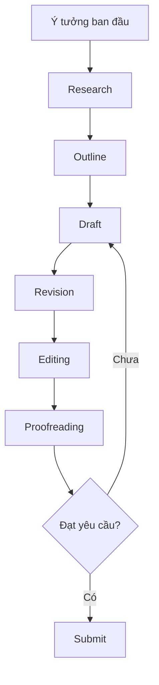

# 01 — Quy trình viết học thuật là gì?

**Timestamp nguồn:** 00:00–00:21

## Mục tiêu

Hiểu vì sao một bài viết học thuật tốt hiếm khi xuất hiện ngay ở lần viết đầu tiên.

## Ý chính

Viết học thuật nên được xem là một **quy trình lặp**, không phải hành động “ngồi xuống và viết một mạch”.

Năm giai đoạn nền tảng:

1. Prewriting.
2. Planning & outlining.
3. First draft.
4. Redrafting & revising.
5. Editing & proofreading.

## Phân biệt mục tiêu từng giai đoạn

| Giai đoạn | Câu hỏi chính |
|---|---|
| Prewriting | Tôi đang thực sự muốn tìm hiểu điều gì? |
| Planning | Tôi sẽ dẫn người đọc qua lập luận theo thứ tự nào? |
| Drafting | Tôi có thể biến outline thành văn bản đầy đủ chưa? |
| Revision | Lập luận và cấu trúc có thuyết phục không? |
| Editing | Câu chữ có rõ, gọn, đúng không? |
| Proofreading | Còn lỗi nhỏ hoặc inconsistency nào không? |

## Nguyên tắc

Đừng dùng proofreading để sửa một bài có cấu trúc yếu. Sửa lỗi chính tả trên một đoạn không phục vụ luận điểm là lãng phí thời gian.

## Bài tập

Chọn một bài cũ của bạn và đánh dấu:
- phần nào thuộc vấn đề ý tưởng;
- phần nào thuộc vấn đề cấu trúc;
- phần nào chỉ là lỗi câu chữ.
