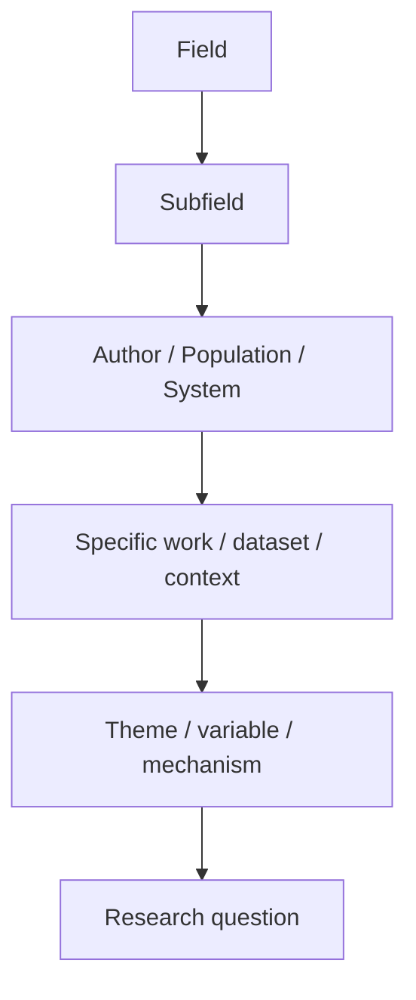

# 02 — Chọn và thu hẹp chủ đề

**Timestamp nguồn:** 00:21–00:51

## Mục tiêu

Chuyển một lĩnh vực rộng thành một câu hỏi nghiên cứu hoặc luận điểm đủ cụ thể.

## Bắt đầu từ sự tò mò

Một chủ đề tốt thường đến từ:
- điều khiến bạn tò mò;
- điều bạn chưa hiểu;
- mâu thuẫn giữa hai quan điểm;
- một câu hỏi còn bỏ ngỏ;
- một hiện tượng có thể phân tích bằng dữ liệu hoặc văn bản.

## Funnel technique

Ví dụ trong transcript:

```text
Văn học thế kỷ 19
→ Tiểu thuyết thời kỳ Lãng mạn
→ Tiểu thuyết của Jane Austen
→ Mansfield Park
→ Chủ đề tính sân khấu trong Mansfield Park
```



## Kiểm tra độ hẹp

Một topic phù hợp phải thỏa ba điều:
1. **Có thể nghiên cứu** — có nguồn, dữ liệu hoặc văn bản.
2. **Có thể xử lý trong giới hạn bài** — không quá rộng.
3. **Có ý nghĩa** — câu hỏi giúp người đọc hiểu thêm điều gì đó.

## Công thức gợi ý

> Trong **[bối cảnh]**, **[yếu tố X]** ảnh hưởng/được thể hiện/liên hệ với **[yếu tố Y]** như thế nào?

## Bài tập

Dùng `templates/topic_narrowing_worksheet.md` và thu hẹp một chủ đề qua ít nhất 4 tầng.
