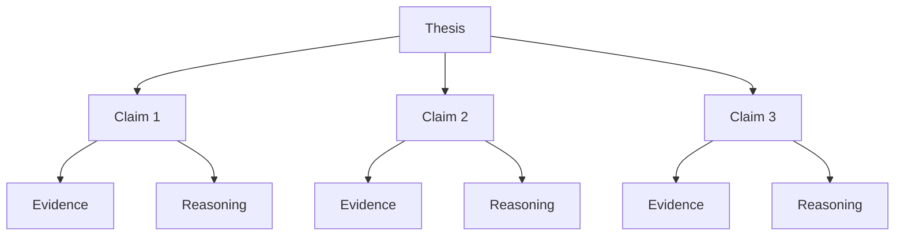

# 05 — Từ outline đến argument map

## Mục tiêu

Không chỉ biết “bài có những phần gì”, mà biết **vì sao mỗi phần tồn tại**.

## Argument map



## Kiểm tra claim

Mỗi claim nên:
- khác biệt với claim khác;
- hỗ trợ thesis;
- có bằng chứng;
- có phân tích;
- có vị trí hợp lý trong chuỗi lập luận.

## Red flag

Nếu outline chỉ là danh sách chủ đề:

```text
AI
Machine Learning
Deep Learning
Results
```

thì chưa phải argument map.

Một outline có lập luận sẽ giống:

```text
1. Dữ liệu nhiễu làm giảm khả năng tổng quát hóa.
2. Regularization giảm overfitting nhưng có trade-off.
3. Data augmentation cải thiện robustness trong điều kiện X.
```
