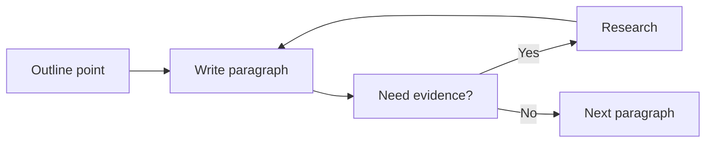

# 06 — Viết first draft đúng cách

**Timestamp nguồn:** 01:52–02:42

## First draft không cần hoàn hảo

Mục tiêu giai đoạn này là tạo **một bản đầy đủ đủ tốt để có thể sửa**.

Quy trình không bắt buộc tuyến tính. Bạn có thể:
- viết body trước introduction;
- để placeholder cho citation;
- quay lại research nếu phát hiện thiếu evidence;
- thay đổi outline khi lập luận phát triển.

## Drafting loop

## Quy tắc thực hành

- Đừng dành 20 phút đánh bóng một câu khi section còn thiếu.
- Viết đủ ý trước, tối ưu câu chữ sau.
- Giữ thesis và outline trong tầm nhìn khi viết.
- Đánh dấu `[CITATION]`, `[DATA]`, `[CHECK]` thay vì dừng dòng suy nghĩ.

## Definition of done

First draft hoàn thành khi:
- tất cả section chính đã có nội dung;
- lập luận có thể đọc từ đầu đến cuối;
- các chỗ thiếu đã được đánh dấu.
