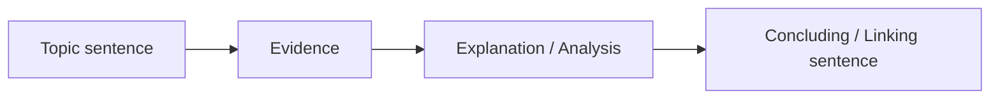

# 07 — Xây dựng đoạn văn học thuật mạnh

**Timestamp nguồn:** 02:07–02:36

Transcript mô tả chuỗi:

1. Topic sentence.
2. Evidence.
3. Explanation / interpretation.
4. Conclusion.

Có thể dùng mô hình **TEEC**:

## 1. Topic sentence

Nêu ý chính mà đoạn sẽ phát triển.

## 2. Evidence

Có thể là:
- số liệu;
- kết quả nghiên cứu;
- trích dẫn;
- ví dụ;
- observation;
- primary text.

## 3. Explanation

Đây là phần dễ bị thiếu nhất.

Không chỉ đưa evidence, bạn phải giải thích:
- evidence cho thấy điều gì;
- tại sao nó liên quan;
- nó hỗ trợ claim ra sao;
- có giới hạn hay cách hiểu khác không.

## 4. Conclusion / Link

Kết đoạn bằng:
- hệ quả của phân tích;
- liên hệ lại thesis;
- hoặc transition sang ý tiếp theo.

## Kiểm tra nhanh

Nếu bỏ toàn bộ citation khỏi đoạn mà không còn lập luận của chính bạn, đoạn đó đang quá phụ thuộc vào nguồn.
