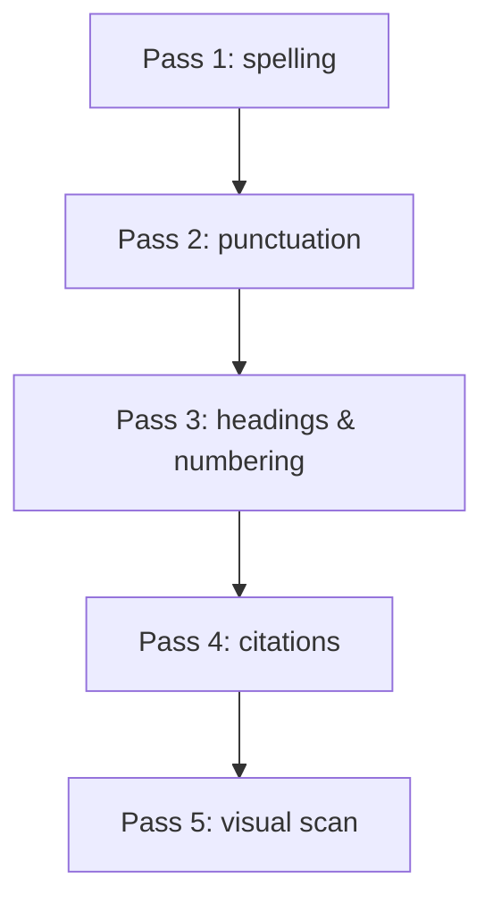

# 12 — Proofreading có hệ thống

**Timestamp nguồn:** 03:29–03:43

Proofreading tập trung vào các lỗi nhỏ còn sót lại sau revision và editing.

## Kiểm tra

- spelling;
- punctuation;
- capitalization;
- heading style;
- numbering;
- spacing;
- bảng/hình;
- tên riêng;
- consistency Anh–Mỹ;
- citation formatting.

## Consistency examples

Chọn một chuẩn và giữ nhất quán:

```text
behavior / colour   ← không nhất quán
behavior / color    ← US English
behaviour / colour  ← UK English
```

## Phương pháp nhiều lượt



## Kỹ thuật hữu ích

- đọc thành tiếng;
- đổi font/zoom để nhìn văn bản “mới” hơn;
- đọc từng câu từ cuối lên đầu khi soi spelling;
- lập danh sách các lỗi cá nhân hay mắc.
