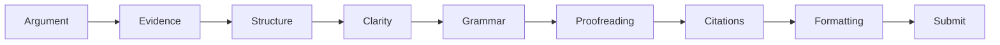

# 13 — Citation và Final Quality Control

**Timestamp nguồn:** 03:43–04:06

## Citation là một phần của chất lượng học thuật

Trước khi submit, kiểm tra:

- mọi ý/claim cần nguồn đã có citation;
- mọi in-text citation có entry trong reference list;
- mọi reference-list entry thực sự được dùng;
- style đúng yêu cầu: APA, IEEE, MLA, Chicago...;
- DOI, year, author, title chính xác;
- quotation có page number khi style yêu cầu.

## Citation audit

| Kiểm tra | Pass |
|---|---|
| Claim cần nguồn đã cite | ☐ |
| Quote có page | ☐ |
| In-text ↔ reference list khớp | ☐ |
| Style nhất quán | ☐ |
| Link/DOI chính xác | ☐ |

## Final submission pipeline

## Nguyên tắc cuối

Đừng chỉ hỏi:
> “Bài có lỗi không?”

Hãy hỏi:
> “Người đọc có thể hiểu chính xác điều tôi muốn chứng minh, tại sao họ nên tin nó, và bằng chứng nằm ở đâu không?”
