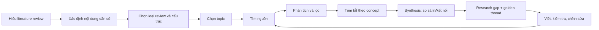

# Course Map — How to Write a Literature Review

## Module 01 — Nền tảng

| Bài | Nội dung | Kết quả |
|---|---|---|
| 01 | Literature review là gì? | Hiểu review là tổng hợp phê bình, không phải danh sách tóm tắt |
| 02 | Cần đưa gì vào review? | Xác định background, context, theory, terminology, gap, evidence |
| 03 | Các loại literature review | Phân biệt selective/comprehensive và stand-alone/part of larger work |

## Module 02 — Hình thức và cấu trúc

| Bài | Nội dung | Kết quả |
|---|---|---|
| 01 | Review trong research article | Biết vai trò của review trong phần Introduction |
| 02 | Stand-alone review | Hiểu phạm vi, độ sâu, tiêu đề và conclusion của review độc lập |
| 03 | Funnel: general → specific | Tổ chức nền tảng rộng đến nghiên cứu gần nhất và research gap |

## Module 03 — Quy trình viết

| Bài | Nội dung | Kết quả |
|---|---|---|
| 01 | Quy trình phi tuyến | Biết quay lại tìm/đọc nguồn khi lập luận thay đổi |
| 02 | Step 1: chọn topic | Tạo topic đủ hẹp, đủ mới, đủ literature |
| 03 | Steps 2–3: search & analyze | Thu thập, lọc và lập bản đồ mạng lưới nghiên cứu |
| 04 | Step 4: describe & summarize | Ghi chú bài báo theo concept thay vì chép abstract |
| 05 | Steps 5–6: synthesis & connection | Xây “golden thread” liên kết literature với câu hỏi nghiên cứu |

## Module 04 — Workflow thực hành

| Bài | Nội dung | Kết quả |
|---|---|---|
| 01 | Độ dài và số nguồn | Chọn độ sâu theo mục đích, scope và mức bất đồng của field |
| 02 | Matrix, note-taking & quality check | Có quy trình ghi chú, tổng hợp, tự kiểm và sửa review |

## Sơ đồ toàn khóa

