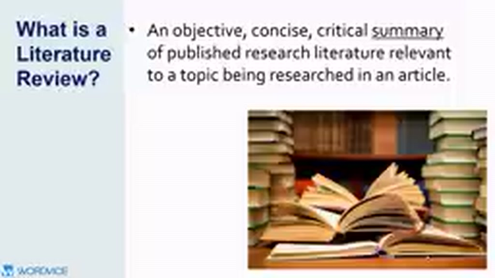
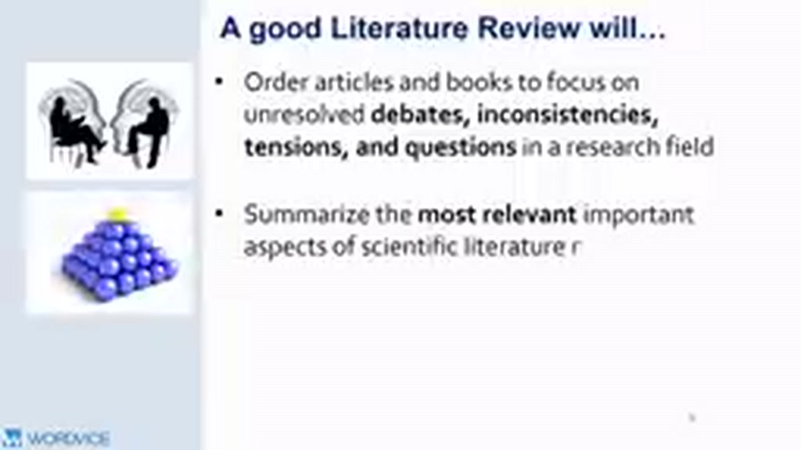
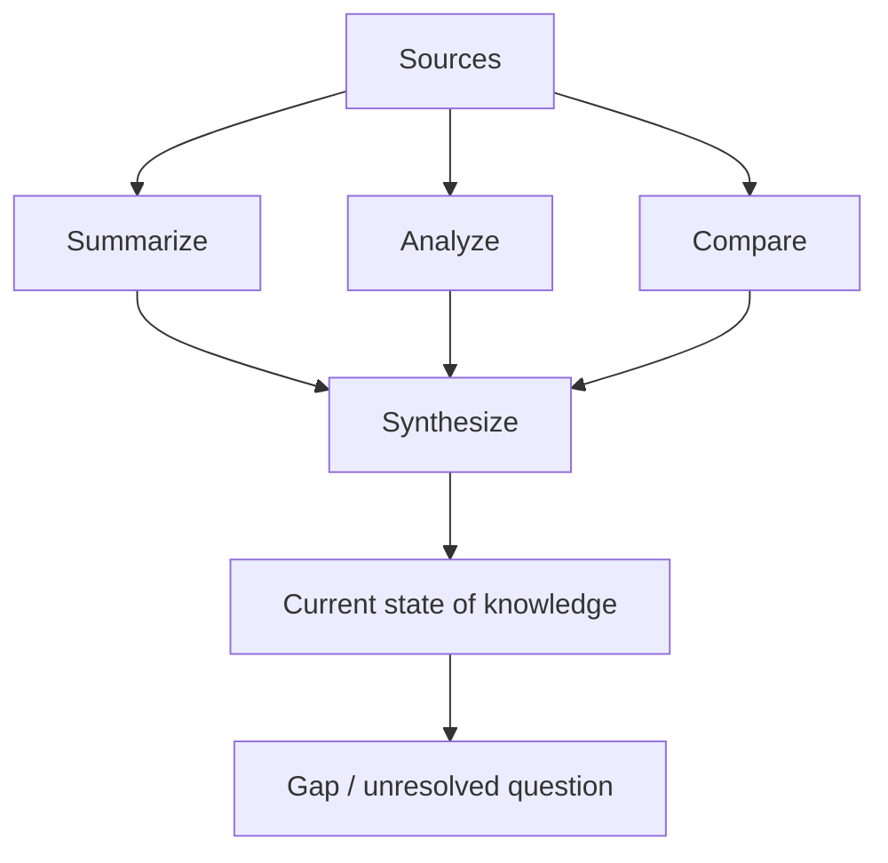
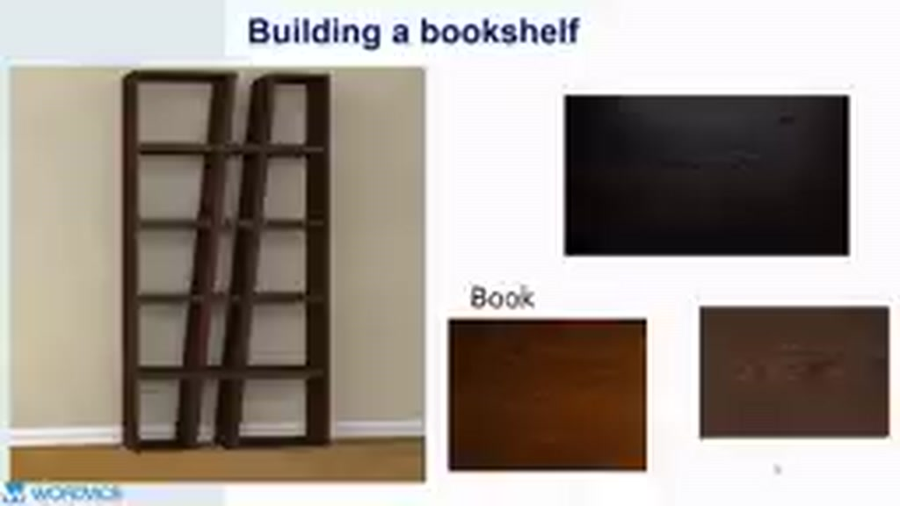

# 01 — Literature Review là gì?

## Mục tiêu

Sau bài này, bạn có thể phân biệt **literature review** với bản tóm tắt tài liệu, annotated bibliography và danh sách trích dẫn.

## 1. Định nghĩa cốt lõi

Literature review là một **tổng hợp có chọn lọc, có cấu trúc và có đánh giá phê bình** về các công trình đã xuất bản liên quan trực tiếp đến một chủ đề nghiên cứu.

Ba từ khóa cần giữ lại:

- **Objective**: dựa trên bằng chứng và tiêu chí lựa chọn nguồn, không chọn nguồn chỉ vì chúng ủng hộ ý mình.
- **Concise**: chọn phần có liên quan, không kể lại toàn bộ từng bài báo.
- **Critical**: không chỉ nói “nghiên cứu A tìm thấy X”, mà còn hỏi bằng chứng có mạnh không, các nghiên cứu có đồng thuận không, còn thiếu gì.

## 2. Một review tốt làm gì?

Một review tốt thường thực hiện đồng thời bốn công việc:

1. **Order** — sắp xếp các nghiên cứu theo chủ đề, tranh luận, phương pháp hoặc thời gian.
2. **Summarize** — nêu các phát hiện quan trọng nhất.
3. **Analyze** — xem xét chất lượng, phạm vi, giới hạn và khác biệt giữa các nguồn.
4. **Synthesize** — ghép các nguồn thành một bức tranh chung của lĩnh vực.

## 3. Ẩn dụ “xây kệ sách”

Video dùng hình ảnh **building a bookshelf**: người viết review không tự tạo mọi “mảnh gỗ”; họ dùng các công trình đã có rồi **lắp chúng thành một cấu trúc có mục đích**. Giá trị của người viết không nằm ở việc chép từng mảnh, mà ở cách chọn, đặt và kết nối chúng.

## 4. Summary khác synthesis thế nào?

**Summary** trả lời: “Nguồn này nói gì?”  
**Synthesis** trả lời: “Các nguồn này liên hệ với nhau thế nào, và từ đó ta hiểu gì về câu hỏi nghiên cứu?”

Ví dụ yếu:

> A cho rằng học trực tuyến tăng tính linh hoạt. B cho rằng học trực tuyến giảm tương tác. C nghiên cứu động lực học tập.

Ví dụ tốt hơn:

> Các nghiên cứu nhìn chung đồng ý rằng học trực tuyến tăng tính linh hoạt, nhưng kết quả về mức độ tương tác không thống nhất. Sự khác biệt có thể liên quan đến thiết kế lớp học và cách đo engagement; vì vậy, ảnh hưởng của mô hình đồng bộ so với bất đồng bộ vẫn cần được phân tích riêng.

## Bài tập

Chọn ba bài báo cùng một chủ đề. Viết:

- 1 câu tóm tắt cho từng bài;
- 1 câu chỉ ra điểm giống/khác giữa ít nhất hai bài;
- 1 câu nêu điều chưa được giải quyết.

Nếu đoạn cuối vẫn có dạng “A nói…, B nói…, C nói…” thì bạn mới ở mức **summary**, chưa đạt **synthesis**.
