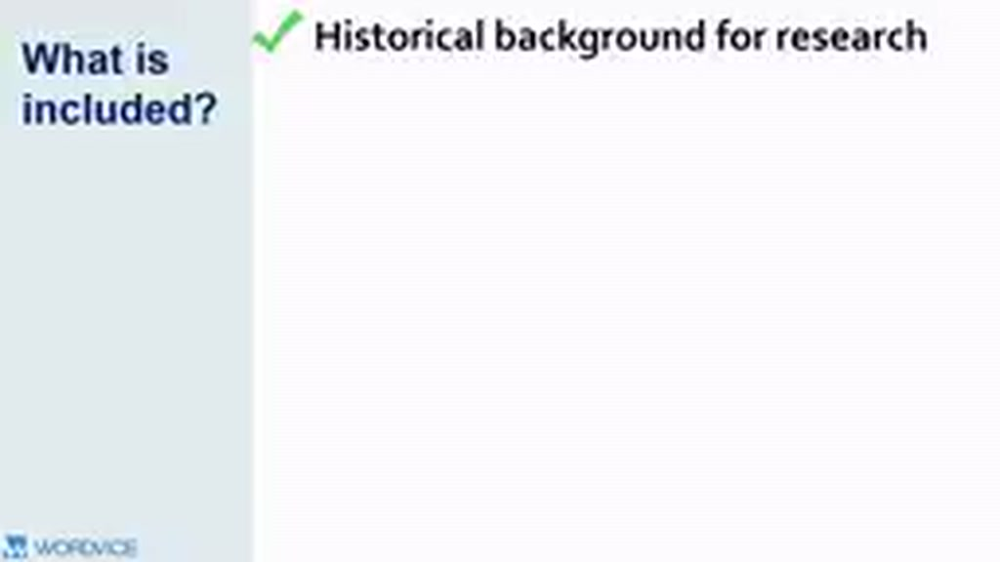
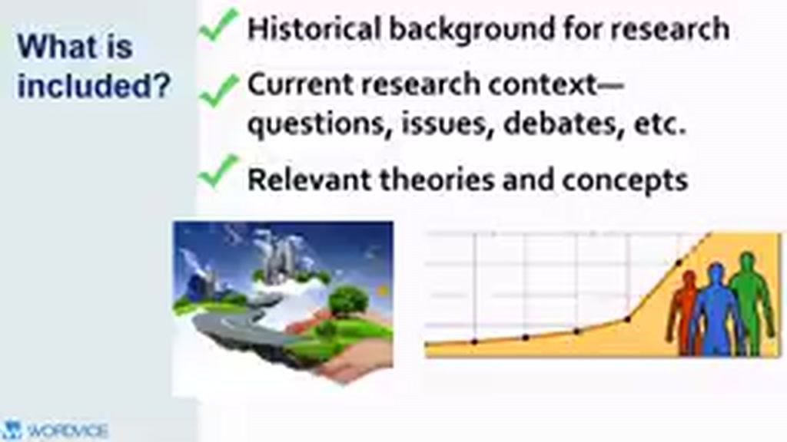
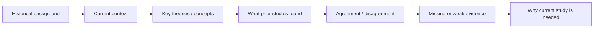

# 02 — Literature Review nên bao gồm những gì?

## Mục tiêu

Xây được checklist nội dung để literature review vừa cung cấp bối cảnh, vừa dẫn người đọc tới lý do nghiên cứu mới cần tồn tại.

## 1. Sáu nhóm nội dung chính

Một literature review có thể bao gồm:

1. **Historical background** — nghiên cứu trước đây đã hình thành field như thế nào.
2. **Current research context** — câu hỏi, tranh luận, xu hướng và vấn đề hiện tại.
3. **Relevant theories and concepts** — khung lý thuyết, mô hình, biến và cơ chế giải thích.
4. **Relevant terminology** — định nghĩa thuật ngữ theo cách bạn sử dụng trong nghiên cứu.
5. **Related research + research gap** — công trình gần nhất và phần còn thiếu mà nghiên cứu của bạn xử lý.
6. **Evidence for a practical problem** — bằng chứng cho thấy vấn đề nghiên cứu có ý nghĩa trong thực tế.

## 2. Không phải bài nào cũng cần tỷ trọng giống nhau

Một bài nghiên cứu kỹ thuật có thể dành nhiều chỗ cho **methods + prior results**. Một nghiên cứu xã hội có thể cần giải thích kỹ **theory + concepts + definitions**. Một thesis có thể cần lịch sử field rộng hơn một journal article ngắn.

Điểm quan trọng là mọi phần phải trả lời câu hỏi:

> Phần này giúp người đọc hiểu điều gì để đánh giá nghiên cứu hiện tại?

## 3. Từ “background” đến “gap”

Một review tốt không “nhảy” thẳng từ lịch sử sang “there is a gap”. Gap phải được chứng minh bằng chuỗi bằng chứng.

## 4. Các dạng research gap thường gặp

- **Population gap**: nhóm đối tượng quan trọng chưa được nghiên cứu.
- **Context gap**: hiện tượng đã được nghiên cứu ở môi trường A nhưng chưa rõ ở B.
- **Methodological gap**: các nghiên cứu dùng cùng một thiết kế có giới hạn; cần cách đo/thiết kế khác.
- **Evidence inconsistency**: kết quả các nghiên cứu mâu thuẫn nhau.
- **Theory gap**: một cơ chế hoặc lý thuyết chưa được kiểm tra đầy đủ.
- **Temporal gap**: bằng chứng cũ không còn phản ánh công nghệ/chính sách/môi trường hiện tại.

## 5. Template nhanh

Bạn có thể kiểm tra review bằng 6 câu:

- Field này bắt đầu từ đâu?
- Hiện nay field đang quan tâm điều gì?
- Những concept/theory nào bắt buộc phải hiểu?
- Các nghiên cứu quan trọng đã cho biết điều gì?
- Chúng bất đồng hoặc còn thiếu ở đâu?
- Nghiên cứu của tôi đi vào đúng điểm thiếu đó như thế nào?

## Bài tập

Với topic của bạn, viết mỗi câu 1 dòng theo sáu câu hỏi trên. Sau đó nối các dòng thành một outline 3–5 heading.
