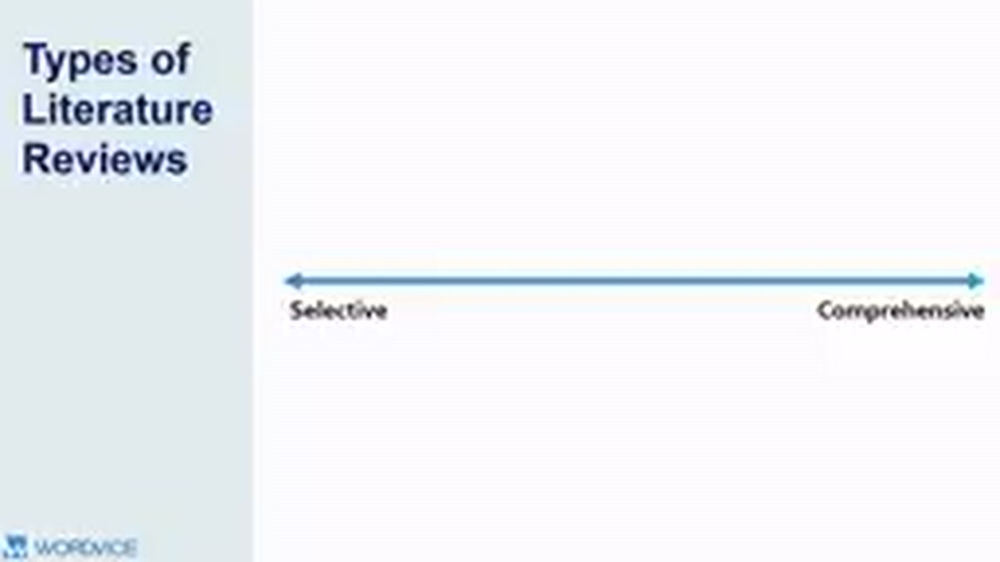
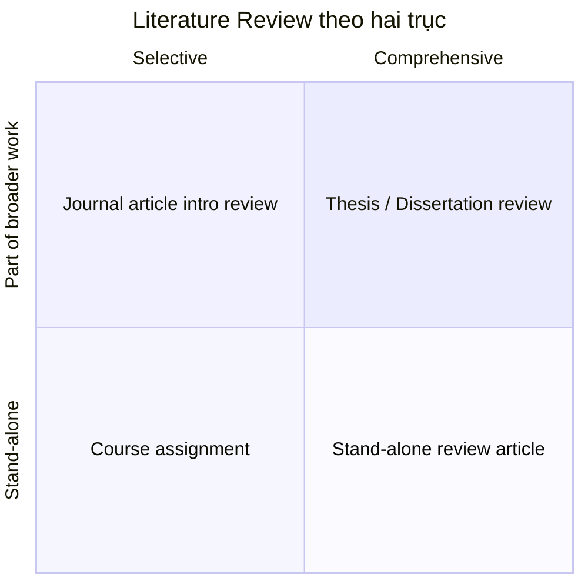

# 03 — Các dạng Literature Review theo phạm vi và vị trí

## Mục tiêu

Biết vì sao một review trong assignment, thesis và journal article có thể khác nhau rất nhiều dù đều được gọi là “literature review”.

## 1. Hai trục để phân loại

Video minh họa literature review theo hai trục:

- **Selective ↔ Comprehensive**: từ chỉ chọn một phần nhỏ của literature đến bao quát phần lớn các công trình quan trọng.
- **Stand-alone work ↔ Part of broader work**: review là sản phẩm độc lập hay chỉ là một phần của tài liệu lớn hơn.

## 2. Bốn trường hợp điển hình

### Course assignment

Thường **selective + stand-alone**. Mục tiêu là chứng minh người học hiểu một vùng literature có giới hạn.

### Research article

Thường **selective + part of broader work**. Review chỉ cần những nguồn trực tiếp dẫn tới research question, hypothesis, method hoặc gap của nghiên cứu.

### Thesis / dissertation

Thường **comprehensive + part of broader work**. Người viết cần chứng minh hiểu sâu field và vị trí của luận án trong field đó.

### Stand-alone review article

Thường **comprehensive + stand-alone**. Toàn bộ bài báo tập trung phân tích literature thay vì báo cáo một thí nghiệm mới.

## 3. Điều quan trọng: mục đích quyết định scope

Không có số nguồn hay độ dài “chuẩn” áp dụng cho mọi loại review. Trước khi viết, phải biết:

- Review của bạn đứng một mình hay nằm trong công trình khác?
- Người đọc cần overview rộng hay chỉ context trực tiếp?
- Mục tiêu là giới thiệu study mới hay tổng hợp trạng thái của cả field?

## Bài tập

Viết một dòng mô tả review bạn đang làm theo mẫu:

> Đây là review **[stand-alone / part of larger work]**, có mức độ **[selective / comprehensive]**, nhằm **[mục tiêu]**, cho **[đối tượng đọc]**.

Câu này sẽ là “scope contract” giúp bạn quyết định nguồn nào nên đưa vào.
