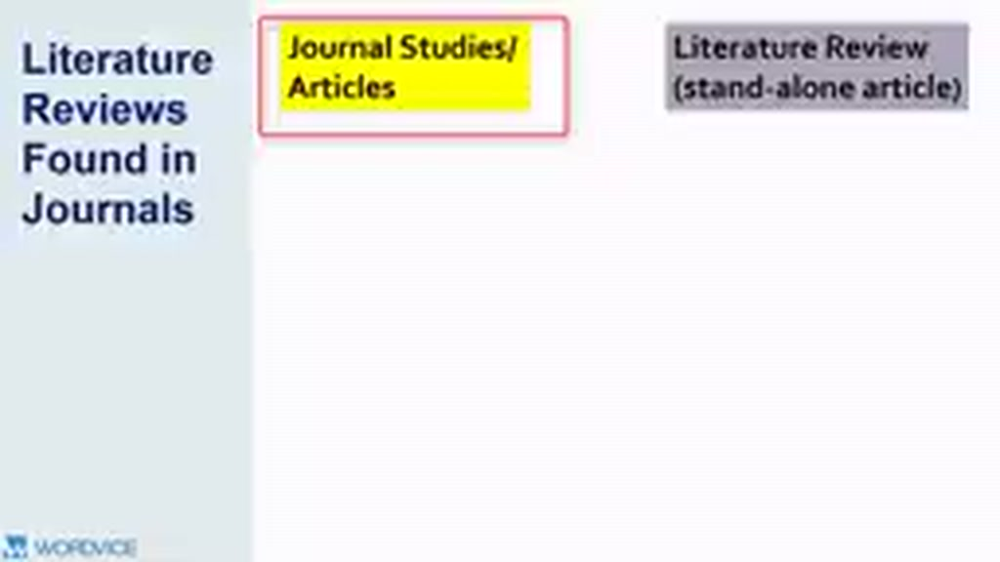
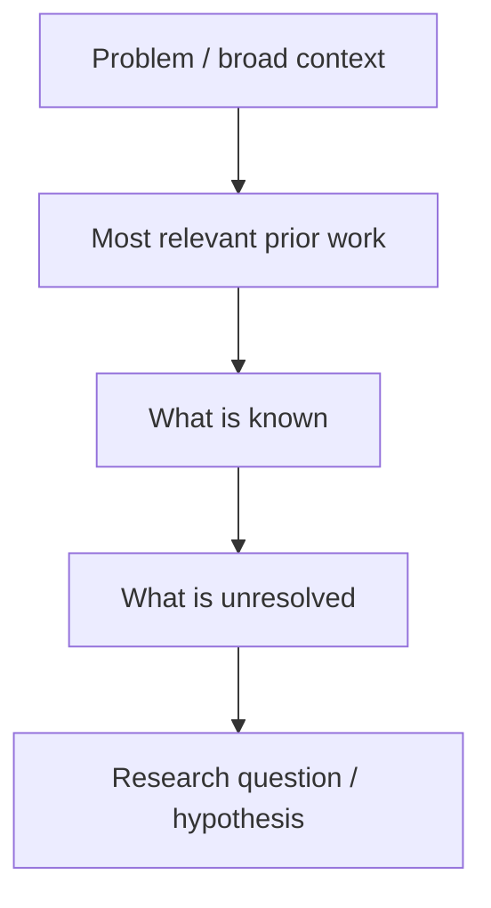

# 01 — Literature Review trong một Research Article

## Mục tiêu

Hiểu cách literature review hoạt động khi nó chỉ là một phần của journal article.

## 1. Vai trò chính

Trong nhiều research article, literature review xuất hiện ở **Introduction** hoặc phần gần cuối Introduction. Nó thường:

- giới thiệu nghiên cứu liên quan trực tiếp;
- định nghĩa context và problem;
- cho thấy precedent của theory/method;
- chỉ ra gap;
- dẫn tới research question hoặc hypothesis.

Vì bị giới hạn dung lượng, loại review này thường **selective**: không cố kể toàn bộ lịch sử field.

## 2. Tiêu chí chọn nguồn

Một nguồn nên được ưu tiên nếu nó giúp trả lời ít nhất một trong các câu sau:

- Vì sao vấn đề nghiên cứu quan trọng?
- Biến/khái niệm nào cần định nghĩa?
- Kết quả trước đó tạo kỳ vọng gì?
- Nghiên cứu trước dùng phương pháp nào?
- Có mâu thuẫn hoặc lỗ hổng gì?
- Study hiện tại mở rộng/chỉnh sửa điều gì?

## 3. Cấu trúc “short review” điển hình

## 4. Sai lầm phổ biến

- Nhồi nhiều citation để chứng minh “đã đọc nhiều”.
- Mỗi paragraph chỉ nói về một tác giả.
- Dành quá nhiều chỗ cho lịch sử xa nhưng không liên quan trực tiếp.
- Kết thúc review mà người đọc vẫn chưa hiểu study hiện tại giải quyết điều gì.

## Bài tập

Lấy một journal article trong lĩnh vực của bạn. Chỉ đọc Introduction và đánh dấu:

- background;
- prior work;
- gap;
- research question / hypothesis.

Nếu không tìm thấy một trong bốn phần, hãy ghi chú cách tác giả thay thế chức năng đó bằng cấu trúc khác.
