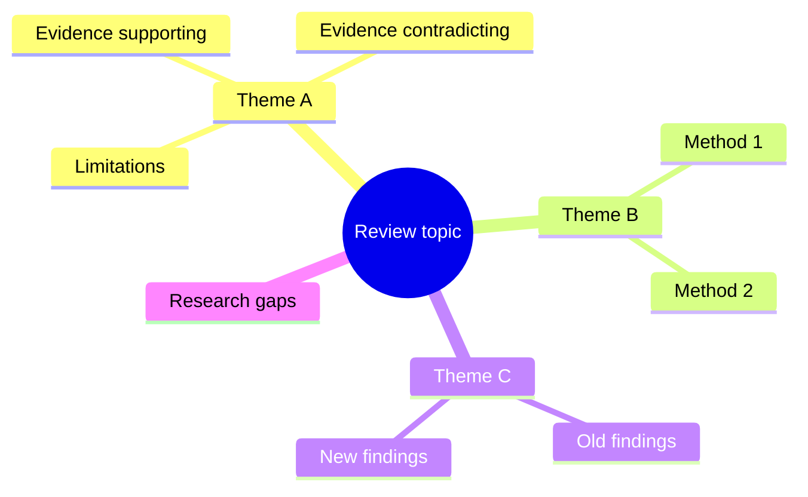

# 02 — Stand-alone Literature Review

## Mục tiêu

Phân biệt review độc lập với review giới thiệu một nghiên cứu mới.

## 1. Stand-alone review tập trung vào literature, không phải thí nghiệm mới

Trong review độc lập, “đối tượng nghiên cứu” chính là **hệ thống các công trình đã xuất bản**. Vì vậy, toàn bộ cấu trúc bài thường xoay quanh chủ đề, theory, phương pháp, kết quả và tranh luận của field.

Stand-alone review thường:

- rộng hơn về scope;
- có nhiều nguồn hơn;
- kéo dài xa hơn theo thời gian nếu cần;
- phân tích sâu methods/results của prior studies;
- có headings phản ánh các nhóm literature;
- có conclusion tổng hợp các xu hướng và lỗ hổng.

## 2. Tổ chức theo “nhóm ý”, không theo “danh sách tác giả”

Các cách tổ chức phổ biến:

- theo **theme**;
- theo **chronology**;
- theo **methodology**;
- theo **theory**;
- theo **debate / controversy**;
- theo **population / context**.

## 3. Conclusion của stand-alone review phải tạo giá trị mới

Một conclusion tốt không chỉ lặp lại các đoạn trước. Nó nên nói:

- field đã biết khá chắc điều gì;
- phần nào còn tranh luận;
- bằng chứng nào yếu hoặc thiếu;
- hướng nghiên cứu tiếp theo nên tập trung ở đâu.

Đây chính là đóng góp trí tuệ của review.

## Bài tập

Chọn một topic và đề xuất 4 headings cho stand-alone review. Không dùng tên tác giả làm heading. Mỗi heading phải biểu diễn **theme, method, theory hoặc debate**.
