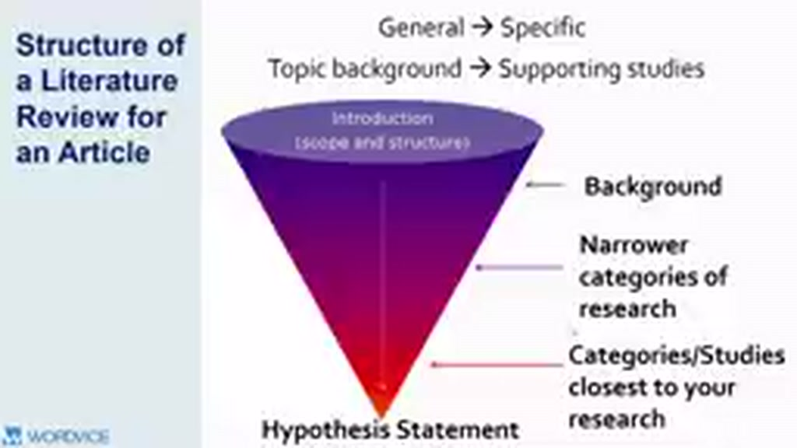
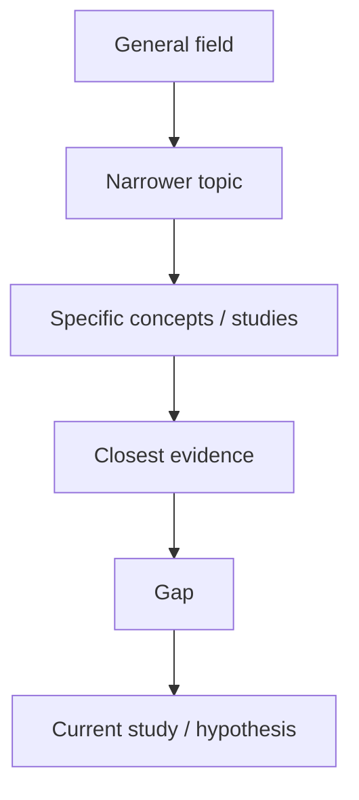

# 03 — Funnel Structure: từ General đến Specific

## Mục tiêu

Tổ chức literature review để người đọc được dẫn từ field rộng đến research question cụ thể một cách tự nhiên.

## 1. Mô hình cái phễu

Với literature review nằm trong Introduction, video nhấn mạnh cấu trúc **General → Specific**:

1. Broad background.
2. Nhóm nghiên cứu gần hơn với topic.
3. Các studies trực tiếp liên quan đến câu hỏi.
4. Gap hoặc unresolved issue.
5. Hypothesis / research question.

## 2. Vì sao funnel hiệu quả?

Nó giảm “chi phí nhận thức”: người đọc chưa cần biết ngay mọi chi tiết. Bạn thiết lập vocabulary và context trước, rồi mới đưa họ tới tranh luận cụ thể.

## 3. Funnel không có nghĩa là kể lịch sử dài dòng

“General” phải vẫn **liên quan trực tiếp**. Nếu một đoạn background không giúp hiểu research question, có thể cắt.

## 4. Template 5 đoạn

- **Đoạn 1:** vấn đề rộng + tầm quan trọng.
- **Đoạn 2:** concept/theory trung tâm.
- **Đoạn 3:** các nhóm nghiên cứu quan trọng và kết quả chung.
- **Đoạn 4:** bất đồng, limitation hoặc gap.
- **Đoạn 5:** study hiện tại và câu hỏi/hypothesis.

## Bài tập

Viết 5 dòng theo template trên cho đề tài của bạn. Sau đó kiểm tra mỗi dòng có hẹp hơn dòng trước không.
