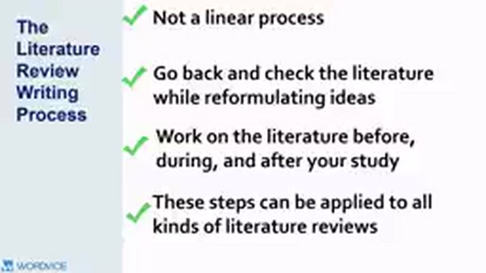
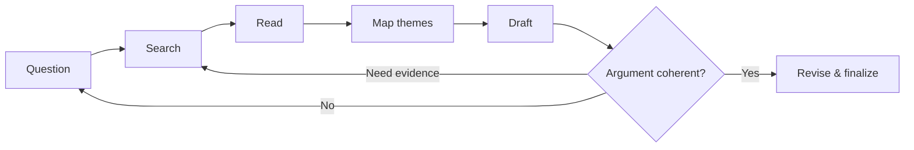

# 01 — Viết Literature Review là một quy trình phi tuyến

## Mục tiêu

Hiểu vì sao review thường phải quay lại search, đọc và chỉnh scope nhiều lần.

## 1. Không phải quy trình “tìm xong rồi mới viết”

Khi đọc thêm, bạn có thể phát hiện:

- từ khóa mới;
- một theory quan trọng chưa biết;
- source nền tảng được nhiều bài cùng trích;
- kết quả mâu thuẫn;
- topic ban đầu quá rộng hoặc quá hẹp.

Vì vậy, quá trình thường lặp:

## 2. Review phát triển cùng với nghiên cứu

Với thesis hoặc project dài, literature review có thể tiếp tục thay đổi trước, trong và sau khi thu thập dữ liệu. Nghiên cứu mới có thể xuất hiện; cách bạn hiểu literature cũng thay đổi khi dữ liệu của chính bạn rõ hơn.

## 3. Thực hành versioning

Một workflow hữu ích:

- `v0`: map field và từ khóa;
- `v1`: outline theo themes;
- `v2`: draft có citation;
- `v3`: thêm counter-evidence và limitations;
- `v4`: chốt golden thread và gap.

## Bài tập

Tạo một “change log” cho review: mỗi lần đổi scope hoặc argument, ghi 1 dòng “Tôi đổi X vì literature cho thấy Y”. Điều này giúp tránh sửa ngẫu nhiên.
