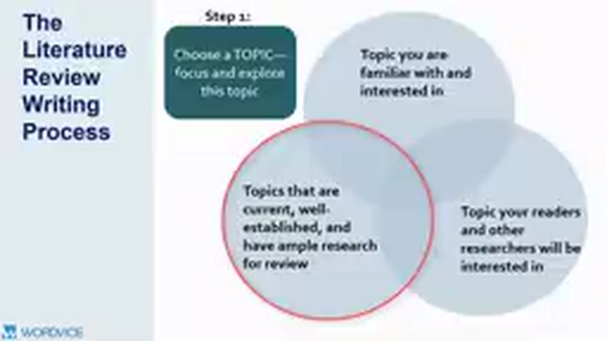
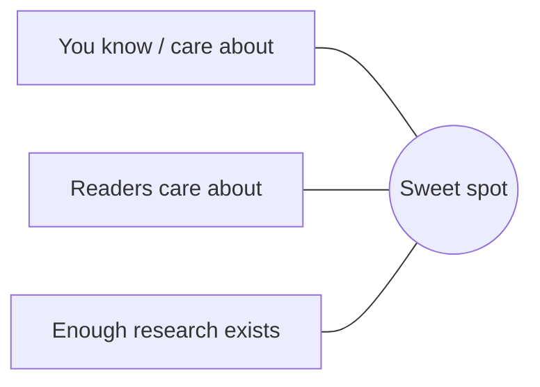

# 02 — Step 1: Chọn Topic đủ tốt để Review

## Mục tiêu

Biến một chủ đề rộng thành câu hỏi đủ hẹp để có thể tìm, đọc và tổng hợp literature.

## 1. “Sweet spot” của topic

Topic tốt thường đồng thời:

- bạn đủ quan tâm để đọc sâu;
- người đọc/field thấy có ý nghĩa;
- đã có đủ research để tổng hợp;
- nhưng vẫn còn một vấn đề chưa giải quyết hoàn toàn.

## 2. Ba vòng tròn chọn topic

## 3. Từ topic sang researchable question

Topic quá rộng: **AI in education**  
Hẹp hơn: **Generative AI and student writing**  
Researchable: **How does AI-assisted feedback affect revision quality in first-year university writing?**

Một question tốt xác định tối thiểu:

- phenomenon / variable;
- population hoặc context;
- relationship / effect / comparison cần xem xét.

## 4. Dấu hiệu scope sai

**Quá rộng:** hàng nghìn paper, nhiều subfield không liên quan, không thể định nghĩa inclusion criteria.  
**Quá hẹp:** chỉ có 1–2 paper trực tiếp, khó tạo synthesis hoặc tranh luận.

## Bài tập

Viết 3 phiên bản câu hỏi từ rộng → vừa → hẹp. Chọn phiên bản mà bạn có thể hình dung 3–5 themes để review.
