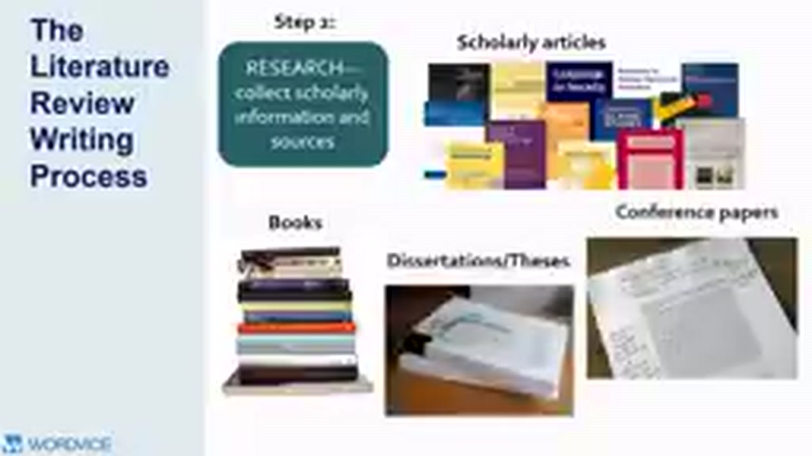
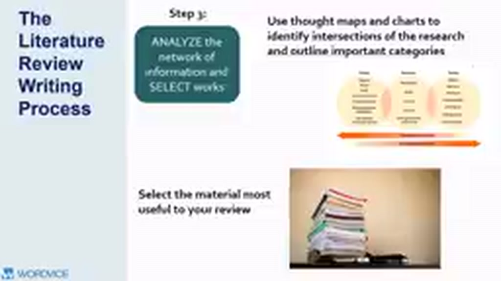
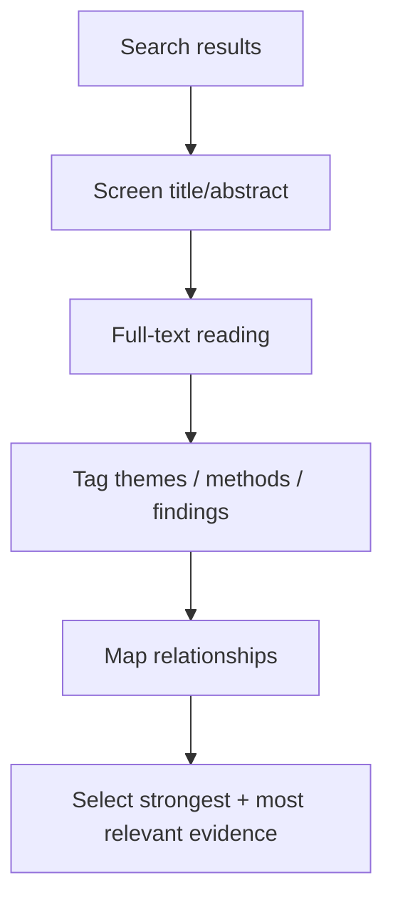

# 03 — Steps 2–3: Search, Collect, Analyze và Select





## Mục tiêu

Xây workflow tìm nguồn có hệ thống và biến một đống paper thành mạng lưới ý nghĩa.

## Step 2 — Research & collect

Các nguồn scholarly có thể gồm:

- journal articles;
- books / book chapters;
- conference papers;
- theses / dissertations;
- review articles;
- reports học thuật có phương pháp rõ ràng.

### Search query cơ bản

```text
("key concept A" OR synonym)
AND
("key concept B" OR synonym)
AND
(population OR context)
```

Đừng chỉ lưu PDF. Với mỗi nguồn, lưu metadata tối thiểu: citation, year, research question, method, sample/context, key findings, limitations, theme tags.

## Step 3 — Analyze the network

Không phải paper nào tìm được cũng cần đưa vào review. Hãy hỏi:

- Source này có nằm trên “đường dẫn” tới research question không?
- Nó là seminal work, recent evidence hay peripheral work?
- Nó hỗ trợ, phản bác hay mở rộng nguồn khác?
- Nó dùng method khác và cho kết quả khác không?



## 3. Mind map và citation network

Một mind map đơn giản có thể có node là **concept** và cạnh là **relationship**. Với field phức tạp, citation chasing (xem tài liệu tham khảo của paper quan trọng và paper nào trích nó) giúp tìm “xương sống” của literature.

## Bài tập

Tạo bảng 8–10 nguồn đầu tiên và thêm cột `Theme`, `Method`, `Supports/Contradicts`, `Relevance`. Sau đó loại ít nhất 2 nguồn không đủ liên quan.
