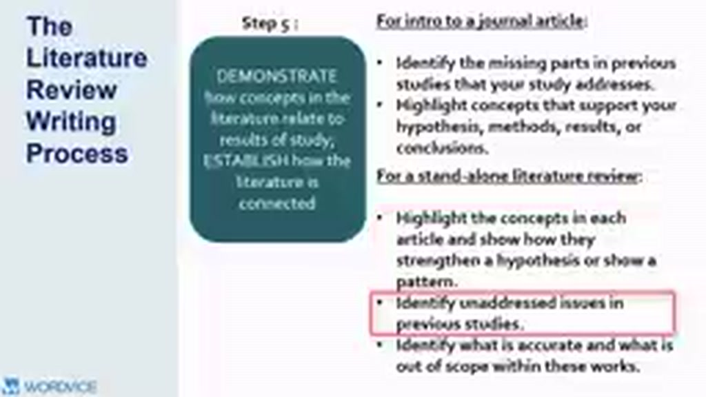
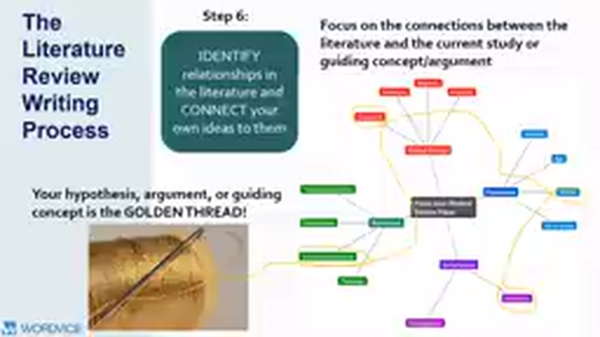
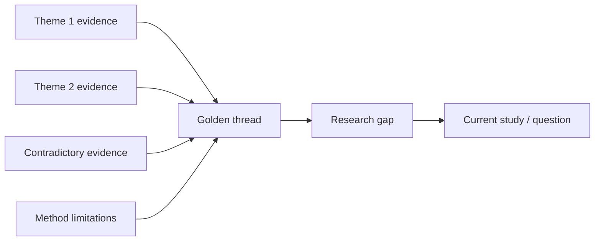

# 05 — Steps 5–6: Synthesis, Relationships và “Golden Thread”

## Mục tiêu

Biến các ghi chú riêng lẻ thành argument nhất quán và liên kết review với nghiên cứu hiện tại.

## Step 5 — Demonstrate connections

Hãy mô tả **cách các concept và kết quả liên hệ với nhau**, chẳng hạn:

- A và B cùng ủng hộ X;
- C cho kết quả ngược nhưng dùng sample khác;
- D giải thích mâu thuẫn bằng theory Y;
- chưa có study nào kiểm tra Y trong context Z.

Một paragraph synthesis tốt thường có nhiều nguồn tham gia vào **cùng một ý**, thay vì một nguồn chiếm toàn paragraph.

## Step 6 — Connect literature to your own question

Video dùng khái niệm **golden thread**: hypothesis, argument hoặc guiding concept là sợi chỉ xuyên suốt giúp quyết định paper nào cần xuất hiện và vì sao.

## 3. Công thức paragraph synthesis

Một cấu trúc dễ dùng:

1. **Topic sentence** — claim của paragraph.
2. **Evidence cluster** — 2–4 sources cùng hỗ trợ/giải thích.
3. **Contrast/limitation** — nguồn không đồng thuận hoặc hạn chế.
4. **Interpretation** — bạn giải thích pattern.
5. **Link** — nối pattern tới câu hỏi nghiên cứu.

## 4. Đóng góp của người viết review

Bạn không “thêm dữ liệu mới” nhưng vẫn tạo đóng góp bằng cách:

- phát hiện pattern;
- kết nối các nhánh literature trước đây bị tách rời;
- phân loại tranh luận;
- giải thích vì sao kết quả mâu thuẫn;
- chỉ ra chính xác điều chưa biết.

## Bài tập

Chọn 4 nguồn. Viết một paragraph synthesis theo cấu trúc 5 bước. Không được bắt đầu 4 câu liên tiếp bằng tên tác giả.
