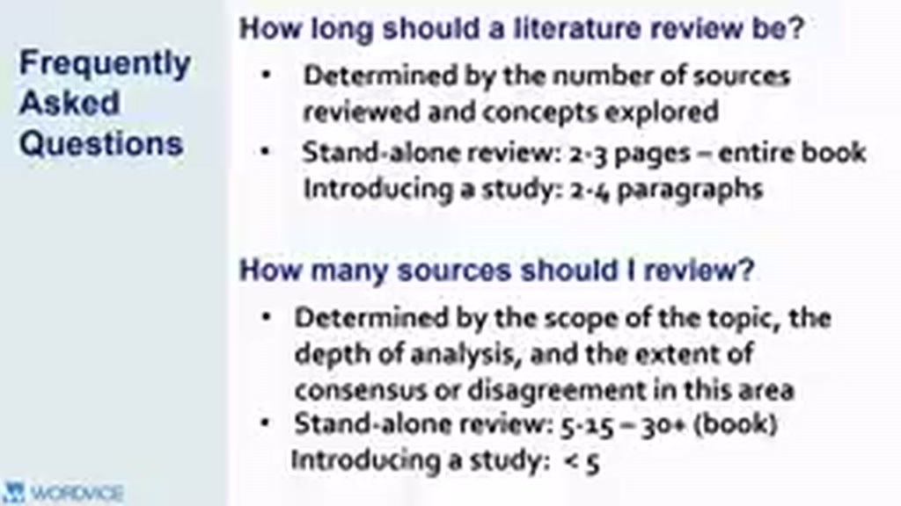
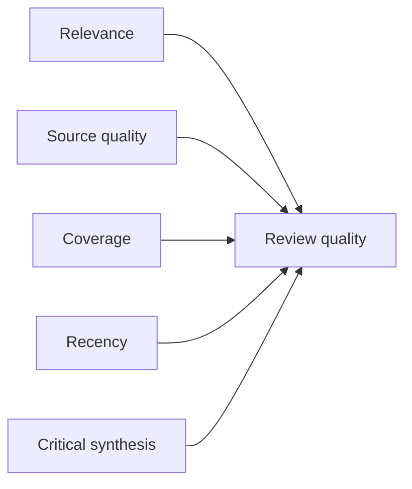

# 01 — Literature Review nên dài bao nhiêu? Cần bao nhiêu nguồn?

## Mục tiêu

Biết cách ước lượng độ dài và số nguồn theo mục tiêu thay vì tìm một “con số chuẩn” áp dụng cho mọi trường hợp.

## 1. Độ dài phụ thuộc vào scope

Các yếu tố chính:

- số nguồn cần review;
- số concept/themes cần xử lý;
- mức độ phân tích mong muốn;
- lượng consensus/disagreement trong field;
- loại tài liệu: article, thesis, assignment, stand-alone review.

Video đưa ra ví dụ định hướng, không phải luật cứng: stand-alone review có thể từ vài trang đến quy mô rất dài; phần review mở đầu một study thường ngắn hơn nhiều.

## 2. Số nguồn cũng không có công thức cố định

Một review hẹp có thể cần ít nguồn nhưng phải đúng “key studies”. Một topic rộng hoặc có nhiều tranh luận cần nhiều nguồn hơn.

Thay vì hỏi “bao nhiêu paper là đủ?”, hãy hỏi:

> Tôi đã bao phủ các theme chính, seminal works, recent evidence và counter-evidence chưa?

## 3. Quy tắc saturation thực dụng

Bạn đang tiến gần đủ literature khi:

- paper mới chủ yếu lặp lại themes đã có;
- ít xuất hiện concept quan trọng hoàn toàn mới;
- citation chasing không còn liên tục dẫn tới foundational work chưa đọc;
- mỗi claim lớn đã có bằng chứng phù hợp;
- bạn có thể giải thích cả consensus lẫn disagreement.

## 4. Đừng dùng “số nguồn” thay cho quality

20 nguồn yếu không tốt hơn 8 nguồn mạnh. Hãy cân bằng:

## Bài tập

Với outline hiện tại, ghi bên cạnh mỗi heading số nguồn mạnh bạn đang có. Heading nào chỉ có 1 nguồn hoặc toàn nguồn cũ là tín hiệu cần search thêm.
