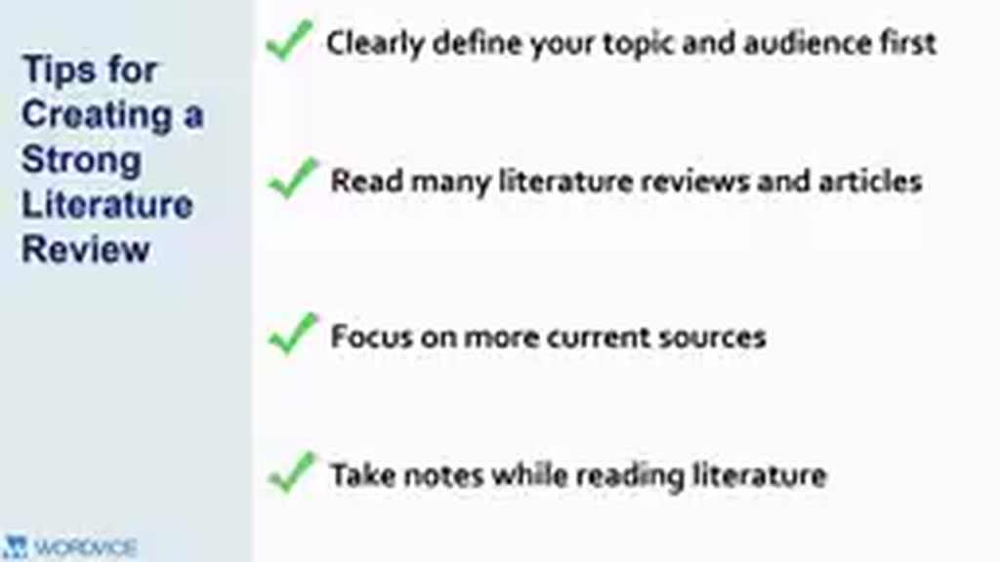
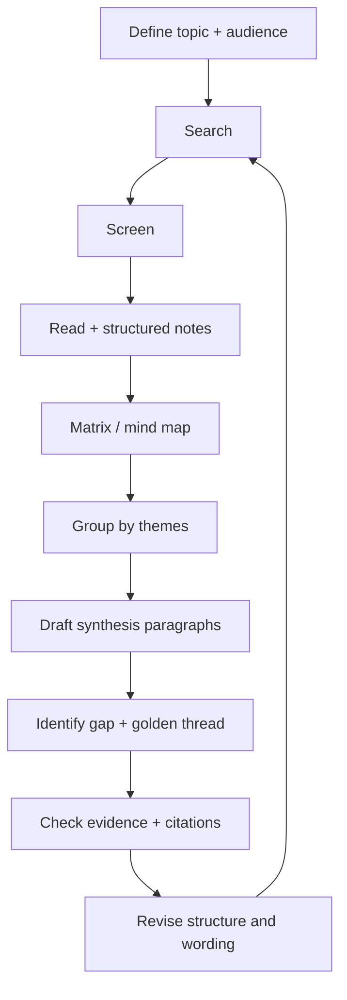

# 02 — Note-taking, Synthesis Matrix và Quality Check

## Mục tiêu

Có một workflow có thể lặp lại cho bất kỳ literature review nào.

## 1. Ba thói quen mạnh nhất

Video kết thúc bằng các gợi ý thực tế:

- định nghĩa topic và audience trước khi research;
- đọc nhiều literature review / journal article trong chính field của bạn;
- ưu tiên literature hiện tại, trừ khi theory cũ là nền tảng;
- ghi chú có hệ thống thay vì chỉ tích PDF.

## 2. Synthesis matrix

| Source | Theme A | Theme B | Method | Finding | Limitation | Relation |
|---|---|---|---|---|---|---|
| Paper 1 | ✓ |  | Survey | Positive | Small sample | Supports |
| Paper 2 | ✓ | ✓ | Experiment | Mixed | Short duration | Contrasts |
| Paper 3 |  | ✓ | Interview | Mechanism Y | One context | Explains |

Matrix giúp nhìn ngang qua nhiều paper để nhận ra pattern.

## 3. Workflow hoàn chỉnh

## 4. Quality checklist

Trước khi hoàn tất, kiểm tra:

- [ ] Mỗi section có mục đích rõ ràng.
- [ ] Heading phản ánh theme, không chỉ tên tác giả.
- [ ] Mỗi paragraph có topic sentence.
- [ ] Có so sánh/đối chiếu nhiều nguồn.
- [ ] Có nêu limitations hoặc disagreement khi cần.
- [ ] Không cherry-pick chỉ những nguồn ủng hộ lập luận.
- [ ] Gap xuất hiện từ bằng chứng, không phải tuyên bố đột ngột.
- [ ] Research question nối logic với review.
- [ ] Citation đầy đủ và nhất quán.
- [ ] Nguồn mới đủ để phản ánh state of the field.

## Mini-project cuối khóa

Viết một literature review 1.000–1.500 từ về đề tài của bạn, gồm:

1. Scope statement.
2. 3–5 themes.
3. Ít nhất một điểm consensus.
4. Ít nhất một disagreement/limitation.
5. Một research gap rõ.
6. Một đoạn cuối nối gap với câu hỏi nghiên cứu.
