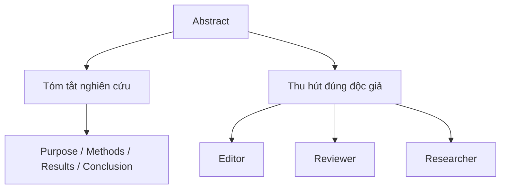

# 01 — Abstract là gì và tại sao nó quan trọng?

**Timestamp nguồn:** 00:00–00:32

## Mục tiêu

- Hiểu abstract là một bản tóm tắt độc lập của nghiên cứu.
- Hiểu vì sao abstract ảnh hưởng đến việc người đọc có tiếp tục đọc paper hay không.

## Khái niệm

Abstract là phần tóm tắt cực ngắn nhưng có mật độ thông tin cao. Nó phải giúp người đọc trả lời nhanh:

1. Nghiên cứu này nói về vấn đề gì?
2. Tác giả đã làm gì?
3. Kết quả chính là gì?
4. Kết quả đó có ý nghĩa gì?

Purdue OWL mô tả abstract như bản tóm tắt ngắn giúp người đọc quyết định nghiên cứu có liên quan đến công việc của họ hay không. Trong nhiều ngành, abstract thường đi gần với logic IMRaD: Introduction, Methods, Results, Discussion.

## Vai trò kép

Một abstract tốt không phải quảng cáo phóng đại. Nó phải **hấp dẫn vì rõ và hữu ích**, không phải vì giật gân.

## Nguyên tắc cốt lõi

> Accurate + Concise + Self-contained + Relevant

- **Accurate:** không nói quá dữ liệu.
- **Concise:** bỏ chi tiết không cần thiết.
- **Self-contained:** người đọc hiểu được ý chính mà chưa cần mở toàn bài.
- **Relevant:** mọi câu đều phục vụ câu hỏi nghiên cứu.

## Bài tập

Lấy một paper của anh. Không nhìn abstract, hãy viết 4 dòng tương ứng với: vấn đề, phương pháp, kết quả, kết luận. Đây là bản nháp đầu tiên của abstract.
