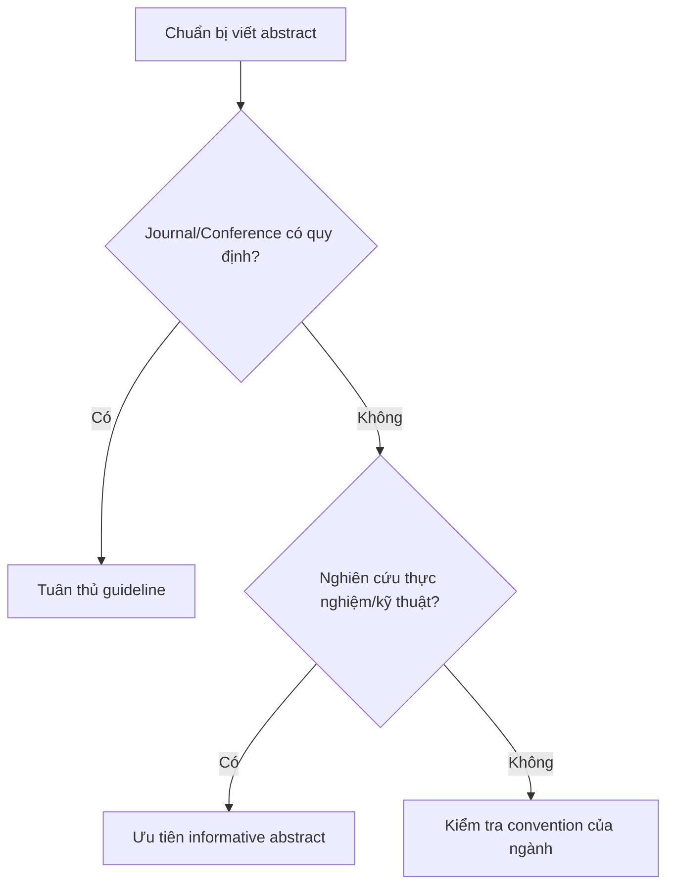

# 02 — Descriptive Abstract và Informative Abstract

**Timestamp nguồn:** 00:32–01:10

## Hai kiểu abstract chính

| Đặc điểm | Descriptive | Informative |
|---|---|---|
| Mục tiêu | Cho biết bài viết chứa loại thông tin gì | Tóm tắt gần như toàn bộ nghiên cứu |
| Thường có | Background, purpose, đôi khi methods | Purpose, methods, results, conclusion |
| Results | Thường không | Có |
| Conclusion | Có thể không | Thường có |
| Phổ biến | Một số humanities/social sciences | Journal/conference khoa học, kỹ thuật, tâm lý… |

Wordvice mô tả descriptive abstract thường ngắn và có thể bỏ results; informative abstract đóng vai trò như một “surrogate” của paper, nghĩa là người đọc có thể nắm phần lớn ý chính từ abstract.

## Quy tắc chọn loại

## Cảnh báo

Không mặc định rằng “100–200 từ” hoặc bất kỳ độ dài nào áp dụng cho mọi nơi. Word limit phải lấy từ **author guidelines** của nơi nộp bài.

## Bài tập

Tìm 3 journal trong lĩnh vực của anh và ghi:

- word limit;
- structured hay unstructured;
- có yêu cầu keywords không;
- có cấm citation/abbreviation trong abstract không.
