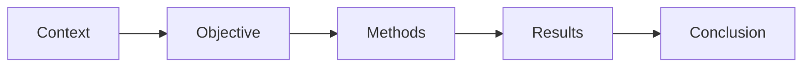

# 03 — Journal Guidelines, Structured và Unstructured Abstract

**Timestamp nguồn:** 01:10–01:37

## Việc phải làm trước khi viết

Đọc trang **Instructions for Authors / Author Guidelines** của journal hoặc conference.

Kiểm tra tối thiểu:

- số từ tối đa/tối thiểu;
- structured hay unstructured;
- tên các heading bắt buộc;
- số lượng keywords;
- quy tắc viết tắt;
- có cho citation/reference trong abstract không;
- tense hoặc style đặc thù nếu có.

## Structured abstract

Ví dụ cấu trúc:

```text
Background:
Objective:
Methods:
Results:
Conclusion:
```

Ưu điểm: rõ, dễ scan, thường dùng trong y sinh và một số journal chuyên ngành.

## Unstructured abstract

Không có heading, thường là một đoạn văn duy nhất. Tuy nhiên logic nội bộ vẫn nên giữ thứ tự:



## Nguyên tắc

**Format là ràng buộc xuất bản, không phải sở thích cá nhân.** Một abstract hay nhưng sai format vẫn có thể gây ấn tượng kém ở vòng kiểm tra hình thức.
