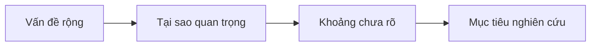

# 04 — Phần 1: Purpose & Motivation

**Timestamp nguồn:** 01:37–02:29

## Câu hỏi cần trả lời

- Vì sao vấn đề này đáng nghiên cứu?
- Tại sao người đọc trong lĩnh vực này nên quan tâm?
- Nghiên cứu hướng tới mục tiêu tổng quát nào?

## Công thức ngắn

> **Context / problem importance → research motivation**

Ví dụ theo case của bài giảng:

> Tỷ lệ bệnh dại ở động vật nuôi gia tăng đang trở thành mối quan tâm tại một số khu vực đô thị.

Câu này chưa nói nghiên cứu làm gì; nó đặt ra **lý do cần nghiên cứu**.

## Phân biệt motivation và objective

- **Motivation:** tại sao nghiên cứu cần tồn tại.
- **Objective:** nghiên cứu cụ thể sẽ làm gì.

## Lỗi thường gặp

- Background dài 4–5 câu khiến không còn chỗ cho kết quả.
- Dùng phát biểu quá lớn như “This is the first study…” mà không kiểm chứng.
- Dùng câu chung chung: “X is very important in modern society.”

## Bài tập

Viết motivation cho nghiên cứu của anh trong **1 câu, tối đa 30 từ**.
