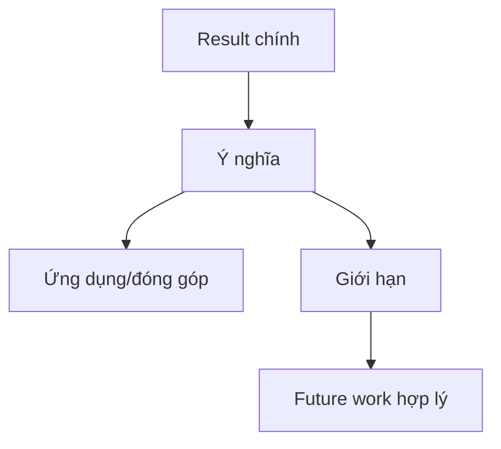

# 08 — Phần 5: Conclusion & Implications

**Timestamp nguồn:** 05:01–06:01

## Nhiệm vụ

Kết luận phải quay lại câu hỏi ở đầu abstract và trả lời:

- Kết quả có nghĩa gì?
- Đóng góp gì cho lĩnh vực?
- Có giới hạn nào quan trọng?
- Có hướng nghiên cứu tiếp theo nào thực sự hợp lý?

## Cấu trúc

## Cảnh báo về causal language

Nếu thiết kế chỉ quan sát/cắt ngang, tránh biến correlation thành causation.

- An toàn hơn: `was associated with`, `correlated with`.
- Chỉ dùng `caused`, `led to` khi thiết kế và bằng chứng hỗ trợ suy luận nhân quả.

## Mẫu câu

> These findings suggest that...

> The results indicate that...

> Further work is needed to determine whether...

## Bài tập

Viết conclusion 1–2 câu nhưng không lặp nguyên văn Results.
