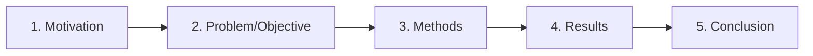

# 09 — Ghép 5 phần thành một Abstract thống nhất

**Timestamp nguồn:** 01:37–06:01

## Công thức 5 phần

## Bản nháp theo câu

1. 1 câu: vấn đề/motivation.
2. 1 câu: objective.
3. 1–2 câu: methods.
4. 1–2 câu: results.
5. 1–2 câu: conclusion/implication.

Sau đó mới chỉnh để thành đoạn văn tự nhiên.

## Kiểm tra tính nhất quán

| Thành phần | Phải khớp với |
|---|---|
| Objective | Research question |
| Methods | Objective |
| Results | Methods + Objective |
| Conclusion | Results |

Nếu conclusion nói về điều Results không chứng minh, abstract bị “logical drift”.

## Bài tập tích hợp

Dùng 5 câu anh đã viết ở Lesson 04–08, ghép thành một paragraph. Sau đó xóa từ thừa cho đến khi giảm ít nhất 15% số từ mà không mất thông tin chính.
