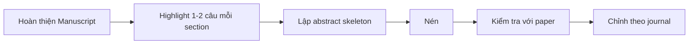

# 10 — Vì sao nên viết Abstract sau cùng?

**Timestamp nguồn:** 06:01–06:27

## Lý do

Khi manuscript đã hoàn chỉnh:

- objective cuối cùng đã ổn định;
- methods không còn thay đổi;
- results cuối cùng đã được chọn;
- discussion/conclusion phản ánh đúng dữ liệu.

Nếu viết abstract quá sớm, rất dễ xảy ra **mismatch** giữa abstract và paper.

## Workflow

## Cách làm nhanh

Mở paper và tô màu:

- Intro: 1 câu gap/objective.
- Methods: 1 câu design/data/analysis.
- Results: 1–2 findings.
- Discussion: 1 implication.

Không copy-paste nguyên câu; hãy viết lại để abstract có flow riêng.
