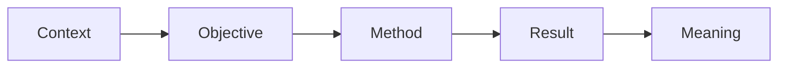

# 11 — Viết ngắn, rõ và đúng thứ tự

**Timestamp nguồn:** 06:14–06:40

## Abstract là bài viết độc lập

Dù lấy thông tin từ manuscript, abstract cần được **viết lại từ đầu** để phù hợp với mục tiêu nén thông tin.

## Kỹ thuật nén

### 1. Xóa framing dư

Dài:
> It is important to note that the results of this study show that...

Ngắn:
> The results show that...

### 2. Ưu tiên động từ mạnh

- `conducted`, `measured`, `compared`, `identified`, `predicted`, `increased`.

### 3. Một câu = một chức năng chính

### 4. Tránh acronym không cần thiết

Nếu chỉ xuất hiện một lần, viết đầy đủ thường rõ hơn.

## Bài tập

Chọn một abstract cũ của anh và giảm 20% số từ mà giữ nguyên tất cả thông tin khoa học chính.
