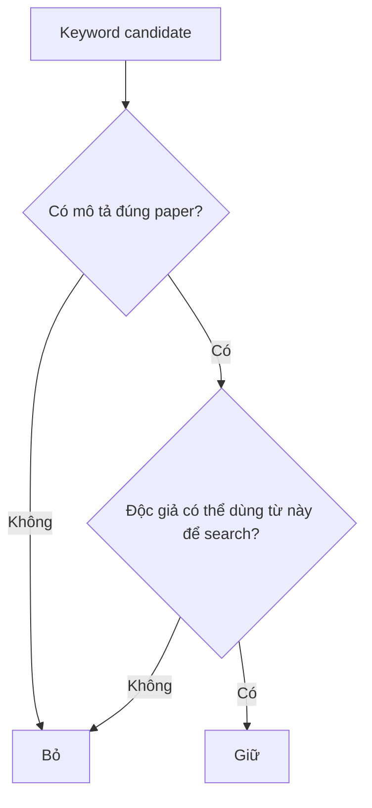

# 12 — Keywords và khả năng được tìm thấy

**Timestamp nguồn:** 06:34–07:04

## Keywords không phải nơi nhồi từ khóa

Mục tiêu là giúp database và nhà nghiên cứu xác định paper có liên quan hay không.

## Chọn keywords theo 4 nhóm

1. **Core topic** — chủ đề trung tâm.
2. **Method** — nếu phương pháp là điểm phân biệt.
3. **Population/data** — nhóm hoặc dataset chính.
4. **Outcome/application** — kết quả/ứng dụng chính.

## Ví dụ AI paper

Paper về facial emotion recognition bằng CNN có thể chọn:

`facial emotion recognition; convolutional neural network; facial expression; computer vision`

thay vì nhồi những từ quá rộng như:

`AI; technology; model; data; research`

## Nguyên tắc

## Bài tập

Tạo 8 keyword candidates, sau đó rút còn 4–6 từ/phrase có độ đặc hiệu cao nhất hoặc theo yêu cầu journal.
