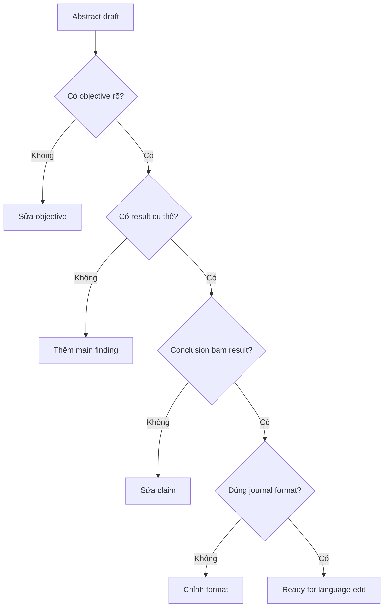

# 13 — Những lỗi thường gặp khi viết Abstract

## 1. Background quá dài

**Triệu chứng:** hết word budget trước khi đến Results.

**Sửa:** giữ context ở mức tối thiểu cần thiết để hiểu objective.

## 2. Không có số liệu/kết quả cụ thể

**Triệu chứng:** chỉ viết “results are discussed”.

**Sửa:** nêu finding chính.

## 3. Conclusion vượt quá dữ liệu

**Triệu chứng:** study correlation nhưng kết luận causal.

**Sửa:** match strength of claim với study design.

## 4. Copy-paste manuscript

**Triệu chứng:** câu quá dài, references nội bộ như “as shown in Figure 2”.

**Sửa:** abstract phải tự đứng độc lập.

## 5. Citation/reference trong abstract khi journal không cho phép

**Sửa:** kiểm tra author guidelines.

## 6. Acronym, jargon quá nhiều

**Sửa:** chỉ giữ thuật ngữ thiết yếu.

## 7. Keyword stuffing

**Sửa:** chọn từ khóa chính xác thay vì nhiều.

## Sơ đồ chẩn đoán

