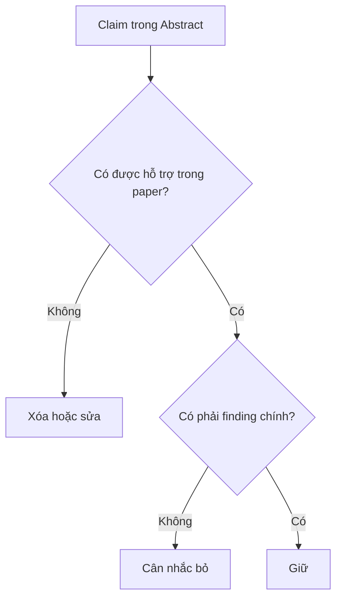

# 15 — Workshop: Nén Paper thành Abstract

## Bước 1 — Trích xuất bằng chứng

Điền bảng:

| Thành phần | Nội dung từ paper | Giới hạn |
|---|---|---|
| Motivation | | 1 câu |
| Objective | | 1 câu |
| Methods | | 1–2 câu |
| Results | | 1–2 câu |
| Conclusion | | 1–2 câu |

## Bước 2 — Ghép thành bản nháp

Không chỉnh style ở vòng đầu. Chỉ đảm bảo logic đúng.

## Bước 3 — Nén

Với mỗi câu, hỏi:

- từ này có thêm thông tin không?
- detail này có cần để hiểu finding chính không?
- câu này có lặp ý câu trước không?

## Bước 4 — Kiểm chứng với manuscript

## Bước 5 — Fit journal

Chỉnh word count, headings, keywords, style theo nơi submit.
