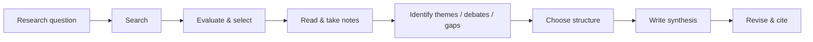

# Course Map — Literature Review in 5 Steps

| Module | Lesson | Nội dung chính | Timestamp gốc |
|---|---|---|---|
| 00 | 00 | Literature review là gì? | 00:00–00:27 |
| 01 | 01 | Tìm tài liệu liên quan | 00:30–00:48 |
| 01 | 02 | Database + Boolean operators | 00:41–00:56 |
| 01 | 03 | Đánh giá và chọn nguồn | 00:58–01:26 |
| 02 | 04 | Themes, debates, influential studies, gaps | 01:26–01:56 |
| 02 | 05 | 4 cách cấu trúc literature review | 01:56–02:31 |
| 03 | 06 | Viết introduction, body, conclusion | 02:34–02:48 |
| 03 | 07 | Workflow đầu-cuối + checklist | Tổng hợp toàn video |

## Luồng học

## Deliverable cuối khóa

Một literature review có:

- câu hỏi/phạm vi rõ ràng;
- search strategy có thể giải thích;
- nguồn được chọn có lý do;
- synthesis matrix;
- cấu trúc logic;
- phân tích và tổng hợp, không chỉ tóm tắt;
- research gap được diễn đạt thận trọng;
- trích dẫn và danh mục tài liệu nhất quán.
