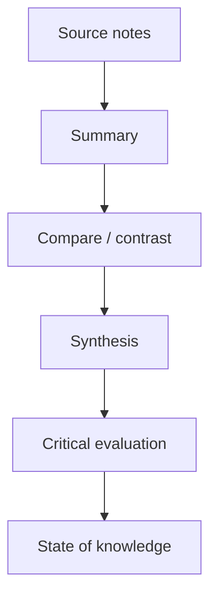

# 00 — Literature Review là gì?

**Nguồn transcript:** 00:00–00:27

## Mục tiêu

Sau bài này, bạn có thể:

- định nghĩa literature review;
- phân biệt summary với synthesis và critical evaluation;
- hiểu vai trò của literature review trong paper, thesis và dissertation.

## 1. Định nghĩa

Literature review là phần **khảo sát, tổng hợp và đánh giá có hệ thống** các công trình học thuật liên quan đến một chủ đề hoặc câu hỏi nghiên cứu.

Nó không đơn giản là:

> Paper A nói gì → Paper B nói gì → Paper C nói gì.

Một literature review tốt phải cho người đọc thấy **bức tranh chung của lĩnh vực**:

- điều gì đã được biết;
- các nghiên cứu đồng thuận ở đâu;
- tranh luận hoặc mâu thuẫn nằm ở đâu;
- phương pháp nào thường được dùng;
- phần nào vẫn chưa được giải quyết.

## 2. Ba lớp tư duy

| Lớp | Câu hỏi |
|---|---|
| Summary | Nguồn này nói gì? |
| Synthesis | Các nguồn liên hệ với nhau thế nào? |
| Critical evaluation | Bằng chứng mạnh/yếu ở đâu, giới hạn là gì? |

## 3. Literature review dùng để làm gì?

Trong một nghiên cứu, literature review giúp:

1. đặt nghiên cứu vào bối cảnh học thuật;
2. tránh lặp lại những gì đã làm;
3. xác định khái niệm, lý thuyết và phương pháp phù hợp;
4. nhận diện gaps;
5. giải thích vì sao nghiên cứu mới là cần thiết.

## 4. Ví dụ mini

Giả sử câu hỏi:

**“Việc dùng mạng xã hội ảnh hưởng thế nào đến hình ảnh cơ thể ở Gen Z?”**

Cách viết yếu:

> Smith (2022) cho rằng mạng xã hội làm giảm body satisfaction. Nguyen (2023) nghiên cứu Instagram. Lee (2024) nghiên cứu TikTok.

Cách tổng hợp tốt hơn:

> Nhiều nghiên cứu liên hệ việc tiếp xúc với nội dung ngoại hình trên mạng xã hội với mức độ hài lòng cơ thể thấp hơn. Tuy nhiên, kết quả khác nhau theo nền tảng, kiểu nội dung và đặc điểm người dùng, cho thấy tác động có thể không đồng nhất.

Đoạn thứ hai đã bắt đầu **synthesis**.

## 5. Bài tập

Chọn 3 paper về cùng một chủ đề và viết:

- 1 câu tóm tắt cho mỗi paper;
- 1 đoạn 4–6 câu chỉ ra ít nhất 2 điểm giống/khác giữa chúng.

## Checklist

- [ ] Tôi hiểu literature review không phải danh sách tóm tắt.
- [ ] Tôi biết sự khác nhau giữa summary, synthesis và evaluation.
- [ ] Tôi có một câu hỏi nghiên cứu đủ cụ thể để bắt đầu tìm tài liệu.

## Đọc thêm

- Scribbr — *How to Write a Literature Review*
- Purdue OWL — *Writing a Literature Review*

Xem `../references/00_sources.md`.
