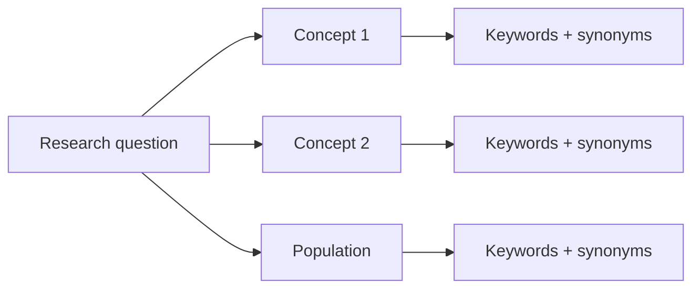
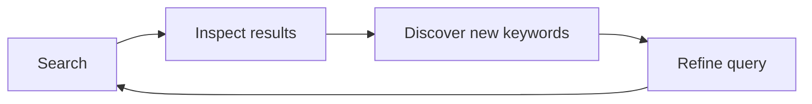

# 01 — Tìm tài liệu liên quan

**Nguồn transcript:** 00:30–00:48

## Mục tiêu

- Biến research question thành nhóm từ khóa.
- Chọn database phù hợp.
- Ghi lại search strategy để có thể tái sử dụng.

## 1. Bắt đầu từ câu hỏi nghiên cứu

Không nên tìm bằng cả câu hỏi dài. Hãy tách nó thành **concepts**.

Ví dụ:

> What is the impact of social media on body image among Generation Z?

Tách thành:

| Concept | Từ khóa |
|---|---|
| Social media | social media, Instagram, TikTok, Facebook |
| Body image | body image, body satisfaction, self-perception |
| Population | Gen Z, adolescent, teenager, youth |

## 2. Chọn nơi tìm

Transcript nêu ba ví dụ:

- **Google Scholar** — tìm rộng, dễ bắt đầu;
- **JSTOR** — mạnh ở humanities và social sciences;
- **ScienceDirect** — nền tảng bài báo/sách của Elsevier, mạnh ở nhiều ngành khoa học và kỹ thuật.

Ngoài ra, tùy lĩnh vực có thể dùng:

- PubMed / MEDLINE;
- IEEE Xplore;
- ACM Digital Library;
- Scopus;
- Web of Science;
- EBSCO;
- Project MUSE.

## 3. Search log

Luôn ghi lại:

| Database | Query | Filter | Date searched | Results | Notes |
|---|---|---|---|---:|---|
| Google Scholar | `"social media" AND "body image"` | 2020–2026 | YYYY-MM-DD | … | quá rộng |
| JSTOR | `("social media" OR Instagram) AND "body image"` | article | YYYY-MM-DD | … | tốt hơn |

Search log giúp bạn:

- nhớ mình đã thử gì;
- tránh tìm lặp;
- giải thích phương pháp tìm tài liệu khi cần.

## 4. Nguyên tắc thực hành

Không cố tìm “query hoàn hảo” ngay lần đầu. Search strategy thường là một vòng lặp:

## Bài tập

Chọn một research question và tạo:

- 3 concept groups;
- ít nhất 3 synonym cho mỗi group;
- 2 query thử nghiệm;
- 1 search log.

## Tiêu chí đạt

Bạn có thể giải thích **tại sao** mình dùng những từ khóa và database đó.
