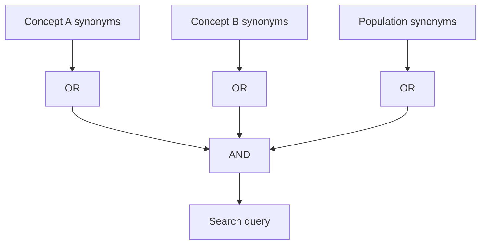

# 02 — Boolean Operators và cách xây query

**Nguồn transcript:** 00:41–00:56

## Mục tiêu

- Dùng `AND`, `OR`, `NOT`.
- Biết khi nào query quá rộng hoặc quá hẹp.
- Nhóm từ khóa bằng ngoặc.

## 1. Ba toán tử cơ bản

### AND — thu hẹp

```text
social media AND body image
```

Kết quả phải chứa cả hai concept.

### OR — mở rộng

```text
adolescent OR teenager OR youth
```

Hữu ích cho synonym và thuật ngữ tương đương.

### NOT — loại bỏ

```text
jaguar NOT car
```

Dùng thận trọng vì có thể loại cả bài hữu ích.

## 2. Dùng ngoặc

Một query tốt thường có dạng:

```text
("social media" OR Instagram OR TikTok)
AND
("body image" OR "body satisfaction")
AND
(adolescent OR teenager OR "Generation Z")
```



## 3. Phrase search

Dùng dấu ngoặc kép khi muốn tìm một cụm từ:

```text
"body image"
"machine learning"
"literature review"
```

## 4. Query tuning

### Quá nhiều kết quả

Thử:

- thêm concept bằng `AND`;
- thêm phrase search;
- giới hạn năm;
- giới hạn field như title/abstract khi database hỗ trợ.

### Quá ít kết quả

Thử:

- thêm synonym bằng `OR`;
- bỏ một điều kiện quá hẹp;
- dùng thuật ngữ rộng hơn;
- kiểm tra spelling và thuật ngữ chuyên ngành.

## 5. Lưu ý theo database

Cú pháp search **không hoàn toàn giống nhau** giữa các nền tảng. Ví dụ JSTOR hỗ trợ Boolean operators và khuyến nghị viết `AND`, `OR`, `NOT` bằng chữ hoa. Với các database khác, hãy kiểm tra search help của chính nền tảng.

## Bài tập

Tạo 3 phiên bản query:

1. broad;
2. balanced;
3. narrow.

Sau đó ghi nhận số lượng và mức liên quan của 10 kết quả đầu.

## Mini checklist

- [ ] Synonym nằm trong nhóm `OR`.
- [ ] Các concept khác nhau nối bằng `AND`.
- [ ] Query phức tạp có ngoặc.
- [ ] Tôi không dùng `NOT` chỉ vì muốn giảm số lượng kết quả.
