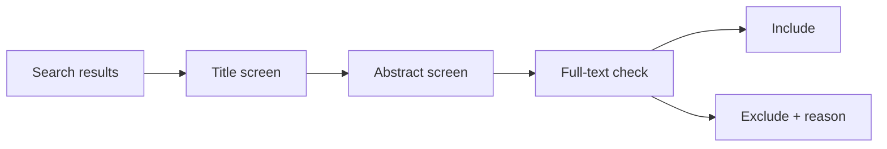
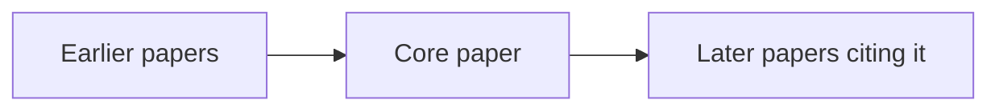

# 03 — Đánh giá và chọn nguồn

**Nguồn transcript:** 00:58–01:26

## Mục tiêu

- Sàng lọc nhanh nguồn bằng title/abstract.
- Dùng citation chaining.
- Tránh chọn nguồn chỉ vì citation count cao.

## 1. Vì sao phải chọn?

Bạn thường không thể đọc toàn bộ những gì đã xuất bản về một chủ đề. Vì vậy cần một quy trình chọn nguồn có lý do.

## 2. Screening bằng abstract

Đọc abstract và hỏi:

- Có đúng population không?
- Có đúng concept/variable không?
- Có đúng context không?
- Study design có hữu ích không?
- Kết quả có trực tiếp liên quan đến research question không?

## 3. Citation chaining

### Backward chaining

Xem **reference list** của một paper tốt để tìm các nguồn trước đó.

### Forward chaining

Xem những paper nào **đã trích dẫn** paper này để tìm nghiên cứu mới hơn.

## 4. Citation count: tín hiệu, không phải phán quyết

Transcript gợi ý chú ý số trích dẫn trên Google Scholar. Điều này hữu ích để phát hiện các công trình có ảnh hưởng, nhưng phải hiểu giới hạn:

- paper cũ có nhiều thời gian tích lũy citation hơn;
- lĩnh vực đông người có citation cao hơn lĩnh vực hẹp;
- citation không tự động đồng nghĩa với chất lượng;
- một paper có thể được trích dẫn để bị phản biện.

Vì vậy hãy dùng citation count cùng với:

- mức liên quan;
- chất lượng phương pháp;
- uy tín nguồn xuất bản;
- độ mới phù hợp;
- vai trò của paper trong cuộc tranh luận.

## 5. Inclusion / exclusion criteria

Ví dụ:

**Include**
- peer-reviewed;
- 2020–2026;
- nghiên cứu về Gen Z;
- đo body image trực tiếp.

**Exclude**
- editorial không có dữ liệu;
- không đúng population;
- chỉ nói chung về mental health mà không đo body image.

## Bài tập

Dùng `../templates/source_evaluation_matrix.md` để đánh giá ít nhất 8 nguồn.

## Tiêu chí đạt

Bạn có thể nói rõ vì sao mỗi nguồn được **include** hoặc **exclude**.
