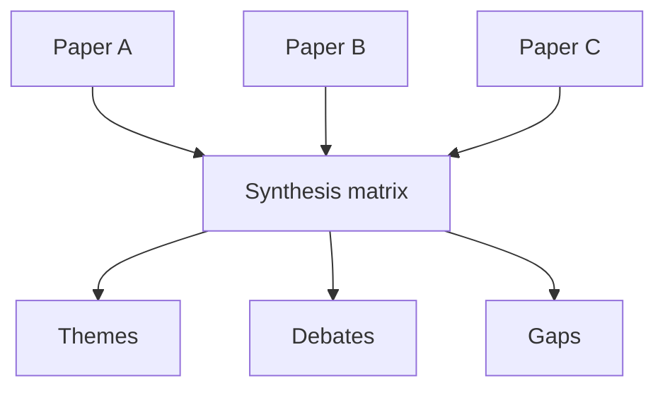

# 04 — Xác định Themes, Debates và Research Gaps

**Nguồn transcript:** 01:26–01:56

## Mục tiêu

- Nhận diện patterns giữa nhiều nguồn.
- Phân biệt theme, debate và gap.
- Dùng synthesis matrix để chuẩn bị viết.

## 1. Đừng ghi chú từng paper một cách cô lập

Khi đọc, hãy ghi chú theo **dimensions dùng để so sánh**:

- theory;
- method;
- sample;
- context;
- variables;
- results;
- limitations.

## 2. Những thứ cần tìm

### Trends / patterns

Ví dụ:
- nghiên cứu gần đây chuyển từ survey sang digital trace data;
- đa số studies dùng cross-sectional design.

### Themes

Nhóm nội dung lặp lại:

- social comparison;
- influencer exposure;
- appearance-focused content.

### Debates / contradictions

Ví dụ:
- nhóm nghiên cứu A cho rằng time spent là yếu tố chính;
- nhóm B cho rằng loại nội dung quan trọng hơn tổng thời gian.

### Influential studies

Những công trình thường xuyên được dùng làm nền cho lý thuyết, phương pháp hoặc định nghĩa.

### Gaps

Một gap không chỉ là:

> “Chưa có ai nghiên cứu X.”

Gap có thể là:

- population gap;
- context gap;
- methodological gap;
- theoretical gap;
- measurement gap;
- contradictory evidence;
- temporal gap.

## 3. Cách diễn đạt gap thận trọng

Tránh:

> “Không có nghiên cứu nào…”

trừ khi bạn đã có search strategy đủ mạnh để bảo vệ khẳng định này.

Nên dùng:

> “Existing studies have primarily focused on …, while comparatively less attention has been paid to …”

## 4. Synthesis matrix

Xem mẫu: `../templates/synthesis_matrix.md`.

Ví dụ:

| Study | Sample | Method | Theme A | Theme B | Limitation |
|---|---|---|---|---|---|
| A | Gen Z | survey | ✓ |  | cross-sectional |
| B | Gen Z | interview | ✓ | ✓ | small sample |
| C | adolescents | experiment |  | ✓ | lab context |

## Bài tập

Với 6–10 nguồn, xác định:

- 2 themes;
- 1 disagreement;
- 1 dominant method;
- 1 potential gap.

Sau đó viết một đoạn synthesis 120–180 từ có ít nhất 3 nguồn cùng xuất hiện.
