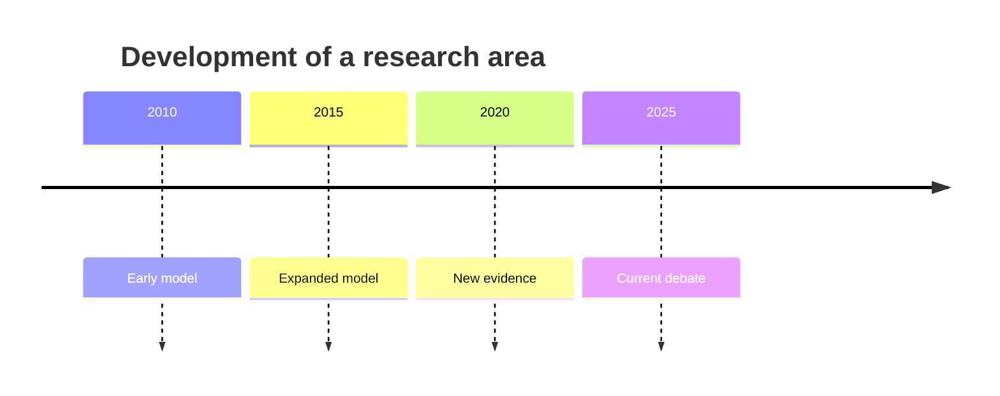
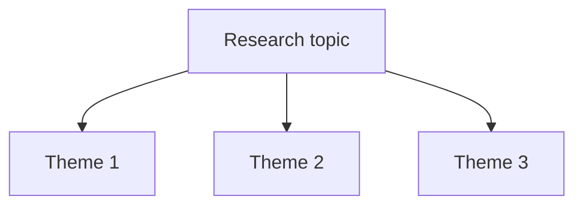
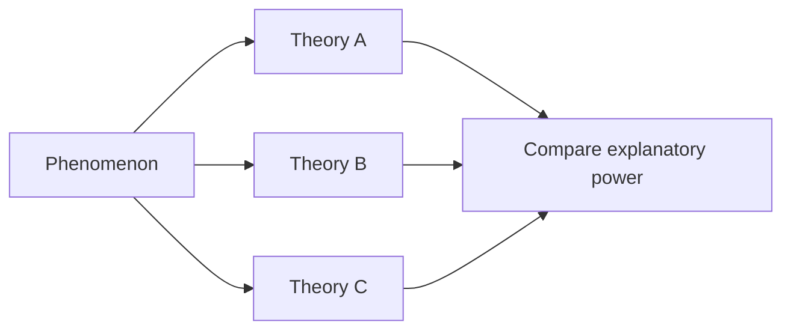

# 05 — Chọn cấu trúc cho Literature Review

**Nguồn transcript:** 01:56–02:31

## Mục tiêu

Biết dùng bốn cấu trúc phổ biến:

1. chronological;
2. thematic;
3. methodological;
4. theoretical.

## 1. Chronological — theo thời gian

Phù hợp khi muốn cho thấy một lĩnh vực **phát triển qua thời gian**.

Không nên chỉ kể “năm này → năm kia”. Cần giải thích **điều gì thay đổi và vì sao**.

## 2. Thematic — theo chủ đề

Phù hợp khi literature chia thành các nhóm ý rõ.

Đây thường là cấu trúc linh hoạt nhất cho student literature reviews.

## 3. Methodological — theo phương pháp

Hữu ích khi các nghiên cứu dùng các phương pháp khác nhau và phương pháp ảnh hưởng mạnh đến kết quả.

Ví dụ:

- quantitative surveys;
- qualitative interviews;
- experiments;
- longitudinal studies.

Câu hỏi trung tâm:

> Kết luận thay đổi thế nào khi phương pháp thay đổi?

## 4. Theoretical — theo lý thuyết

Dùng khi literature xoay quanh:

- competing theories;
- conceptual models;
- definitions;
- theoretical traditions.

Ví dụ:

## 5. Chọn cấu trúc bằng câu hỏi

| Nếu bạn muốn nhấn mạnh… | Cấu trúc phù hợp |
|---|---|
| sự phát triển theo thời gian | Chronological |
| các chủ đề lớn | Thematic |
| sự khác biệt do phương pháp | Methodological |
| các cách giải thích cạnh tranh | Theoretical |

Có thể kết hợp. Ví dụ:

- body theo themes;
- trong mỗi theme trình bày chronological.

## Bài tập

Tạo hai outline khác nhau cho cùng một topic:

1. thematic;
2. methodological hoặc chronological.

Sau đó chọn bản cho thấy lập luận rõ hơn.
