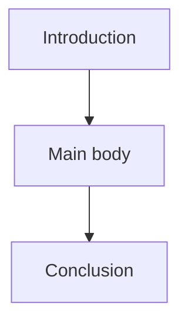

# 06 — Viết Literature Review

**Nguồn transcript:** 02:34–02:48

## Mục tiêu

- Viết introduction, body, conclusion.
- Phân biệt paragraph summary với synthesis paragraph.
- Dùng cấu trúc đoạn để kết nối nhiều nguồn.

## 1. Kiến trúc cơ bản



## 2. Introduction

Một phần mở đầu tốt thường:

- giới thiệu topic;
- xác định phạm vi;
- giải thích mục tiêu của review;
- nêu cách tổ chức;
- nếu phù hợp, chỉ ra vấn đề/gap dẫn vào nghiên cứu.

### Mẫu logic

> Topic → Scope → State of literature → Organizing logic → Purpose

## 3. Body

Body không nên là:

```text
Study A...
Study B...
Study C...
```

Nên tổ chức theo **idea**:

```text
Claim / theme
→ evidence from multiple studies
→ compare / contrast
→ evaluate
→ implication
```


### Mẫu synthesis paragraph

1. Topic sentence nêu pattern.
2. Nguồn A + B hỗ trợ pattern.
3. Nguồn C cho kết quả khác.
4. Giải thích vì sao khác: sample, method, context?
5. Kết thúc bằng implication.

## 4. Conclusion

Conclusion có thể:

- tóm tắt patterns chính;
- nêu điểm đồng thuận / tranh luận;
- chỉ ra limitation của literature;
- dẫn đến research gap hoặc research question.

Không nên đưa một loạt paper mới vào phần kết luận.

## 5. Critical voice

Các động từ hữu ích:

- suggests;
- indicates;
- demonstrates;
- challenges;
- extends;
- contradicts;
- overlooks;
- is limited by;
- provides evidence for.

## Bài tập

Viết một body paragraph 150–220 từ:

- dùng ít nhất 3 nguồn;
- có compare/contrast;
- có 1 câu evaluation;
- kết bằng implication.
