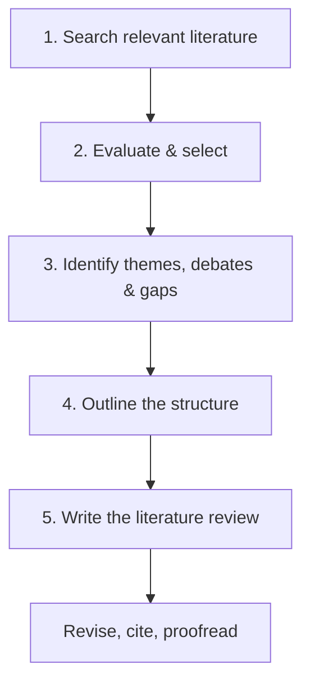

# 07 — Workflow hoàn chỉnh và Checklist cuối

**Nguồn:** Tổng hợp toàn transcript 00:00–02:54

## Workflow 5 bước



## Bước 1 — Search

- [ ] Research question rõ.
- [ ] Có keyword groups và synonyms.
- [ ] Dùng database phù hợp.
- [ ] Có search log.
- [ ] Query dùng Boolean logic hợp lý.

## Bước 2 — Evaluate & select

- [ ] Đọc title + abstract.
- [ ] Có inclusion/exclusion criteria.
- [ ] Dùng backward/forward citation chaining.
- [ ] Không đánh giá nguồn chỉ bằng citation count.
- [ ] Có bảng đánh giá nguồn.

## Bước 3 — Themes, debates, gaps

- [ ] Có synthesis matrix.
- [ ] Đã nhận diện patterns.
- [ ] Có ít nhất một debate/contradiction nếu literature cho thấy.
- [ ] Gap được diễn đạt thận trọng.
- [ ] Phân biệt gap thật với “tôi chưa tìm thấy”.

## Bước 4 — Structure

- [ ] Đã chọn chronological / thematic / methodological / theoretical.
- [ ] Mỗi section phục vụ một mục tiêu.
- [ ] Trật tự section dẫn dắt lập luận.

## Bước 5 — Write

- [ ] Introduction nói rõ focus và scope.
- [ ] Body tổng hợp nhiều nguồn theo idea.
- [ ] Có critical evaluation.
- [ ] Conclusion tóm tắt state of knowledge.
- [ ] Citation style nhất quán.

## Kiểm tra chất lượng

### Câu hỏi 1: Tôi đang tổng hợp hay chỉ kể?

Nếu nhiều đoạn có dạng “A nói…, B nói…, C nói…”, hãy quay lại synthesis matrix.

### Câu hỏi 2: Mỗi section có một luận điểm không?

Mỗi heading phải trả lời một phần của research question.

### Câu hỏi 3: Gap có bằng chứng không?

Gap phải xuất phát từ pattern của literature, không phải cảm giác cá nhân.

### Câu hỏi 4: Tôi có phân biệt quality với popularity không?

Citation count cao không thay thế methodological appraisal.

## Deliverable cuối khóa

Tạo một thư mục dự án:

```text
my_lit_review/
├── research_question.md
├── search_log.md
├── source_evaluation.md
├── synthesis_matrix.md
├── outline.md
├── draft_01.md
└── references.bib
```

## Thử thách cuối

Viết literature review 800–1.500 từ với:

- ≥ 8 nguồn học thuật;
- ≥ 3 đoạn synthesis;
- ≥ 1 debate hoặc tension;
- ≥ 1 gap hoặc limitation;
- structure được giải thích rõ.
