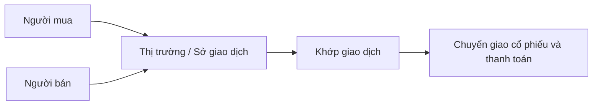
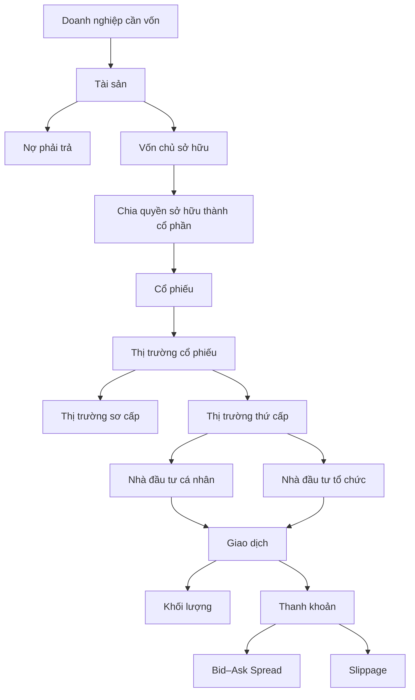

# Cổ phiếu, thị trường cổ phiếu và các nhóm tham gia

## 1. Tóm tắt

Cổ phiếu bắt nguồn từ một ý tưởng rất cơ bản: **chia quyền sở hữu của một doanh nghiệp thành nhiều phần nhỏ có thể chuyển giao**.

Khi một doanh nghiệp cần vốn, chủ sở hữu không nhất thiết phải tự bỏ toàn bộ số tiền cần thiết. Doanh nghiệp có thể vay nợ hoặc huy động thêm vốn từ những người đồng sở hữu. Khi quyền sở hữu được chia thành các đơn vị, mỗi đơn vị đó có thể được biểu diễn bằng một **cổ phần**.

Thị trường cổ phiếu hình thành để những quyền sở hữu này có thể được phát hành và mua bán. Trong thị trường có nhiều nhóm tham gia, nhưng có thể chia thành hai nhóm lớn:

- **nhà đầu tư cá nhân** (*retail investors*);
- **nhà đầu tư tổ chức** (*institutional investors*).

Hiểu mối quan hệ giữa **tài sản, nợ, vốn chủ sở hữu và cổ phần** là nền tảng trước khi nghiên cứu sâu hơn về giao dịch cổ phiếu.

---

## 2. Mục tiêu học tập

Sau bài học này, bạn có thể:

- giải thích cổ phiếu đại diện cho quyền sở hữu như thế nào;
- phân biệt **tài sản**, **nợ phải trả** và **vốn chủ sở hữu**;
- tính giá trị tài sản ròng của doanh nghiệp trong một ví dụ đơn giản;
- giải thích cách cổ phần giúp chuyển giao quyền sở hữu mà không cần thay đổi hoạt động của doanh nghiệp;
- mô tả chức năng cơ bản của thị trường cổ phiếu và sở giao dịch;
- phân biệt thị trường sơ cấp với thị trường thứ cấp ở mức khái niệm;
- phân biệt nhà đầu tư cá nhân với nhà đầu tư tổ chức;
- giải thích vì sao thanh khoản và khối lượng giao dịch có ý nghĩa đối với người tham gia thị trường.

---

## 3. Từ doanh nghiệp đến vốn chủ sở hữu

Giả sử bạn muốn thành lập một doanh nghiệp cần tổng cộng **10.000 USD tài sản** để hoạt động.

Nếu bạn có đủ 10.000 USD tiền tiết kiệm và sử dụng toàn bộ số tiền đó để mua tài sản cho doanh nghiệp, bảng cân đối đơn giản ban đầu sẽ gồm:

| Thành phần | Giá trị |
| --- | ---: |
| Tổng tài sản | 10.000 USD |
| Nợ phải trả | 0 USD |
| Vốn chủ sở hữu | 10.000 USD |

Phương trình kế toán cơ bản là:

$$
\text{Tài sản} = \text{Nợ phải trả} + \text{Vốn chủ sở hữu}
$$

Ký hiệu ngắn gọn:

$$
A = L + E
$$

trong đó:

- $A$ (*Assets*): tài sản;
- $L$ (*Liabilities*): nợ phải trả;
- $E$ (*Equity*): vốn chủ sở hữu.

Trong trường hợp không có khoản nợ nào:

$$
10.000 = 0 + 10.000
$$

Bạn là người cung cấp toàn bộ vốn nên về mặt kinh tế bạn sở hữu toàn bộ phần vốn chủ sở hữu của doanh nghiệp.

---

## 4. Điều gì xảy ra khi doanh nghiệp vay tiền?

Giả sử bạn chỉ có **8.000 USD**, trong khi doanh nghiệp vẫn cần 10.000 USD tài sản để hoạt động với quy mô ban đầu.

Phần vốn còn thiếu là:

$$
10.000 - 8.000 = 2.000\ \text{USD}
$$

Một cách giải quyết là vay thêm **2.000 USD**.

Bảng cân đối trở thành:

| Thành phần | Giá trị |
| --- | ---: |
| Tổng tài sản | 10.000 USD |
| Nợ phải trả | 2.000 USD |
| Vốn chủ sở hữu | 8.000 USD |

Ta có:

$$
10.000 = 2.000 + 8.000
$$

Lúc này, 10.000 USD tài sản của doanh nghiệp không đồng nghĩa với việc chủ sở hữu có giá trị tài sản ròng 10.000 USD.

Doanh nghiệp còn nghĩa vụ trả khoản vay 2.000 USD cho chủ nợ.

Vốn chủ sở hữu vì thế có thể được viết:

$$
E = A - L
$$

hay:

$$
\text{Vốn chủ sở hữu}
=
\text{Tổng tài sản}
-
\text{Tổng nợ phải trả}
$$

Trong ví dụ:

$$
E = 10.000 - 2.000 = 8.000\ \text{USD}
$$

Phần 8.000 USD này phản ánh **giá trị tài sản ròng thuộc về chủ sở hữu**, nếu chỉ xét mô hình đơn giản trên.

---

## 5. Vì sao chủ nợ và chủ sở hữu không giống nhau?

Người cho doanh nghiệp vay tiền không trở thành chủ sở hữu chỉ vì họ cung cấp vốn.

Họ có một **quyền đòi nợ** đối với doanh nghiệp.

Theo thỏa thuận vay, doanh nghiệp thường có nghĩa vụ:

- trả lãi theo điều kiện của khoản vay;
- hoàn trả tiền gốc khi đến hạn.

Nếu doanh nghiệp thanh lý toàn bộ tài sản, nghĩa vụ với các chủ nợ thường phải được xử lý trước khi phần giá trị còn lại được phân bổ cho chủ sở hữu.

Có thể hình dung thứ tự kinh tế đơn giản như sau:


Vì vậy:

> **Chủ nợ có quyền đòi khoản tiền doanh nghiệp nợ họ; cổ đông có quyền đối với phần giá trị còn lại thuộc vốn chủ sở hữu.**

Đây là điểm quan trọng để phân biệt **debt financing** và **equity financing**.

---

## 6. Từ vốn chủ sở hữu đến cổ phần

Tiếp tục ví dụ trên.

Doanh nghiệp có:

- 10.000 USD tài sản;
- 2.000 USD nợ;
- 8.000 USD vốn chủ sở hữu.

Giả sử bạn không muốn tiếp tục bỏ toàn bộ 8.000 USD vốn của mình vào doanh nghiệp. Bạn chỉ muốn đầu tư **4.000 USD**, nhưng cũng không muốn:

- thu nhỏ doanh nghiệp;
- bán bớt tài sản;
- hoặc vay thêm tiền.

Một giải pháp là tìm một người khác đầu tư **4.000 USD** và trở thành đồng sở hữu.

Khi đó:

$$
4.000 + 4.000 = 8.000\ \text{USD vốn chủ sở hữu}
$$

Giả sử quyền sở hữu được chia thành **2 cổ phần bằng nhau**:

| Chủ sở hữu | Số cổ phần | Giá trị vốn góp | Tỷ lệ sở hữu |
| --- | ---: | ---: | ---: |
| Bạn | 1 | 4.000 USD | 50% |
| Đối tác | 1 | 4.000 USD | 50% |
| **Tổng** | **2** | **8.000 USD** | **100%** |

Tỷ lệ sở hữu của một cổ đông có thể biểu diễn đơn giản bằng:

$$
\text{Tỷ lệ sở hữu}
=
\frac{\text{Số cổ phần sở hữu}}
{\text{Tổng số cổ phần}}
\times 100\%
$$

Trong trường hợp này:

$$
\frac{1}{2}\times100\%=50\%
$$

Mỗi người sở hữu 50% phần vốn chủ sở hữu của doanh nghiệp.

---

## 7. Cổ phiếu là gì?

Một **cổ phần** (*share*) biểu diễn một phần quyền sở hữu trong doanh nghiệp.

Trong cách hiểu đơn giản, nếu một công ty có 100 cổ phần và bạn sở hữu 1 cổ phần thì tỷ lệ sở hữu của bạn là:

$$
\frac{1}{100}\times100\%=1\%
$$

Bạn đang nắm giữ 1% quyền sở hữu được biểu diễn thông qua số cổ phần đang lưu hành trong ví dụ này.

Điều quan trọng là không nên hiểu cổ phiếu chỉ như một con số tăng giảm trên màn hình giao dịch.

Đằng sau cổ phiếu là:

```text
Doanh nghiệp
    ↓
Tài sản và hoạt động kinh doanh
    ↓
Nợ phải trả
    ↓
Vốn chủ sở hữu
    ↓
Quyền sở hữu được chia thành các cổ phần
```

Giá cổ phiếu trên thị trường có thể thay đổi liên tục, nhưng bản chất kinh tế của cổ phiếu vẫn gắn với **quyền sở hữu trong doanh nghiệp**.

---

## 8. Quyền đối với lợi nhuận

Doanh nghiệp tạo ra doanh thu nhưng cũng phải trả nhiều loại chi phí.

Ở mức đơn giản:

$$
\text{Lợi nhuận}
=
\text{Doanh thu}
-
\text{Chi phí}
$$

Nếu doanh nghiệp có khoản vay, chi phí tài chính như tiền lãi cũng ảnh hưởng đến lợi nhuận.

Các cổ đông là chủ sở hữu phần vốn chủ sở hữu nên lợi ích kinh tế của họ gắn với kết quả hoạt động của doanh nghiệp.

Tuy nhiên, **sở hữu 1% cổ phần không có nghĩa mỗi năm cổ đông tự động nhận bằng tiền mặt 1% lợi nhuận của công ty**.

Doanh nghiệp có thể:

- giữ lại lợi nhuận để tái đầu tư;
- sử dụng tiền cho hoạt động kinh doanh;
- giảm nợ;
- hoặc phân phối một phần lợi nhuận cho cổ đông dưới hình thức cổ tức nếu có quyết định phù hợp.

Do đó cần phân biệt:

> **quyền sở hữu kinh tế** với **khoản tiền mặt thực tế được phân phối cho cổ đông**.

---

## 9. Vì sao cổ phần giúp chuyển giao quyền sở hữu?

Giả sử bạn đang sở hữu 50% doanh nghiệp và muốn chuyển phần sở hữu đó cho một người khác.

Nếu quyền sở hữu đã được chia thành các cổ phần, về nguyên lý, phần sở hữu có thể được chuyển giao thông qua việc chuyển nhượng cổ phần.

Hoạt động kinh doanh không nhất thiết phải:

- đóng cửa;
- bán toàn bộ tài sản;
- mua lại máy móc;
- hoặc tổ chức lại từ đầu.

Đây là một trong những ý tưởng quan trọng nhất của cổ phần:

> **Quyền sở hữu doanh nghiệp có thể thay đổi trong khi hoạt động thường ngày của doanh nghiệp vẫn tiếp tục.**

Chính khả năng này tạo nền tảng cho thị trường cổ phiếu.

---

## 10. Thị trường cổ phiếu là gì?

**Thị trường cổ phiếu** (*stock market*) là hệ thống trong đó quyền sở hữu dưới dạng cổ phiếu có thể được phát hành, mua bán và chuyển giao.

Người muốn mua và người muốn bán gặp nhau thông qua cơ chế thị trường.

Một phần quan trọng của hệ thống này là **sở giao dịch chứng khoán** (*stock exchange*).

Sở giao dịch cung cấp hạ tầng và các quy tắc để lệnh mua và lệnh bán có thể được xử lý theo cơ chế của thị trường.

Có thể hình dung quá trình cơ bản:



Sở giao dịch hiện đại phần lớn hoạt động thông qua hệ thống điện tử thay vì một địa điểm nơi tất cả nhà đầu tư trực tiếp gặp nhau.

---

## 11. Thị trường sơ cấp và thị trường thứ cấp

Giao dịch liên quan đến cổ phiếu có thể được xem xét theo hai thị trường cơ bản.

### 11.1. Thị trường sơ cấp

**Thị trường sơ cấp** (*primary market*) liên quan đến việc chứng khoán được phát hành để huy động vốn.

Dòng vốn có dạng khái quát:

```text
Nhà đầu tư
    ↓
Mua chứng khoán mới phát hành
    ↓
Doanh nghiệp / tổ chức phát hành nhận vốn
```

Trọng tâm ở đây là **huy động vốn mới**.

### 11.2. Thị trường thứ cấp

**Thị trường thứ cấp** (*secondary market*) là nơi các chứng khoán đã được phát hành được giao dịch giữa những nhà đầu tư.

Ví dụ:

```text
Nhà đầu tư A sở hữu cổ phiếu
            ↓
         Bán cổ phiếu
            ↓
Nhà đầu tư B mua lại
```

Trong giao dịch thông thường trên thị trường thứ cấp, tiền được chuyển giữa người mua và người bán; doanh nghiệp phát hành cổ phiếu không trực tiếp nhận số tiền của từng giao dịch đó.

| Tiêu chí | Thị trường sơ cấp | Thị trường thứ cấp |
| --- | --- | --- |
| Mục đích chính | Phát hành và huy động vốn | Giao dịch chứng khoán đã phát hành |
| Bên bán | Tổ chức phát hành | Nhà đầu tư đang sở hữu |
| Người mua | Nhà đầu tư | Nhà đầu tư |
| Dòng vốn chính | Vào tổ chức phát hành | Giữa các nhà đầu tư |

---

## 12. Những ai tham gia thị trường cổ phiếu?

Có rất nhiều thành phần tham gia thị trường. Nếu phân loại ở mức nhập môn dựa trên quy mô vốn và cách tổ chức hoạt động đầu tư, có thể bắt đầu với hai nhóm lớn:

1. **nhà đầu tư cá nhân**;
2. **nhà đầu tư tổ chức**.

---

## 13. Nhà đầu tư cá nhân

**Nhà đầu tư cá nhân** (*retail investor*) là những cá nhân sử dụng tiền của mình để đầu tư trên thị trường.

Nguồn vốn có thể đến từ:

- tiền tiết kiệm;
- thu nhập tích lũy;
- vốn đầu tư cá nhân.

Họ có thể tự thực hiện phân tích hoặc sử dụng thông tin từ các trung gian và chuyên gia tài chính.

So với các tổ chức lớn, giá trị giao dịch của từng nhà đầu tư cá nhân thường nhỏ hơn đáng kể.

Tuy nhiên, không nên đồng nhất nhà đầu tư cá nhân với người thiếu kiến thức hoặc chỉ sử dụng chiến lược đơn giản. Mức độ kinh nghiệm và phương pháp của từng người có thể rất khác nhau.

---

## 14. Nhà đầu tư tổ chức

**Nhà đầu tư tổ chức** (*institutional investor*) là những tổ chức quản lý hoặc đầu tư lượng vốn lớn.

Ví dụ có thể bao gồm:

- quỹ đầu tư;
- ngân hàng;
- công ty bảo hiểm;
- quỹ hưu trí;
- một số tổ chức và định chế tài chính khác.

Một tổ chức có thể quản lý vốn của rất nhiều cá nhân hoặc đơn vị.

Ví dụ, một quỹ đầu tư có thể tập hợp tiền của nhiều nhà đầu tư và quản lý số tiền đó theo một mục tiêu đầu tư xác định.

Công ty bảo hiểm lại thu phí bảo hiểm từ nhiều khách hàng. Một phần nguồn vốn được quản lý để doanh nghiệp có khả năng thực hiện các nghĩa vụ và chi trả những yêu cầu bảo hiểm trong tương lai.

Do quy mô lớn, nhà đầu tư tổ chức thường có thể sử dụng:

- nhà quản lý danh mục;
- chuyên viên phân tích;
- chuyên viên nghiên cứu;
- trader;
- hệ thống dữ liệu và công nghệ chuyên biệt.

Họ cũng có thể triển khai các chiến lược phức tạp hơn, bao gồm việc sử dụng công cụ phái sinh cho những mục đích như quản trị rủi ro hoặc xây dựng chiến lược đầu tư.

Tuy nhiên, **quy mô lớn hoặc chiến lược phức tạp không đảm bảo lợi nhuận cao hơn**. Mọi hoạt động đầu tư vẫn chịu rủi ro.

---

## 15. So sánh nhà đầu tư cá nhân và nhà đầu tư tổ chức

| Tiêu chí | Nhà đầu tư cá nhân | Nhà đầu tư tổ chức |
| --- | --- | --- |
| Chủ thể | Cá nhân | Tổ chức |
| Nguồn vốn | Chủ yếu là vốn cá nhân | Có thể tập hợp vốn từ nhiều cá nhân hoặc đơn vị |
| Quy mô mỗi giao dịch | Thường nhỏ hơn | Có thể rất lớn |
| Nguồn lực nghiên cứu | Tùy từng cá nhân | Thường có đội ngũ chuyên môn |
| Công cụ | Có thể từ cơ bản đến nâng cao | Có khả năng sử dụng hệ thống và chiến lược phức tạp |
| Mục tiêu | Phụ thuộc từng cá nhân | Phụ thuộc nhiệm vụ và chiến lược của tổ chức |

Sự khác biệt này có ảnh hưởng lớn đến cách mỗi nhóm tham gia thị trường.

Một lệnh trị giá vài nghìn USD và một lệnh trị giá hàng chục triệu USD không gây ra cùng một vấn đề về thực thi giao dịch.

---

## 16. Những mục tiêu khác nhau của người tham gia thị trường

Không phải tất cả người mua cổ phiếu đều có cùng lý do.

Một người có thể mua cổ phiếu với mục tiêu:

- nắm giữ dài hạn để hưởng sự tăng trưởng của doanh nghiệp;
- giao dịch ngắn hạn dựa trên biến động giá;
- đa dạng hóa danh mục;
- phòng hộ một số rủi ro;
- triển khai chiến lược định lượng;
- thực hiện một chiến lược đầu tư cụ thể của quỹ.

Vì mục tiêu khác nhau nên cùng một cổ phiếu ở cùng một mức giá có thể được các nhà đầu tư đánh giá khác nhau.

Một người đầu tư dài hạn có thể quan tâm đến khả năng tạo lợi nhuận của doanh nghiệp trong nhiều năm.

Một trader ngắn hạn có thể tập trung nhiều hơn vào:

- biến động giá;
- dòng lệnh;
- thanh khoản;
- hoặc những chuyển động ngắn hạn của thị trường.

Điều này giải thích tại sao trên thị trường luôn có thể đồng thời tồn tại người muốn mua và người muốn bán.

---

## 17. Khối lượng giao dịch và thanh khoản

### 17.1. Khối lượng giao dịch

**Khối lượng giao dịch** (*trading volume*) cho biết số lượng cổ phiếu được giao dịch trong một khoảng thời gian nhất định.

Khối lượng cung cấp thông tin về mức độ hoạt động của thị trường đối với cổ phiếu đó.

### 17.2. Thanh khoản

**Thanh khoản** (*liquidity*) phản ánh khả năng mua hoặc bán một tài sản tương đối dễ dàng mà không làm giá thay đổi quá lớn chỉ vì chính giao dịch đó.

Một cổ phiếu có thanh khoản cao thường có:

- nhiều người mua và người bán;
- khả năng thực hiện giao dịch thuận lợi hơn;
- chênh lệch giữa giá mua và giá bán cạnh tranh hơn.

Ngược lại, với cổ phiếu thanh khoản thấp, một lệnh lớn có thể phải khớp ở nhiều mức giá khác nhau.

---

## 18. Bid, ask và bid–ask spread

Trên thị trường, người mua và người bán không nhất thiết đưa ra cùng một mức giá.

- **Bid**: mức giá người mua đang sẵn sàng trả.
- **Ask**: mức giá người bán đang sẵn sàng chấp nhận.

Chênh lệch giữa hai mức giá gọi là **bid–ask spread**:

$$
\text{Bid–Ask Spread}
=
\text{Ask Price}
-
\text{Bid Price}
$$

Ví dụ:

- bid: 99,90 USD;
- ask: 100,00 USD.

Khi đó:

$$
\text{Spread}
=
100,00 - 99,90
=
0,10\ \text{USD}
$$

Spread nhỏ thường giúp chi phí thực thi giao dịch thấp hơn so với trường hợp spread lớn, nếu các yếu tố khác tương đương.

Thanh khoản cao thường đi cùng với spread cạnh tranh hơn, nhưng mối quan hệ thực tế còn phụ thuộc vào điều kiện thị trường.

---

## 19. Trượt giá

Giả sử cổ phiếu đang có mức giá bán tốt nhất là 100 USD nhưng chỉ có 100 cổ phiếu được chào bán tại mức giá đó.

Nếu bạn đặt lệnh mua 10.000 cổ phiếu theo giá thị trường, toàn bộ lệnh không thể được khớp ở 100 USD.

Hệ thống có thể phải tiếp tục lấy thanh khoản ở các mức giá cao hơn, chẳng hạn:

```text
100 cổ phiếu  @ 100,00 USD
500 cổ phiếu  @ 100,05 USD
1.000 cổ phiếu @ 100,10 USD
...
```

Giá thực hiện trung bình khi đó có thể cao hơn mức giá 100 USD bạn nhìn thấy ban đầu.

Hiện tượng giá thực hiện khác với mức giá dự kiến được gọi là **trượt giá** (*slippage*).

Điều này đặc biệt quan trọng với các nhà đầu tư tổ chức vì quy mô lệnh của họ có thể rất lớn.

---

## 20. Mối quan hệ giữa các khái niệm

Toàn bộ bài học có thể kết nối thành chuỗi sau:



Điểm xuất phát không phải là biểu đồ giá cổ phiếu mà là **doanh nghiệp và quyền sở hữu doanh nghiệp**.

Thị trường chỉ là cơ chế giúp những quyền sở hữu đó được định giá và chuyển giao giữa các bên.

---

## 21. Những điểm dễ nhầm

### 21.1. Tài sản của công ty không phải toàn bộ tài sản thuộc về cổ đông

Công ty có thể có cả tài sản và nghĩa vụ nợ.

Do đó:

$$
\text{Vốn chủ sở hữu}
=
\text{Tài sản}
-
\text{Nợ phải trả}
$$

Không thể chỉ nhìn tổng tài sản rồi coi toàn bộ giá trị đó là của cổ đông.

### 21.2. Cổ đông và chủ nợ là hai vị trí khác nhau

Chủ nợ cung cấp vốn thông qua khoản cho vay.

Cổ đông cung cấp vốn dưới hình thức vốn chủ sở hữu.

Quyền lợi, mức độ rủi ro và thứ tự yêu cầu đối với tài sản của doanh nghiệp khác nhau.

### 21.3. Sở hữu cổ phần không đồng nghĩa với nhận toàn bộ phần lợi nhuận tương ứng bằng tiền

Lợi nhuận có thể được giữ lại và tái đầu tư thay vì được phân phối hết cho cổ đông.

### 21.4. Giao dịch cổ phiếu không làm doanh nghiệp thay đổi chủ sở hữu hoạt động mỗi ngày

Trên thị trường thứ cấp, cổ phiếu có thể liên tục chuyển từ nhà đầu tư này sang nhà đầu tư khác trong khi công ty vẫn tiếp tục vận hành.

### 21.5. Chiến lược phức tạp không đảm bảo lợi nhuận

Nhà đầu tư tổ chức có thể có nhiều vốn, dữ liệu và nhân sự hơn, nhưng những lợi thế đó không loại bỏ rủi ro của thị trường.

---

## 22. Ví dụ tổng hợp

Một doanh nghiệp có:

- tổng tài sản: 500.000 USD;
- tổng nợ phải trả: 200.000 USD;
- tổng số cổ phần: 30.000.

Vốn chủ sở hữu là:

$$
E = A - L
$$

$$
E = 500.000 - 200.000
$$

$$
E = 300.000\ \text{USD}
$$

Nếu một nhà đầu tư sở hữu 3.000 cổ phần thì tỷ lệ sở hữu là:

$$
\frac{3.000}{30.000}\times100\%=10\%
$$

Trong mô hình đơn giản này, nhà đầu tư sở hữu 10% số cổ phần đang xét.

Nếu một nhà đầu tư khác mua lại toàn bộ 3.000 cổ phần đó trên thị trường thứ cấp, quyền sở hữu 10% này có thể được chuyển từ người bán sang người mua mà doanh nghiệp không cần bán 10% máy móc, văn phòng hay hàng tồn kho của mình.

Đó chính là sức mạnh của việc **chuẩn hóa quyền sở hữu thành cổ phần có thể chuyển nhượng**.

---

## 23. Câu hỏi ôn tập

### Câu 1

Một doanh nghiệp có 100.000 USD tài sản và 30.000 USD nợ phải trả. Vốn chủ sở hữu của doanh nghiệp là bao nhiêu?

A. 30.000 USD  
B. 70.000 USD  
C. 100.000 USD  
D. 130.000 USD  

**Đáp án:** B

**Giải thích:** Vốn chủ sở hữu được tính bằng tài sản trừ nợ phải trả:

$$
100.000 - 30.000 = 70.000\ \text{USD}
$$

### Câu 2

Một công ty có 20.000 cổ phần đang xét. Một nhà đầu tư sở hữu 1.000 cổ phần. Tỷ lệ sở hữu của người này là bao nhiêu?

A. 2%  
B. 5%  
C. 10%  
D. 20%  

**Đáp án:** B

**Giải thích:**

$$
\frac{1.000}{20.000}\times100\%=5\%
$$

### Câu 3

Tình huống nào mô tả đúng nhất một giao dịch trên thị trường thứ cấp?

A. Công ty phát hành cổ phiếu mới để nhận thêm vốn.  
B. Ngân hàng cho doanh nghiệp vay tiền.  
C. Một nhà đầu tư bán cổ phiếu đang sở hữu cho một nhà đầu tư khác.  
D. Doanh nghiệp dùng lợi nhuận để mua thêm máy móc.  

**Đáp án:** C

**Giải thích:** Thị trường thứ cấp chủ yếu liên quan đến việc chứng khoán đã được phát hành được chuyển nhượng giữa các nhà đầu tư.

### Câu 4

Một nhà đầu tư đặt lệnh mua rất lớn đối với một cổ phiếu có ít lệnh bán. Điều gì có khả năng xảy ra?

A. Toàn bộ lệnh luôn được thực hiện đúng tại giá đang hiển thị.  
B. Cổ phiếu tự động phát hành thêm để đáp ứng lệnh mua.  
C. Lệnh có thể được khớp ở nhiều mức giá và phát sinh trượt giá.  
D. Nợ phải trả của công ty tự động tăng lên.  

**Đáp án:** C

**Giải thích:** Khi thanh khoản tại mức giá tốt nhất không đủ, lệnh lớn có thể phải lấy thanh khoản ở nhiều mức giá khác nhau, khiến giá thực hiện trung bình khác với giá ban đầu.

### Câu 5

Điểm khác biệt quan trọng giữa chủ nợ và cổ đông là gì?

A. Chủ nợ có quyền sở hữu toàn bộ công ty.  
B. Cổ đông luôn được thanh toán trước chủ nợ khi thanh lý.  
C. Chủ nợ có quyền đòi khoản nợ theo thỏa thuận, còn cổ đông sở hữu phần vốn chủ sở hữu.  
D. Chủ nợ và cổ đông về bản chất là cùng một loại nhà đầu tư.  

**Đáp án:** C

**Giải thích:** Chủ nợ có quyền đòi các khoản doanh nghiệp nợ theo hợp đồng, trong khi cổ đông nắm giữ quyền sở hữu đối với phần vốn chủ sở hữu.

### Câu 6

Một quỹ đầu tư tập hợp tiền của nhiều người và sử dụng đội ngũ quản lý chuyên nghiệp để đầu tư. Quỹ này thuộc nhóm nào?

A. Nhà đầu tư cá nhân  
B. Nhà đầu tư tổ chức  
C. Chủ nợ thương mại  
D. Thị trường sơ cấp  

**Đáp án:** B

**Giải thích:** Quỹ đầu tư là một ví dụ điển hình của nhà đầu tư tổ chức vì quản lý nguồn vốn tập hợp từ nhiều nhà đầu tư.

### Câu 7

Phát biểu nào mô tả đúng nhất tính thanh khoản của cổ phiếu?

A. Khả năng công ty tạo ra doanh thu.  
B. Khả năng cổ phiếu tăng giá trong dài hạn.  
C. Khả năng mua hoặc bán cổ phiếu tương đối dễ dàng mà giao dịch không gây biến động giá quá lớn.  
D. Tỷ lệ lợi nhuận được trả dưới dạng cổ tức.  

**Đáp án:** C

**Giải thích:** Thanh khoản liên quan đến khả năng thực hiện giao dịch với mức tác động giá tương đối nhỏ, chứ không trực tiếp phản ánh khả năng sinh lời của doanh nghiệp.

---

## 24. Tổng kết

Cổ phiếu có thể được hiểu từ một phương trình rất cơ bản:

$$
\text{Tài sản}
=
\text{Nợ phải trả}
+
\text{Vốn chủ sở hữu}
$$

Từ đó:

$$
\text{Vốn chủ sở hữu}
=
\text{Tài sản}
-
\text{Nợ phải trả}
$$

Quyền sở hữu phần vốn chủ sở hữu có thể được chia thành các cổ phần. Cổ phần giúp quyền sở hữu doanh nghiệp được phân chia và chuyển giao mà không nhất thiết làm gián đoạn hoạt động của doanh nghiệp.

Thị trường cổ phiếu tạo ra cơ chế để các quyền sở hữu này được phát hành và giao dịch. Trong thị trường, nhà đầu tư cá nhân và nhà đầu tư tổ chức có thể khác nhau đáng kể về quy mô vốn, nguồn lực, mục tiêu và cách thực hiện giao dịch.

Khi bắt đầu phân tích giao dịch thực tế, ba khái niệm cần đặc biệt chú ý là **khối lượng, thanh khoản và bid–ask spread**, bởi mức giá hiển thị trên màn hình không phải lúc nào cũng là mức giá mà một lệnh lớn có thể thực hiện hoàn toàn.