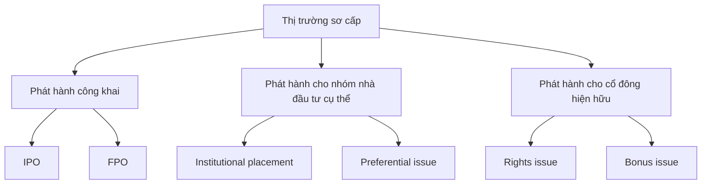
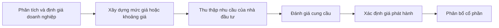
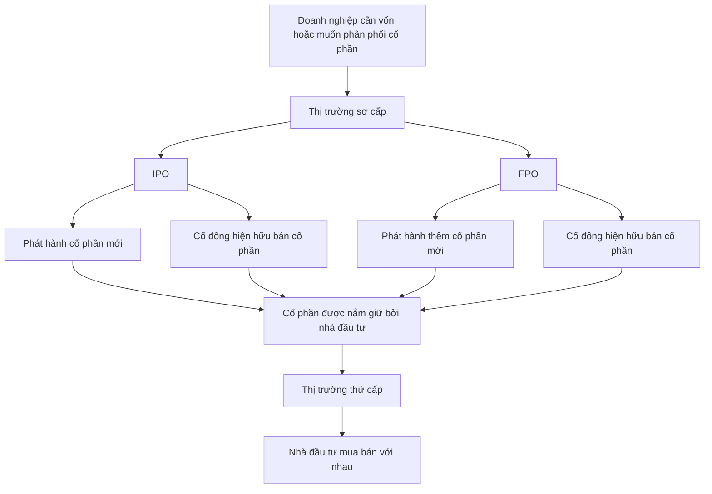

# Thị trường sơ cấp, IPO và FPO

## 1. Tóm tắt

Khi một doanh nghiệp cần thêm vốn, một trong những lựa chọn là **phát hành chứng khoán mới cho nhà đầu tư**. Hoạt động phát hành này diễn ra trên **thị trường sơ cấp** (*primary market*).

Nếu doanh nghiệp lần đầu chào bán cổ phần rộng rãi ra công chúng, đợt phát hành được gọi là **IPO — Initial Public Offering**. Khi một công ty đã niêm yết tiếp tục thực hiện một đợt chào bán công khai mới, đợt phát hành đó thường được gọi là **FPO — Follow-on Public Offering**.

Điểm quan trọng nhất là phải phân biệt **phát hành cổ phần mới** với **việc cổ đông hiện hữu bán lại cổ phần của mình**. Trong trường hợp phát hành mới, công ty có thể nhận thêm vốn nhưng số lượng cổ phần tăng lên và tỷ lệ sở hữu của cổ đông cũ có thể bị pha loãng. Nếu chỉ có cổ đông hiện hữu bán cổ phần, tiền bán thuộc về người bán và không trực tiếp trở thành vốn mới của công ty.

---

## 2. Mục tiêu học tập

Sau bài học này, bạn có thể:

- giải thích vai trò của thị trường sơ cấp;
- phân biệt thị trường sơ cấp với thị trường thứ cấp;
- giải thích IPO và FPO;
- phân biệt **phát hành cổ phần mới** với **Offer for Sale**;
- giải thích vì sao phát hành cổ phần mới có thể gây pha loãng;
- phân biệt IPO với FPO theo thời điểm phát hành;
- mô tả ở mức cơ bản cách giá IPO được hình thành;
- phân biệt phát hành công khai với một số hình thức phân phối chứng khoán cho nhóm nhà đầu tư cụ thể.

---

## 3. Vì sao doanh nghiệp cần thị trường sơ cấp?

Nhiều doanh nghiệp bắt đầu với số vốn tương đối nhỏ từ:

- người sáng lập;
- người thân;
- bạn bè;
- một số nhà đầu tư ban đầu.

Khi doanh nghiệp phát triển, lượng vốn cần thiết có thể vượt quá khả năng của nhóm nhà đầu tư ban đầu.

Doanh nghiệp có thể cần tiền để:

- mở rộng hoạt động;
- đầu tư vào tài sản mới;
- tài trợ kế hoạch tăng trưởng;
- hoặc điều chỉnh cấu trúc vốn.

Một lựa chọn là vay nợ. Một lựa chọn khác là huy động thêm **vốn chủ sở hữu** bằng cách phát hành cổ phần.

Đây là lúc thị trường sơ cấp trở nên quan trọng.

---

## 4. Thị trường sơ cấp là gì?

**Thị trường sơ cấp** (*primary market*) là nơi chứng khoán được phát hành để huy động vốn từ nhà đầu tư.

Trong mô hình cơ bản:

```text
Doanh nghiệp
    ↓
Phát hành chứng khoán
    ↓
Nhà đầu tư mua
    ↓
Doanh nghiệp huy động vốn
```

Doanh nghiệp hoặc tổ chức phát hành được gọi là **issuer — tổ chức phát hành**.

Nhà đầu tư có thể là:

- cá nhân;
- quỹ đầu tư;
- công ty bảo hiểm;
- ngân hàng;
- hoặc các tổ chức tài chính khác.

Điểm đặc trưng của thị trường sơ cấp là chứng khoán được đưa vào quá trình phát hành và phân phối, thay vì chỉ được mua bán lại giữa những nhà đầu tư đã sở hữu chúng.

---

## 5. Thị trường sơ cấp khác thị trường thứ cấp như thế nào?

Sau khi chứng khoán đã được phát hành và đủ điều kiện giao dịch, nhà đầu tư có thể mua bán chúng trên **thị trường thứ cấp** (*secondary market*).

Hai thị trường phục vụ hai mục đích khác nhau.

| Tiêu chí | Thị trường sơ cấp | Thị trường thứ cấp |
| --- | --- | --- |
| Hoạt động chính | Phát hành chứng khoán | Mua bán chứng khoán đã phát hành |
| Một bên giao dịch | Tổ chức phát hành hoặc cổ đông chào bán | Nhà đầu tư |
| Bên còn lại | Nhà đầu tư | Nhà đầu tư khác |
| Mục tiêu | Huy động hoặc phân phối chứng khoán | Chuyển giao quyền sở hữu |
| Công ty luôn nhận tiền? | Không phải trong mọi trường hợp | Thông thường không |

Ví dụ, khi công ty phát hành **cổ phần mới**, tiền của nhà đầu tư có thể đi vào công ty.

Ngược lại, khi nhà đầu tư A bán cổ phiếu cho nhà đầu tư B trên sàn:

```text
Nhà đầu tư A
    ↓ bán cổ phiếu
Nhà đầu tư B
    ↓ trả tiền
Tiền chuyển từ B sang A
```

Công ty không trực tiếp nhận thêm vốn từ giao dịch này.

---

## 6. Các hình thức phát hành trên thị trường sơ cấp

Không phải mọi chứng khoán trên thị trường sơ cấp đều được bán rộng rãi cho công chúng.

Có thể phân biệt ở mức cơ bản thành các nhóm sau:



Các hình thức này khác nhau chủ yếu ở:

- đối tượng được quyền mua;
- mục tiêu huy động vốn;
- việc nhà đầu tư có phải trả tiền hay không;
- và tác động đến cấu trúc sở hữu.

---

## 7. Phát hành công khai

Một **public offering** xảy ra khi chứng khoán được chào bán cho công chúng theo cơ chế phát hành phù hợp.

Hai trường hợp quan trọng là:

1. **IPO — Initial Public Offering**;
2. **FPO — Follow-on Public Offering**.

Sự khác biệt lớn nhất nằm ở việc công ty đã từng thực hiện một đợt chào bán công khai trước đó hay chưa.

---

## 8. IPO là gì?

**IPO — Initial Public Offering** là đợt chào bán cổ phần ra công chúng lần đầu của một công ty.

Có thể hình dung:

```text
Công ty chưa có cổ phần được giao dịch rộng rãi
                    ↓
                  IPO
                    ↓
Cổ phần được phân phối cho công chúng
                    ↓
Nhiều nhóm nhà đầu tư có thể trở thành cổ đông
```

Sau IPO, cơ cấu sở hữu của công ty có thể thay đổi đáng kể.

Trước đó, cổ đông có thể chủ yếu gồm:

- nhà sáng lập;
- promoter;
- nhà đầu tư ban đầu;
- một số tổ chức đầu tư.

Sau IPO, quyền sở hữu có thể được phân tán rộng hơn cho nhiều nhà đầu tư.

---

## 9. IPO không nhất thiết chỉ gồm cổ phần mới

Một IPO có thể bao gồm hai cấu phần khác nhau:

1. **phát hành cổ phần mới**;
2. **cổ đông hiện hữu bán cổ phần**.

Hai trường hợp có tác động tài chính hoàn toàn khác nhau.

---

## 10. Phát hành cổ phần mới trong IPO

Trong một **fresh issue**, công ty tạo thêm cổ phần mới và bán chúng cho nhà đầu tư.

Ví dụ, trước IPO công ty có:

$$
1.000.000
$$

cổ phần.

Công ty phát hành thêm:

$$
250.000
$$

cổ phần mới.

Sau phát hành:

$$
1.000.000 + 250.000 = 1.250.000
$$

cổ phần.

Tiền từ việc bán 250.000 cổ phần mới có thể đi vào công ty và trở thành nguồn vốn phục vụ các mục tiêu đã xác định của đợt phát hành.

Luồng tiền có thể biểu diễn đơn giản như sau:

```text
Nhà đầu tư
    ↓ tiền
Công ty
    ↓
Phát hành cổ phần mới
    ↓
Nhà đầu tư
```

Trong trường hợp này:

- công ty nhận vốn mới;
- tổng số cổ phần tăng;
- tỷ lệ sở hữu của cổ đông cũ có thể giảm.

Hiện tượng cuối cùng được gọi là **pha loãng — dilution**.

---

## 11. Pha loãng quyền sở hữu

Giả sử trước khi phát hành, một cổ đông sở hữu:

$$
100.000
$$

trên tổng:

$$
1.000.000
$$

cổ phần.

Tỷ lệ sở hữu là:

$$
\frac{100.000}{1.000.000}\times100\%=10\%
$$

Sau khi công ty phát hành thêm 250.000 cổ phần, tổng số cổ phần tăng lên:

$$
1.250.000
$$

Nếu cổ đông đó vẫn chỉ có 100.000 cổ phần:

$$
\frac{100.000}{1.250.000}\times100\%=8\%
$$

Tỷ lệ sở hữu giảm từ:

$$
10\%\rightarrow8\%
$$

Đây là một ví dụ đơn giản về **pha loãng tỷ lệ sở hữu**.

Điểm quan trọng là cổ đông không nhất thiết bị mất cổ phần. Họ vẫn sở hữu 100.000 cổ phần.

Thứ thay đổi là **tỷ lệ của số cổ phần đó trên tổng số cổ phần của công ty**.

---

## 12. Offer for Sale trong IPO

IPO cũng có thể bao gồm trường hợp các cổ đông hiện hữu đưa một phần cổ phần của họ ra bán.

Cơ chế này thường được gọi là **Offer for Sale — OFS**.

Trong trường hợp này:

```text
Cổ đông hiện hữu
      ↓ cổ phần
Nhà đầu tư mới
      ↓ tiền
Cổ đông hiện hữu
```

Công ty không tạo ra cổ phần mới.

Do đó:

$$
\text{Tổng số cổ phần trước}
=
\text{Tổng số cổ phần sau}
$$

Tiền thu được từ việc bán cổ phần đi tới những cổ đông đang bán, thay vì trực tiếp đi vào công ty.

---

## 13. So sánh phát hành mới và Offer for Sale

| Đặc điểm | Phát hành cổ phần mới | Offer for Sale |
| --- | --- | --- |
| Công ty tạo thêm cổ phần? | Có | Không |
| Tổng số cổ phần tăng? | Có | Không |
| Công ty trực tiếp nhận tiền? | Có thể có | Không |
| Cổ đông hiện hữu bán cổ phần? | Không bắt buộc | Có |
| Có thể gây pha loãng? | Có | Không phải do tăng tổng số cổ phần |

Đây là một trong những phân biệt quan trọng nhất khi đọc thông tin về một IPO.

Một đợt IPO trị giá lớn không đồng nghĩa toàn bộ số tiền đó đều trở thành vốn mới của công ty.

Cần xem đợt IPO gồm:

- bao nhiêu cổ phần phát hành mới;
- bao nhiêu cổ phần do cổ đông hiện hữu bán ra.

---

## 14. FPO là gì?

**FPO — Follow-on Public Offering** là một đợt chào bán công khai được thực hiện sau khi công ty đã có đợt IPO trước đó.

Nói cách khác:

```text
IPO
 ↓
Công ty trở thành doanh nghiệp có cổ phần được giao dịch công khai
 ↓
Một thời gian sau
 ↓
Công ty thực hiện thêm một đợt chào bán
 ↓
FPO
```

Một công ty có thể sử dụng FPO khi cần thêm vốn, chẳng hạn để:

- hỗ trợ tăng trưởng;
- tài trợ các nhu cầu vốn mới;
- hoặc điều chỉnh cấu trúc vốn, ví dụ sử dụng nguồn vốn mới để giảm một phần nợ.

---

## 15. FPO cũng có thể gồm nhiều loại cổ phần chào bán

Tương tự IPO, một FPO có thể bao gồm:

- cổ phần mới do công ty phát hành;
- cổ phần hiện hữu được các cổ đông bán;
- hoặc sự kết hợp của cả hai.

Nếu công ty phát hành thêm cổ phần mới:

$$
\text{Tổng số cổ phần sau FPO}
>
\text{Tổng số cổ phần trước FPO}
$$

Khi đó có thể xảy ra pha loãng.

Nếu chỉ có cổ đông hiện hữu bán cổ phần:

$$
\text{Tổng số cổ phần sau FPO}
=
\text{Tổng số cổ phần trước FPO}
$$

Quyền sở hữu được chuyển từ người bán sang nhà đầu tư khác, nhưng công ty không tạo thêm cổ phần chỉ vì giao dịch này.

---

## 16. IPO và FPO khác nhau như thế nào?

| Tiêu chí | IPO | FPO |
| --- | --- | --- |
| Tên đầy đủ | Initial Public Offering | Follow-on Public Offering |
| Thời điểm | Lần chào bán công khai đầu tiên | Sau khi công ty đã IPO |
| Công ty đã có cổ phần giao dịch công khai trước đó? | Chưa theo nghĩa của IPO | Có |
| Có thể phát hành cổ phần mới? | Có | Có |
| Có thể có cổ đông hiện hữu bán cổ phần? | Có | Có |
| Có thể làm thay đổi cơ cấu sở hữu? | Có | Có |

Có thể ghi nhớ ngắn gọn:

> **IPO mở đầu quá trình chào bán công khai; FPO là một đợt chào bán công khai tiếp theo.**

---

## 17. Vì sao công ty thực hiện IPO?

IPO có thể giúp doanh nghiệp tiếp cận một tập hợp nhà đầu tư rộng hơn.

Thay vì phụ thuộc vào một nhóm nhỏ gồm:

- người sáng lập;
- người quen;
- hoặc một số nhà đầu tư tổ chức ban đầu,

công ty có thể phân phối cổ phần tới một lượng nhà đầu tư lớn hơn.

Nếu IPO có thành phần phát hành mới, doanh nghiệp cũng có thể huy động thêm vốn.

Sau IPO, cổ phần có thể trở nên dễ chuyển nhượng hơn thông qua thị trường thứ cấp, cho phép các nhà đầu tư mua hoặc bán phần sở hữu của mình mà không cần thay đổi trực tiếp hoạt động thường ngày của doanh nghiệp.

---

## 18. Vì sao nhà đầu tư ban đầu có thể bán cổ phần?

Một số cổ đông đã đầu tư từ giai đoạn sớm có thể sử dụng IPO hoặc một đợt chào bán sau đó để bán một phần số cổ phần mà họ đang sở hữu.

Ví dụ:

```text
Trước đợt bán
Nhà đầu tư A → 20% công ty

A bán một phần cổ phần
        ↓

Sau đợt bán
Nhà đầu tư A → 12%
Nhà đầu tư mới → nhận phần sở hữu được chuyển nhượng
```

Tổng số cổ phần không nhất thiết thay đổi.

Thay đổi chính nằm ở **ai đang sở hữu những cổ phần đó**.

---

## 19. Các hình thức phát hành cho nhóm nhà đầu tư cụ thể

Không phải doanh nghiệp nào cũng cần ngay lập tức chào bán cổ phần cho toàn bộ công chúng.

Một doanh nghiệp có thể phát hành chứng khoán cho một nhóm nhà đầu tư cụ thể.

Ví dụ có thể gồm:

- nhà đầu tư tổ chức;
- quỹ đầu tư;
- công ty bảo hiểm;
- một số nhà đầu tư được lựa chọn.

Điểm khác biệt với một đợt phát hành công khai nằm ở phạm vi nhà đầu tư được tham gia.

---

## 20. Institutional placement

Trong một hình thức phát hành dành cho nhà đầu tư tổ chức, chứng khoán được phân phối tới những tổ chức đủ điều kiện tham gia.

Các tổ chức có thể bao gồm:

- quỹ đầu tư;
- công ty bảo hiểm;
- hoặc những nhà đầu tư tổ chức khác.

Thay vì chào bán rộng rãi cho mọi nhà đầu tư cá nhân, công ty tập trung vào một nhóm tổ chức xác định.

---

## 21. Preferential issue

Trong **preferential issue**, chứng khoán được phát hành cho một nhóm nhà đầu tư được lựa chọn cụ thể.

Nhóm này có thể bao gồm những đối tượng có quan hệ nhất định với công ty hoặc những nhà đầu tư mà doanh nghiệp quyết định phát hành chứng khoán cho họ theo cơ chế phù hợp.

Đây vẫn là một hình thức huy động vốn thông qua phát hành chứng khoán, nhưng không phải là một đợt chào bán rộng rãi cho toàn bộ công chúng.

---

## 22. Rights issue

**Rights issue** là đợt phát hành trong đó các cổ đông hiện hữu được trao quyền mua thêm cổ phần.

Điểm quan trọng là cổ đông phải **trả tiền** nếu muốn mua số cổ phần mới được quyền mua.

Ví dụ, một cổ đông đang sở hữu cổ phần của công ty có thể được quyền mua thêm một lượng cổ phần nhất định theo tỷ lệ sở hữu hiện tại.

Cơ chế này giúp công ty huy động thêm vốn đồng thời tạo cơ hội để cổ đông hiện hữu duy trì tỷ lệ sở hữu của mình nếu họ tham gia mua thêm.

---

## 23. Bonus issue

**Bonus issue** cũng phân phối thêm cổ phần cho cổ đông hiện hữu, nhưng khác rights issue ở một điểm quan trọng:

> Cổ đông không phải trả thêm tiền để nhận số cổ phần thưởng.

Có thể so sánh:

| Đặc điểm | Rights issue | Bonus issue |
| --- | --- | --- |
| Dành cho cổ đông hiện hữu | Có | Có |
| Nhận thêm cổ phần | Có | Có |
| Cổ đông phải trả tiền | Có | Không |
| Mục tiêu trực tiếp là thu tiền từ người nhận | Có | Không |

Không nên nhầm hai khái niệm chỉ vì cả hai đều liên quan đến việc cổ đông hiện hữu nhận thêm cổ phần.

---

## 24. Giá IPO được xác định như thế nào?

Một câu hỏi tự nhiên là:

> Nếu cổ phiếu chưa giao dịch công khai trên thị trường, giá IPO ban đầu lấy từ đâu?

Giá IPO không đơn giản là một con số được chọn tùy ý, cũng không phải một **“giá trị đúng tuyệt đối”** của doanh nghiệp.

Quá trình xác định giá có thể xem xét nhiều yếu tố:

- tình hình và triển vọng của doanh nghiệp;
- quá trình thẩm định;
- định giá tương đối so với những doanh nghiệp có thể so sánh;
- mức độ quan tâm của nhà đầu tư;
- điều kiện thị trường;
- lượng cổ phần dự định chào bán;
- và cơ chế xác lập giá của đợt phát hành.

Một cơ chế thường gặp là **book-building**.

---

## 25. Book-building

Trong book-building, mức độ quan tâm của nhà đầu tư được thu thập trong quá trình chào bán.

Có thể hình dung ở mức khái quát:



Mục tiêu không phải tìm ra một con số toán học duy nhất được xem là giá trị tuyệt đối chính xác.

Giá phát hành cuối cùng phản ánh sự kết hợp giữa:

- phân tích doanh nghiệp;
- mức định giá;
- nhu cầu của nhà đầu tư;
- lượng cổ phần được chào bán;
- và điều kiện thị trường tại thời điểm phát hành.

---

## 26. Giá IPO và giá giao dịch sau IPO không phải một khái niệm

Giả sử cổ phiếu được phát hành với mức giá:

$$
P_{\text{IPO}}
$$

Sau khi cổ phiếu bắt đầu giao dịch trên thị trường thứ cấp, giá tiếp tục được hình thành bởi các lệnh mua và bán của thị trường.

Do đó:

$$
P_{\text{market}}
\neq
P_{\text{IPO}}
$$

không phải là điều bất thường.

Giá thị trường có thể:

- cao hơn giá IPO;
- thấp hơn giá IPO;
- hoặc dao động quanh mức giá đó.

Giá IPO chỉ là mức giá của quá trình phát hành ban đầu. Sau khi giao dịch bắt đầu, thị trường liên tục đánh giá lại cổ phiếu dựa trên cung cầu và kỳ vọng của nhà đầu tư.

---

## 27. Ba dòng tiền cần phân biệt

Khi nghiên cứu IPO hoặc FPO, nên xác định tiền thực sự đang đi đâu.

### 27.1. Công ty phát hành cổ phần mới

```text
Nhà đầu tư
    ↓ tiền
Công ty
```

Công ty nhận vốn.

### 27.2. Cổ đông hiện hữu bán cổ phần

```text
Nhà đầu tư mới
    ↓ tiền
Cổ đông hiện hữu
```

Công ty không trực tiếp nhận số tiền bán này.

### 27.3. Hai nhà đầu tư giao dịch trên thị trường thứ cấp

```text
Nhà đầu tư B
    ↓ tiền
Nhà đầu tư A

Nhà đầu tư A
    ↓ cổ phiếu
Nhà đầu tư B
```

Một lần nữa, công ty không trực tiếp nhận thêm vốn.

Đây là ba tình huống trông khá giống nhau nếu chỉ nhìn thấy hoạt động mua cổ phiếu, nhưng ý nghĩa tài chính lại khác nhau.

---

## 28. Mối quan hệ giữa IPO, FPO và thị trường thứ cấp

Toàn bộ quá trình có thể hình dung như sau:



Điểm cần ghi nhớ là:

> **Thị trường sơ cấp đưa chứng khoán vào quá trình phát hành và phân phối; thị trường thứ cấp giúp các chứng khoán đó tiếp tục được chuyển giao giữa các nhà đầu tư.**

---

## 29. Những điểm dễ nhầm

### 29.1. IPO không đồng nghĩa toàn bộ tiền đều đi vào công ty

Nếu IPO bao gồm Offer for Sale, một phần tiền có thể đi tới cổ đông hiện hữu đang bán cổ phần.

Cần phân biệt:

$$
\text{Fresh Issue}
\neq
\text{Offer for Sale}
$$

---

### 29.2. Mọi đợt bán cổ phần không đều gây pha loãng

Pha loãng do số lượng cổ phần tăng xảy ra khi công ty phát hành thêm cổ phần mới.

Nếu một cổ đông đơn giản bán cổ phần đang có cho người khác:

$$
\text{Tổng số cổ phần không đổi}
$$

Do đó không có pha loãng do tăng tổng số cổ phần.

---

### 29.3. IPO và FPO đều là public offering nhưng không giống nhau

IPO là đợt đầu tiên.

FPO xảy ra sau khi công ty đã IPO.

Có thể nhớ:

```text
Initial → lần đầu
Follow-on → những lần tiếp theo
```

---

### 29.4. Giá IPO không phải giá trị tuyệt đối của doanh nghiệp

Giá phát hành được hình thành từ một quá trình định giá và phân phối tại một thời điểm cụ thể.

Sau khi giao dịch trên thị trường thứ cấp bắt đầu, mức giá có thể thay đổi theo đánh giá liên tục của nhà đầu tư.

---

### 29.5. Rights issue và bonus issue không giống nhau

Cả hai đều liên quan đến cổ đông hiện hữu.

Nhưng:

- rights issue yêu cầu nhà đầu tư trả tiền nếu muốn mua thêm cổ phần;
- bonus issue phân phối thêm cổ phần mà cổ đông không phải trả thêm tiền.

---

## 30. Ví dụ tổng hợp

Giả sử một công ty có:

$$
8.000.000
$$

cổ phần trước IPO.

Trong IPO, công ty:

- phát hành mới 2.000.000 cổ phần;
- một cổ đông sáng lập bán 1.000.000 cổ phần hiện hữu.

Tổng số cổ phần sau IPO là:

$$
8.000.000 + 2.000.000
=
10.000.000
$$

Không cộng thêm 1.000.000 cổ phần được cổ đông sáng lập bán vì số cổ phần đó **đã tồn tại trước IPO**.

Luồng giao dịch gồm hai phần:

```text
PHẦN 1 — FRESH ISSUE

Nhà đầu tư
    ↓ tiền
Công ty
    ↓
2.000.000 cổ phần mới
```

và:

```text
PHẦN 2 — OFFER FOR SALE

Nhà đầu tư
    ↓ tiền
Cổ đông sáng lập
    ↓
1.000.000 cổ phần hiện hữu
```

Nếu trước IPO một cổ đông sở hữu:

$$
800.000
$$

cổ phần và không mua thêm cổ phần mới, tỷ lệ sở hữu trước IPO là:

$$
\frac{800.000}{8.000.000}\times100\%
=
10\%
$$

Sau khi công ty phát hành thêm 2.000.000 cổ phần:

$$
\frac{800.000}{10.000.000}\times100\%
=
8\%
$$

Tỷ lệ sở hữu của cổ đông giảm xuống 8%.

Đây là tác động của phần **fresh issue**, không phải do 1.000.000 cổ phần hiện hữu được chuyển từ người sáng lập sang nhà đầu tư khác.

---

## 31. Câu hỏi ôn tập

### Câu 1

Trường hợp nào mô tả đúng nhất thị trường sơ cấp?

A. Hai nhà đầu tư mua bán cổ phiếu đã niêm yết với nhau.  
B. Doanh nghiệp phát hành chứng khoán để huy động vốn.  
C. Nhà đầu tư bán cổ phiếu sau khi giá tăng.  
D. Sàn giao dịch khớp hai lệnh của nhà đầu tư.

**Đáp án:** B

**Giải thích:** Thị trường sơ cấp liên quan đến quá trình phát hành và phân phối chứng khoán, trong đó doanh nghiệp có thể huy động vốn thông qua phát hành mới.

### Câu 2

Một công ty có 1 triệu cổ phần và phát hành thêm 250.000 cổ phần. Một cổ đông giữ nguyên số cổ phần đang sở hữu. Điều gì có thể xảy ra?

A. Tỷ lệ sở hữu của cổ đông tăng tự động.  
B. Tổng số cổ phần giảm.  
C. Tỷ lệ sở hữu của cổ đông có thể bị pha loãng.  
D. Công ty phải mua lại toàn bộ cổ phần cũ.

**Đáp án:** C

**Giải thích:** Khi mẫu số là tổng số cổ phần tăng nhưng số cổ phần của cổ đông không tăng tương ứng, tỷ lệ sở hữu của họ giảm.

### Câu 3

Trong Offer for Sale, tiền của nhà đầu tư chủ yếu đi đâu?

A. Tới cổ đông hiện hữu đang bán cổ phần.  
B. Luôn đi toàn bộ vào vốn của công ty.  
C. Tới sở giao dịch chứng khoán.  
D. Tự động được dùng để trả nợ công ty.

**Đáp án:** A

**Giải thích:** Offer for Sale là việc cổ đông hiện hữu bán cổ phần đang sở hữu. Do đó tiền bán cổ phần thuộc về người bán chứ không trực tiếp tạo vốn mới cho công ty.

### Câu 4

Điểm khác biệt cơ bản giữa IPO và FPO là gì?

A. IPO chỉ dành cho tổ chức còn FPO chỉ dành cho cá nhân.  
B. IPO luôn làm pha loãng còn FPO thì không.  
C. FPO diễn ra trước IPO.  
D. IPO là đợt chào bán công khai đầu tiên, còn FPO diễn ra sau khi công ty đã IPO.

**Đáp án:** D

**Giải thích:** Từ *Initial* thể hiện đây là đợt chào bán công khai đầu tiên, còn *Follow-on* là một đợt chào bán tiếp theo.

### Câu 5

Một IPO có 70% cổ phần phát hành mới và 30% cổ phần do cổ đông hiện hữu bán. Phát biểu nào đúng nhất?

A. Toàn bộ tiền IPO đều đi vào công ty.  
B. Phần tiền từ cổ phần phát hành mới có thể vào công ty, còn tiền từ cổ phần hiện hữu được bán thuộc về người bán.  
C. Không có cổ phần mới nào được tạo ra.  
D. Toàn bộ số tiền đều thuộc về cổ đông hiện hữu.

**Đáp án:** B

**Giải thích:** Cần tách fresh issue khỏi Offer for Sale. Hai phần có dòng tiền và tác động đến số lượng cổ phần khác nhau.

### Câu 6

Yếu tố nào phù hợp với quá trình xác định giá IPO?

A. Chỉ lấy giá do người sáng lập tự chọn.  
B. Luôn bằng đúng giá trị sổ sách trên mỗi cổ phần.  
C. Có thể dựa trên định giá, nhu cầu nhà đầu tư, điều kiện thị trường và quá trình book-building.  
D. Phải bằng giá đóng cửa của ngày giao dịch trước đó.

**Đáp án:** C

**Giải thích:** Giá IPO được hình thành thông qua quá trình đánh giá doanh nghiệp và nhu cầu thị trường tại thời điểm phát hành, chứ không phải từ một công thức tuyệt đối duy nhất.

### Câu 7

Điểm khác biệt chính giữa rights issue và bonus issue là gì?

A. Rights issue chỉ dành cho người chưa phải cổ đông.  
B. Bonus issue bắt buộc cổ đông trả tiền mua cổ phần mới.  
C. Rights issue yêu cầu cổ đông trả tiền để mua thêm cổ phần, còn bonus issue không yêu cầu trả thêm tiền.  
D. Hai hình thức hoàn toàn giống nhau.

**Đáp án:** C

**Giải thích:** Cả hai có thể dành cho cổ đông hiện hữu, nhưng rights issue là quyền mua thêm cổ phần, còn bonus issue phân phối thêm cổ phần mà không yêu cầu cổ đông thanh toán thêm.

---

## 32. Tổng kết

**Thị trường sơ cấp** là nơi chứng khoán được phát hành và phân phối tới nhà đầu tư.

Hai hình thức chào bán công khai quan trọng là:

$$
\text{IPO}
=
\text{Initial Public Offering}
$$

và:

$$
\text{FPO}
=
\text{Follow-on Public Offering}
$$

IPO là đợt chào bán công khai đầu tiên của công ty. FPO là một đợt chào bán công khai tiếp theo sau IPO.

Trong cả IPO và FPO, cần đặc biệt phân biệt hai trường hợp:

```text
Fresh Issue
→ Công ty phát hành cổ phần mới
→ Công ty có thể nhận vốn
→ Tổng số cổ phần tăng
→ Có thể gây pha loãng

Offer for Sale
→ Cổ đông bán cổ phần đã tồn tại
→ Tiền đi tới cổ đông bán
→ Tổng số cổ phần không tăng chỉ vì giao dịch này
```

Pha loãng xảy ra khi tổng số cổ phần tăng nhưng số cổ phần của một cổ đông không tăng tương ứng:

$$
\text{Tỷ lệ sở hữu}
=
\frac{\text{Số cổ phần của cổ đông}}
{\text{Tổng số cổ phần}}
\times100\%
$$

Giá IPO cũng không phải một mức “giá trị đúng” duy nhất. Nó được hình thành từ quá trình định giá, điều kiện thị trường, nhu cầu nhà đầu tư và cơ chế phân phối như book-building.

Cuối cùng, cần luôn xác định **ai đang bán cổ phần và tiền đang đi đâu**. Chỉ riêng câu hỏi đó đã giúp phân biệt phần lớn những tình huống dễ nhầm giữa phát hành mới, Offer for Sale và giao dịch trên thị trường thứ cấp.