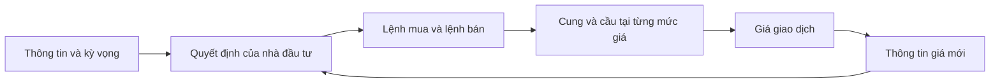
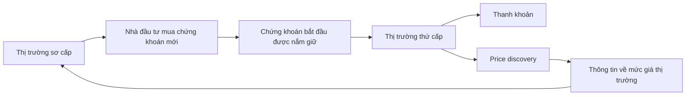
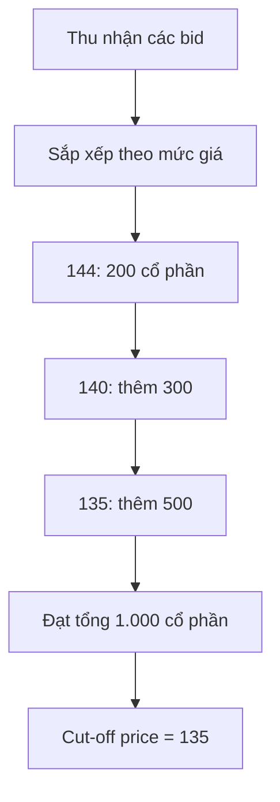
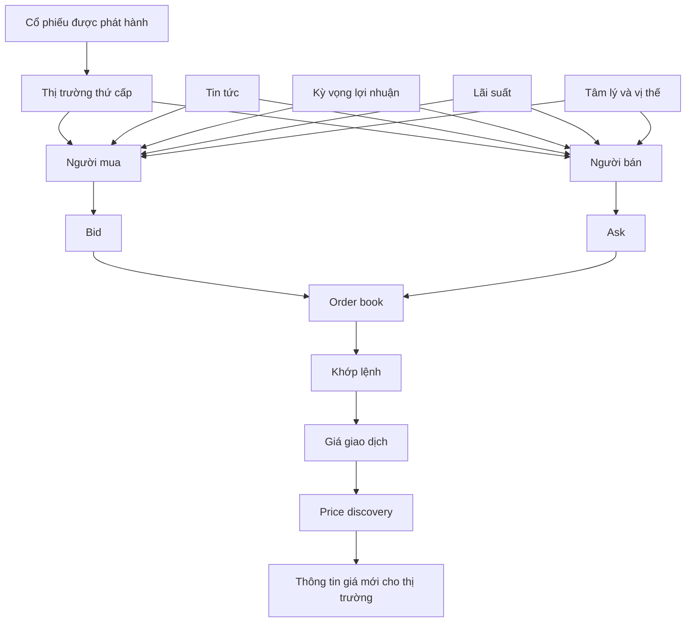

# Thị trường thứ cấp và cách giá cổ phiếu hình thành

## 1. Tóm tắt

Sau khi cổ phiếu được phát hành, chúng có thể tiếp tục được mua bán giữa các nhà đầu tư trên **thị trường thứ cấp** (*secondary market*).

Khác với thị trường sơ cấp, giao dịch trên thị trường thứ cấp thông thường **không tạo thêm vốn trực tiếp cho công ty**. Người mua trả tiền cho người đang bán cổ phiếu, còn quyền sở hữu cổ phần được chuyển từ người bán sang người mua.

Thị trường thứ cấp có hai chức năng đặc biệt quan trọng:

- tạo **thanh khoản**, giúp nhà đầu tư có khả năng mua và bán chứng khoán;
- thực hiện **price discovery — khám phá giá**, tức liên tục hình thành mức giá từ các lệnh mua và bán trên thị trường.

Không có một cá nhân duy nhất ngồi đặt giá cho toàn bộ thị trường. Giá cổ phiếu là kết quả của sự tương tác giữa rất nhiều người tham gia với những thông tin, kỳ vọng, mục tiêu và mức giá chấp nhận khác nhau.

---

## 2. Mục tiêu học tập

Sau bài học này, bạn có thể:

- giải thích chức năng của thị trường thứ cấp;
- phân biệt dòng tiền trên thị trường sơ cấp và thứ cấp;
- giải thích vai trò của thanh khoản;
- giải thích cơ chế **price discovery**;
- phân biệt `bid`, `ask` và `bid–ask spread`;
- mô tả cách lệnh mua và lệnh bán hình thành giá giao dịch;
- giải thích vì sao giá cổ phiếu có thể thay đổi khi kỳ vọng của nhà đầu tư thay đổi;
- phân biệt cơ chế định giá cổ phiếu trên thị trường thứ cấp với việc xác định giá trong một đợt IPO.

---

## 3. Thị trường thứ cấp là gì?

Sau khi một chứng khoán được phát hành trên thị trường sơ cấp, nhà đầu tư đang sở hữu chứng khoán đó có thể bán lại cho những nhà đầu tư khác.

Hoạt động mua bán này diễn ra trên **thị trường thứ cấp**.

Có thể hình dung đơn giản:

```text
Nhà đầu tư A
    ↓ bán cổ phiếu
Nhà đầu tư B

Nhà đầu tư B
    ↓ trả tiền
Nhà đầu tư A
```

Công ty phát hành không phải là bên nhận tiền trực tiếp trong giao dịch thông thường này.

Điều đó khác với trường hợp công ty phát hành cổ phần mới:

```text
THỊ TRƯỜNG SƠ CẤP

Nhà đầu tư
    ↓ tiền
Công ty phát hành


THỊ TRƯỜNG THỨ CẤP

Nhà đầu tư B
    ↓ tiền
Nhà đầu tư A
```

Đây là khác biệt nền tảng giữa hai thị trường.

---

## 4. Vì sao thị trường thứ cấp cần thiết?

Giả sử một nhà đầu tư mua cổ phần của một công ty nhưng sau đó không có cách nào bán lại.

Khoản tiền đầu tư có thể bị giữ lại trong doanh nghiệp trong thời gian rất dài.

Điều này làm việc đầu tư trở nên kém hấp dẫn hơn.

Thị trường thứ cấp giải quyết vấn đề đó bằng cách tạo ra một nơi để:

- người đang sở hữu cổ phiếu có thể bán;
- người muốn sở hữu cổ phiếu có thể mua.

Nhờ vậy, quyền sở hữu có thể chuyển từ nhà đầu tư này sang nhà đầu tư khác mà công ty không phải phát hành lại cổ phần mỗi lần giao dịch.

---

## 5. Chức năng thanh khoản

Một trong những chức năng quan trọng nhất của thị trường thứ cấp là tạo **thanh khoản — liquidity**.

Thanh khoản phản ánh mức độ dễ dàng mà một chứng khoán có thể được mua hoặc bán.

Một thị trường có nhiều người mua và người bán thường giúp nhà đầu tư dễ tìm được đối tác giao dịch hơn.

Có thể hình dung:

```text
Không có thị trường thứ cấp
→ mua cổ phần
→ khó tìm người mua lại
→ vốn khó chuyển đổi trở lại thành tiền

Có thị trường thứ cấp
→ mua cổ phần
→ có mạng lưới người mua và người bán
→ khả năng thoái vị thế thuận lợi hơn
```

Thanh khoản vì vậy làm cho việc nắm giữ cổ phiếu trở nên linh hoạt hơn.

Nhà đầu tư không cần phải mặc định rằng số vốn của mình sẽ bị giữ trong khoản đầu tư mãi mãi.

---

## 6. Price discovery — khám phá giá

Chức năng lớn thứ hai của thị trường thứ cấp là **price discovery**.

Price discovery là quá trình thị trường liên tục xác định mức giá mà người mua và người bán sẵn sàng giao dịch.

Nếu triển vọng của một công ty được nhiều người đánh giá tích cực, số lượng người muốn mua có thể tăng.

Ngược lại, nếu nhiều nhà đầu tư đánh giá triển vọng doanh nghiệp kém đi, số lượng người muốn bán có thể tăng.

Giá vì thế liên tục được điều chỉnh thông qua các quyết định mua và bán của những người tham gia thị trường.



Quá trình này diễn ra liên tục trong thời gian thị trường hoạt động.

---

## 7. Ai đặt giá cổ phiếu?

Một câu hỏi phổ biến của người mới là:

> Ai quyết định rằng một cổ phiếu phải có giá 50 USD, 100 USD hay 200 USD?

Trên thị trường thứ cấp, thông thường không có một người duy nhất quyết định giá cho toàn bộ thị trường.

Giá xuất hiện từ hoạt động giao dịch của nhiều nhóm:

- nhà đầu tư cá nhân;
- nhà đầu tư tổ chức;
- trader ngắn hạn;
- nhà đầu tư dài hạn;
- market maker;
- cùng những người tham gia khác.

Mỗi người có thể:

- sở hữu thông tin khác nhau;
- đánh giá thông tin khác nhau;
- có thời gian đầu tư khác nhau;
- chấp nhận mức rủi ro khác nhau;
- và sẵn sàng mua hoặc bán ở những mức giá khác nhau.

Khi tất cả những quyết định này gặp nhau trên thị trường, chúng tạo thành **cung và cầu đối với cổ phiếu**.

Giá giao dịch là kết quả của quá trình đó.

---

## 8. Không phải mọi người đều định giá cổ phiếu giống nhau

Giả sử một cổ phiếu đang giao dịch quanh 100 USD.

Nhà đầu tư A cho rằng:

> 100 USD vẫn còn rẻ so với triển vọng tương lai.

A muốn mua.

Nhà đầu tư B lại cho rằng:

> Với tình hình hiện tại, 100 USD đã đủ hấp dẫn để bán.

B muốn bán.

Một giao dịch có thể xảy ra vì hai người có đánh giá khác nhau về cùng một tài sản.

Do đó, để có giao dịch không cần tất cả mọi người đồng ý rằng cổ phiếu đáng giá một con số giống hệt nhau.

Thị trường tồn tại chính vì có những kỳ vọng khác nhau.

---

## 9. Bid và ask

Để hiểu cách giá hình thành, cần phân biệt hai mức giá cơ bản trong sổ lệnh.

### 9.1. Bid

**Bid** là mức giá người mua sẵn sàng trả.

Ví dụ:

> Một nhà đầu tư sẵn sàng mua 100 cổ phiếu với giá 99,90 USD.

Ta có thể ghi:

```text
Bid: 99,90 USD
Quantity: 100
```

### 9.2. Ask

**Ask**, còn gọi là **offer**, là mức giá người bán sẵn sàng chấp nhận.

Ví dụ:

> Một nhà đầu tư sẵn sàng bán 100 cổ phiếu với giá 100,00 USD.

Ta có:

```text
Ask: 100,00 USD
Quantity: 100
```

---

## 10. Bid–ask spread

Khoảng cách giữa giá bán tốt nhất và giá mua tốt nhất được gọi là **bid–ask spread**.

Công thức:

$$
\text{Spread}
=
\text{Best Ask}
-
\text{Best Bid}
$$

Nếu:

$$
\text{Bid}=99{,}90
$$

và:

$$
\text{Ask}=100{,}00
$$

thì:

$$
\text{Spread}
=
100{,}00-99{,}90
=
0{,}10
$$

Spread trong ví dụ là:

$$
0{,}10\ \text{USD}
$$

Có thể hình dung:

```text
Người mua                       Người bán

99,90 USD        ← spread →      100,00 USD
   BID                             ASK
```

---

## 11. Sổ lệnh

Một cổ phiếu thường có nhiều người muốn mua và nhiều người muốn bán ở những mức giá khác nhau.

Ví dụ đơn giản:

| Lệnh mua | Khối lượng | Lệnh bán | Khối lượng |
| ---: | ---: | ---: | ---: |
| 99,90 USD | 500 | 100,00 USD | 300 |
| 99,80 USD | 800 | 100,10 USD | 600 |
| 99,70 USD | 1.200 | 100,20 USD | 900 |

Phía mua được gọi là **bid side**.

Phía bán được gọi là **ask side**.

Trong ví dụ:

- best bid = 99,90 USD;
- best ask = 100,00 USD.

Spread là:

$$
100{,}00-99{,}90=0{,}10\ \text{USD}
$$

---

## 12. Khi nào giao dịch xảy ra?

Một giao dịch xảy ra khi lệnh của người mua và người bán có thể khớp với nhau.

Giả sử thị trường đang có:

```text
Best Bid = 99,90 USD
Best Ask = 100,00 USD
```

Một người mua mới quyết định rằng họ không muốn chờ giá xuống 99,90 USD.

Họ chấp nhận mua ở:

```text
100,00 USD
```

Lệnh của họ có thể khớp với người đang chào bán tại 100 USD.

Khi đó, một giao dịch được thực hiện tại mức giá đó.

Giá giao dịch vì vậy không phải một con số xuất hiện ngẫu nhiên.

Nó đến từ **những lệnh thực sự đang tồn tại trên thị trường**.

---

## 13. Giá tăng như thế nào?

Giả sử ngày càng nhiều nhà đầu tư muốn mua một cổ phiếu.

Ban đầu:

```text
Ask
100,00 USD → 100 cổ phiếu
100,10 USD → 200 cổ phiếu
100,20 USD → 300 cổ phiếu
```

Nếu người mua liên tục chấp nhận những mức giá bán hiện tại, lượng cổ phiếu tại 100 USD sẽ được mua hết.

Người mua tiếp theo có thể phải giao dịch ở:

```text
100,10 USD
```

Nếu nhu cầu tiếp tục mạnh, mức 100,10 USD cũng có thể được hấp thụ.

Giá giao dịch khi đó tiếp tục lên:

```text
100,00
  ↓
100,10
  ↓
100,20
```

Nói đơn giản:

> Khi nhu cầu mua tại các mức giá hiện tại lớn hơn lượng cổ phiếu mà người bán sẵn sàng cung cấp, người mua có thể phải chấp nhận mức giá cao hơn.

---

## 14. Giá giảm như thế nào?

Cơ chế ngược lại xảy ra khi áp lực bán tăng.

Giả sử phía mua có:

```text
Bid
100,00 USD → 100 cổ phiếu
99,90 USD  → 300 cổ phiếu
99,80 USD  → 500 cổ phiếu
```

Nếu người bán liên tục chấp nhận các mức bid hiện tại, lượng mua ở 100 USD có thể bị hấp thụ hết.

Người bán tiếp theo phải chấp nhận:

```text
99,90 USD
```

Nếu áp lực bán tiếp tục:

```text
100,00
  ↓
99,90
  ↓
99,80
```

Giá giảm vì người bán đang chấp nhận các mức giá thấp hơn để hoàn thành giao dịch.

---

## 15. Giá là kết quả của cung và cầu tại từng mức cụ thể

Nói rằng giá được xác định bởi **cung và cầu** là đúng, nhưng vẫn còn khá trừu tượng.

Trên thị trường thực tế, cung và cầu xuất hiện dưới dạng:

```text
Người mua
→ muốn mua bao nhiêu?
→ ở giá nào?

Người bán
→ muốn bán bao nhiêu?
→ ở giá nào?
```

Vì thế, điều quan trọng không chỉ là:

> Có bao nhiêu người muốn mua?

mà còn là:

> Họ sẵn sàng mua ở mức giá nào?

Tương tự, không chỉ là:

> Có bao nhiêu người muốn bán?

mà còn:

> Họ yêu cầu mức giá nào?

Đây chính là cơ chế khiến giá được hình thành liên tục.

---

## 16. Những yếu tố làm cung và cầu thay đổi

Lệnh mua và bán không xuất hiện một cách ngẫu nhiên.

Chúng phản ánh đánh giá của nhà đầu tư về doanh nghiệp và thị trường.

Một số yếu tố có thể làm nhu cầu mua hoặc bán thay đổi gồm:

- tin tức;
- kỳ vọng về lợi nhuận tương lai;
- kết quả kinh doanh;
- triển vọng tăng trưởng;
- lãi suất;
- thanh khoản;
- vị thế hiện tại của nhà đầu tư;
- tâm lý thị trường;
- kỳ vọng của các nhóm người tham gia.

Ví dụ:

```text
Kỳ vọng lợi nhuận tương lai tăng
            ↓
Một số nhà đầu tư muốn mua nhiều hơn
            ↓
Cầu tại các mức giá hiện tại tăng
            ↓
Giá có thể thay đổi
```

Hoặc:

```text
Triển vọng doanh nghiệp bị đánh giá xấu hơn
            ↓
Một số người muốn giảm vị thế
            ↓
Lệnh bán tăng
            ↓
Giá có thể chịu áp lực giảm
```

---

## 17. Vì sao giá có thể thay đổi trước báo cáo tài chính?

Thị trường không chỉ phản ứng với những con số đã được công bố trong báo cáo tài chính.

Nhà đầu tư còn giao dịch dựa trên **kỳ vọng về tương lai**.

Giả sử báo cáo quý chưa được công bố nhưng thị trường bắt đầu kỳ vọng doanh số của công ty sẽ tăng mạnh.

Một số nhà đầu tư có thể mua cổ phiếu ngay từ trước ngày công bố.

Ngược lại, nếu kỳ vọng trở nên bi quan, người sở hữu cổ phiếu có thể bán trước khi báo cáo chính thức xuất hiện.

Vì thế:

```text
Kỳ vọng thay đổi
      ↓
Lệnh mua / bán thay đổi
      ↓
Cung và cầu thay đổi
      ↓
Giá có thể thay đổi
      ↓
Báo cáo chính thức được công bố sau
```

Giá cổ phiếu do đó có thể thay đổi trước khi kết quả được phản ánh đầy đủ trong một báo cáo tài chính chính thức.

---

## 18. Giá thị trường phản ánh đánh giá tập thể

Trên thị trường có rất nhiều loại người tham gia.

Mỗi người có thể tập trung vào những yếu tố khác nhau.

Một nhà đầu tư dài hạn có thể quan tâm nhiều đến:

- doanh thu;
- lợi nhuận;
- khả năng tăng trưởng;
- năng lực của doanh nghiệp.

Một trader ngắn hạn có thể quan tâm nhiều hơn đến:

- biến động giá;
- dòng lệnh;
- thanh khoản;
- chuyển động ngắn hạn của thị trường.

Nhà đầu tư tổ chức có thể có:

- đội ngũ nghiên cứu;
- hệ thống dữ liệu;
- chiến lược đầu tư riêng.

Các quyết định của họ cùng xuất hiện trong thị trường thông qua lệnh mua và lệnh bán.

Theo cách đó, giá giao dịch là kết quả tổng hợp của rất nhiều đánh giá khác nhau đang tồn tại tại một thời điểm.

---

## 19. Price discovery không có nghĩa giá không bao giờ thay đổi

Nếu giá hiện tại là:

$$
P_t
$$

thì mức giá đó chỉ phản ánh trạng thái cung và cầu tại thời điểm $t$.

Khi có thông tin hoặc kỳ vọng mới:

$$
\text{Thông tin / kỳ vọng mới}
\rightarrow
\text{Lệnh mới}
\rightarrow
\text{Cung cầu mới}
\rightarrow
P_{t+1}
$$

Do đó:

$$
P_{t+1}
\neq P_t
$$

là điều hoàn toàn bình thường.

Price discovery là một **quá trình liên tục**, không phải việc thị trường tìm ra một con số rồi giữ nguyên mãi mãi.

---

## 20. Thị trường thứ cấp hỗ trợ thị trường sơ cấp như thế nào?

Hai thị trường không tồn tại tách biệt hoàn toàn.

Nếu nhà đầu tư biết rằng sau khi mua cổ phiếu họ có khả năng bán lại trên một thị trường có thanh khoản, họ sẽ dễ cân nhắc tham gia một đợt phát hành hơn.

Có thể hình dung:



Giá trên thị trường thứ cấp cũng tạo ra một mức tham chiếu khi một công ty niêm yết cân nhắc huy động vốn trong những đợt phát hành tiếp theo.

---

## 21. Giá cổ phiếu như tín hiệu thị trường

Nếu hoạt động của doanh nghiệp được đánh giá tích cực, nhu cầu mua cổ phiếu có thể tăng.

Nếu triển vọng bị đánh giá tiêu cực, một số nhà đầu tư có thể giảm vị thế hoặc bán cổ phiếu.

Do đó, diễn biến giá trên thị trường thứ cấp tạo ra một tín hiệu liên tục về cách những người tham gia đang đánh giá doanh nghiệp.

Không cần chờ đến một giao dịch phát hành mới để có một mức giá tham khảo.

Thị trường liên tục tạo ra thông tin giá thông qua hoạt động giao dịch.

---

## 22. Chỉ số thị trường

Dữ liệu giá của nhiều cổ phiếu có thể được tập hợp để xây dựng các **chỉ số thị trường**.

Một số ví dụ được sử dụng trong nội dung bài học gồm:

- S&P 500;
- Nasdaq;
- DAX.

Các chỉ số giúp theo dõi diễn biến của một nhóm cổ phiếu thay vì chỉ nhìn một doanh nghiệp riêng lẻ.

Ở mức đơn giản:

```text
Nhiều cổ phiếu
      ↓
Dữ liệu giá
      ↓
Chỉ số thị trường
      ↓
Theo dõi diễn biến của một nhóm doanh nghiệp
```

---

## 23. Thị trường và quyền kiểm soát doanh nghiệp

Thị trường thứ cấp cũng cho phép quyền sở hữu doanh nghiệp được chuyển giao với quy mô lớn.

Nếu một công ty hoạt động kém và giá cổ phiếu giảm đáng kể, cổ phần có thể trở nên hấp dẫn đối với những bên muốn mua một tỷ lệ sở hữu lớn hơn.

Khi quyền sở hữu thay đổi đủ lớn, quyền kiểm soát doanh nghiệp cũng có thể thay đổi.

Điều này cho thấy cổ phiếu không chỉ là công cụ đầu tư.

Mỗi cổ phần còn đại diện cho một phần quyền sở hữu trong doanh nghiệp.

---

## 24. Một ví dụ về cách giá thay đổi

Giả sử sổ lệnh ban đầu của một cổ phiếu là:

### Bên mua

| Giá mua | Khối lượng |
| ---: | ---: |
| 99,90 USD | 300 |
| 99,80 USD | 600 |
| 99,70 USD | 1.000 |

### Bên bán

| Giá bán | Khối lượng |
| ---: | ---: |
| 100,00 USD | 200 |
| 100,10 USD | 400 |
| 100,20 USD | 800 |

Best bid là:

$$
99{,}90
$$

Best ask là:

$$
100{,}00
$$

Spread:

$$
100{,}00-99{,}90=0{,}10
$$

Bây giờ xuất hiện một người muốn mua ngay 500 cổ phiếu.

Nếu lệnh của họ chấp nhận các mức giá bán đang có, có thể xảy ra:

- 200 cổ phiếu được mua tại 100,00 USD;
- 300 cổ phiếu tiếp theo được mua tại 100,10 USD.

Sau giao dịch, giá gần nhất có thể là:

$$
100{,}10\ \text{USD}
$$

Không có ai tuyên bố:

> Từ bây giờ cổ phiếu phải có giá 100,10 USD.

Mức giá đó xuất hiện vì lệnh mua đã hấp thụ lượng cổ phiếu đang được chào bán ở mức thấp hơn.

---

## 25. Thị trường thứ cấp và IPO định giá khác nhau

Cần phân biệt rõ hai câu hỏi:

> Giá cổ phiếu đang giao dịch trên sàn được hình thành như thế nào?

và:

> Một cổ phiếu chưa giao dịch công khai được đặt giá IPO như thế nào?

Trên thị trường thứ cấp:

```text
Nhiều người mua + nhiều người bán
              ↓
          đặt lệnh
              ↓
       lệnh được khớp
              ↓
         giá thị trường
```

Trong IPO, giá phát hành phải được xác định **trước hoặc trong quá trình phân phối cổ phiếu**.

Vì thế cơ chế khác nhau.

---

## 26. Fixed-price issue

Một cách định giá IPO được trình bày trong bài là **fixed-price issue**.

Trong mô hình này, công ty phát hành làm việc với một **lead manager**, chẳng hạn một tổ chức ngân hàng đầu tư, để xác định mức giá phát hành.

Việc xác định giá có thể xem xét:

- kết quả hoạt động trước đây;
- kỳ vọng về kết quả tương lai;
- giá cổ phiếu của các doanh nghiệp có thể so sánh trên thị trường.

Sau đó, công ty công bố mức giá phát hành cùng những thông tin cần thiết để nhà đầu tư quyết định có muốn mua ở mức giá đó hay không.

Luồng cơ bản:

```text
Doanh nghiệp + Lead Manager
            ↓
       Đánh giá doanh nghiệp
            ↓
     Xác định giá phát hành
            ↓
        Công bố mức giá
            ↓
 Nhà đầu tư quyết định mua hay không
```

---

## 27. Định giá IPO dựa trên các lệnh đặt mua

Một cách khác là sử dụng quá trình nhận **bid** từ nhà đầu tư.

Tổ chức phát hành có thể đưa ra:

- **floor price** — mức giá tối thiểu;
- hoặc **price band** — khoảng giá tối thiểu và tối đa.

Ví dụ:

$$
120 \leq P_{\text{bid}} \leq 144
$$

Nhà đầu tư sau đó gửi:

1. giá họ muốn mua;
2. số lượng cổ phần họ muốn mua.

Ví dụ:

```text
Bid price: 140
Bid quantity: 300 cổ phần
```

Sau khi nhận các bid, chúng có thể được sắp xếp để xác định mức giá mà lượng cổ phần dự kiến phát hành có thể được phân bổ.

---

## 28. Ví dụ xác định cut-off price

Giả sử công ty A muốn phát hành:

$$
1.000
$$

cổ phần.

Price band là:

$$
120-144
$$

Giả sử các bid liên quan gồm:

| Giá đặt mua | Số lượng |
| ---: | ---: |
| 144 | 200 |
| 140 | 300 |
| 135 | 500 |

Các bid được xét từ mức giá cao xuống thấp.

### Bước 1: mức 144

Phân bổ:

$$
200
$$

cổ phần.

Số cổ phần còn lại:

$$
1.000-200=800
$$

### Bước 2: mức 140

Phân bổ thêm:

$$
300
$$

cổ phần.

Tổng đã phân bổ:

$$
200+300=500
$$

Còn lại:

$$
1.000-500=500
$$

### Bước 3: mức 135

Có nhu cầu cho:

$$
500
$$

cổ phần.

Sau khi phân bổ:

$$
200+300+500=1.000
$$

Toàn bộ lượng cổ phần cần phát hành đã được phân bổ.

Mức giá thấp nhất trong ví dụ mà vẫn nằm trong lượng phân bổ là:

$$
135
$$

Do đó, mức này trở thành **cut-off price** trong ví dụ.

---

## 29. Ý nghĩa của cut-off price

Có thể hình dung quá trình:



Những nhà đầu tư đặt bid đạt điều kiện theo mức cut-off có thể đủ điều kiện nhận phân bổ theo cơ chế của đợt phát hành.

Trong nội dung bài học, công ty cũng có thể lựa chọn một mức cut-off thấp hơn trong một số trường hợp, và đôi khi nhà đầu tư cá nhân có thể được phân bổ theo một mức giá có chiết khấu nếu điều kiện của đợt phát hành quy định như vậy.

---

## 30. So sánh cách hình thành giá

| Đặc điểm | Thị trường thứ cấp | IPO |
| --- | --- | --- |
| Cổ phiếu đã được phát hành? | Có | Đang trong quá trình phát hành |
| Ai tham gia hình thành giá? | Người mua và người bán trên thị trường | Tổ chức phát hành, đơn vị quản lý phát hành và nhà đầu tư |
| Giá thay đổi liên tục? | Có | Giá phát hành được xác định cho đợt chào bán |
| Công cụ chính | Bid, ask, order matching | Fixed price hoặc quá trình thu nhận bid |
| Vai trò cung cầu | Liên tục | Thể hiện trong nhu cầu của đợt phát hành |

Điểm chung là **mức độ sẵn sàng mua của nhà đầu tư vẫn rất quan trọng**.

Điểm khác là cấu trúc thị trường và thời điểm xác định giá không giống nhau.

---

## 31. Những điểm dễ nhầm

### 31.1. Sở giao dịch không đơn giản “chọn” giá cổ phiếu

Sở giao dịch cung cấp hạ tầng để các lệnh được đưa vào và khớp theo cơ chế của thị trường.

Giá xuất hiện từ lệnh của những người tham gia.

---

### 31.2. Giá niêm yết và giá người mua muốn trả có thể khác nhau

Người mua có bid.

Người bán có ask.

Nếu hai phía chưa chấp nhận cùng một mức giao dịch, spread vẫn tồn tại.

---

### 31.3. Giá tăng không có nghĩa tất cả mọi người đều muốn mua

Để giao dịch xảy ra luôn phải có người bán cổ phần.

Giá tăng có thể xuất hiện khi người mua phải chấp nhận những mức ask ngày càng cao để có đủ số lượng cổ phiếu họ muốn.

---

### 31.4. Giá giảm không có nghĩa không còn người mua

Vẫn có người mua, nhưng họ có thể chỉ sẵn sàng mua ở những mức giá thấp hơn.

Nếu người bán muốn thực hiện giao dịch ngay, họ có thể phải chấp nhận những bid thấp hơn.

---

### 31.5. Giá thị trường và giá IPO hình thành theo cơ chế khác nhau

Giá cổ phiếu đang giao dịch được hình thành liên tục từ hoạt động mua bán.

Giá IPO được xác định trong quá trình phát hành trước khi cổ phiếu bước vào hoạt động giao dịch thứ cấp thông thường.

---

## 32. Sơ đồ tổng hợp



Giá không xuất hiện ở đầu chuỗi.

Nó là **kết quả** của các quyết định mua và bán.

---

## 33. Câu hỏi ôn tập

### Câu 1

Trong một giao dịch thông thường trên thị trường thứ cấp, tiền của người mua chủ yếu đi đâu?

A. Trực tiếp vào vốn của công ty phát hành.  
B. Tới nhà đầu tư đang bán cổ phiếu.  
C. Tới ngân hàng trung ương.  
D. Tự động chuyển thành lợi nhuận của công ty.

**Đáp án:** B

**Giải thích:** Trên thị trường thứ cấp, cổ phiếu đã tồn tại được chuyển giữa các nhà đầu tư. Người mua trả tiền cho người bán chứ công ty không trực tiếp nhận vốn mới từ giao dịch đó.

### Câu 2

`Bid` là gì?

A. Giá người bán muốn nhận.  
B. Giá IPO của cổ phiếu.  
C. Giá người mua sẵn sàng trả.  
D. Giá cao nhất từng được giao dịch.

**Đáp án:** C

**Giải thích:** Bid thể hiện mức giá mà người mua đang sẵn sàng trả cho chứng khoán.

### Câu 3

Một cổ phiếu có best bid là 48,70 USD và best ask là 48,85 USD. Bid–ask spread bằng bao nhiêu?

A. 0,15 USD  
B. 0,25 USD  
C. 48,70 USD  
D. 97,55 USD

**Đáp án:** A

**Giải thích:**

$$
48{,}85-48{,}70=0{,}15\ \text{USD}
$$

### Câu 4

Điều gì mô tả chính xác nhất cách giá cổ phiếu hình thành trên thị trường thứ cấp?

A. Công ty phát hành tự đặt lại giá sau mỗi giao dịch.  
B. Sở giao dịch quyết định một mức giá cố định mỗi ngày.  
C. Một nhà đầu tư lớn duy nhất quyết định giá cho tất cả mọi người.  
D. Giá hình thành từ sự tương tác giữa lệnh mua và lệnh bán của nhiều người tham gia.

**Đáp án:** D

**Giải thích:** Giá trên thị trường thứ cấp là kết quả của cung và cầu thể hiện qua các lệnh thực tế của người mua và người bán.

### Câu 5

Một công ty chưa công bố báo cáo quý, nhưng nhiều nhà đầu tư bắt đầu kỳ vọng lợi nhuận tương lai tăng mạnh. Điều gì có thể xảy ra?

A. Giá bắt buộc phải giữ nguyên đến ngày công bố báo cáo.  
B. Lệnh mua có thể thay đổi và giá có thể biến động trước khi báo cáo chính thức xuất hiện.  
C. Sàn phải ngừng giao dịch cổ phiếu.  
D. Công ty phải lập tức phát hành thêm cổ phần.

**Đáp án:** B

**Giải thích:** Nhà đầu tư giao dịch dựa trên kỳ vọng về tương lai, vì vậy thay đổi kỳ vọng có thể làm cung cầu và giá thay đổi trước khi thông tin xuất hiện đầy đủ trong báo cáo tài chính.

### Câu 6

Một người mua muốn thực hiện ngay một lệnh lớn, trong khi số cổ phiếu được chào bán tại best ask rất ít. Điều gì có thể xảy ra?

A. Lệnh tiếp tục khớp với các mức ask cao hơn.  
B. Toàn bộ lệnh bắt buộc khớp tại best bid.  
C. Công ty tự động phát hành thêm cổ phiếu.  
D. Spread lập tức bằng 0.

**Đáp án:** A

**Giải thích:** Khi lượng cổ phiếu tại mức ask tốt nhất không đủ, một lệnh mua chấp nhận giá thị trường có thể tiếp tục hấp thụ các mức ask cao hơn.

### Câu 7

Điểm khác nhau quan trọng giữa giá trên thị trường thứ cấp và giá IPO là gì?

A. Giá thị trường thứ cấp hình thành liên tục qua mua bán, còn giá IPO được xác định trong quá trình phát hành.  
B. Giá IPO luôn cao hơn giá thị trường thứ cấp.  
C. Giá thị trường thứ cấp không chịu ảnh hưởng của cung cầu.  
D. Giá IPO do một nhà đầu tư cá nhân duy nhất quyết định.

**Đáp án:** A

**Giải thích:** Hai thị trường có cơ chế hình thành giá khác nhau. Thị trường thứ cấp liên tục khớp lệnh giữa người mua và người bán, còn IPO phải xác định mức giá phục vụ việc phát hành và phân bổ cổ phần.

---

## 34. Tổng kết

Thị trường thứ cấp là nơi cổ phiếu đã được phát hành được mua bán giữa các nhà đầu tư.

Khác với phát hành cổ phần mới:

```text
Thị trường sơ cấp
→ công ty có thể nhận vốn mới

Thị trường thứ cấp
→ tiền chủ yếu chuyển giữa các nhà đầu tư
```

Hai chức năng cốt lõi của thị trường thứ cấp là:

1. **thanh khoản**;
2. **price discovery**.

Trong sổ lệnh:

$$
\text{Bid}
=
\text{giá người mua sẵn sàng trả}
$$

$$
\text{Ask}
=
\text{giá người bán sẵn sàng nhận}
$$

và:

$$
\text{Bid–Ask Spread}
=
\text{Ask}
-
\text{Bid}
$$

Giá cổ phiếu không do một cá nhân duy nhất đặt ra. Nó hình thành từ hàng loạt lệnh mua và bán của các nhóm tham gia khác nhau.

Tin tức, kỳ vọng lợi nhuận, điều kiện thị trường, lãi suất, thanh khoản, vị thế và tâm lý có thể làm hành vi mua bán thay đổi. Khi cung và cầu tại từng mức giá thay đổi, giá giao dịch cũng thay đổi.

Có thể ghi nhớ toàn bộ bài bằng chuỗi đơn giản:

```text
Thông tin và kỳ vọng
        ↓
Quyết định của nhà đầu tư
        ↓
Bid và Ask
        ↓
Khớp lệnh
        ↓
Giá giao dịch
        ↓
Price discovery
```

Vì vậy, khi nhìn một mức giá trên màn hình, điều cần hiểu không phải là **“ai đã đặt ra con số này?”**, mà là:

> **Những lệnh mua và bán nào đã gặp nhau để tạo ra mức giá đó?**