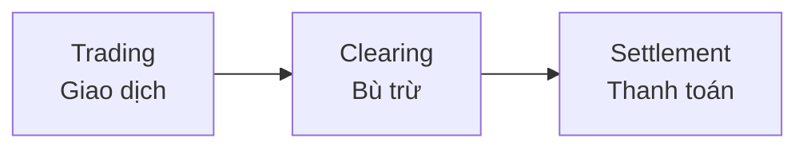
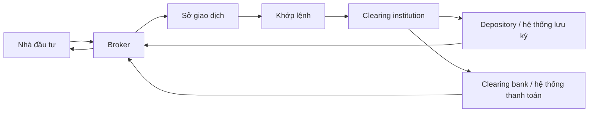

# Sở giao dịch và các trung gian tài chính

## 1. Tóm tắt

Một giao dịch cổ phiếu trên thị trường thứ cấp nhìn từ màn hình của nhà đầu tư có vẻ rất đơn giản: nhập mã cổ phiếu, chọn giá, nhập khối lượng rồi nhấn mua hoặc bán. Tuy nhiên, phía sau thao tác đó là cả một hệ thống gồm **broker, sở giao dịch, tổ chức bù trừ, hệ thống lưu ký và ngân hàng thanh toán**.

Mỗi thành phần chịu trách nhiệm cho một phần khác nhau của giao dịch. Sở giao dịch tổ chức thị trường và khớp lệnh; broker tiếp nhận lệnh từ nhà đầu tư; tổ chức bù trừ xác định nghĩa vụ của các bên; hệ thống lưu ký ghi nhận chứng khoán; còn hệ thống thanh toán xử lý dòng tiền.

Hiểu cấu trúc này giúp nhà đầu tư thấy rằng một giao dịch không kết thúc tại thời điểm lệnh được khớp. Sau **trading** còn có **clearing** và **settlement** trước khi tiền và chứng khoán thực sự được chuyển giao.

## 2. Mục tiêu học tập

Sau bài này, bạn có thể:

- giải thích vai trò của sở giao dịch chứng khoán;
- phân biệt **trading**, **clearing** và **settlement**;
- mô tả đường đi của một lệnh từ nhà đầu tư đến khi hoàn tất thanh toán;
- phân biệt vai trò của broker, clearing institution, depository, depository participant, clearing bank và custodian;
- giải thích vì sao thị trường cần các trung gian thay vì để người mua và người bán tự giao dịch trực tiếp;
- xác định những tiêu chí quan trọng khi lựa chọn broker.

## 3. Sở giao dịch chứng khoán là gì?

**Sở giao dịch chứng khoán — stock exchange —** là hạ tầng tổ chức nơi các lệnh mua và bán chứng khoán được đưa vào một hệ thống chung và thực hiện theo những quy tắc xác định trước.

Một sở giao dịch thường đảm nhiệm nhiều chức năng:

- tiếp nhận và tổ chức các lệnh giao dịch;
- vận hành hệ thống khớp lệnh;
- cung cấp dữ liệu thị trường;
- đặt ra hoặc thực thi các yêu cầu đối với thành viên giao dịch;
- hỗ trợ việc tuân thủ các quy định áp dụng cho chứng khoán niêm yết;
- phối hợp với những tổ chức khác trong quá trình bù trừ và thanh toán.

Nhờ có một thị trường tập trung và có quy tắc, người muốn mua không phải tự đi tìm từng người bán và thương lượng riêng từng giao dịch.

### 3.1. Những gì có thể được giao dịch trên sở giao dịch?

Cổ phiếu là một trong những loại chứng khoán phổ biến nhất, nhưng không phải loại duy nhất.

Tùy thị trường và sở giao dịch, hệ thống có thể hỗ trợ:

- cổ phiếu;
- trái phiếu doanh nghiệp;
- trái phiếu chính phủ;
- quỹ đầu tư hoặc chứng chỉ quỹ;
- một số sản phẩm liên quan đến ngoại hối;
- hợp đồng tương lai — `futures`;
- quyền chọn — `options`.

Mỗi nhóm sản phẩm có thể chịu các quy tắc giao dịch, ký quỹ và thanh toán khác nhau.

### 3.2. Vì sao không để nhà đầu tư tự mua bán với nhau?

Giả sử bạn muốn mua 1.000 cổ phiếu của một công ty.

Nếu không có thị trường tập trung, bạn phải:

1. tìm một người đang sở hữu đúng cổ phiếu đó;
2. kiểm tra xem họ có thực sự sở hữu chứng khoán hay không;
3. thống nhất giá;
4. thống nhất cách chuyển tiền;
5. thống nhất cách chuyển quyền sở hữu;
6. xử lý rủi ro nếu một bên không thực hiện cam kết.

Sở giao dịch và các trung gian tài chính biến quá trình này thành một hệ thống chuẩn hóa.

Nhờ đó, nhà đầu tư có thể gửi lệnh vào một thị trường có nhiều người mua và người bán cùng tham gia thay vì tìm đối tác riêng cho từng giao dịch.

## 4. Nhà đầu tư giao dịch thông qua broker

Nhà đầu tư cá nhân thông thường không trực tiếp kết nối với lõi khớp lệnh của sở giao dịch.

Lệnh thường đi theo hướng:

```text
Nhà đầu tư
    ↓
Broker / Công ty chứng khoán
    ↓
Sở giao dịch
    ↓
Hệ thống khớp lệnh
```

**Broker** là trung gian trực tiếp giữa nhà đầu tư và hạ tầng giao dịch.

Broker tiếp nhận lệnh từ khách hàng, kiểm tra các điều kiện cần thiết rồi chuyển lệnh đến hệ thống thị trường.

Tùy mô hình của từng thị trường, các thành viên của sở giao dịch có thể đảm nhiệm một hoặc nhiều vai trò như:

- **trading member**: thành viên giao dịch;
- **clearing member**: thành viên bù trừ;
- hoặc đồng thời thực hiện cả hai chức năng.

Để trở thành thành viên thị trường, tổ chức thường phải đáp ứng các yêu cầu về vốn, năng lực vận hành, quản trị rủi ro và các tiêu chuẩn pháp lý liên quan.

## 5. Vòng đời của một giao dịch chứng khoán

Một giao dịch trên thị trường thứ cấp có thể được chia thành ba giai đoạn chính:



Ba giai đoạn này liên quan chặt chẽ nhưng không phải là một.

- **Trading** xác định giao dịch nào đã được thực hiện.
- **Clearing** xác định mỗi bên phải giao và nhận những gì.
- **Settlement** thực hiện việc chuyển tiền và chứng khoán.

## 6. Giai đoạn 1: Trading — giao dịch và khớp lệnh

Đây là giai đoạn người mua và người bán đưa lệnh vào thị trường.

Ví dụ, sổ lệnh của một cổ phiếu có thể có:

| Lệnh mua | Giá | Lệnh bán | Giá |
| --- | ---: | --- | ---: |
| Mua 100 CP | 49.900 | Bán 200 CP | 50.000 |
| Mua 300 CP | 49.800 | Bán 150 CP | 50.100 |
| Mua 500 CP | 49.700 | Bán 400 CP | 50.200 |

Hệ thống khớp lệnh liên tục kiểm tra xem các lệnh có đáp ứng điều kiện giao dịch hay không.

Khi một lệnh mua và một lệnh bán có thể khớp theo cơ chế của thị trường, giao dịch được hình thành.

Quá trình tổng quát:

```text
Nhà đầu tư gửi lệnh
        ↓
Broker tiếp nhận lệnh
        ↓
Lệnh được chuyển tới sở giao dịch
        ↓
Hệ thống khớp lệnh
        ↓
Tìm lệnh đối ứng phù hợp
        ↓
Giao dịch được xác lập
```

Hệ thống điện tử giúp quá trình này diễn ra nhanh và không yêu cầu người mua phải biết danh tính của người bán.

### Một điểm quan trọng

**Khớp lệnh không đồng nghĩa với giao dịch đã hoàn tất toàn bộ.**

Khớp lệnh chỉ xác nhận rằng đã tồn tại một giao dịch:

> Bên A mua một lượng chứng khoán nhất định từ bên B với mức giá xác định.

Sau đó hệ thống vẫn phải xác định và thực hiện nghĩa vụ của hai bên.

## 7. Giai đoạn 2: Clearing — bù trừ

Sau khi giao dịch được xác lập, hệ thống phải tính toán:

- ai phải giao chứng khoán;
- ai phải nhận chứng khoán;
- số lượng bao nhiêu;
- ai phải trả tiền;
- ai phải nhận tiền;
- tổng nghĩa vụ của mỗi bên sau nhiều giao dịch là bao nhiêu.

Đây là chức năng của **clearing**.

### Ví dụ

Nhà đầu tư A mua từ nhà đầu tư B:

- 100 cổ phiếu X;
- giá 10 USD/cổ phiếu.

Giá trị giao dịch là:

$$
100 \times 10 = 1.000\ \text{USD}
$$

Sau khi giao dịch được xác lập, quá trình clearing xác định:

| Nhà đầu tư | Nghĩa vụ |
| --- | --- |
| A | Phải nhận 100 cổ phiếu X và phải thanh toán 1.000 USD |
| B | Phải giao 100 cổ phiếu X và được nhận 1.000 USD |

Nếu một thành viên thực hiện hàng trăm hoặc hàng nghìn giao dịch, hệ thống bù trừ sẽ tổng hợp các nghĩa vụ tương ứng thay vì xử lý chúng như những phép tính rời rạc hoàn toàn độc lập.

## 8. Clearing institution — tổ chức bù trừ

Quá trình bù trừ được thực hiện thông qua hạ tầng bù trừ của thị trường.

Trong các cấu trúc thị trường sử dụng **central counterparty — CCP**, tổ chức bù trừ đứng giữa giao dịch và quản lý nghĩa vụ đối với các thành viên liên quan.

Mục tiêu quan trọng là giảm **settlement risk — rủi ro thanh toán**.

Rủi ro thanh toán xuất hiện khi một bên đến thời điểm thực hiện nghĩa vụ nhưng:

- không giao chứng khoán như cam kết; hoặc
- không chuyển số tiền phải thanh toán.

Hệ thống bù trừ vì vậy thường gắn với các cơ chế quản trị rủi ro nhằm hạn chế khả năng một thành viên không hoàn thành nghĩa vụ làm ảnh hưởng dây chuyền đến các thành viên khác.

## 9. Giai đoạn 3: Settlement — thanh toán và chuyển giao

Sau clearing, hệ thống đã biết chính xác:

- chứng khoán phải đi đâu;
- tiền phải đi đâu;
- mỗi bên phải giao hoặc nhận bao nhiêu.

**Settlement** là giai đoạn thực hiện những nghĩa vụ đó.

```text
Bên mua
   │
   ├── Tiền ─────────────► Hệ thống thanh toán
   │
   ◄────── Chứng khoán ───
   │
Bên bán
   │
   ├── Chứng khoán ──────► Hệ thống lưu ký
   │
   ◄──────── Tiền ────────
```

Khi settlement hoàn tất:

- người mua nhận được chứng khoán;
- người bán nhận được tiền;
- quyền sở hữu chứng khoán được cập nhật trong hệ thống liên quan.

Vì vậy:

> **Execution xác lập giao dịch; settlement hoàn thành việc chuyển giao.**

## 10. Depository — hệ thống lưu ký chứng khoán

Chứng khoán giao dịch trên các thị trường hiện đại thường được quản lý dưới dạng điện tử.

**Depository** là hạ tầng lưu ký trung tâm giúp ghi nhận chứng khoán và quyền sở hữu liên quan.

Có thể hình dung vai trò này gần giống một hệ thống sổ cái:

```text
Depository
│
├── Nhà đầu tư A → sở hữu chứng khoán X
├── Nhà đầu tư B → sở hữu chứng khoán Y
└── Nhà đầu tư C → sở hữu chứng khoán X và Z
```

Khi một giao dịch được thanh toán, dữ liệu sở hữu phải được cập nhật để phản ánh người nắm giữ mới.

Ở một số thị trường, nhà đầu tư tiếp cận hệ thống lưu ký thông qua **depository participant — DP**, thay vì làm việc trực tiếp với hệ thống lưu ký trung tâm.

## 11. Clearing bank — ngân hàng thanh toán

Nếu depository xử lý phía **chứng khoán**, giao dịch cũng cần một hạ tầng xử lý phía **tiền**.

Các ngân hàng được chỉ định trong quá trình thanh toán có thể hỗ trợ:

- chuyển tiền từ bên có nghĩa vụ thanh toán;
- chuyển tiền tới bên được nhận;
- phối hợp với hệ thống bù trừ;
- hoàn thành phần tiền của quá trình settlement.

Do đó một giao dịch chứng khoán có hai dòng chuyển giao song song:

```text
Chứng khoán: Người bán ─────────► Người mua

Tiền:        Người mua ─────────► Người bán
```

Các trung gian và hệ thống thị trường phối hợp để hai phía này được thực hiện đúng nghĩa vụ.

## 12. Custodian — tổ chức lưu ký tài sản cho nhà đầu tư tổ chức

**Custodian** thường gắn nhiều hơn với các nhà đầu tư tổ chức lớn như:

- quỹ đầu tư;
- công ty bảo hiểm;
- tổ chức quản lý tài sản.

Custodian có thể thay mặt khách hàng tổ chức:

- lưu giữ tài sản;
- quản lý chứng khoán;
- quản lý dòng tiền liên quan;
- hỗ trợ settlement;
- đối soát giao dịch.

Tùy cấu trúc thị trường, một tổ chức cũng có thể đồng thời tham gia một số chức năng thanh toán hoặc bù trừ.

Không nên nhầm **custodian** với broker.

Broker chủ yếu là cổng giao dịch của nhà đầu tư, trong khi custodian tập trung nhiều hơn vào việc bảo quản, ghi nhận và vận hành tài sản sau giao dịch.

## 13. Toàn bộ chuỗi giao dịch

Có thể ghép các thành phần thành một sơ đồ tổng quát:



Quá trình có thể đọc theo ba lớp:

**Lớp giao dịch**

```text
Nhà đầu tư → Broker → Sở giao dịch → Khớp lệnh
```

**Lớp bù trừ**

```text
Giao dịch đã khớp → Xác định nghĩa vụ tiền và chứng khoán
```

**Lớp thanh toán**

```text
Chuyển chứng khoán + chuyển tiền → Hoàn tất giao dịch
```

Trong thực tế, kiến trúc cụ thể phụ thuộc vào từng quốc gia, sở giao dịch và hệ thống thanh toán, nhưng ba khái niệm **trading — clearing — settlement** vẫn là nền tảng để hiểu vòng đời giao dịch.

## 14. Các trung gian giải quyết những vấn đề gì?

| Thành phần | Vai trò chính |
| --- | --- |
| Nhà đầu tư | Ra quyết định mua hoặc bán |
| Broker | Tiếp nhận và chuyển lệnh của khách hàng |
| Sở giao dịch | Tổ chức thị trường và khớp lệnh |
| Clearing institution | Xác định và quản lý nghĩa vụ sau giao dịch |
| Depository | Ghi nhận và hỗ trợ chuyển quyền sở hữu chứng khoán |
| Depository participant | Kết nối nhà đầu tư với hạ tầng lưu ký trong mô hình áp dụng |
| Clearing bank | Hỗ trợ thanh toán phần tiền |
| Custodian | Quản lý và lưu giữ tài sản, đặc biệt cho nhà đầu tư tổ chức |
| Cơ quan quản lý | Thiết lập và giám sát việc tuân thủ khung pháp lý |

Điểm quan trọng là **không có một tổ chức duy nhất làm tất cả mọi việc**.

Việc phân chia chức năng giúp thị trường kiểm soát tốt hơn các nhóm rủi ro khác nhau.

## 15. Vì sao sở giao dịch và các trung gian có giá trị?

### 15.1. Tạo thanh khoản

Khi nhiều người mua và người bán cùng tập trung trên một thị trường, khả năng tìm được đối tác giao dịch tăng lên.

Thanh khoản tốt giúp việc mua bán thuận tiện hơn, dù không có nghĩa rằng mọi chứng khoán đều luôn có thanh khoản cao.

### 15.2. Hình thành giá

Các lệnh mua và bán cạnh tranh với nhau tạo ra quá trình khám phá giá — **price discovery**.

Giá không cần được một cá nhân duy nhất quyết định. Nó hình thành từ các lệnh của những người tham gia thị trường.

### 15.3. Chuẩn hóa quy trình

Thay vì mỗi cặp người mua và người bán tự thiết kế hợp đồng riêng, sở giao dịch và các trung gian tạo ra quy trình chung cho:

- đặt lệnh;
- khớp lệnh;
- xác định nghĩa vụ;
- thanh toán;
- chuyển quyền sở hữu.

### 15.4. Giảm rủi ro thanh toán

Hạ tầng clearing và settlement giúp kiểm soát tình huống một bên đã hoàn thành nghĩa vụ nhưng bên còn lại không thực hiện phần của mình.

### 15.5. Cung cấp thông tin và công cụ

Broker có thể cung cấp cho nhà đầu tư:

- dữ liệu giá;
- thông tin thị trường;
- báo cáo;
- công cụ phân tích;
- lịch sử giao dịch;
- thông tin tài khoản.

Mức độ và loại dịch vụ phụ thuộc vào từng broker.

## 16. Chọn broker: phí không phải tiêu chí duy nhất

Broker có mức phí thấp chưa chắc là broker phù hợp nhất.

Khi đánh giá một công ty chứng khoán, cần xem xét cả:

| Tiêu chí | Câu hỏi nên đặt ra |
| --- | --- |
| Phí | Tổng chi phí giao dịch là bao nhiêu? |
| Độ ổn định | Hệ thống có hoạt động ổn định khi thị trường biến động mạnh không? |
| Thực thi lệnh | Lệnh được xử lý như thế nào? |
| Tài sản | Cách quản lý và bảo vệ tài sản khách hàng ra sao? |
| Sản phẩm | Có hỗ trợ những sản phẩm bạn thực sự cần không? |
| Dữ liệu | Dữ liệu giá và lịch sử giao dịch có đủ không? |
| Báo cáo | Báo cáo giao dịch và tài sản có rõ ràng không? |
| Công cụ | Có công cụ phân tích phù hợp với nhu cầu không? |
| Hỗ trợ | Có kênh xử lý sự cố hiệu quả không? |

Đặc biệt với người mới, một hệ thống rõ ràng, ổn định và dễ kiểm tra lịch sử giao dịch thường quan trọng hơn việc cố tiết kiệm một khoản phí rất nhỏ.

## 17. Những điểm dễ nhầm

### 17.1. Khớp lệnh không phải settlement

Khi màn hình hiển thị lệnh đã khớp, giao dịch đã được **executed**, nhưng hạ tầng sau giao dịch vẫn còn phải thực hiện clearing và settlement.

### 17.2. Broker không phải sở giao dịch

Broker là trung gian nhận lệnh của khách hàng.

Sở giao dịch là nơi tổ chức thị trường và vận hành hệ thống giao dịch.

```text
Nhà đầu tư ≠ Broker ≠ Sở giao dịch
```

### 17.3. Clearing không phải settlement

**Clearing** trả lời:

> Mỗi bên đang nợ gì?

**Settlement** trả lời:

> Bây giờ thực hiện nghĩa vụ đó như thế nào?

### 17.4. Depository không giống tài khoản ngân hàng

Depository tập trung vào chứng khoán và quyền sở hữu chứng khoán.

Ngân hàng thanh toán tập trung vào phần tiền của giao dịch.

## 18. Ví dụ hoàn chỉnh

An đặt lệnh mua 100 cổ phiếu ABC thông qua broker.

### Bước 1 — Đặt lệnh

```text
An
 ↓
Broker
 ↓
Sở giao dịch
```

### Bước 2 — Khớp lệnh

Hệ thống tìm thấy một lệnh bán tương ứng.

Giả sử mức giá thực hiện là 50.000 đồng/cổ phiếu.

Giá trị giao dịch:

$$
100 \times 50.000 = 5.000.000\ \text{đồng}
$$

### Bước 3 — Clearing

Hệ thống xác định:

```text
An:
- Nhận 100 cổ phiếu ABC
- Thanh toán 5.000.000 đồng

Bên bán:
- Giao 100 cổ phiếu ABC
- Nhận 5.000.000 đồng
```

### Bước 4 — Settlement

Hạ tầng thanh toán thực hiện hai phía:

```text
100 cổ phiếu ABC ─────► An

5.000.000 đồng ───────► Bên bán
```

Sau khi quá trình này hoàn tất, quyền sở hữu chứng khoán và phần tiền tương ứng được ghi nhận theo hệ thống của thị trường.

## 19. Câu hỏi ôn tập

### Câu 1

Điều gì xảy ra ngay sau khi một lệnh mua và một lệnh bán được hệ thống khớp thành công?

A. Người mua lập tức trở thành chủ sở hữu cuối cùng mà không cần thêm quy trình nào.  
B. Broker tự quyết định cách phân chia tiền và chứng khoán.  
C. Giao dịch đi vào quá trình clearing để xác định nghĩa vụ của các bên.  
D. Sở giao dịch hủy toàn bộ lệnh còn lại của nhà đầu tư.

**Đáp án:** C

**Giải thích:** Khớp lệnh xác lập giao dịch. Sau đó clearing xác định số tiền và số chứng khoán mà mỗi bên phải giao hoặc nhận trước khi settlement được thực hiện.

### Câu 2

Vai trò nào phù hợp nhất với broker đối với một nhà đầu tư cá nhân?

A. Tiếp nhận và chuyển lệnh của nhà đầu tư vào hạ tầng giao dịch.  
B. Tự đặt giá thị trường cho tất cả cổ phiếu.  
C. Phát hành mọi chứng khoán được giao dịch trên thị trường.  
D. Thay thế hoàn toàn hệ thống lưu ký.

**Đáp án:** A

**Giải thích:** Broker là trung gian trực tiếp của nhà đầu tư trong quá trình gửi lệnh. Broker không tự quyết định giá chung của thị trường và cũng không thay thế sở giao dịch hay depository.

### Câu 3

Một hệ thống đã xác định rằng nhà đầu tư A phải nhận 200 cổ phiếu và trả 20 triệu đồng. Đây chủ yếu là kết quả của giai đoạn nào?

A. Listing.  
B. Settlement.  
C. Market making.  
D. Clearing.

**Đáp án:** D

**Giải thích:** Clearing có nhiệm vụ xác định nghĩa vụ của các bên. Settlement là bước thực hiện những nghĩa vụ đã được xác định đó.

### Câu 4

Thành phần nào gắn trực tiếp nhất với việc ghi nhận và hỗ trợ chuyển quyền sở hữu chứng khoán?

A. Bộ phận nghiên cứu của broker.  
B. Depository.  
C. Nhà đầu tư bán.  
D. Công ty kiểm toán.

**Đáp án:** B

**Giải thích:** Depository là hạ tầng lưu ký và ghi nhận chứng khoán. Khi settlement hoàn thành, thông tin sở hữu phải được cập nhật trong hệ thống liên quan.

### Câu 5

Một nhà đầu tư chỉ so sánh phí giao dịch khi chọn broker. Yếu tố nào sau đây cũng đáng được đánh giá?

A. Màu logo của broker.  
B. Số lượng quảng cáo trên mạng xã hội.  
C. Độ ổn định hệ thống, khả năng thực thi lệnh và cách quản lý tài sản khách hàng.  
D. Broker có văn phòng gần quán cà phê hay không.

**Đáp án:** C

**Giải thích:** Phí chỉ là một phần của chi phí và chất lượng dịch vụ. Độ ổn định, thực thi lệnh, khả năng quản lý tài sản, dữ liệu và hỗ trợ đều có thể ảnh hưởng trực tiếp đến trải nghiệm giao dịch.

## 20. Tổng kết

Một giao dịch chứng khoán không chỉ là thao tác mua hoặc bán trên ứng dụng.

Đằng sau nó là một chuỗi:

```text
Nhà đầu tư
    ↓
Broker
    ↓
Sở giao dịch
    ↓
Trading
    ↓
Clearing
    ↓
Settlement
    ↓
Chuyển tiền + chuyển chứng khoán
```

Ba khái niệm quan trọng nhất cần ghi nhớ là:

- **Trading:** giao dịch được xác lập.
- **Clearing:** nghĩa vụ được tính toán.
- **Settlement:** tiền và chứng khoán được chuyển giao.

Broker, sở giao dịch, tổ chức bù trừ, hệ thống lưu ký và ngân hàng thanh toán không phải những lớp trung gian dư thừa. Mỗi thành phần xử lý một phần khác nhau của bài toán giao dịch, qua đó giúp một thị trường với rất nhiều người mua và người bán có thể vận hành theo một quy trình thống nhất và có kiểm soát.
