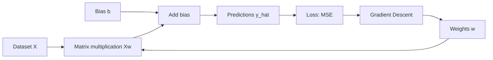
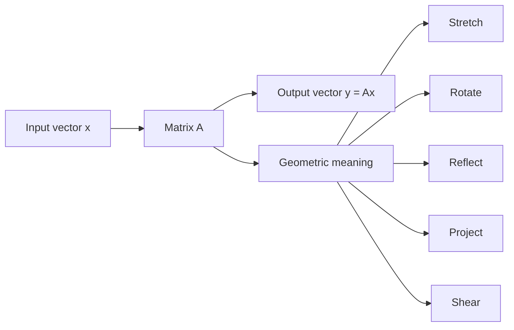
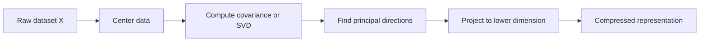
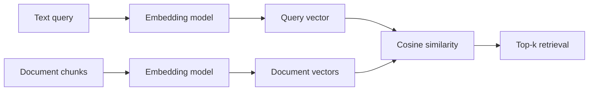
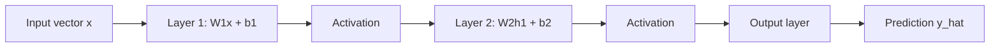
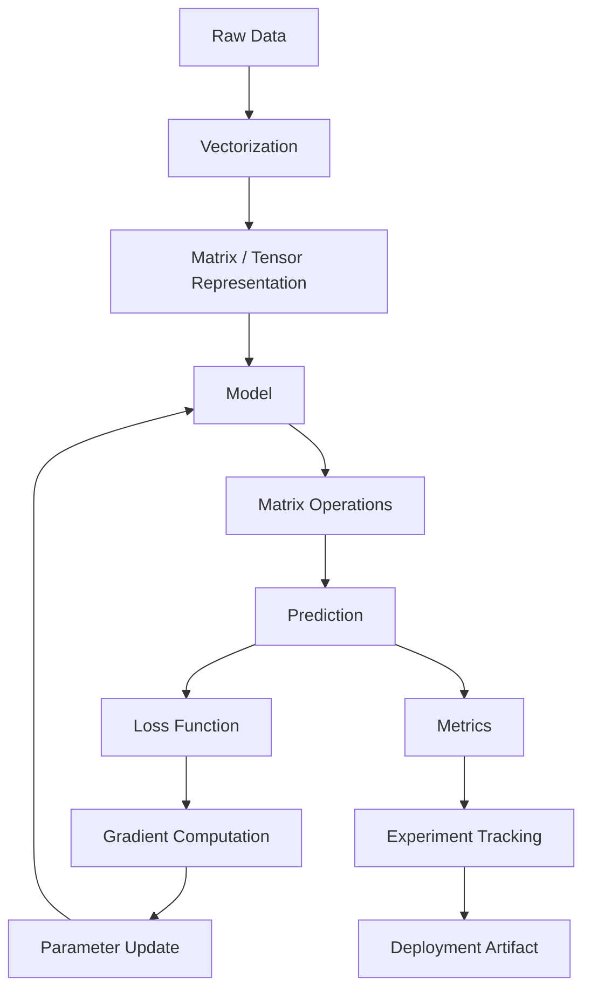
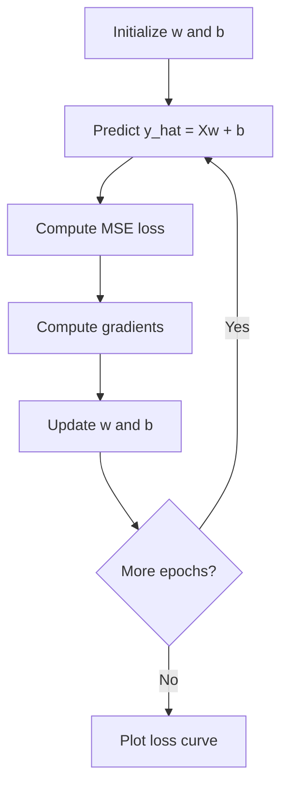

# 001 — Linear Algebra for AI and Data Science

**Course:** 01 — Math, Statistics and Econometrics
**Module:** Module 01 — Mathematics for AI and Data Science
**Content Group:** Linear Algebra
**Roadmap Source:** Mathematics for AI and Data Science / Linear Algebra
**Lesson Type:** Mathematics
**Order in Module:** 001
**Suggested Duration:** 24 minutes

---

## 1. Lesson Summary

**Linear Algebra** is the mathematical language of **vectors, matrices, linear transformations, spaces, projections, eigenvectors, optimization, embeddings, PCA, neural networks, and gradients**.

In AI and Data Science, linear algebra is not just abstract math. It is the way we represent:

* A row in a dataset as a **vector**
* A full dataset as a **matrix**
* An image as a **tensor**
* Model parameters as **weights**
* Text/image/audio representations as **embeddings**
* Neural network layers as **matrix transformations**
* Dimensionality reduction as **projection**
* Training as **optimization over vector spaces**

MIT’s Linear Algebra course emphasizes matrix theory, systems of equations, vector spaces, determinants, eigenvalues, and applications in other disciplines. NumPy, PyTorch, TensorFlow, and scikit-learn all expose linear algebra operations directly because they are core computational building blocks in scientific computing and machine learning.

---

## 2. Learning Objectives

After this lesson, you should be able to:

1. Explain **Linear Algebra** in your own words.
2. Represent data as **vectors, matrices, and tensors**.
3. Understand why matrix multiplication is the core operation behind many ML models.
4. Connect vectors and matrices to:

    - datasets
    - embeddings
    - linear regression
    - neural networks
    - PCA
    - gradient descent
5. Build a small practical artifact:

    - a notebook
    - a chart
    - a Python check
    - a mini ML experiment
    - a loss curve
    - a matrix transformation visualization

---

## 3. Big Picture: Where Linear Algebra Fits in AI

> Render note: Mermaid diagrams should be rendered by GitHub, VS Code Markdown Preview Mermaid Support, Obsidian, or compatible Markdown viewers.

```mermaid
flowchart TD
    LA["Linear Algebra for AI"]

    LA --> DR["Data Representation"]
    DR --> V["Vector"]
    DR --> M["Matrix"]
    DR --> T["Tensor"]
    DR --> E["Embedding"]

    LA --> GEO["Geometry"]
    GEO --> LEN["Length"]
    GEO --> ANG["Angle"]
    GEO --> DIST["Distance"]
    GEO --> PROJ["Projection"]
    GEO --> ROT["Rotation"]

    LA --> MLM["ML Models"]
    MLM --> LR["Linear Regression"]
    MLM --> LOGR["Logistic Regression"]
    MLM --> PCA["PCA"]
    MLM --> NN["Neural Networks"]
    MLM --> REC["Recommender Systems"]

    LA --> OPT["Optimization"]
    OPT --> GRAD["Gradient"]
    OPT --> JAC["Jacobian"]
    OPT --> HES["Hessian"]
    OPT --> GD["Gradient Descent"]

    LA --> DL["Deep Learning"]
    DL --> MM["Matrix Multiplication"]
    DL --> WM["Weight Matrices"]
    DL --> ACT["Activations"]
    DL --> BP["Backpropagation"]

    LA --> ART["Deployment Artifacts"]
    ART --> NB["Notebook"]
    ART --> MET["Metric"]
    ART --> CH["Chart"]
    ART --> API["API"]
    ART --> MOD["Model"]
    ART --> PORT["Portfolio Demo"]
```



---

## 4. Core Definition

Linear algebra studies **linear relationships** between quantities.

A relationship is linear when it preserves:

### Addition

$$
T(u + v) = T(u) + T(v)
$$

### Scalar multiplication

$$
T(cu) = cT(u)
$$

Combined:

$$
T(au + bv) = aT(u) + bT(v)
$$

A **linear transformation** can stretch, rotate, shear, reflect, or project vectors, but it does not bend space.

MIT describes linear transformations as what happens when a matrix multiplies an input vector to produce an output vector.

---

## 5. Concept Tree

```text
Linear Algebra
│
├── 1. Scalars
│   └── Single numbers: 2, -5, 3.14
│
├── 2. Vectors
│   ├── Ordered list of numbers
│   ├── Point in space
│   ├── Direction + magnitude
│   └── Example: [height, weight, age]
│
├── 3. Matrices
│   ├── Table of numbers
│   ├── Dataset representation
│   ├── Linear transformation
│   └── Example: X with shape (samples × features)
│
├── 4. Tensors
│   ├── Higher-dimensional arrays
│   ├── Images, videos, batches
│   └── Example: image = height × width × channels
│
├── 5. Vector Spaces
│   ├── Span
│   ├── Basis
│   ├── Dimension
│   └── Subspace
│
├── 6. Matrix Operations
│   ├── Addition
│   ├── Multiplication
│   ├── Transpose
│   ├── Inverse
│   └── Decomposition
│
├── 7. Geometry
│   ├── Dot product
│   ├── Norm
│   ├── Angle
│   ├── Projection
│   └── Orthogonality
│
└── 8. ML Applications
    ├── Linear regression
    ├── PCA
    ├── Neural networks
    ├── Embeddings
    └── Gradient descent
```

---

## 6. Main Objects in Linear Algebra

| Object      |                          Mathematical Form | AI / Data Science Meaning               |
| ----------- | -----------------------------------------: | --------------------------------------- |
| Scalar      |                       $a \in \mathbb{R}$ | One value, for example learning rate    |
| Vector      |                     $x \in \mathbb{R}^n$ | One data point or embedding             |
| Matrix      |          $X \in \mathbb{R}^{m \times n}$ | Dataset with rows and features          |
| Tensor      | $T \in \mathbb{R}^{a \times b \times c}$ | Image, video, model batch               |
| Linear map  |                                 $y = Ax$ | Transformation of input data            |
| Dot product |                               $x^\top y$ | Similarity, projection, attention score |
| Norm        |                                    $\lVert x \rVert$ | Length, magnitude, distance             |
| Eigenvector |                         $Av = \lambda v$ | Direction preserved by transformation   |
| SVD         |                     $A = U\Sigma V^\top$ | Compression, PCA, latent structure      |

---

## 7. Scalars, Vectors, Matrices, and Tensors

### 7.1 Scalar

A scalar is a single number.

$$
a = 3.5
$$

Examples in ML:

```text
learning_rate = 0.01
loss = 0.573
accuracy = 0.91
regularization_lambda = 0.001
```

---

### 7.2 Vector

A vector is an ordered list of numbers.

$$
x =
\begin{bmatrix}
x_1 \\
x_2 \\
x_3
\end{bmatrix}
$$

Example:

$$
x =
\begin{bmatrix}
170 \\
65 \\
22
\end{bmatrix}
$$

This could represent:

```text
height = 170 cm
weight = 65 kg
age = 22
```

In machine learning, one row of a dataset is often a vector:

$$
x_i = [x_{i1}, x_{i2}, x_{i3}, ..., x_{in}]
$$

---

### 7.3 Matrix

A matrix is a rectangular table of numbers.

$$
X =
\begin{bmatrix}
x_{11} & x_{12} & x_{13} \\
x_{21} & x_{22} & x_{23} \\
x_{31} & x_{32} & x_{33}
\end{bmatrix}
$$

In Data Science:

$$
X \in \mathbb{R}^{m \times n}
$$

Where:

```text
m = number of samples
n = number of features
```

Example:

$$
X =
\begin{bmatrix}
170 & 65 & 22 \\
160 & 50 & 21 \\
180 & 80 & 25
\end{bmatrix}
$$

```text
Rows    = people
Columns = height, weight, age
```

---

### 7.4 Tensor

A tensor is a higher-dimensional array.

Example: RGB image

$$
Image \in \mathbb{R}^{H \times W \times C}
$$

```text
H = height
W = width
C = channels, usually 3 for RGB
```

Example:

```text
Image shape = 224 × 224 × 3
Batch shape = 32 × 224 × 224 × 3
```

Deep learning frameworks use tensors heavily. TensorFlow’s matrix multiplication documentation describes inputs as tensors with matrix dimensions and optional outer batch dimensions.

---

## 8. Coordinate Plane Intuition

A 2D vector:

$$
v =
\begin{bmatrix}
3 \\
2
\end{bmatrix}
$$

means:

```text
move 3 units along x-axis
move 2 units along y-axis
```

### Coordinate Diagram

```text
y
↑
5 |
4 |
3 |
2 |             ● v = (3, 2)
1 |          ↗
0 +----+----+----+----+----→ x
     0    1    2    3    4
```

The vector has:

* direction
* magnitude
* coordinates
* geometric meaning

---

## 9. Vector Addition

Given:

$$
u =
\begin{bmatrix}
2 \\
1
\end{bmatrix},
\quad
v =
\begin{bmatrix}
1 \\
3
\end{bmatrix}
$$

Then:

$$
u + v =
\begin{bmatrix}
2 + 1 \\
1 + 3
\end{bmatrix}
=

\begin{bmatrix}
3 \\
4
\end{bmatrix}
$$

### Geometric Diagram

```text
y
↑
4 |                  ● u + v = (3,4)
3 |               ↗
2 |            ↗
1 |       ● u = (2,1)
0 +----+----+----+----+----→ x
     0    1    2    3    4

u moves first.
v moves from the head of u.
u + v lands at the final point.
```

---

## 10. Scalar Multiplication

Given:

$$
v =
\begin{bmatrix}
2 \\
1
\end{bmatrix}
$$

Then:

$$
3v =
3
\begin{bmatrix}
2 \\
1
\end{bmatrix}
=

\begin{bmatrix}
6 \\
3
\end{bmatrix}
$$

Scalar multiplication changes vector length.

```text
v   = short arrow
3v  = same direction, 3 times longer
-v  = opposite direction
```

---

## 11. Dot Product

The dot product of two vectors is:

$$
u \cdot v = u^\top v = \sum_{i=1}^{n} u_i v_i
$$

Example:

$$
u =
\begin{bmatrix}
2 \\
3
\end{bmatrix},
\quad
v =
\begin{bmatrix}
4 \\
1
\end{bmatrix}
$$

$$
u^\top v = 2 \times 4 + 3 \times 1 = 11
$$

### Geometric Meaning

$$
u^\top v = \lVert u \rVert\lVert v \rVert\cos(\theta)
$$

So dot product measures:

```text
large positive  → same direction
zero            → perpendicular
large negative  → opposite direction
```

### ML Meaning

Dot product appears in:

* linear regression
* logistic regression
* neural network layers
* attention mechanisms
* embedding similarity
* recommender systems

Example:

$$
score = w^\top x + b
$$

---

## 12. Norm: Vector Length

The L2 norm is:

$$
\lVert x \rVert_2 = \sqrt{x_1^2 + x_2^2 + ... + x_n^2}
$$

Example:

$$
x =
\begin{bmatrix}
3 \\
4
\end{bmatrix}
$$

$$
\lVert x \rVert_2 = \sqrt{3^2 + 4^2} = 5
$$

NumPy provides `numpy.linalg.norm` for vector and matrix norms.

---

## 13. Matrix Multiplication

Given:

$$
A =
\begin{bmatrix}
1 & 2 \\
3 & 4
\end{bmatrix},
\quad
x =
\begin{bmatrix}
5 \\
6
\end{bmatrix}
$$

Then:

$$
Ax =
\begin{bmatrix}
1 \times 5 + 2 \times 6 \\
3 \times 5 + 4 \times 6
\end{bmatrix}
=

\begin{bmatrix}
17 \\
39
\end{bmatrix}
$$

### Shape Rule

$$
A_{m \times n} B_{n \times p} = C_{m \times p}
$$

```text
A shape: m × n
B shape: n × p

Inner dimensions must match.

(m × n) @ (n × p) = (m × p)
```

### Shape Diagram

```text
        B
     n × p
   ┌────────┐
   │        │
   │        │
   └────────┘

A  m × n       Result: m × p
┌────────┐     ┌────────┐
│        │  @  │        │
│        │  =  │        │
└────────┘     └────────┘

The shared dimension n disappears.
```

PyTorch’s `torch.matmul` supports matrix multiplication and batched matrix multiplication when tensors have more than two dimensions.

---

## 14. Matrix as Dataset

A dataset can be represented as:

$$
X =
\begin{bmatrix}
x_1^\top \\
x_2^\top \\
x_3^\top \\
\vdots \\
x_m^\top
\end{bmatrix}
$$

Where:

```text
Each row    = one sample
Each column = one feature
```

Example:

```text
Student dataset
```

$$
X =
\begin{bmatrix}
8.0 & 2.0 & 1.0 \\
6.5 & 3.0 & 0.0 \\
9.0 & 1.0 & 1.0
\end{bmatrix}
$$

```text
Column 1 = study hours
Column 2 = sleep debt
Column 3 = completed practice test
```

---

## 15. Linear Regression as Linear Algebra

Linear regression predicts:

$$
\hat{y} = Xw + b
$$

Where:

```text
X = dataset matrix
w = weight vector
b = bias
ŷ = prediction vector
```

For one sample:

$$
\hat{y}_i = w^\top x_i + b
$$

For many samples:

$$
\hat{y} = Xw + b
$$

### Diagram



---

## 16. Mean Squared Error

For regression:

$$
MSE = \frac{1}{m}\sum_{i=1}^{m}(\hat{y}_i - y_i)^2
$$

Vectorized form:

$$
MSE = \frac{1}{m}\lVert \hat{y} - y \rVert_2^2
$$

Since:

$$
\hat{y} = Xw + b
$$

Then:

$$
MSE = \frac{1}{m}\lVert Xw + b - y \rVert_2^2
$$

This is why linear algebra is directly connected to model training.

---

## 17. Gradient Descent from Linear Algebra View

Gradient descent updates parameters:

$$
w_{new} = w_{old} - \alpha \nabla_w L
$$

Where:

```text
w       = parameter vector
α       = learning rate
L       = loss function
∇w L    = gradient of loss with respect to w
```

### Gradient Descent Diagram

```text
Loss
↑
|               ● start
|            ↙
|         ●
|      ↙
|   ●
| ↙
|● minimum
+----------------------------→ parameter w
```

In the mini project, you can implement:

```text
1. Generate small dataset X, y
2. Initialize weights w
3. Predict y_hat = Xw
4. Compute MSE
5. Compute gradient
6. Update w
7. Plot loss curve
```

---

## 18. Linear Transformation

A matrix can transform vectors.

$$
y = Ax
$$

Example:

$$
A =
\begin{bmatrix}
2 & 0 \\
0 & 1
\end{bmatrix}
$$

This stretches space by 2 along the x-axis.

### Before Transformation

```text
y
↑
3 |      ●
2 |   ●     ●
1 |      ●
0 +----------------→ x
```

### After Transformation

```text
y
↑
3 |            ●
2 |      ●           ●
1 |            ●
0 +------------------------→ x
```

The points become wider horizontally.

---

## 19. Common 2D Transformation Matrices

### Scaling

$$
A =
\begin{bmatrix}
s_x & 0 \\
0 & s_y
\end{bmatrix}
$$

### Rotation

$$
R(\theta) =
\begin{bmatrix}
\cos\theta & -\sin\theta \
\sin\theta & \cos\theta
\end{bmatrix}
$$

### Reflection over x-axis

$$
A =
\begin{bmatrix}
1 & 0 \\
0 & -1
\end{bmatrix}
$$

### Shear

$$
A =
\begin{bmatrix}
1 & k \\
0 & 1
\end{bmatrix}
$$

### Projection onto x-axis

$$
P =
\begin{bmatrix}
1 & 0 \\
0 & 0
\end{bmatrix}
$$

---

## 20. Transformation Diagram



---

## 21. Span

The **span** of vectors is the set of all linear combinations.

Given:

$$
v_1, v_2
$$

Their span is:

$$
\operatorname{span}(v_1, v_2) = \{a v_1 + b v_2 \mid a,b \in \mathbb{R}\}
$$

### Case 1: Two independent vectors in 2D

```text
v1 and v2 point in different directions.
Their span covers the whole 2D plane.
```

$$
\operatorname{span}(v_1, v_2) = \mathbb{R}^2
$$

### Case 2: Two dependent vectors

```text
v2 is just a stretched version of v1.
Their span is only one line.
```

$$
\operatorname{span}(v_1, v_2) = \text{a line}
$$

---

## 22. Basis and Dimension

A **basis** is a set of vectors that:

1. spans the space
2. is linearly independent

For $\mathbb{R}^2$, the standard basis is:

$$
e_1 =
\begin{bmatrix}
1 \\
0
\end{bmatrix},
\quad
e_2 =
\begin{bmatrix}
0 \\
1
\end{bmatrix}
$$

Any vector in $\mathbb{R}^2$ can be written as:

$$
v = a e_1 + b e_2
$$

Example:

$$
\begin{bmatrix}
3 \\
2
\end{bmatrix}
=

3
\begin{bmatrix}
1 \\
0
\end{bmatrix}
+
2
\begin{bmatrix}
0 \\
1
\end{bmatrix}
$$

---

## 23. Rank

The **rank** of a matrix is the number of independent directions represented by its columns.

```text
High rank  → many independent directions
Low rank   → redundant information
Rank 1     → all columns lie on one direction
```

In ML, rank is related to:

* feature redundancy
* dimensionality
* compression
* PCA
* matrix factorization
* recommender systems

---

## 24. Determinant

For a 2×2 matrix:

$$
A =
\begin{bmatrix}
a & b \\
c & d
\end{bmatrix}
$$

The determinant is:

$$
\det(A) = ad - bc
$$

### Geometric Meaning

The determinant tells how much a matrix scales area.

```text
det(A) = 2    → area doubles
det(A) = 1    → area preserved
det(A) = 0    → space collapses
det(A) < 0    → orientation flips
```

A square matrix is invertible if its determinant is nonzero.

---

## 25. Inverse Matrix

The inverse of a matrix $A$ is:

$$
A^{-1}
$$

Such that:

$$
A^{-1}A = I
$$

Where $I$ is the identity matrix.

If:

$$
Ax = b
$$

Then:

$$
x = A^{-1}b
$$

But in real ML/scientific computing, we usually avoid explicitly computing $A^{-1}$ for large systems. Numerical solvers are often preferred.

---

## 26. Eigenvalues and Eigenvectors

An eigenvector is a vector whose direction does not change after transformation.

$$
Av = \lambda v
$$

Where:

```text
A = matrix
v = eigenvector
λ = eigenvalue
```

MIT explains that if $Ax$ points in the same direction as $x$, then (x) is an eigenvector of $A$.

### Diagram

```text
Normal vector transformation:

v  ───────▶
Av    ↗
     direction changed


Eigenvector transformation:

v  ───────▶
Av ─────────────────▶
same direction, only length changes
```

### Interpretation

```text
λ > 1      → vector stretches
0 < λ < 1  → vector shrinks
λ < 0      → vector flips direction
λ = 0      → vector collapses to zero
```

---

## 27. Eigenvectors in Data Science

Eigenvectors and eigenvalues appear in:

* PCA
* covariance matrices
* graph algorithms
* spectral clustering
* PageRank-like methods
* stability analysis
* dimensionality reduction

---

## 28. PCA: Principal Component Analysis

PCA finds new directions that capture the most variance in the data.

scikit-learn describes PCA as linear dimensionality reduction using SVD to project data to a lower-dimensional space.

### PCA Intuition

```text
Original data has many features.
Some features are redundant.
PCA finds fewer directions that keep most useful variation.
```

### PCA Diagram

```text
Original 2D data:

y
↑
|        ●
|      ●   ●
|    ●   ●
|  ●   ●
|●
+----------------→ x

Main direction of variance:

y
↑
|        ●
|      ●   ●
|    ●   ●
|  ●   ●
|●
+----------------→ x
 \________________
   principal component
```

### PCA Pipeline



---

## 29. SVD: Singular Value Decomposition

SVD decomposes a matrix into:

$$
A = U\Sigma V^\top
$$

Where:

```text
U      = left singular vectors
Σ      = singular values
Vᵀ     = right singular vectors
```

NumPy documents 2D SVD as $A = U S V^H$, where singular values are stored in `s`.

### SVD Meaning

```text
A matrix transformation can be decomposed into:

1. rotate/reflection
2. stretch/compress
3. rotate/reflection again
```

### SVD Diagram

```text
Input space
   │
   ▼
Vᵀ: rotate
   │
   ▼
Σ: stretch/compress
   │
   ▼
U: rotate
   │
   ▼
Output space
```

### ML Use Cases

* PCA
* image compression
* noise reduction
* recommender systems
* latent semantic analysis
* low-rank approximation

scikit-learn’s `TruncatedSVD` performs linear dimensionality reduction with truncated SVD and can work efficiently on sparse matrices such as term-count or TF-IDF matrices.

---

## 30. Embeddings as Vectors

An embedding is a vector representation of an object.

Examples:

```text
word     → vector
sentence → vector
image    → vector
user     → vector
product  → vector
```

Example:

$$
embedding("cat") =
\begin{bmatrix}
0.12 \\
-0.44 \\
0.91 \\
... \\
0.07
\end{bmatrix}
$$

### Similarity

Two embeddings can be compared using cosine similarity:

$$
cosine(x,y) = \frac{x^\top y}{|x||y|}
$$

```text
cosine close to 1  → very similar
cosine close to 0  → unrelated
cosine close to -1 → opposite direction
```

### Embedding Search Diagram



---

## 31. Neural Networks as Linear Algebra

A dense neural network layer is:

$$
z = Wx + b
$$

Then an activation function is applied:

$$
a = \sigma(z)
$$

### One Layer

```text
input vector x
     │
     ▼
linear transform: z = Wx + b
     │
     ▼
activation: a = ReLU(z)
     │
     ▼
output vector a
```

### Multi-layer Neural Network

$$
h_1 = \sigma(W_1x + b_1)
$$

$$
h_2 = \sigma(W_2h_1 + b_2)
$$

$$
\hat{y} = W_3h_2 + b_3
$$

### Diagram



---

## 32. Linear Algebra in the ML Workflow



---

## 33. Practical Numeric Example

Suppose we want to predict exam score from study hours and sleep hours.

### Dataset

$$
X =
\begin{bmatrix}
2 & 6 \\
4 & 7 \\
6 & 8
\end{bmatrix}
$$

Weights:

$$
w =
\begin{bmatrix}
5 \\
3
\end{bmatrix}
$$

Bias:

$$
b = 10
$$

Prediction:

$$
\hat{y} = Xw + b
$$

Compute:

$$
Xw =
\begin{bmatrix}
2 \times 5 + 6 \times 3 \\
4 \times 5 + 7 \times 3 \\
6 \times 5 + 8 \times 3
\end{bmatrix}
=

\begin{bmatrix}
28 \\
41 \\
54
\end{bmatrix}
$$

Add bias:

$$
\hat{y} =
\begin{bmatrix}
38 \\
51 \\
64
\end{bmatrix}
$$

---

## 34. Python Check

```python
import numpy as np

X = np.array([
    [2, 6],
    [4, 7],
    [6, 8]
])

w = np.array([5, 3])
b = 10

y_hat = X @ w + b

print(y_hat)
# Expected: [38 51 64]
```

---

## 35. Mini Project: Gradient Descent from Scratch

### Goal

Build a mini notebook that trains a linear regression model using MSE loss and gradient descent.

### Model

$$
\hat{y} = Xw + b
$$

### Loss

$$
L = \frac{1}{m}\sum_{i=1}^{m}(\hat{y}_i - y_i)^2
$$

### Gradients

$$
\frac{\partial L}{\partial w} = \frac{2}{m}X^\top(\hat{y} - y)
$$

$$
\frac{\partial L}{\partial b} = \frac{2}{m}\sum_{i=1}^{m}(\hat{y}_i - y_i)
$$

### Update

$$
w := w - \alpha \frac{\partial L}{\partial w}
$$

$$
b := b - \alpha \frac{\partial L}{\partial b}
$$

### Training Flow



---

## 36. Practice Notebook Structure

```text
linear_algebra_gradient_descent.ipynb
│
├── 1. Import libraries
├── 2. Create small dataset
├── 3. Visualize data
├── 4. Initialize weights
├── 5. Forward pass: y_hat = Xw + b
├── 6. Compute MSE
├── 7. Compute gradients
├── 8. Update weights
├── 9. Train over epochs
├── 10. Plot loss curve
└── 11. Write ML interpretation
```

---

## 37. Common Mistakes

### Mistake 1: Memorizing definitions without geometry

Bad:

```text
A vector is an element of a vector space.
```

Better:

```text
A vector can represent a data point, direction, or embedding.
It has length, direction, and coordinates.
```

---

### Mistake 2: Confusing element-wise multiplication with matrix multiplication

Element-wise:

$$
A * B
$$

Matrix multiplication:

$$
A @ B
$$

They are not the same.

---

### Mistake 3: Ignoring shape rules

Before multiplying matrices, always check:

```text
(m × n) @ (n × p) = (m × p)
```

If inner dimensions do not match, multiplication is invalid.

---

### Mistake 4: Thinking inverse is always the best solution

For large ML systems, directly computing the inverse can be unstable or inefficient. Prefer numerical solvers, decomposition methods, or gradient-based optimization.

---

### Mistake 5: Learning only symbols, not artifacts

For AI/Data Science, every math topic should become something practical:

```text
concept → numeric example → Python check → visual intuition → ML use case
```

---

## 38. Checklist for Completion

You are done with this lesson if you can:

* [ ] Explain Linear Algebra in 1–2 minutes.
* [ ] Represent a dataset as a matrix.
* [ ] Explain vector, matrix, tensor, dot product, norm, and transformation.
* [ ] Compute a small matrix-vector product by hand.
* [ ] Verify the result with Python.
* [ ] Explain why neural networks use matrix multiplication.
* [ ] Explain PCA as projection to important directions.
* [ ] Build a mini notebook for gradient descent.
* [ ] Plot a loss curve.
* [ ] Write at least one caveat or limitation.

---

## 39. One-Minute Explanation

Linear algebra is the math of vectors, matrices, and transformations. In AI, data points are vectors, datasets are matrices, images are tensors, and neural networks are chains of matrix multiplications plus nonlinear activations. Concepts like dot product, norm, projection, eigenvectors, and SVD help us measure similarity, reduce dimensions, train models, compress data, and understand optimization. Without linear algebra, it is hard to understand regression, PCA, embeddings, backpropagation, or deep learning.

---

## 40. Final Outcome

By the end of this lesson, you should understand that **Linear Algebra is the mathematical foundation behind vectors, optimization, gradients, PCA, neural networks, and embeddings**.

Your practical artifact should be:

```text
A small notebook implementing gradient descent from scratch
with:
- dataset matrix X
- weight vector w
- prediction y_hat = Xw + b
- MSE loss
- gradient update
- loss curve over epochs
```

---

## 41. Portfolio Artifact Idea

### Project Name

**Gradient Descent from Scratch with Linear Algebra**

### Deliverables

```text
1. Notebook
2. Loss curve chart
3. Explanation of Xw + b
4. Hand-calculated example
5. Python verification
6. Short README
```

### README Structure

```markdown
# Gradient Descent from Scratch

## Goal
Implement linear regression using only NumPy and linear algebra.

## Concepts
- Vector
- Matrix
- Dot product
- MSE
- Gradient
- Gradient descent

## Result
The model learns weights that reduce MSE over epochs.

## Caveat
This demo uses a small synthetic dataset, so it does not prove real-world generalization.
```

---

## 42. Key Takeaway

Linear algebra is not only a math subject.
It is the **data representation and computation language of modern AI**.

```text
Data → Vector
Dataset → Matrix
Image → Tensor
Model → Matrix operations
Training → Gradient updates
PCA → Projection
Embedding search → Dot product / cosine similarity
Neural network → Repeated linear transformations
```
