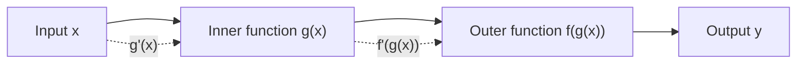
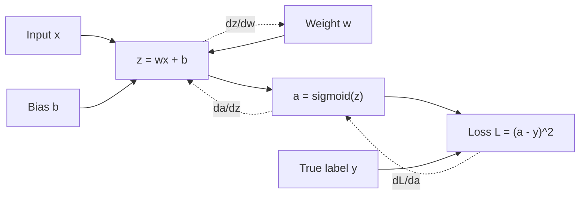
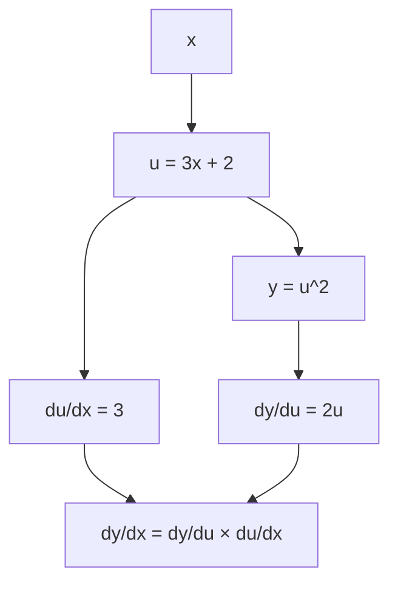

# 014 - Chain Rule

**Course:** 01 - Math, Statistics and Econometrics
**Module:** Module 01 - Mathematics for AI and Data Science
**Content Group:** Calculus
**Roadmap Source:** Mathematics for AI and Data Science / Calculus
**Lesson Type:** Mathematics
**Order in Module:** 014
**Suggested Duration:** 24 minutes

---

## 1. Summary

This lesson explains the **Chain Rule** in the context of AI and Data Science.

The Chain Rule tells us how to differentiate a function that is built from other functions. In Machine Learning, many models are nested systems: input data goes through transformations, activations, layers, losses, and finally an optimization step.

Because of this, the Chain Rule is the mathematical foundation behind **backpropagation**, **gradient descent**, and **training neural networks**.

After this lesson, you should understand how the Chain Rule helps answer questions such as:

* How does a small change in a model parameter affect the final loss?
* How do gradients flow through multiple layers of a neural network?
* Why can deep learning frameworks automatically compute derivatives?
* How can we debug training behavior when gradients are too small or too large?

---

## 2. Learning Objectives

By the end of this lesson, you should be able to:

* Explain the Chain Rule in your own words.
* Compute simple derivatives of composite functions.
* Understand how Chain Rule connects to gradients and optimization.
* Recognize the role of Chain Rule in backpropagation.
* Implement a small numerical check in Python.
* Connect Chain Rule to Machine Learning artifacts such as notebooks, loss curves, model training logs, and gradient debugging.

---

## 3. Core Idea

### 3.1 What Is the Chain Rule?

The Chain Rule is used when one function is inside another function.

If:

$$
y = f(g(x))
$$

then the derivative of `y` with respect to `x` is:

$$
\frac{dy}{dx} = f'(g(x)) \cdot g'(x)
$$

In words:

> The rate of change of the outer function depends on the derivative of the outer function and the derivative of the inner function.

---

## 4. Intuition

Imagine a pipeline:

```text
x -> g(x) -> f(g(x)) -> y
```

A change in `x` affects `g(x)`, and that change affects the final output `y`.

So, to understand how `x` affects `y`, we multiply the local effects along the path.



The Chain Rule says:

```text
total effect = effect of outer function × effect of inner function
```

Mathematically:

$$
\frac{dy}{dx}
=============

\frac{dy}{du}
\cdot
\frac{du}{dx}
$$

where:

$$
u = g(x)
$$

and:

$$
y = f(u)
$$

---

## 5. Simple Numeric Example

Suppose:

$$
y = (3x + 2)^2
$$

This is a composite function.

Let:

$$
u = 3x + 2
$$

Then:

$$
y = u^2
$$

Now apply the Chain Rule:

$$
\frac{dy}{dx}
=============

\frac{dy}{du}
\cdot
\frac{du}{dx}
$$

Calculate each part:

$$
\frac{dy}{du} = 2u
$$

$$
\frac{du}{dx} = 3
$$

Therefore:

$$
\frac{dy}{dx} = 2u \cdot 3
$$

Substitute back:

$$
\frac{dy}{dx} = 2(3x + 2) \cdot 3
$$

So:

$$
\frac{dy}{dx} = 6(3x + 2)
$$

If:

$$
x = 1
$$

then:

$$
\frac{dy}{dx} = 6(3(1) + 2) = 6(5) = 30
$$

So at `x = 1`, the slope is `30`.

---

## 6. Visual Intuition

```text
Original function:

y = (3x + 2)^2

Break it into layers:

x
|
| u = 3x + 2
v
u
|
| y = u^2
v
y
```

Each layer has a local derivative:

```text
x ---------> u ---------> y
   du/dx       dy/du
```

The total derivative is:

```text
dy/dx = dy/du × du/dx
```

This is exactly how neural networks compute gradients during backpropagation.

---

## 7. Chain Rule in Machine Learning

Many ML models are built as chains of transformations.

Example:

```text
input data
   ↓
linear transformation
   ↓
activation function
   ↓
prediction
   ↓
loss function
   ↓
gradient update
```

A simple neural network layer may look like this:

$$
z = wx + b
$$

$$
a = \sigma(z)
$$

$$
L = (a - y)^2
$$

Here, the loss `L` depends on `a`, `a` depends on `z`, and `z` depends on `w`.

So if we want to know how the loss changes when the weight `w` changes, we use:

$$
\frac{dL}{dw}
=============

\frac{dL}{da}
\cdot
\frac{da}{dz}
\cdot
\frac{dz}{dw}
$$

This is the Chain Rule.

---

## 8. Backpropagation Connection

Backpropagation is basically the Chain Rule applied efficiently through a computational graph.



Forward pass:

```text
x -> z -> a -> loss
```

Backward pass:

```text
loss -> a -> z -> w
```

The model learns by calculating:

$$
\frac{dL}{dw}
$$

Then it updates the weight:

$$
w := w - \alpha \frac{dL}{dw}
$$

where:

* `w` is the model weight.
* `α` is the learning rate.
* `dL/dw` is the gradient of the loss with respect to the weight.

---

## 9. Python Check

```python
def f(x):
    return (3 * x + 2) ** 2

def derivative_chain_rule(x):
    u = 3 * x + 2
    dy_du = 2 * u
    du_dx = 3
    return dy_du * du_dx

x = 1
print("Function value:", f(x))
print("Derivative by Chain Rule:", derivative_chain_rule(x))
```

Expected output:

```text
Function value: 25
Derivative by Chain Rule: 30
```

---

## 10. Numerical Gradient Check

We can also check the derivative using a small difference.

```python
def numerical_derivative(func, x, h=1e-5):
    return (func(x + h) - func(x - h)) / (2 * h)

x = 1

analytic = derivative_chain_rule(x)
numeric = numerical_derivative(f, x)

print("Analytic derivative:", analytic)
print("Numerical derivative:", numeric)
print("Difference:", abs(analytic - numeric))
```

Expected result:

```text
Analytic derivative: 30
Numerical derivative: approximately 30
Difference: very small
```

This is useful because gradient checking helps verify whether your derivative implementation is correct.

---

## 11. Mini ML Example

Suppose we have a simple prediction:

$$
\hat{y} = wx
$$

and a Mean Squared Error loss:

$$
L = (\hat{y} - y)^2
$$

We want:

$$
\frac{dL}{dw}
$$

Break it into steps:

$$
\hat{y} = wx
$$

$$
L = (\hat{y} - y)^2
$$

Apply Chain Rule:

$$
\frac{dL}{dw}
=============

\frac{dL}{d\hat{y}}
\cdot
\frac{d\hat{y}}{dw}
$$

Calculate each part:

$$
\frac{dL}{d\hat{y}} = 2(\hat{y} - y)
$$

$$
\frac{d\hat{y}}{dw} = x
$$

Therefore:

$$
\frac{dL}{dw} = 2(\hat{y} - y)x
$$

This is the gradient used to update `w`.

---

## 12. Chain Rule as a Computation Tree



The Chain Rule follows the path from output back to input.

---

## 13. Common Patterns

### Pattern 1: Power of a Function

If:

$$
y = [g(x)]^n
$$

then:

$$
\frac{dy}{dx} = n[g(x)]^{n-1}g'(x)
$$

Example:

$$
y = (5x - 1)^4
$$

Derivative:

$$
\frac{dy}{dx} = 4(5x - 1)^3 \cdot 5
$$

---

### Pattern 2: Exponential of a Function

If:

$$
y = e^{g(x)}
$$

then:

$$
\frac{dy}{dx} = e^{g(x)}g'(x)
$$

Example:

$$
y = e^{2x + 1}
$$

Derivative:

$$
\frac{dy}{dx} = e^{2x + 1} \cdot 2
$$

---

### Pattern 3: Log of a Function

If:

$$
y = \log(g(x))
$$

then:

$$
\frac{dy}{dx} = \frac{g'(x)}{g(x)}
$$

Example:

$$
y = \log(3x + 2)
$$

Derivative:

$$
\frac{dy}{dx} = \frac{3}{3x + 2}
$$

---

### Pattern 4: Sigmoid Activation

The sigmoid function is:

$$
\sigma(z) = \frac{1}{1 + e^{-z}}
$$

Its derivative is:

$$
\sigma'(z) = \sigma(z)(1 - \sigma(z))
$$

If:

$$
z = wx + b
$$

and:

$$
a = \sigma(z)
$$

then:

$$
\frac{da}{dw}
=============

\frac{da}{dz}
\cdot
\frac{dz}{dw}
$$

So:

$$
\frac{da}{dw}
=============

\sigma(z)(1 - \sigma(z))x
$$

This is a direct Chain Rule example in neural networks.

---

## 14. Why Chain Rule Matters in AI

The Chain Rule is important because AI models are usually not one simple formula. They are layered systems.

```text
features
   ↓
linear layer
   ↓
activation
   ↓
another layer
   ↓
prediction
   ↓
loss
```

To train the model, we need to know how each parameter contributed to the final error.

The Chain Rule allows us to compute:

```text
How much did this parameter affect the loss?
```

That answer becomes the gradient.

The gradient is then used by an optimizer such as:

* Gradient Descent
* Stochastic Gradient Descent
* Adam
* RMSProp

---

## 15. Practical Data Science Use Cases

### 15.1 Model Training

The Chain Rule helps compute gradients for model parameters.

Example:

```text
loss -> prediction -> activation -> linear layer -> weights
```

---

### 15.2 Neural Network Backpropagation

Every deep learning framework uses Chain Rule internally.

Examples:

* PyTorch autograd
* TensorFlow GradientTape
* JAX automatic differentiation

---

### 15.3 Debugging Training Problems

Understanding Chain Rule helps explain:

* Why gradients vanish.
* Why gradients explode.
* Why learning is slow.
* Why loss does not decrease.
* Why activation functions matter.

---

### 15.4 Feature Transformation

If a model uses transformed features, the Chain Rule helps analyze how changes propagate.

Example:

$$
x \rightarrow \log(x) \rightarrow model \rightarrow prediction
$$

---

## 16. Common Mistakes

### Mistake 1: Forgetting the Inner Derivative

Wrong:

$$
\frac{d}{dx}(3x + 2)^2 = 2(3x + 2)
$$

Correct:

$$
\frac{d}{dx}(3x + 2)^2 = 2(3x + 2) \cdot 3
$$

The missing part is:

$$
\frac{d}{dx}(3x + 2) = 3
$$

---

### Mistake 2: Treating Composite Functions as Simple Functions

For:

$$
y = \sin(x^2)
$$

Wrong:

$$
\frac{dy}{dx} = \cos(x)
$$

Correct:

$$
\frac{dy}{dx} = \cos(x^2) \cdot 2x
$$

---

### Mistake 3: Not Tracking Intermediate Variables

A good habit is to define intermediate variables:

```text
u = inner function
y = outer function
```

Then compute:

```text
dy/dx = dy/du × du/dx
```

---

### Mistake 4: Ignoring Numerical Validation

Even if the derivative looks correct, it is useful to check it numerically.

This is especially important when implementing gradients manually.

---

## 17. Practice Exercises

### Exercise 1

Given:

$$
y = (2x + 5)^3
$$

Find:

$$
\frac{dy}{dx}
$$

Hint:

$$
u = 2x + 5
$$

---

### Exercise 2

Given:

$$
y = e^{4x - 1}
$$

Find:

$$
\frac{dy}{dx}
$$

---

### Exercise 3

Given:

$$
y = \log(x^2 + 1)
$$

Find:

$$
\frac{dy}{dx}
$$

---

### Exercise 4

Given:

$$
\hat{y} = wx + b
$$

$$
L = (\hat{y} - y)^2
$$

Find:

$$
\frac{dL}{dw}
$$

and:

$$
\frac{dL}{db}
$$

---

### Exercise 5

Write 5-10 lines of Python to compare:

* Analytic derivative using Chain Rule.
* Numerical derivative using finite differences.

Use this function:

$$
f(x) = (4x - 3)^2
$$

---

## 18. Suggested Notebook Artifact

Create a notebook named:

```text
014_chain_rule_gradient_check.ipynb
```

Notebook sections:

```text
1. Define a composite function
2. Compute derivative manually
3. Implement derivative in Python
4. Validate using numerical gradient
5. Connect result to gradient descent
6. Write one reflection: where does this appear in ML?
```

---

## 19. Portfolio Artifact Idea

Build a small demo:

```text
Gradient Descent from Scratch with MSE Loss
```

Include:

* A synthetic dataset.
* A simple linear model.
* MSE loss.
* Manual gradient using Chain Rule.
* Weight update loop.
* Loss curve over epochs.
* Short explanation of how Chain Rule produced the gradient.

Possible output:

```text
chain_rule_gradient_descent_demo/
├── README.md
├── notebook.ipynb
├── loss_curve.png
└── gradient_check.py
```

---

## 20. Completion Checklist

You have completed this lesson if:

* You can explain the Chain Rule in 1-2 minutes.
* You can break a composite function into intermediate variables.
* You can compute a simple Chain Rule derivative by hand.
* You can validate the derivative with a numerical gradient.
* You understand how Chain Rule connects to backpropagation.
* You know why Chain Rule is important for gradient descent.
* You created at least one small notebook, chart, model, or portfolio note.
* You recorded at least one caveat, assumption, or follow-up question.

---

## 21. Key Takeaways

* The Chain Rule explains how changes pass through nested functions.
* It is essential for calculating gradients in Machine Learning.
* Backpropagation is the Chain Rule applied through a computational graph.
* Gradient descent uses these gradients to update model parameters.
* Numerical gradient checking helps validate manual derivatives.
* Understanding Chain Rule makes it easier to debug model training behavior.

---

## 22. Final Summary

**Chain Rule** is a core milestone in the AI and Data Scientist roadmap.

It connects calculus to practical machine learning by explaining how gradients flow through models. Without the Chain Rule, it would be difficult to train neural networks, compute gradients efficiently, or understand backpropagation.

Turn this topic into a practical artifact such as a notebook, loss curve, gradient checker, mini model, API demo, or portfolio note so the concept becomes something you can actually use.
