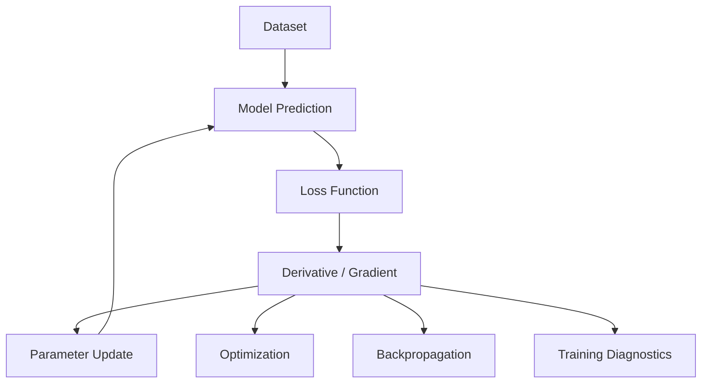
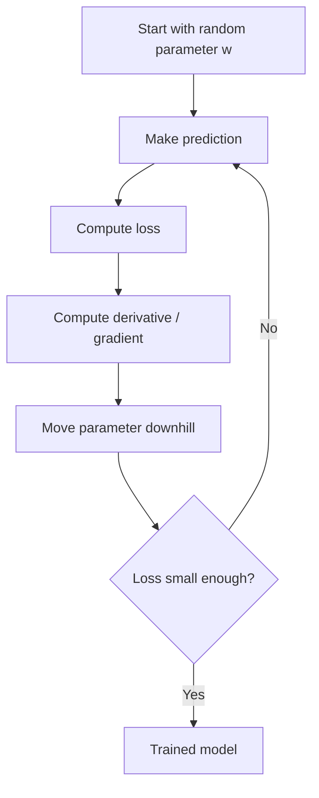

# 016 - Differential Calculus

**Course:** 01 - Math, Statistics and Econometrics
**Module:** Module 01 - Mathematics for AI and Data Science
**Content Group:** Analysis and ML Math
**Roadmap Source:** Mathematics for AI and Data Science / Analysis and ML Math
**Lesson Type:** Mathematics
**Order in Module:** 016
**Suggested Duration:** 24 minutes

---

## 1. Summary

This lesson explains **Differential Calculus** in the context of **AI and Data Science**.

Differential calculus studies how quantities change. In machine learning, this is one of the most important mathematical tools because models are trained by measuring how the loss changes when model parameters change.

After this lesson, you should understand how differential calculus helps answer questions such as:

* How does the model output change when an input changes?
* How does the loss change when a weight changes?
* Which direction should the model parameters move to reduce error?
* Why do gradients drive neural network training?
* How can we approximate a complex function near a point?

---

## 2. Learning Objectives

By the end of this lesson, you should be able to:

* Explain **Differential Calculus** in your own words.
* Understand how derivatives describe local change.
* Connect derivatives, gradients, Jacobians, and Hessians to ML workflows.
* Use differential calculus to reason about optimization and model training.
* Implement a small Python demo that checks derivative behavior numerically.
* Relate this topic to datasets, models, loss functions, metrics, and experiments.

---

## 3. Core Idea

Differential calculus is the mathematics of **local change**.

If a function is written as:

[
y = f(x)
]

then the derivative tells us how much (y) changes when (x) changes slightly:

[
\frac{dy}{dx}
]

In machine learning, we often care about a loss function:

[
L(\theta)
]

where:

* (L) is the loss.
* (\theta) represents model parameters.
* The derivative tells us how changing the parameters affects the loss.

The main optimization question is:

> Which direction should we move the parameters to make the loss smaller?

---

## 4. Intuition

A derivative measures the **slope** of a function at a point.

If the slope is positive, the function is increasing.
If the slope is negative, the function is decreasing.
If the slope is zero, the function may be at a minimum, maximum, or flat region.

```text
Positive slope       Zero slope          Negative slope

     /                  ----                  \
    /                                         \
   /                                           \
```

For optimization, we usually want to move **against the slope** to reduce the loss.

```text
Current parameter
       |
       v
Loss surface:       \ 
                     \
                      \____ minimum

Move downhill to reduce loss.
```

---

## 5. Where Differential Calculus Appears in AI and Data Science

Differential calculus appears in almost every part of model training.



Examples:

| ML Concept                    | Differential Calculus Role                |
| ----------------------------- | ----------------------------------------- |
| Linear Regression             | Minimize MSE loss                         |
| Logistic Regression           | Optimize cross-entropy loss               |
| Neural Networks               | Backpropagation uses derivatives          |
| Gradient Descent              | Uses gradients to update weights          |
| PCA / Representation Learning | Uses matrix calculus and optimization     |
| Embeddings                    | Optimized through gradient-based learning |
| Model Debugging               | Explains vanishing/exploding gradients    |

---

## 6. Key Concepts

### 6.1 Derivative

For a single-variable function:

[
f(x) = x^2
]

the derivative is:

[
f'(x) = 2x
]

This means the slope changes depending on the value of (x).

Example:

[
f'(3) = 2 \times 3 = 6
]

So at (x = 3), the function is increasing with slope 6.

---

### 6.2 Differential

A differential represents a very small change.

If:

[
y = f(x)
]

then:

[
dy \approx f'(x)dx
]

This means:

> A small change in (x) creates an approximate change in (y).

In ML, this is useful because we often ask:

> If I slightly change a model weight, how much will the loss change?

---

### 6.3 Partial Derivative

For a function with many variables:

[
f(x, y) = x^2 + y^2
]

The partial derivatives are:

[
\frac{\partial f}{\partial x} = 2x
]

[
\frac{\partial f}{\partial y} = 2y
]

Each partial derivative measures the effect of changing one variable while keeping the others fixed.

---

### 6.4 Gradient

The gradient is a vector of partial derivatives.

For:

[
f(x, y) = x^2 + y^2
]

the gradient is:

[
\nabla f(x, y) =
\begin{bmatrix}
2x \
2y
\end{bmatrix}
]

The gradient points in the direction of steepest increase.

For minimizing loss, we move in the opposite direction:

[
\theta_{new} = \theta_{old} - \alpha \nabla L(\theta)
]

where:

* (\theta) = model parameters
* (\alpha) = learning rate
* (\nabla L(\theta)) = gradient of the loss

---

### 6.5 Chain Rule

The chain rule explains how to differentiate composed functions.

If:

[
z = f(g(x))
]

then:

[
\frac{dz}{dx} = f'(g(x))g'(x)
]

This is the mathematical foundation of **backpropagation** in neural networks.

```mermaid
flowchart LR
    X[Input x] --> G[g(x)]
    G --> F[f(g(x))]
    F --> Z[Output z]

    Z -->|gradient backward| F
    F -->|chain rule| G
    G -->|chain rule| X
```

---

### 6.6 Jacobian

The Jacobian generalizes derivatives to vector-valued functions.

If:

[
f: \mathbb{R}^n \rightarrow \mathbb{R}^m
]

then the Jacobian stores all first-order partial derivatives.

It is useful in:

* Neural network layers
* Transformations
* Feature mappings
* Sensitivity analysis
* Backpropagation

---

### 6.7 Hessian

The Hessian stores second-order derivatives.

It tells us about curvature:

[
H =
\begin{bmatrix}
\frac{\partial^2 f}{\partial x^2} & \frac{\partial^2 f}{\partial x \partial y} \
\frac{\partial^2 f}{\partial y \partial x} & \frac{\partial^2 f}{\partial y^2}
\end{bmatrix}
]

In ML, Hessians are useful for understanding:

* Curvature of the loss surface
* Optimization difficulty
* Sharp vs flat minima
* Second-order optimization methods

---

## 7. Small Numeric Example

Suppose we have:

[
f(x) = x^2
]

At:

[
x = 3
]

The derivative is:

[
f'(x) = 2x
]

So:

[
f'(3) = 6
]

Now use a small change:

[
dx = 0.01
]

Approximate change:

[
dy \approx f'(3)dx = 6 \times 0.01 = 0.06
]

Actual change:

[
f(3.01) - f(3) = 3.01^2 - 3^2
]

[
= 9.0601 - 9 = 0.0601
]

The approximation is very close.

```text
Derivative approximation: 0.0600
Actual function change:   0.0601
```

This is the core idea behind local approximation.

---

## 8. Python Check

```python
def f(x):
    return x ** 2

x = 3
dx = 0.01

derivative = 2 * x
approx_change = derivative * dx
actual_change = f(x + dx) - f(x)

print("Derivative:", derivative)
print("Approximate change:", approx_change)
print("Actual change:", actual_change)
```

Expected output:

```text
Derivative: 6
Approximate change: 0.06
Actual change: 0.060099999999999376
```

---

## 9. ML Example: MSE Loss

For a simple prediction problem:

[
\hat{y} = wx
]

The Mean Squared Error loss for one data point is:

[
L(w) = (wx - y)^2
]

Derivative with respect to (w):

[
\frac{dL}{dw} = 2(wx - y)x
]

This tells us how the loss changes when the weight (w) changes.

Gradient descent update:

[
w_{new} = w_{old} - \alpha \frac{dL}{dw}
]

This is the basic idea behind model training.

---

## 10. Mini Demo: Gradient Descent from Scratch

```python
import numpy as np
import matplotlib.pyplot as plt

# Simple dataset: y = 2x
x = np.array([1, 2, 3, 4], dtype=float)
y = np.array([2, 4, 6, 8], dtype=float)

w = 0.0
learning_rate = 0.01
epochs = 100

loss_history = []

for epoch in range(epochs):
    y_pred = w * x
    loss = np.mean((y_pred - y) ** 2)
    
    # d/dw MSE = mean(2 * (wx - y) * x)
    grad = np.mean(2 * (y_pred - y) * x)
    
    w = w - learning_rate * grad
    loss_history.append(loss)

print("Final weight:", w)

plt.plot(loss_history)
plt.xlabel("Epoch")
plt.ylabel("MSE Loss")
plt.title("Loss Curve")
plt.show()
```

Expected behavior:

```text
The weight should move closer to 2.
The loss should decrease over epochs.
```

---

## 11. Visual Intuition for Gradient Descent



Gradient descent is not magic. It is just repeated local improvement using derivatives.

---

## 12. Practical Use Cases

### Use Case 1: Debugging Training Behavior

If the loss does not decrease, possible causes include:

* Learning rate is too high.
* Learning rate is too low.
* Gradients are exploding.
* Gradients are vanishing.
* Loss function is not implemented correctly.
* Data is not normalized.
* Model is too simple or too complex.

---

### Use Case 2: Understanding Neural Networks

Each neural network layer is a function.

```text
Input -> Linear Layer -> Activation -> Output -> Loss
```

Backpropagation computes how the loss changes with respect to each parameter.

```text
Loss gradient
    ↓
Output layer
    ↓
Hidden layers
    ↓
Weights and biases
```

---

### Use Case 3: Feature Sensitivity

Differential calculus can help answer:

> If this feature changes slightly, how much does the prediction change?

This is useful for:

* Model interpretation
* Sensitivity analysis
* Risk modeling
* Feature importance
* Debugging unstable predictions

---

## 13. Common Mistakes

### Mistake 1: Memorizing formulas without intuition

Do not only memorize:

[
\frac{d}{dx}x^2 = 2x
]

Understand that it means:

> The function changes faster when (x) becomes larger.

---

### Mistake 2: Confusing derivative and gradient

A derivative is usually for one input variable.

A gradient is a vector of partial derivatives for many variables.

```text
Derivative: one direction
Gradient: many directions
```

---

### Mistake 3: Ignoring the learning rate

Even with the correct gradient, training can fail if the learning rate is wrong.

```text
Too small: training is very slow
Too large: training becomes unstable
```

---

### Mistake 4: Assuming zero gradient always means good result

A zero gradient can mean:

* Minimum
* Maximum
* Saddle point
* Flat region

In deep learning, saddle points and flat regions are common.

---

### Mistake 5: Skipping validation

A tiny demo may work, but real ML systems need validation.

Always check:

* Training loss
* Validation loss
* Metrics
* Data leakage
* Overfitting
* Underfitting

---

## 14. Practice Exercises

### Exercise 1: Manual Derivative

Given:

[
f(x) = 3x^2 + 2x + 1
]

Find:

[
f'(x)
]

Then calculate:

[
f'(4)
]

---

### Exercise 2: Numerical Approximation

Use:

[
f(x) = x^3
]

At:

[
x = 2
]

Compare:

[
f'(2)dx
]

with:

[
f(2 + dx) - f(2)
]

for:

[
dx = 0.01
]

---

### Exercise 3: Gradient of a Two-Variable Function

Given:

[
f(x, y) = x^2 + 3y^2
]

Find:

[
\nabla f(x, y)
]

Then calculate the gradient at:

[
x = 2, y = 1
]

---

### Exercise 4: ML Loss Derivative

Given:

[
\hat{y} = wx
]

[
L(w) = (wx - y)^2
]

Derive:

[
\frac{dL}{dw}
]

Then test it with:

```text
x = 2
y = 6
w = 1
```

---

### Exercise 5: Build a Small Artifact

Create a notebook that includes:

* One simple function
* Its derivative
* A numerical derivative check
* A plot of the function
* A gradient descent example
* A short explanation of how this relates to ML training

---

## 15. Completion Checklist

You have completed this lesson if you can:

* Explain **Differential Calculus** in 1-2 minutes.
* Explain why derivatives are useful for optimization.
* Describe the relationship between derivative, partial derivative, and gradient.
* Explain how gradient descent uses derivatives.
* Write a small Python script to verify a derivative numerically.
* Connect this topic to loss functions, model parameters, and training loops.
* Identify at least one caveat, assumption, or limitation.
* Produce one artifact such as a notebook, chart, experiment, or portfolio note.

---

## 16. Related Outcome

This lesson supports the broader outcome:

> Understand the mathematical language behind vectors, optimization, gradients, PCA, neural networks, and embeddings.

Differential calculus is especially important for:

* Optimization
* Gradient descent
* Backpropagation
* Loss minimization
* Neural network training
* Model sensitivity analysis

---

## 17. Related Mini Project

### Mini Project: Gradient Descent from Scratch with MSE Loss

Build a small notebook that trains a one-parameter linear model:

[
\hat{y} = wx
]

Use MSE loss:

[
L(w) = \frac{1}{n}\sum_{i=1}^{n}(wx_i - y_i)^2
]

Implement:

1. Dataset creation
2. Prediction function
3. MSE loss function
4. Gradient calculation
5. Parameter update
6. Loss curve over epochs
7. Final explanation of what happened

Expected artifact:

```text
gradient_descent_from_scratch.ipynb
```

Portfolio note:

```text
I implemented gradient descent from scratch using differential calculus.
The derivative of the MSE loss tells the model how to update its weight.
The loss curve shows that the model improves over time.
```

---

## 18. Final Summary

**Differential Calculus** is a core milestone in the AI and Data Science roadmap.

It helps you understand how functions change, how models learn, and how optimization works. In machine learning, derivatives are not just abstract formulas. They are the mechanism that allows a model to reduce error and improve predictions.

The key idea is simple:

> Small changes in parameters create changes in loss. Differential calculus tells us how to choose better changes.

To make this knowledge practical, turn it into a small notebook, chart, model experiment, API, Docker service, or portfolio note.
