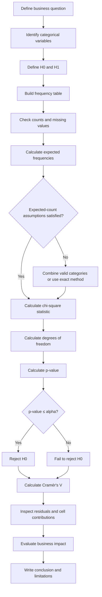

# 028 — Chi-Square Test

**Course:** 01 — Math, Statistics and Econometrics
**Module:** Module 02 — Statistics
**Content Group:** Testing and Experiments
**Roadmap Source:** Statistics / Testing and Experiments
**Lesson Type:** Statistics
**Order in Module:** 028
**Suggested Duration:** 24 minutes

---

## 1. Summary

A **chi-square test** is a statistical hypothesis test used mainly with **categorical data**.

It compares:

* Observed category frequencies.
* Expected category frequencies under a null hypothesis.

The central question is:

> Are the differences between observed and expected counts large enough to indicate a real pattern, or could they reasonably be explained by random sampling variation?

The chi-square statistic is:

[
\chi^2
======

\sum
\frac{(O-E)^2}{E}
]

where:

* (O) is an observed frequency.
* (E) is an expected frequency.
* The sum is taken over all categories or cells.

A larger chi-square statistic means that the observed counts are farther from the expected counts.

In AI and Data Science, chi-square tests can help answer questions such as:

* Is device type associated with conversion?
* Is churn status associated with subscription plan?
* Is a model's error type associated with demographic group?
* Does traffic allocation match the expected A/B test split?
* Has the distribution of a categorical feature changed after deployment?
* Are customer segments independent of product preferences?
* Does an observed class distribution match an expected distribution?

The general workflow is:

```text
Business question
      ↓
Categorical variables
      ↓
Observed frequency table
      ↓
Expected frequencies under H₀
      ↓
Chi-square statistic
      ↓
p-value
      ↓
Statistical conclusion
      ↓
Business decision
```

---

## 2. Learning Objectives

After completing this lesson, you should be able to:

* Explain the chi-square test in your own words.
* Identify categorical variables.
* Distinguish between counts and percentages.
* Build a contingency table.
* Calculate expected frequencies.
* Calculate the chi-square statistic.
* Interpret degrees of freedom.
* Interpret a p-value.
* Perform a chi-square goodness-of-fit test.
* Perform a chi-square test of independence.
* Understand the chi-square test of homogeneity.
* Check the assumptions of a chi-square test.
* Distinguish statistical significance from business significance.
* Measure association strength with Cramér's (V).
* Implement chi-square tests in Python.
* Apply chi-square testing to A/B experiments, model evaluation, and data-drift monitoring.

---

## 3. Why the Chi-Square Test Matters

A dashboard may show different percentages across categories.

For example:

| Device  | Converted | Did not convert |
| ------- | --------: | --------------: |
| Mobile  |       420 |           3,580 |
| Desktop |       600 |           3,400 |
| Tablet  |        90 |             910 |

Desktop users appear to convert more often than mobile or tablet users.

However, the observed difference may be caused by random variation.

A chi-square test helps answer:

> Is conversion behavior statistically associated with device type?

The test does not only compare percentages. It compares all observed counts against the counts expected if the variables were independent.

---

## 4. Categorical Data

A categorical variable places observations into groups or labels.

Examples include:

* Device type: mobile, desktop, tablet.
* Subscription plan: free, basic, premium.
* Model prediction: positive, negative.
* Actual class: fraud, legitimate.
* Region: north, south, central.
* Churn status: churned, retained.
* Error type: timeout, validation, authentication.
* Experiment group: control, treatment.

Categorical variables may be:

### Nominal

Categories have no natural order.

Examples:

```text
Browser:
Chrome, Firefox, Safari, Edge
```

### Ordinal

Categories have a meaningful order.

Examples:

```text
Satisfaction:
Low, Medium, High
```

The standard chi-square test uses category counts but does not directly use ordinal distance.

---

## 5. Observed and Expected Frequencies

The chi-square test compares two types of values.

### 5.1 Observed Frequency

The **observed frequency**, denoted by (O), is the actual number of observations in a category or table cell.

Example:

```text
Observed mobile conversions = 420
```

### 5.2 Expected Frequency

The **expected frequency**, denoted by (E), is the count expected if the null hypothesis is true.

Example:

```text
Expected mobile conversions under independence = 493.3
```

The chi-square test measures how different the observed counts are from these expected counts.

---

## 6. The Chi-Square Statistic

The chi-square statistic is:

[
\chi^2
======

\sum_{i=1}^{k}
\frac{(O_i-E_i)^2}{E_i}
]

where:

* (k) is the number of categories or cells.
* (O_i) is the observed frequency for category (i).
* (E_i) is the expected frequency for category (i).

Each cell contributes:

[
\frac{(O_i-E_i)^2}{E_i}
]

to the final statistic.

### Interpretation

* If (O_i) is close to (E_i), the cell contributes little.
* If (O_i) is far from (E_i), the cell contributes more.
* Squaring prevents positive and negative differences from canceling.
* Dividing by (E_i) scales the difference relative to the expected count.

---

## 7. Intuition Behind the Formula

Suppose a category has:

[
O=120
]

and:

[
E=100
]

Its contribution is:

[
\frac{(120-100)^2}{100}
=======================

# \frac{400}{100}

4
]

Another category has:

[
O=102
]

and:

[
E=100
]

Its contribution is:

[
\frac{(102-100)^2}{100}
=======================

# \frac{4}{100}

0.04
]

Therefore, a difference of 20 produces much stronger evidence against the null hypothesis than a difference of 2.

---

## 8. The Chi-Square Distribution

The test statistic follows a chi-square distribution under the null hypothesis:

[
X
\sim
\chi^2_{\nu}
]

where:

[
\nu
===

\text{degrees of freedom}
]

The chi-square distribution:

* Is always non-negative.
* Is right-skewed.
* Depends on the degrees of freedom.
* Becomes more symmetric as the degrees of freedom increase.

```text
Probability density
^
|\
| \
|  \
|   \__
|      \____
|______________> χ²
0
```

A large chi-square statistic lies farther in the right tail and provides stronger evidence against the null hypothesis.

---

## 9. Main Types of Chi-Square Tests

The three common chi-square tests are:

| Test                 | Main question                                                   |
| -------------------- | --------------------------------------------------------------- |
| Goodness-of-fit test | Does one categorical variable follow an expected distribution?  |
| Test of independence | Are two categorical variables associated?                       |
| Test of homogeneity  | Do multiple populations have the same categorical distribution? |

The formulas are similar, but the research questions and data-collection designs differ.

---

# Part I — Chi-Square Goodness-of-Fit Test

## 10. Goodness-of-Fit Test

A **chi-square goodness-of-fit test** determines whether the observed distribution of one categorical variable matches an expected distribution.

Example questions:

* Does traffic follow a planned 50/50 A/B allocation?
* Are customer support tickets equally distributed across weekdays?
* Does a six-sided die behave fairly?
* Does a model receive classes in the expected production proportions?
* Does a category distribution match a historical baseline?

---

## 11. Goodness-of-Fit Hypotheses

Suppose a categorical variable has (k) possible categories.

The null hypothesis is:

[
H_0:
p_1=p_{1,0},
\quad
p_2=p_{2,0},
\quad
\dots,
\quad
p_k=p_{k,0}
]

This means that the population proportions follow the expected distribution.

The alternative hypothesis is:

[
H_1:
\text{At least one population proportion differs}
]

---

## 12. Expected Counts for Goodness-of-Fit

If the expected proportion for category (i) is (p_i), then:

[
E_i=np_i
]

where:

* (n) is the total sample size.
* (p_i) is the expected probability for category (i).

The expected probabilities must satisfy:

[
\sum_{i=1}^{k}p_i=1
]

The expected counts must satisfy:

[
\sum_{i=1}^{k}E_i=n
]

---

## 13. Goodness-of-Fit Degrees of Freedom

When all expected probabilities are specified in advance:

[
df=k-1
]

where (k) is the number of categories.

If one or more parameters are estimated from the sample, the degrees of freedom may need to be reduced:

[
df
==

k-1-m
]

where (m) is the number of estimated parameters.

---

## 14. Example: A/B Test Sample Ratio Mismatch

Suppose an experiment is designed to allocate users equally:

```text
Control:   50%
Treatment: 50%
```

The observed assignment is:

| Group     | Observed users |
| --------- | -------------: |
| Control   |          5,300 |
| Treatment |          4,700 |
| **Total** |     **10,000** |

The expected counts under a 50/50 allocation are:

[
E_{\text{control}}
==================

# 10{,}000(0.50)

5{,}000
]

[
E_{\text{treatment}}
====================

# 10{,}000(0.50)

5{,}000
]

---

### 14.1 Define the Hypotheses

[
H_0:
p_{\text{control}}=0.50
]

and:

[
p_{\text{treatment}}=0.50
]

The alternative is that the observed allocation does not follow the planned allocation.

---

### 14.2 Calculate the Chi-Square Statistic

[
\chi^2
======

\frac{(5300-5000)^2}{5000}
+
\frac{(4700-5000)^2}{5000}
]

# [

\frac{300^2}{5000}
+
\frac{(-300)^2}{5000}
]

# [

\frac{90{,}000}{5000}
+
\frac{90{,}000}{5000}
]

[
=18+18
]

[
\chi^2=36
]

---

### 14.3 Degrees of Freedom

There are two categories:

[
k=2
]

Therefore:

[
df=k-1=1
]

A chi-square statistic of 36 with one degree of freedom produces a very small p-value.

We reject the null hypothesis.

---

### 14.4 Business Interpretation

The observed assignment differs significantly from the intended 50/50 split.

This may indicate:

* Broken randomization.
* Feature eligibility differences.
* Logging errors.
* Bots or duplicate users.
* Platform-specific bugs.
* Exposure failures.
* Missing events.

The team should not trust the A/B test result until the allocation issue is investigated.

---

## 15. Example: Expected Class Distribution

Suppose an image-classification system historically processes:

| Class | Expected proportion |
| ----- | ------------------: |
| Cat   |                 50% |
| Dog   |                 30% |
| Bird  |                 20% |

In a new production sample of 1,000 images, the observed counts are:

| Class | Observed |
| ----- | -------: |
| Cat   |      430 |
| Dog   |      350 |
| Bird  |      220 |

Expected counts:

[
E_{\text{cat}}
==============

# 1000(0.50)

500
]

[
E_{\text{dog}}
==============

# 1000(0.30)

300
]

[
E_{\text{bird}}
===============

# 1000(0.20)

200
]

The chi-square statistic is:

[
\chi^2
======

\frac{(430-500)^2}{500}
+
\frac{(350-300)^2}{300}
+
\frac{(220-200)^2}{200}
]

# [

\frac{4900}{500}
+
\frac{2500}{300}
+
\frac{400}{200}
]

# [

9.8+8.333+2
]

[
\chi^2\approx20.133
]

Degrees of freedom:

[
df=3-1=2
]

The large statistic suggests that the current class distribution differs from the expected baseline.

This may be evidence of **categorical data drift**.

---

# Part II — Chi-Square Test of Independence

## 16. Test of Independence

A **chi-square test of independence** determines whether two categorical variables are associated within one population.

Example questions:

* Is device type associated with conversion?
* Is subscription plan associated with churn?
* Is region associated with preferred payment method?
* Is model error type associated with customer segment?
* Is experiment group associated with conversion outcome?
* Is browser type associated with checkout failure?

---

## 17. Independence Hypotheses

For two categorical variables (A) and (B):

[
H_0:
A \text{ and } B \text{ are independent}
]

[
H_1:
A \text{ and } B \text{ are associated}
]

Independence means:

[
P(A_i \cap B_j)
===============

P(A_i)P(B_j)
]

for every pair of categories (i) and (j).

---

## 18. Contingency Table

A **contingency table** displays frequencies for combinations of two categorical variables.

Example:

| Device    | Converted | Not converted |     Total |
| --------- | --------: | ------------: | --------: |
| Mobile    |       420 |         3,580 |     4,000 |
| Desktop   |       600 |         3,400 |     4,000 |
| Tablet    |        90 |           910 |     1,000 |
| **Total** | **1,110** |     **7,890** | **9,000** |

The table has:

* (r=3) rows.
* (c=2) columns.
* (N=9000) observations.

---

## 19. Expected Counts for Independence

For cell ((i,j)), the expected frequency is:

[
E_{ij}
======

\frac{
(\text{row total}_i)
(\text{column total}_j)
}{
\text{grand total}
}
]

This formula reflects what would be expected if the row and column variables were independent.

---

## 20. Calculating Expected Counts

For mobile users who converted:

[
E_{\text{mobile, converted}}
============================

\frac{
4000\times1110
}{
9000
}
]

# [

493.333
]

For mobile users who did not convert:

[
E_{\text{mobile, not converted}}
================================

\frac{
4000\times7890
}{
9000
}
]

# [

3506.667
]

For desktop users who converted:

[
E_{\text{desktop, converted}}
=============================

\frac{
4000\times1110
}{
9000
}
=

493.333
]

For tablet users who converted:

[
E_{\text{tablet, converted}}
============================

\frac{
1000\times1110
}{
9000
}
]

# [

123.333
]

The complete expected table is approximately:

| Device  | Converted | Not converted |
| ------- | --------: | ------------: |
| Mobile  |    493.33 |      3,506.67 |
| Desktop |    493.33 |      3,506.67 |
| Tablet  |    123.33 |        876.67 |

---

## 21. Chi-Square Statistic for a Contingency Table

For an (r\times c) table:

[
\chi^2
======

\sum_{i=1}^{r}
\sum_{j=1}^{c}
\frac{(O_{ij}-E_{ij})^2}{E_{ij}}
]

Each cell contributes to the total statistic.

For example, the mobile-converted contribution is:

[
\frac{(420-493.33)^2}{493.33}
]

[
\approx10.899
]

The desktop-converted contribution is:

[
\frac{(600-493.33)^2}{493.33}
]

[
\approx23.063
]

Cells with large observed-versus-expected differences dominate the final statistic.

---

## 22. Degrees of Freedom for Independence

For an (r\times c) contingency table:

[
df
==

(r-1)(c-1)
]

For the device and conversion table:

[
r=3
]

[
c=2
]

Therefore:

[
df
==

(3-1)(2-1)
]

[
df=2
]

---

## 23. Decision Rule

The p-value is calculated from:

[
P
\left(
\chi^2_{df}
\geq
\chi^2_{\text{observed}}
\right)
]

Decision rule:

[
p\leq\alpha
\quad\Longrightarrow\quad
\text{Reject }H_0
]

[
p>\alpha
\quad\Longrightarrow\quad
\text{Fail to reject }H_0
]

For a typical significance level:

[
\alpha=0.05
]

a small p-value indicates evidence of an association between the categorical variables.

---

## 24. Important Interpretation

A significant chi-square test shows that an association exists.

It does **not** show:

* Which variable causes the other.
* Why the association exists.
* Whether the association is strong.
* Whether the association is commercially important.
* Which specific categories are responsible without further analysis.

Therefore:

```text
Significant chi-square test
          ↓
Evidence of association
          ↓
Inspect residuals and effect size
          ↓
Evaluate practical meaning
```

---

# Part III — Chi-Square Test of Homogeneity

## 25. Test of Homogeneity

A **chi-square test of homogeneity** determines whether multiple populations share the same categorical distribution.

Example:

A company samples users from three countries and records their preferred subscription plan.

The question is:

> Is the subscription-plan distribution the same across the three countries?

The mathematical calculation is the same as the test of independence.

The primary difference is the data-collection design.

---

## 26. Independence Versus Homogeneity

| Feature               | Independence test                      | Homogeneity test                           |
| --------------------- | -------------------------------------- | ------------------------------------------ |
| Number of populations | One                                    | Two or more                                |
| Sampling design       | One sample classified by two variables | Separate samples from populations          |
| Main question         | Are two variables associated?          | Do populations have the same distribution? |
| Calculation           | Chi-square contingency table           | Chi-square contingency table               |

Example of independence:

```text
Sample one group of users.
Measure device and conversion.
```

Example of homogeneity:

```text
Sample users separately from Vietnam, Thailand, and Singapore.
Compare payment-method distributions.
```

---

# Part IV — Assumptions

## 27. Assumptions of the Chi-Square Test

A chi-square test is reliable only when its assumptions are reasonably satisfied.

---

### 27.1 Categorical Data

The variables should represent categories.

Appropriate examples:

* Yes or no.
* Mobile, desktop, or tablet.
* Free, basic, or premium.
* Fraud, legitimate, or review.

A continuous variable should usually be analyzed with a method designed for continuous data.

Converting continuous values into arbitrary categories may discard information.

---

### 27.2 Frequency Counts

The input should be counts, not percentages, rates, or averages.

Correct:

| Category | Count |
| -------- | ----: |
| A        |   120 |
| B        |    90 |
| C        |    70 |

Incorrect input:

| Category | Percentage |
| -------- | ---------: |
| A        |      42.9% |
| B        |      32.1% |
| C        |      25.0% |

The test can calculate percentages from counts, but it needs the underlying sample size.

---

### 27.3 Mutually Exclusive Categories

Each observation should belong to only one category for each variable.

For example:

```text
One user cannot simultaneously be classified as both
"converted" and "not converted".
```

Overlapping categories violate the table structure.

---

### 27.4 Independent Observations

Each observation should contribute to only one table cell.

Potential violations include:

* The same user appears multiple times.
* Multiple sessions from one user are treated as independent.
* Repeated measurements are placed in the same table.
* Members of the same household influence each other.
* Transactions are clustered within stores.

If users appear multiple times, the effective sample size may be much smaller than the event count.

---

### 27.5 Random or Representative Sampling

The sample should reasonably represent the population of interest.

Bias may occur when:

* Only highly active users are included.
* Only one platform is sampled.
* Missing events are ignored.
* Failed requests are removed.
* Only successful model predictions are retained.
* Some geographic regions are excluded.

A large biased sample can produce a highly significant but misleading result.

---

### 27.6 Sufficient Expected Frequencies

The chi-square approximation requires expected counts that are not too small.

A common rule of thumb is:

* No expected count should be less than 1.
* At least 80% of expected counts should be at least 5.

A stricter practical guideline is:

[
E_{ij}\geq5
]

for every cell.

When expected counts are too small, possible solutions include:

* Collect more data.
* Combine logically similar categories.
* Use Fisher's exact test.
* Use an exact multinomial test.
* Use a Monte Carlo procedure.

Do not combine categories only to obtain significance.

---

## 28. Sample Size and Statistical Sensitivity

The chi-square statistic often increases with sample size.

Suppose two variables have only a tiny association.

With a small sample, the test may not detect it.

With millions of observations, the test may produce:

[
p<0.001
]

even when the practical difference is negligible.

Therefore, always consider:

* Sample size.
* Effect size.
* Category-level percentages.
* Business consequences.
* Confidence intervals where appropriate.

---

# Part V — Effect Size

## 29. Why the p-Value Is Not Enough

A p-value answers:

> Is the observed association unlikely under the null hypothesis?

It does not answer:

> How strong is the association?

A large dataset can make a weak association statistically significant.

Effect-size measures help quantify association strength.

---

## 30. Phi Coefficient

For a (2\times2) contingency table, the **phi coefficient** is:

[
\phi
====

\sqrt{
\frac{\chi^2}{n}
}
]

where:

* (\chi^2) is the chi-square statistic.
* (n) is the total number of observations.

The phi coefficient ranges approximately from:

[
0\leq\phi\leq1
]

for a standard (2\times2) table.

A value near zero indicates weak association.

---

## 31. Cramér's V

For larger contingency tables, use **Cramér's (V)**:

[
V
=

\sqrt{
\frac{
\chi^2
}{
n\min(r-1,c-1)
}
}
]

where:

* (n) is the total sample size.
* (r) is the number of rows.
* (c) is the number of columns.

Its range is:

[
0\leq V\leq1
]

General interpretation guidelines are sometimes given as:

|  Cramér's (V) | Approximate interpretation |
| ------------: | -------------------------- |
| (0.00)–(0.10) | Negligible or very weak    |
| (0.10)–(0.30) | Weak                       |
| (0.30)–(0.50) | Moderate                   |
|       (>0.50) | Strong                     |

These are only rough guidelines.

The practical meaning depends on the domain, table size, sample size, and business context.

---

## 32. Example of Cramér's V

Suppose:

[
\chi^2=50
]

[
n=5000
]

and the table has:

[
r=3,\qquad c=2
]

Then:

[
\min(r-1,c-1)
=============

# \min(2,1)

1
]

Therefore:

[
V
=

\sqrt{
\frac{50}{5000}
}
]

# [

\sqrt{0.01}
]

[
V=0.10
]

The result may be statistically significant, but the association is relatively weak.

---

# Part VI — Cell-Level Diagnostics

## 33. Pearson Residuals

After a significant chi-square result, inspect which cells contribute most strongly.

The Pearson residual for cell ((i,j)) is:

[
R_{ij}
======

\frac{O_{ij}-E_{ij}}
{\sqrt{E_{ij}}}
]

Interpretation:

* Positive residual: observed count is higher than expected.
* Negative residual: observed count is lower than expected.
* Larger absolute residual: stronger cell-level deviation.

A rough interpretation is:

[
|R_{ij}|>2
]

may indicate a notable deviation.

However, when many cells are inspected, multiple-comparison concerns should be considered.

---

## 34. Standardized Residuals

A more adjusted residual can account for row and column proportions:

[
R_{ij}^{*}
==========

\frac{
O_{ij}-E_{ij}
}{
\sqrt{
E_{ij}
(1-p_{i\cdot})
(1-p_{\cdot j})
}
}
]

where:

* (p_{i\cdot}) is the row proportion.
* (p_{\cdot j}) is the column proportion.

Standardized residuals are useful for identifying which cells drive the overall association.

---

## 35. Contribution of Each Cell

Each cell's contribution to the chi-square statistic is:

[
C_{ij}
======

\frac{(O_{ij}-E_{ij})^2}{E_{ij}}
]

The proportion of the total statistic contributed by a cell is:

[
\text{Contribution share}_{ij}
==============================

\frac{C_{ij}}{\chi^2}
]

Cells with large contribution shares deserve closer investigation.

---

## 36. Residual Analysis Workflow

```text
Overall chi-square test
          ↓
Is the result significant?
          ↓
       Yes
          ↓
Calculate expected counts
          ↓
Calculate residuals
          ↓
Identify unusual cells
          ↓
Check effect size
          ↓
Interpret business meaning
```

---

# Part VII — Chi-Square and A/B Testing

## 37. Conversion Outcome by Experiment Group

A binary A/B test can be represented as:

| Group     | Converted | Not converted |
| --------- | --------: | ------------: |
| Control   |       500 |         4,500 |
| Treatment |       575 |         4,425 |

The chi-square test asks:

> Is conversion outcome independent of experiment group?

Hypotheses:

[
H_0:
\text{Experiment group and conversion are independent}
]

[
H_1:
\text{Experiment group and conversion are associated}
]

For a (2\times2) table, the chi-square test and the two-proportion z-test are closely related.

Without a continuity correction:

[
\chi^2=z^2
]

Therefore, both tests produce equivalent two-sided conclusions under the same assumptions.

---

## 38. z-Test Versus Chi-Square Test for A/B Testing

| Feature                    | Two-proportion z-test                 | Chi-square test                           |
| -------------------------- | ------------------------------------- | ----------------------------------------- |
| Main comparison            | Difference between two proportions    | Association between categorical variables |
| Common table size          | (2\times2)                            | Any (r\times c)                           |
| Direction                  | Can be one-sided or two-sided         | Usually non-directional                   |
| Statistic                  | (z)                                   | (\chi^2)                                  |
| Relationship in (2\times2) | (z^2=\chi^2)                          | (\chi^2=z^2)                              |
| Best use                   | Focused comparison of two proportions | General categorical association           |

Use a proportion z-test when the primary goal is to estimate and test a specific proportion difference.

Use a chi-square test when analyzing general categorical relationships or tables with more than two categories.

---

## 39. Multi-Variant Experiments

Suppose an experiment has three versions:

| Variant | Converted | Not converted |
| ------- | --------: | ------------: |
| A       |       500 |         4,500 |
| B       |       560 |         4,440 |
| C       |       610 |         4,390 |

A chi-square test can determine whether conversion depends on the experiment variant.

The hypotheses are:

[
H_0:
p_A=p_B=p_C
]

[
H_1:
\text{At least one conversion rate differs}
]

A significant result does not identify which pairs differ.

Follow-up pairwise comparisons may be needed:

* A versus B.
* A versus C.
* B versus C.

These comparisons should use a multiple-testing correction.

---

# Part VIII — Multiple Comparisons

## 40. The Multiple-Comparison Problem

Suppose the overall test is significant and the analyst compares many pairs of categories.

Testing many hypotheses increases the chance of false positives.

If (m) independent tests are performed at significance level (\alpha), the probability of at least one false positive is approximately:

[
1-(1-\alpha)^m
]

For:

[
m=10
]

and:

[
\alpha=0.05
]

the probability is:

[
1-0.95^{10}
]

[
\approx0.401
]

Therefore, there is approximately a 40.1% chance of at least one false positive under the global null.

---

## 41. Bonferroni Correction

The Bonferroni-adjusted significance threshold is:

[
\alpha_{\text{adjusted}}
========================

\frac{\alpha}{m}
]

For:

[
\alpha=0.05
]

and:

[
m=3
]

the adjusted threshold is:

[
\alpha_{\text{adjusted}}
========================

\frac{0.05}{3}
]

[
\approx0.0167
]

Bonferroni is simple but can be conservative.

Other methods include:

* Holm correction.
* Hochberg correction.
* Benjamini–Hochberg false-discovery-rate control.

---

# Part IX — Common Mistakes

## 42. Using Percentages Instead of Counts

Incorrect:

```text
Mobile conversion: 10.5%
Desktop conversion: 15.0%
Tablet conversion: 9.0%
```

A chi-square test requires the underlying counts.

A 15% conversion rate from 20 users is not equivalent to a 15% conversion rate from 20,000 users.

---

## 43. Ignoring Small Expected Counts

A result may be unreliable if expected cell counts are too low.

For example:

| Category       | Yes |  No |
| -------------- | --: | --: |
| Rare segment   |   1 |   2 |
| Common segment | 300 | 700 |

An exact test may be more appropriate than the chi-square approximation.

---

## 44. Treating Events as Independent Users

Suppose:

```text
2,000 users
10 sessions per user
20,000 sessions
```

The sessions are not necessarily 20,000 independent observations.

Using session-level counts may artificially inflate the sample size and produce an excessively small p-value.

The analysis unit should usually match the randomization or decision unit.

---

## 45. Concluding Causation from Association

A significant association does not imply causation.

For example:

```text
Device type is associated with conversion.
```

This does not prove that device type causes the conversion difference.

Possible confounders include:

* User demographics.
* Traffic source.
* Purchase intent.
* Page design.
* Network quality.
* Product availability.

---

## 46. Ignoring Effect Size

A very large dataset may produce:

[
p<0.0001
]

while:

[
V=0.02
]

This indicates a statistically detectable but extremely weak association.

The business impact may be negligible.

---

## 47. Combining Categories Arbitrarily

Categories should not be merged only to make the test significant or satisfy expected-count rules.

Category combination should be:

* Defined before inspecting results.
* Logically meaningful.
* Documented.
* Consistent with the business question.

---

## 48. Running Many Tests Without Correction

Testing:

* Every user segment.
* Every country.
* Every device.
* Every browser.
* Every model version.
* Every metric.

without correction creates a high false-positive risk.

---

## 49. Ignoring Missing Data

Missing values may form a meaningful category.

For example:

```text
Payment method:
Credit card
Bank transfer
Digital wallet
Missing
```

Removing missing observations may introduce bias if missingness is related to the outcome.

---

## 50. Reporting Only the p-Value

An incomplete report:

```text
The variables are associated because p < 0.05.
```

A stronger report includes:

* Observed counts.
* Expected counts.
* Percentages.
* Chi-square statistic.
* Degrees of freedom.
* p-value.
* Cramér's (V).
* Important residuals.
* Sample size.
* Business implications.
* Assumptions and limitations.

---

# Part X — Python Implementation

## 51. Goodness-of-Fit Test with SciPy

```python
import numpy as np
from scipy.stats import chisquare

observed = np.array([5300, 4700])
expected = np.array([5000, 5000])

chi2_statistic, p_value = chisquare(
    f_obs=observed,
    f_exp=expected,
)

print(f"Chi-square statistic: {chi2_statistic:.4f}")
print(f"p-value: {p_value:.6f}")
```

Expected result:

```text
Chi-square statistic: 36.0000
p-value: very small
```

---

## 52. Expected Counts from Proportions

```python
import numpy as np
from scipy.stats import chisquare

observed = np.array([430, 350, 220])

expected_proportions = np.array([
    0.50,
    0.30,
    0.20,
])

sample_size = observed.sum()

expected = (
    sample_size
    * expected_proportions
)

chi2_statistic, p_value = chisquare(
    f_obs=observed,
    f_exp=expected,
)

print("Observed counts:", observed)
print("Expected counts:", expected)
print(f"Chi-square statistic: {chi2_statistic:.4f}")
print(f"p-value: {p_value:.6f}")
```

---

## 53. Test of Independence with SciPy

```python
import numpy as np
from scipy.stats import chi2_contingency

observed = np.array([
    [420, 3580],
    [600, 3400],
    [90, 910],
])

chi2_statistic, p_value, degrees_of_freedom, expected = (
    chi2_contingency(
        observed,
        correction=False,
    )
)

print(f"Chi-square statistic: {chi2_statistic:.4f}")
print(f"Degrees of freedom: {degrees_of_freedom}")
print(f"p-value: {p_value:.6f}")
print("Expected frequencies:")
print(expected)
```

---

## 54. Yates Continuity Correction

For a (2\times2) contingency table, some implementations apply **Yates' continuity correction** by default.

The corrected statistic uses:

[
\chi^2
======

\sum
\frac{
\left(
|O-E|-0.5
\right)^2
}{
E
}
]

The correction reduces the statistic and makes the test more conservative.

In SciPy:

```python
chi2_statistic, p_value, dof, expected = (
    chi2_contingency(
        observed,
        correction=True,
    )
)
```

For large samples, the correction often makes little difference.

For small samples, Fisher's exact test may be preferable.

---

## 55. Building a Contingency Table with Pandas

```python
import pandas as pd

data = pd.DataFrame({
    "device": [
        "mobile",
        "mobile",
        "desktop",
        "desktop",
        "tablet",
        "tablet",
    ],
    "conversion": [
        "converted",
        "not_converted",
        "converted",
        "not_converted",
        "converted",
        "not_converted",
    ],
    "count": [
        420,
        3580,
        600,
        3400,
        90,
        910,
    ],
})

contingency_table = data.pivot(
    index="device",
    columns="conversion",
    values="count",
)

print(contingency_table)
```

For row-level event data:

```python
contingency_table = pd.crosstab(
    data["device"],
    data["converted"],
)
```

---

## 56. Cramér's V in Python

```python
from math import sqrt
import numpy as np
from scipy.stats import chi2_contingency


def cramers_v(
    contingency_table: np.ndarray,
) -> float:
    if contingency_table.ndim != 2:
        raise ValueError(
            "The contingency table must be two-dimensional."
        )

    if np.any(contingency_table < 0):
        raise ValueError(
            "Counts cannot be negative."
        )

    total = contingency_table.sum()

    if total == 0:
        raise ValueError(
            "The contingency table cannot be empty."
        )

    chi2_statistic, _, _, _ = chi2_contingency(
        contingency_table,
        correction=False,
    )

    rows, columns = contingency_table.shape

    denominator = total * min(
        rows - 1,
        columns - 1,
    )

    if denominator == 0:
        raise ValueError(
            "The table must contain at least "
            "two rows and two columns."
        )

    return sqrt(
        chi2_statistic / denominator
    )


observed = np.array([
    [420, 3580],
    [600, 3400],
    [90, 910],
])

effect_size = cramers_v(observed)

print(f"Cramér's V: {effect_size:.4f}")
```

---

## 57. Pearson Residuals in Python

```python
import numpy as np
from scipy.stats import chi2_contingency

observed = np.array([
    [420, 3580],
    [600, 3400],
    [90, 910],
])

chi2_statistic, p_value, dof, expected = (
    chi2_contingency(
        observed,
        correction=False,
    )
)

pearson_residuals = (
    observed - expected
) / np.sqrt(expected)

cell_contributions = (
    observed - expected
) ** 2 / expected

contribution_shares = (
    cell_contributions
    / chi2_statistic
)

print("Expected frequencies:")
print(expected)

print("\nPearson residuals:")
print(pearson_residuals)

print("\nCell contributions:")
print(cell_contributions)

print("\nContribution shares:")
print(contribution_shares)
```

---

## 58. Reusable Chi-Square Function

```python
from dataclasses import dataclass

import numpy as np
from scipy.stats import chi2_contingency


@dataclass
class ChiSquareResult:
    chi2_statistic: float
    p_value: float
    degrees_of_freedom: int
    expected_frequencies: np.ndarray
    pearson_residuals: np.ndarray
    cramers_v: float
    reject_null: bool


def chi_square_independence_test(
    observed: np.ndarray,
    alpha: float = 0.05,
    apply_yates_correction: bool = False,
) -> ChiSquareResult:
    observed = np.asarray(
        observed,
        dtype=float,
    )

    if observed.ndim != 2:
        raise ValueError(
            "Observed values must form a 2D table."
        )

    if observed.shape[0] < 2 or observed.shape[1] < 2:
        raise ValueError(
            "The table must have at least "
            "two rows and two columns."
        )

    if np.any(observed < 0):
        raise ValueError(
            "Observed frequencies cannot be negative."
        )

    if observed.sum() == 0:
        raise ValueError(
            "The table cannot be empty."
        )

    if not 0 < alpha < 1:
        raise ValueError(
            "alpha must be between 0 and 1."
        )

    (
        chi2_statistic,
        p_value,
        degrees_of_freedom,
        expected,
    ) = chi2_contingency(
        observed,
        correction=apply_yates_correction,
    )

    pearson_residuals = (
        observed - expected
    ) / np.sqrt(expected)

    total = observed.sum()
    rows, columns = observed.shape

    cramers_v = np.sqrt(
        chi2_statistic
        / (
            total
            * min(
                rows - 1,
                columns - 1,
            )
        )
    )

    return ChiSquareResult(
        chi2_statistic=chi2_statistic,
        p_value=p_value,
        degrees_of_freedom=degrees_of_freedom,
        expected_frequencies=expected,
        pearson_residuals=pearson_residuals,
        cramers_v=cramers_v,
        reject_null=p_value <= alpha,
    )


observed = np.array([
    [420, 3580],
    [600, 3400],
    [90, 910],
])

result = chi_square_independence_test(
    observed=observed,
    alpha=0.05,
)

print(result)
```

---

## 59. Checking Expected Counts

```python
expected = result.expected_frequencies

cells_below_5 = np.sum(
    expected < 5
)

proportion_at_least_5 = np.mean(
    expected >= 5
)

print(
    f"Cells below 5: {cells_below_5}"
)

print(
    "Proportion of expected cells at least 5: "
    f"{proportion_at_least_5:.2%}"
)
```

A warning can be generated when assumptions are not satisfied:

```python
if np.any(expected < 1):
    print(
        "Warning: At least one expected count is below 1."
    )

if np.mean(expected >= 5) < 0.80:
    print(
        "Warning: Fewer than 80% of expected counts "
        "are at least 5."
    )
```

---

# Part XI — Data Visualization

## 60. Heatmap of Observed Counts

```python
import matplotlib.pyplot as plt

observed_counts = contingency_table.to_numpy()

plt.imshow(
    observed_counts,
    aspect="auto",
)

plt.colorbar(
    label="Observed count",
)

plt.xticks(
    range(len(contingency_table.columns)),
    contingency_table.columns,
)

plt.yticks(
    range(len(contingency_table.index)),
    contingency_table.index,
)

plt.title(
    "Observed Frequencies"
)

plt.xlabel(
    "Conversion Outcome"
)

plt.ylabel(
    "Device Type"
)

plt.tight_layout()
plt.show()
```

---

## 61. Heatmap of Pearson Residuals

```python
import matplotlib.pyplot as plt

plt.imshow(
    pearson_residuals,
    aspect="auto",
)

plt.colorbar(
    label="Pearson residual",
)

plt.xticks(
    range(len(contingency_table.columns)),
    contingency_table.columns,
)

plt.yticks(
    range(len(contingency_table.index)),
    contingency_table.index,
)

plt.title(
    "Chi-Square Pearson Residuals"
)

plt.xlabel(
    "Conversion Outcome"
)

plt.ylabel(
    "Device Type"
)

plt.tight_layout()
plt.show()
```

Interpretation:

* Positive cells have more observations than expected.
* Negative cells have fewer observations than expected.
* Large absolute values identify important deviations.

---

## 62. Grouped Percentage Chart

Counts should be used for testing, but percentages are often easier to communicate.

```python
row_percentages = (
    contingency_table
    .div(
        contingency_table.sum(axis=1),
        axis=0,
    )
)

row_percentages.plot(
    kind="bar",
)

plt.title(
    "Outcome Distribution by Device Type"
)

plt.xlabel(
    "Device Type"
)

plt.ylabel(
    "Proportion"
)

plt.xticks(
    rotation=0,
)

plt.tight_layout()
plt.show()
```

A useful reporting combination is:

```text
Count table
    +
Percentage chart
    +
Chi-square test
    +
Effect size
    +
Residual analysis
```

---

# Part XII — Applications in AI and Data Science

## 63. Feature Selection for Classification

The chi-square test can assess whether a categorical feature is associated with a categorical target.

Example:

```text
Feature:
Subscription plan

Target:
Churned or retained
```

A significant association suggests that the feature may contain predictive information.

However, significance does not guarantee:

* High model importance.
* Strong out-of-sample performance.
* Causal relevance.
* Stability over time.

Feature selection should also consider:

* Validation performance.
* Leakage.
* Missingness.
* Cardinality.
* Production availability.
* Fairness.
* Drift.

---

## 64. Chi-Square Feature Selection in Scikit-Learn

Scikit-learn provides chi-square feature selection for non-negative features:

```python
from sklearn.feature_selection import chi2
from sklearn.feature_selection import SelectKBest

selector = SelectKBest(
    score_func=chi2,
    k=10,
)

X_selected = selector.fit_transform(
    X_train,
    y_train,
)

scores = selector.scores_
p_values = selector.pvalues_
```

Important:

The features must be non-negative.

This method is commonly used with:

* One-hot encoded categorical features.
* Word counts.
* Term-frequency features.
* Event-count features.

It should not be applied directly to standardized features containing negative values.

---

## 65. Text Classification

In text classification, chi-square scores can identify terms associated with labels.

Example:

```text
Words:
refund, invoice, login, password

Target:
billing, account_access, technical_support
```

A high chi-square score indicates that a term's occurrence differs strongly across target classes.

Possible uses:

* Feature ranking.
* Vocabulary reduction.
* Model interpretation.
* Dataset auditing.
* Class-specific keyword discovery.

---

## 66. Model Error Analysis

Suppose a model produces different error types:

* False positive.
* False negative.
* Correct positive.
* Correct negative.

A chi-square test can examine whether error type is associated with:

* Age group.
* Region.
* Device.
* Language.
* Customer segment.
* Product category.

Example question:

> Is model error type independent of language group?

A significant result may reveal:

* Data imbalance.
* Representation gaps.
* Label-quality issues.
* Domain shifts.
* Potential fairness concerns.

Statistical significance alone is not sufficient for a fairness conclusion.

---

## 67. Fairness Monitoring

A contingency table can compare decision outcomes across groups.

| Group   | Approved | Rejected |
| ------- | -------: | -------: |
| Group A |      820 |      180 |
| Group B |      700 |      300 |

A chi-square test can detect association between group membership and decision outcome.

However, a responsible fairness analysis may also require:

* Selection rates.
* False-positive rates.
* False-negative rates.
* Equalized odds.
* Calibration.
* Confounding controls.
* Legal and ethical review.
* Confidence intervals.
* Domain-specific thresholds.

---

## 68. Categorical Data Drift

Suppose a production model expects the following traffic distribution:

| Region  | Baseline |
| ------- | -------: |
| North   |      40% |
| Central |      25% |
| South   |      35% |

A new sample can be compared with the baseline using a goodness-of-fit test.

Hypotheses:

[
H_0:
\text{Current distribution matches baseline}
]

[
H_1:
\text{Current distribution differs from baseline}
]

A significant result may trigger:

* Data-quality inspection.
* Model-performance analysis.
* Retraining review.
* Regional monitoring.
* Pipeline debugging.

---

## 69. Sample Ratio Mismatch Monitoring

In experiments, a goodness-of-fit test can detect whether observed treatment allocation matches the planned split.

Examples:

```text
Expected:
50% control
50% treatment
```

or:

```text
Expected:
80% control
10% treatment A
10% treatment B
```

Sample ratio mismatch should be checked before analyzing the primary metric.

---

## 70. Classification Label Distribution

The test can compare:

* Training label distribution.
* Validation label distribution.
* Production label distribution.
* Predicted class distribution.
* Human-reviewed class distribution.

A significant difference may indicate:

* Sampling changes.
* Label drift.
* Selection bias.
* Changed user behavior.
* Broken data pipelines.

---

## 71. Recommendation Systems

A chi-square test can examine associations between:

* User segment and item category.
* Recommendation position and click outcome.
* Device type and content preference.
* Membership plan and purchase category.

Care is needed because users usually generate repeated interactions, violating the independence assumption.

User-level aggregation, cluster-aware methods, or mixed-effects models may be needed.

---

## 72. Deployment Monitoring

Examples of categorical production metrics include:

* HTTP status class.
* Error type.
* Model fallback reason.
* Moderation label.
* Fraud-decision category.
* Request source.
* Queue outcome.
* Retry state.

A chi-square test can compare current counts against:

* Historical baselines.
* Expected operational ratios.
* Pre-deployment distributions.
* Different model versions.

---

# Part XIII — When Not to Use a Chi-Square Test

## 73. Small Expected Counts

Use Fisher's exact test for a small (2\times2) table when expected counts are low.

```python
from scipy.stats import fisher_exact

table = [
    [1, 8],
    [7, 4],
]

odds_ratio, p_value = fisher_exact(
    table,
    alternative="two-sided",
)

print(f"Odds ratio: {odds_ratio:.4f}")
print(f"p-value: {p_value:.6f}")
```

---

## 74. Paired Categorical Data

A standard chi-square test assumes independent groups.

For paired binary data, such as predictions from two models on the same examples, use **McNemar's test**.

Example:

```text
Same test observations
        ↓
Model A prediction
Model B prediction
        ↓
Paired outcomes
```

A regular independence test would ignore the pairing.

---

## 75. Repeated Measures

If the same users are observed before and after an intervention, the observations are dependent.

Possible alternatives include:

* McNemar's test for paired binary outcomes.
* Cochran's (Q) test for more than two paired binary conditions.
* Generalized estimating equations.
* Mixed-effects logistic regression.

---

## 76. Continuous Outcomes

The chi-square test is not designed for comparing continuous means.

Examples of continuous metrics:

* Revenue.
* Latency.
* Session duration.
* Order value.
* Prediction error.

Possible alternatives include:

* t-test.
* ANOVA.
* Mann–Whitney U test.
* Kruskal–Wallis test.
* Linear regression.

---

## 77. Ordered Categories

The standard chi-square test ignores category order.

For an ordinal outcome such as:

```text
Low
Medium
High
```

other methods may use the ordering more efficiently:

* Trend tests.
* Ordinal logistic regression.
* Spearman correlation.
* Mantel–Haenszel procedures.

---

## 78. Confounded Relationships

A chi-square test evaluates unadjusted association.

Suppose conversion is associated with device type, but device type is also strongly related to country and traffic source.

A regression model may be needed:

[
\operatorname{logit}
\left(
P(Y=1)
\right)
=======

\beta_0
+
\beta_1X_1
+
\beta_2X_2
+
\dots
]

Logistic regression can estimate an association while controlling for additional variables.

---

# Part XIV — End-to-End Workflow

## 79. Chi-Square Analysis Workflow



---

## 80. Recommended Analysis Steps

1. Define the population and business question.
2. Identify the categorical variables.
3. Decide which chi-square test is appropriate.
4. Define the null and alternative hypotheses.
5. Choose the significance level.
6. Build the observed frequency table.
7. Check missing values and duplicate observations.
8. Calculate expected frequencies.
9. Check expected-count assumptions.
10. Calculate the chi-square statistic.
11. Calculate degrees of freedom.
12. Calculate the p-value.
13. Calculate effect size.
14. Inspect residuals.
15. Correct for multiple comparisons if necessary.
16. Evaluate practical significance.
17. Document limitations.
18. Write a business recommendation.

---

# Part XV — Reporting

## 81. Statistical Reporting Template

```text
Research question:
Is device type associated with conversion outcome?

Sample size:
9,000 users

Variables:
Device type: mobile, desktop, tablet
Outcome: converted, not converted

Test:
Chi-square test of independence

Null hypothesis:
Device type and conversion are independent.

Alternative hypothesis:
Device type and conversion are associated.

Result:
χ²(df = 2) = [statistic]
p = [p-value]

Effect size:
Cramér's V = [value]

Decision:
Reject / fail to reject the null hypothesis.

Interpretation:
The data provides / does not provide sufficient evidence
of an association between device type and conversion.

Important cells:
Desktop conversions were higher than expected,
while mobile conversions were lower than expected.

Business recommendation:
Investigate device-specific user experience, but avoid
concluding that device type causes the difference.

Limitations:
Observations were assumed to be independent.
The result may be affected by traffic source,
country, user intent, and repeated users.
```

---

## 82. Concise Business Conclusion

```text
Conversion outcome was statistically associated with device type.

Desktop users converted more often than expected under independence,
while mobile users converted less often than expected.

However, the association should be quantified with Cramér's V and
investigated for confounding factors such as traffic source,
country, page performance, and customer intent before product changes
are recommended.
```

---

# Part XVI — Practical Exercise

## 83. Exercise: Subscription Plan and Churn

A company records the following data:

| Subscription plan | Churned | Retained |
| ----------------- | ------: | -------: |
| Free              |     320 |      680 |
| Basic             |     180 |      820 |
| Premium           |      75 |      925 |

Use:

[
\alpha=0.05
]

### Tasks

1. Identify the two categorical variables.
2. Define (H_0) and (H_1).
3. Calculate row totals.
4. Calculate column totals.
5. Calculate the grand total.
6. Calculate every expected frequency.
7. Check whether expected counts satisfy the assumptions.
8. Calculate the chi-square statistic.
9. Calculate the degrees of freedom.
10. Calculate the p-value.
11. State the statistical decision.
12. Calculate Cramér's (V).
13. Calculate Pearson residuals.
14. Identify which cells contribute most strongly.
15. Write a business interpretation.
16. Explain why association does not imply causation.
17. List at least three possible confounders.
18. Recommend one follow-up analysis.

---

## 84. Exercise: Data Drift

A production system expects:

| Category | Expected proportion |
| -------- | ------------------: |
| A        |                 45% |
| B        |                 30% |
| C        |                 15% |
| D        |                 10% |

A new sample of 2,000 observations contains:

| Category | Observed count |
| -------- | -------------: |
| A        |            820 |
| B        |            660 |
| C        |            310 |
| D        |            210 |

### Tasks

1. Calculate the expected count for each category.
2. Define the hypotheses.
3. Calculate the chi-square statistic.
4. Calculate the degrees of freedom.
5. Calculate the p-value.
6. Identify the category with the largest contribution.
7. Decide whether there is evidence of drift.
8. Explain whether statistical significance alone should trigger retraining.

---

# Part XVII — Mini Project

## 85. Mini Project: Categorical Experiment Analysis

Build a portfolio project that analyzes the relationship between experiment variant and conversion outcome.

### Suggested Dataset Columns

| Column           | Meaning                              |
| ---------------- | ------------------------------------ |
| `user_id`        | Unique user identifier               |
| `variant`        | Control, treatment A, or treatment B |
| `converted`      | `1` for conversion, otherwise `0`    |
| `device`         | Mobile, desktop, or tablet           |
| `country`        | User country                         |
| `traffic_source` | Advertising, organic, referral       |
| `timestamp`      | Exposure time                        |

---

## 86. Project Requirements

The project should include:

* Data-quality validation.
* Duplicate-user detection.
* Missing-value analysis.
* Sample ratio mismatch test.
* Contingency table.
* Conversion-rate summary.
* Chi-square test of independence.
* Expected-count validation.
* Cramér's (V).
* Pearson residuals.
* Cell-contribution analysis.
* Percentage visualization.
* Guardrail metrics.
* Segment analysis.
* Multiple-comparison correction.
* Business recommendation.
* Limitations.
* Reproducible notebook.

---

## 87. Suggested Project Structure

```text
chi-square-experiment/
├── data/
│   └── experiment.csv
├── notebooks/
│   └── chi_square_analysis.ipynb
├── src/
│   ├── chi_square.py
│   ├── validation.py
│   ├── residuals.py
│   └── reporting.py
├── api/
│   └── main.py
├── tests/
│   ├── test_chi_square.py
│   └── test_validation.py
├── README.md
├── requirements.txt
└── Dockerfile
```

---

# Part XVIII — API Design

## 88. Suggested API Endpoint

```http
POST /statistics/chi-square/independence
```

### Request

```json
{
  "observed": [
    [420, 3580],
    [600, 3400],
    [90, 910]
  ],
  "row_labels": [
    "mobile",
    "desktop",
    "tablet"
  ],
  "column_labels": [
    "converted",
    "not_converted"
  ],
  "alpha": 0.05,
  "apply_yates_correction": false
}
```

### Response

```json
{
  "chi_square_statistic": 38.427,
  "degrees_of_freedom": 2,
  "p_value": 0.0000000045,
  "alpha": 0.05,
  "reject_null": true,
  "cramers_v": 0.0653,
  "expected_frequencies": [
    [493.333, 3506.667],
    [493.333, 3506.667],
    [123.333, 876.667]
  ],
  "assumptions": {
    "minimum_expected_count": 123.333,
    "all_expected_counts_at_least_5": true
  },
  "conclusion": "The variables are statistically associated."
}
```

The exact statistic depends on the implementation and whether continuity correction is applied.

---

## 89. API Validation Rules

Useful validation rules include:

* The table must have at least two rows.
* The table must have at least two columns.
* Counts must be numeric.
* Counts must be non-negative.
* At least one count must be positive.
* Row lengths must be consistent.
* Labels must match table dimensions.
* (0<\alpha<1).
* Expected-count assumptions should be reported.
* The API should warn about sparse tables.
* The API should not claim causation.

---

# Part XIX — Checklist

## 90. Completion Checklist

* [ ] I can explain the chi-square test in one or two minutes.
* [ ] I know that the test works with categorical counts.
* [ ] I can distinguish observed and expected frequencies.
* [ ] I can calculate the chi-square statistic.
* [ ] I can calculate degrees of freedom.
* [ ] I can interpret a p-value.
* [ ] I understand the goodness-of-fit test.
* [ ] I understand the test of independence.
* [ ] I understand the test of homogeneity.
* [ ] I can build a contingency table.
* [ ] I can calculate expected cell counts.
* [ ] I can check expected-frequency assumptions.
* [ ] I understand independence of observations.
* [ ] I can calculate Cramér's (V).
* [ ] I can inspect Pearson residuals.
* [ ] I can identify cells that drive the result.
* [ ] I understand multiple-comparison risk.
* [ ] I know when Fisher's exact test is more appropriate.
* [ ] I know when McNemar's test is more appropriate.
* [ ] I can implement a chi-square test in Python.
* [ ] I can apply the test to A/B experiments.
* [ ] I can apply the test to data-drift monitoring.
* [ ] I can distinguish association from causation.
* [ ] I can distinguish statistical significance from business significance.
* [ ] I have created a notebook, chart, API, or portfolio note.
* [ ] I have documented at least one caveat or assumption.

---

# Part XX — Related Outcome

## 91. Related Learning Outcome

Use probability, sampling, descriptive statistics, hypothesis testing, confidence intervals, and A/B testing to make decisions from data.

The expected workflow is:

```text
Raw categorical data
        ↓
Frequency table
        ↓
Expected counts
        ↓
Assumption checks
        ↓
Chi-square test
        ↓
Effect-size calculation
        ↓
Residual analysis
        ↓
Business interpretation
        ↓
Decision and follow-up
```

---

# Part XXI — Final Summary

## 92. Final Summary

The **chi-square test** evaluates whether observed categorical frequencies differ from the frequencies expected under a null hypothesis.

Its core formula is:

[
\chi^2
======

\sum
\frac{(O-E)^2}{E}
]

The test can answer three major types of questions:

```text
Goodness of fit
    ↓
Does one categorical distribution match expectations?

Independence
    ↓
Are two categorical variables associated?

Homogeneity
    ↓
Do multiple populations share the same distribution?
```

A complete chi-square analysis should include:

```text
Business question
+ observed frequencies
+ expected frequencies
+ sample size
+ assumption checks
+ chi-square statistic
+ degrees of freedom
+ p-value
+ effect size
+ residual analysis
+ multiple-testing considerations
+ business impact
+ limitations
+ recommendation
```

A statistically significant result indicates that the observed frequencies are unlikely under the null hypothesis.

It does not automatically show:

* Causation.
* A strong association.
* A valuable business effect.
* A valid experimental design.
* The exact categories responsible for the relationship.

The chi-square test is an important milestone in the AI and Data Science roadmap because it connects:

* Categorical data.
* Probability.
* Sampling.
* Hypothesis testing.
* A/B experimentation.
* Model evaluation.
* Feature selection.
* Fairness analysis.
* Data-drift monitoring.
* Production diagnostics.

Turn this topic into a notebook, experiment report, monitoring dashboard, API, Docker service, or portfolio project so that the statistical concept becomes an applied data-science skill.
