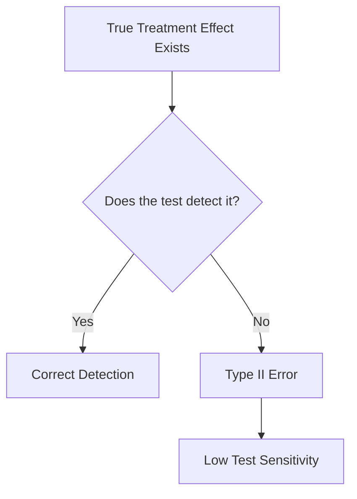
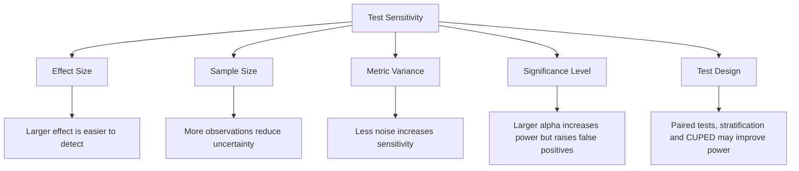
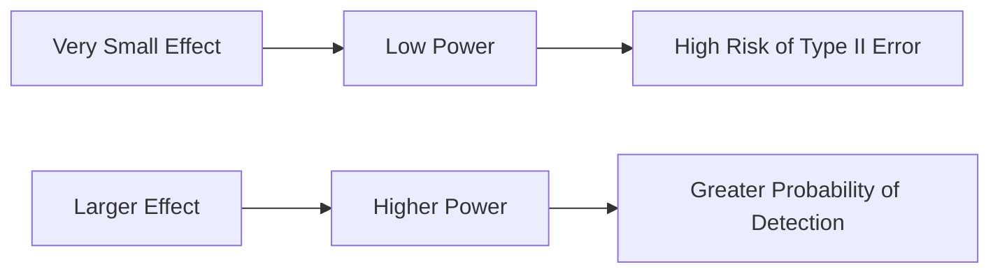
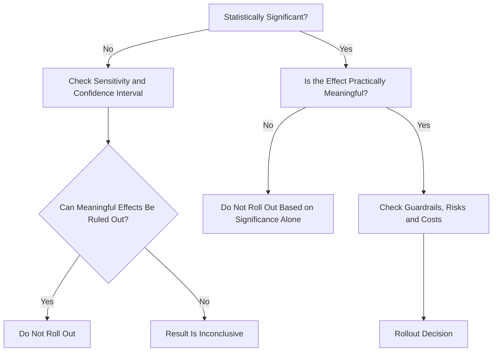

# 033 — Test Sensitivity

**Course:** 01 — Math, Statistics and Econometrics
**Module:** Module 02 — Statistics
**Content Group:** Testing and Experiments
**Roadmap Source:** Statistics / Testing and Experiments
**Lesson Type:** Statistics
**Order in Module:** 033
**Suggested Duration:** 24 minutes

---

## 1. Overview

**Test sensitivity** describes how capable a statistical test is of detecting a real effect.

A highly sensitive test can detect relatively small differences between groups. A test with low sensitivity may fail to detect an effect even when the effect actually exists.

In experimentation, test sensitivity helps answer questions such as:

* Is the experiment large enough to detect the expected improvement?
* Is the metric too noisy?
* Could a real product improvement be hidden by random variation?
* How much traffic is required before making a rollout decision?
* Would a variance-reduction method improve the experiment?
* Is a non-significant result evidence of no effect, or merely insufficient sensitivity?

Test sensitivity is closely connected to:

* statistical power;
* Type II error;
* effect size;
* sample size;
* metric variance;
* significance level;
* experiment duration;
* measurement quality.

The central idea is:

> A statistical test cannot reliably detect an effect that is too small relative to the noise in the data.

---

## 2. Learning Objectives

By the end of this lesson, you should be able to:

* Explain test sensitivity in your own words.
* Describe the relationship between sensitivity, statistical power and Type II error.
* Identify the main factors that increase or decrease sensitivity.
* Distinguish statistical sensitivity from business importance.
* Estimate whether an A/B test has enough sample size.
* Interpret a non-significant result without immediately concluding that there is no effect.
* Create a sensitivity or power analysis for an experiment.
* Translate the statistical result into a business recommendation.

---

## 3. Where Test Sensitivity Fits in an Experiment

A typical experimentation workflow looks like this:


Test sensitivity should be considered **before the experiment begins**, not only after the p-value has been calculated.

A well-designed experiment asks:

```text
What effect matters?
        ↓
How noisy is the metric?
        ↓
How much data is required?
        ↓
Can the test reliably detect that effect?
```

---

## 4. Core Definition

Suppose an experiment compares a control group with a treatment group.

The hypotheses may be written as:

$$
H_0: \Delta = 0
$$

$$
H_1: \Delta \neq 0
$$

where:

* $\Delta$ is the true treatment effect;
* $H_0$ states that the treatment has no effect;
* $H_1$ states that the treatment has an effect.

The **sensitivity of the test** refers to its ability to reject $H_0$ when a meaningful treatment effect truly exists.

This ability is usually measured using **statistical power**.

$$
\text{Power}
============

P(\text{reject } H_0 \mid H_1 \text{ is true})
$$

Statistical power is also related to the Type II error rate:

$$
\text{Power} = 1 - \beta
$$

where:

* $\beta$ is the probability of failing to detect a real effect;
* $1-\beta$ is the probability of detecting that effect.

A common experiment design target is:

$$
\text{Power} = 0.80
$$

This means that if the expected effect is real, the test has an 80% probability of detecting it under the design assumptions.

---

## 5. Type I and Type II Errors

Every hypothesis test can produce one of four outcomes.

| Reality            | Test does not reject $H_0$ | Test rejects $H_0$ |
| ------------------ | -------------------------: | -----------------: |
| No real effect     |           Correct decision |       Type I error |
| Real effect exists |              Type II error |  Correct detection |

### Type I Error

A Type I error occurs when the test reports an effect even though no real effect exists.

$$
\alpha
======

P(\text{reject } H_0 \mid H_0 \text{ is true})
$$

The significance level is commonly set to:

$$
\alpha = 0.05
$$

### Type II Error

A Type II error occurs when the test fails to detect a real effect.

$$
\beta
=====

P(\text{do not reject } H_0 \mid H_1 \text{ is true})
$$

A test with a large $\beta$ has low power and low sensitivity.



---

## 6. Factors That Determine Test Sensitivity

The sensitivity of a statistical test is mainly controlled by five factors.



### 6.1 Effect Size

Large effects are easier to detect than small effects.

For a difference in means:

$$
\Delta = \mu_T - \mu_C
$$

where:

* $\mu_T$ is the treatment-group mean;
* $\mu_C$ is the control-group mean.

When $\lvert \Delta \rvert$ increases, the signal becomes easier to distinguish from random noise.

A standardized effect size may be expressed using Cohen's $d$:

$$
d
=

\frac{\mu_T-\mu_C}{\sigma}
$$

where $\sigma$ is the standard deviation.

A larger value of $\lvert d \rvert$ generally produces greater statistical power.

---

### 6.2 Sample Size

Larger samples reduce the standard error.

For the difference between two independent means:

$$
SE(\bar{X}_T-\bar{X}_C)
=======================

\sqrt{
\frac{\sigma_T^2}{n_T}
+
\frac{\sigma_C^2}{n_C}
}
$$

As $n_T$ and $n_C$ increase, the standard error becomes smaller.

This makes it easier for the observed effect to stand out from random variation.

```text
Larger sample
      ↓
Smaller standard error
      ↓
Narrower confidence interval
      ↓
Higher probability of detecting a real effect
      ↓
Greater test sensitivity
```

However, increasing sample size has diminishing returns because the standard error decreases in proportion to the square root of the sample size.

Approximately:

$$
SE \propto \frac{1}{\sqrt{n}}
$$

To reduce the standard error by half, approximately four times as many observations are required.

---

### 6.3 Metric Variance

A noisy metric makes real effects more difficult to detect.

Suppose two experiments have the same treatment effect and sample size:

* Experiment A uses a stable metric with low variance.
* Experiment B uses a noisy metric with high variance.

Experiment A will usually have greater sensitivity.

The signal-to-noise relationship can be represented approximately as:

$$
\text{Signal-to-noise ratio}
============================

\frac{\text{Effect size}}{\text{Standard error}}
$$

Higher metric variance increases the denominator and lowers the signal-to-noise ratio.

Ways to reduce variance include:

* improving data quality;
* using a more stable metric;
* removing invalid observations using predefined rules;
* stratifying users before randomization;
* using paired measurements;
* adding relevant covariates;
* applying CUPED or CUPAC;
* increasing the measurement window when appropriate.

Variance reduction can increase sensitivity without increasing traffic.

---

### 6.4 Significance Level

The significance level $\alpha$ controls the false-positive threshold.

A larger $\alpha$ makes it easier to reject the null hypothesis.

For example:

$$
\alpha = 0.10
$$

is more permissive than:

$$
\alpha = 0.05
$$

Increasing $\alpha$ generally increases power, but it also increases the probability of a Type I error.

Therefore, increasing $\alpha$ should not be used simply to force a significant result.

The value of $\alpha$ should be defined before examining the experiment results.

---

### 6.5 One-Sided and Two-Sided Tests

A two-sided test evaluates effects in both directions:

$$
H_1: \Delta \neq 0
$$

A one-sided test evaluates an effect in one predefined direction:

$$
H_1: \Delta > 0
$$

A one-sided test can have greater sensitivity in the selected direction because the rejection region is concentrated on one side of the distribution.

However, a one-sided test is appropriate only when:

* the direction is specified before observing the data;
* effects in the opposite direction are not relevant to the decision;
* the choice is scientifically and operationally justified.

It should not be selected after seeing the result.

---

## 7. Minimum Detectable Effect

The **Minimum Detectable Effect**, or MDE, is the smallest true effect that an experiment is designed to detect with a specified power and significance level.

For a difference between two means, an approximate MDE is:

$$
\text{MDE}
\approx
\left(
z_{1-\alpha/2}
+
z_{1-\beta}
\right)
\sigma
\sqrt{
\frac{1}{n_C}
+
\frac{1}{n_T}
}
$$

where:

* $z_{1-\alpha/2}$ is the critical value for a two-sided significance test;
* $z_{1-\beta}$ corresponds to the desired power;
* $\sigma$ is the standard deviation;
* $n_C$ is the control sample size;
* $n_T$ is the treatment sample size.

For a 5% two-sided significance level:

$$
z_{1-\alpha/2} \approx 1.96
$$

For 80% statistical power:

$$
z_{1-\beta} \approx 0.84
$$

Therefore:

$$
z_{1-\alpha/2}+z_{1-\beta}
\approx
2.80
$$

The MDE becomes smaller when:

* sample size increases;
* variance decreases;
* the significance threshold becomes less strict;
* the desired power decreases.

However, lowering the desired power or relaxing the significance threshold creates additional statistical risk.

---

## 8. Approximate Sample-Size Formula

For two equally sized groups comparing continuous outcomes, the approximate required sample size per group is:

$$
n
\approx
\frac{
2\sigma^2
\left(
z_{1-\alpha/2}
+
z_{1-\beta}
\right)^2
}{
\Delta^2
}
$$

where:

* $n$ is the sample size per group;
* $\sigma^2$ is the outcome variance;
* $\Delta$ is the effect that the experiment should detect.

This formula reveals an important relationship:

$$
n \propto \frac{1}{\Delta^2}
$$

If the target effect is reduced by half, the required sample size becomes approximately four times larger.

For example:

```text
Target effect: 4 units → required sample: n
Target effect: 2 units → required sample: approximately 4n
Target effect: 1 unit  → required sample: approximately 16n
```

Small effects can therefore be very expensive to detect.

---

## 9. Conversion-Rate Example

Assume an e-commerce company is testing a new checkout design.

The baseline conversion rate is:

$$
p_C = 0.10
$$

The team wants to detect an increase of one percentage point:

$$
p_T = 0.11
$$

The absolute effect is:

$$
\Delta = 0.11 - 0.10 = 0.01
$$

The relative uplift is:

$$
\text{Relative uplift}
======================

# \frac{0.11-0.10}{0.10}

0.10
$$

Therefore, the expected relative uplift is 10%.

For two equally sized groups, the approximate sample size for a proportion metric can be estimated using:

$$
n
\approx
\frac{
2\bar{p}(1-\bar{p})
\left(
z_{1-\alpha/2}
+
z_{1-\beta}
\right)^2
}{
\Delta^2
}
$$

where:

$$
\bar{p}
=======

\frac{p_C+p_T}{2}
$$

For this experiment:

$$
\bar{p}
=======

# \frac{0.10+0.11}{2}

0.105
$$

Using:

$$
\alpha = 0.05
$$

and:

$$
1-\beta = 0.80
$$

we obtain approximately:

$$
n \approx 14{,}735
$$

The experiment therefore requires roughly 14,735 users per group, or about 29,470 users in total.

This estimate is approximate. A production analysis may also account for:

* unequal allocation;
* repeated users;
* clustered observations;
* expected data loss;
* sequential monitoring;
* multiple treatment groups;
* changes in baseline conversion;
* variance from user-level aggregation.

---

## 10. Power Curve

A **power curve** shows the probability of detecting an effect for different possible effect sizes.

```text
Power
1.0 |                              ********
    |                         *****
0.8 |--------------------*****
    |                 ****
0.6 |              ***
    |           ***
0.4 |        ***
    |     ***
0.2 |  ***
    |**
0.0 +----------------------------------------
      0       Small       MDE        Large
                  True Effect Size
```

At an effect size of zero, the probability of rejecting the null hypothesis should be approximately equal to $\alpha$.

As the true effect becomes larger, power increases.

The MDE is commonly the effect size where the curve reaches the target power, such as 80%.



A power curve is more informative than reporting only one sample-size value because it shows how the experiment behaves under several possible true effects.

---

## 11. Interpreting a Non-Significant Result

Suppose an experiment produces:

$$
p = 0.18
$$

Because:

$$
p > 0.05
$$

the result is not statistically significant at the 5% level.

This does **not** automatically prove that the treatment has no effect.

A non-significant result may occur because:

1. The true effect is approximately zero.
2. The true effect exists but is smaller than the MDE.
3. The sample size is insufficient.
4. The metric is too noisy.
5. Random variation hid the effect.
6. The treatment implementation was inconsistent.
7. The experiment suffered from measurement or assignment problems.

A better interpretation includes the estimated effect and confidence interval.

For example:

> The estimated conversion uplift was 0.4 percentage points, with a 95% confidence interval from −0.2 to 1.0 percentage points. The result is inconclusive: the data are compatible with a small negative effect, no effect, or an improvement of up to one percentage point.

This is more informative than saying:

> The treatment did not work because the p-value was greater than 0.05.

---

## 12. Confidence Intervals and Sensitivity

A confidence interval communicates both the estimated effect and its uncertainty.

An approximate confidence interval is:

$$
\widehat{\Delta}
\pm
z_{1-\alpha/2}
SE(\widehat{\Delta})
$$

A wide confidence interval indicates low precision.

A narrow confidence interval indicates high precision.

```text
Low-sensitivity experiment:

<----------------------|---------------------->
                    estimated effect

High-sensitivity experiment:

              <--------|-------->
                  estimated effect
```

When evaluating an experiment, ask:

* Does the interval exclude zero?
* Does the interval exclude effects that are too small to matter?
* Does the interval exclude harmful effects?
* Is the interval narrow enough to support a decision?
* Does it include both meaningful benefits and meaningful harms?

A result can be statistically non-significant but still useful if the confidence interval rules out effects large enough to matter.

Similarly, a result can be statistically significant but operationally unhelpful if the effect is extremely small.

---

## 13. Statistical Significance vs Business Significance

Statistical sensitivity and business value are not the same thing.

With a very large sample, a test may detect a tiny effect such as:

$$
\Delta = 0.0005
$$

The effect may be statistically significant but too small to justify:

* engineering costs;
* operational complexity;
* user-experience risk;
* increased infrastructure cost;
* maintenance burden;
* legal or compliance risk.

A complete experiment decision should evaluate:

$$
\text{Expected Business Value}
==============================

\text{Effect Size}
\times
\text{Population Size}
\times
\text{Value per Outcome}
$$

The team should also compare the expected benefit with implementation and opportunity costs.

A useful decision framework is:



---

## 14. Ways to Increase Test Sensitivity

### 14.1 Increase Sample Size

Collecting more observations reduces the standard error.

Advantages:

* simple conceptually;
* improves precision;
* supports smaller MDEs.

Limitations:

* increases experiment duration;
* delays decisions;
* exposes more users to a potentially harmful treatment;
* may be expensive or impossible for low-traffic products.

---

### 14.2 Reduce Metric Variance

Choose stable metrics and improve measurement quality.

Examples:

* use user-level aggregation instead of event-level pseudo-replication;
* remove bot traffic;
* correct duplicate events;
* normalize highly skewed measurements;
* use pre-experiment behavior as a covariate;
* apply CUPED or CUPAC.

Reducing variance can be more efficient than simply collecting more data.

---

### 14.3 Use Paired or Repeated Measurements

When the same subjects are measured before and after treatment, a paired test may remove between-subject variability.

For paired observations:

$$
D_i = X_{i,\text{after}} - X_{i,\text{before}}
$$

The test is performed on the differences $D_i$.

This design can be more sensitive when measurements from the same subject are strongly correlated.

However, it must be appropriate for the experiment and must not introduce carryover or time-related bias.

---

### 14.4 Improve Randomization

Good randomization reduces systematic differences between groups.

Useful techniques include:

* stratified randomization;
* blocked randomization;
* cluster-aware randomization;
* balanced treatment allocation.

Poor randomization can increase variance or introduce bias, making the result less trustworthy even when the sample is large.

---

### 14.5 Select an Appropriate Primary Metric

A primary metric should be:

* connected to the experiment hypothesis;
* sensitive to the expected product change;
* stable enough to measure reliably;
* difficult to manipulate;
* understandable to stakeholders.

A metric can be important but unsuitable as the primary experiment metric if it changes very slowly or has extreme variance.

Teams may combine:

* one primary decision metric;
* several secondary diagnostic metrics;
* guardrail metrics for safety and quality.

---

### 14.6 Extend the Observation Window Carefully

A longer observation window may reduce short-term noise and capture delayed effects.

However, it can also:

* delay results;
* increase exposure to seasonality;
* introduce repeated-user dependence;
* mix short-term and long-term behavior;
* create attribution problems.

A longer window does not automatically guarantee better sensitivity.

---

## 15. Sensitivity Analysis

A **sensitivity analysis** examines how conclusions change under different assumptions.

This is related to, but broader than, statistical power.

A sensitivity analysis may vary:

* the assumed baseline rate;
* the standard deviation;
* the effect size;
* the significance level;
* the desired power;
* the outlier-removal rule;
* the metric definition;
* the experiment population;
* the missing-data treatment;
* the statistical model.

Example:

| Assumption          | Scenario A | Scenario B | Scenario C |
| ------------------- | ---------: | ---------: | ---------: |
| Baseline conversion |         8% |        10% |        12% |
| Absolute MDE        |     0.5 pp |     1.0 pp |     1.5 pp |
| Power               |        80% |        80% |        90% |
| Required sample     | Very large |   Moderate |    Smaller |

The purpose is not to search for the assumptions that create a significant result.

The purpose is to determine whether the conclusion is robust.

A conclusion is more trustworthy when it remains similar across reasonable analytical choices.

---

## 16. Multiple Comparisons

Testing many metrics, segments or treatment variants increases the probability of false positives.

If $m$ independent hypotheses are tested at level $\alpha$, the probability of at least one false positive is:

$$
P(\text{at least one false positive})
=====================================

1-(1-\alpha)^m
$$

For example, with 20 independent tests and:

$$
\alpha = 0.05
$$

the probability is:

$$
1-(1-0.05)^{20}
\approx
0.642
$$

This means there is approximately a 64.2% probability of observing at least one false positive under the global null.

Corrections such as Bonferroni reduce the per-test significance level:

$$
\alpha_{\text{adjusted}}
========================

\frac{\alpha}{m}
$$

However, stricter thresholds can reduce power and test sensitivity.

This creates a trade-off:

```text
More comparisons
      ↓
Greater false-positive risk
      ↓
Stricter correction
      ↓
Lower power for each individual test
      ↓
More traffic may be required
```

Pre-registering a primary metric and limiting unnecessary comparisons help preserve sensitivity.

---

## 17. Sequential Monitoring

Repeatedly checking an experiment and stopping as soon as:

$$
p < 0.05
$$

can inflate the false-positive rate.

This practice is often called **peeking**.

Standard fixed-horizon tests assume that the sample size or stopping rule was defined in advance.

Safer approaches include:

* waiting until the planned sample size is reached;
* using group-sequential designs;
* applying alpha-spending methods;
* using always-valid p-values;
* using confidence sequences;
* using a properly designed Bayesian decision framework.

Sequential methods can support earlier decisions, but they require appropriate statistical procedures.

---

## 18. Data Quality and Effective Sample Size

A large row count does not always imply high sensitivity.

Suppose a dataset contains one million events, but the randomization unit is the user.

If each user generates 100 correlated events, the effective sample size is closer to the number of users than to the number of events.

Treating correlated events as independent can produce artificially small standard errors.

This problem is called **pseudo-replication**.

The analysis unit should match the randomization unit whenever possible.

Examples:

| Randomization Unit | Common Analysis Unit   |
| ------------------ | ---------------------- |
| User               | User-level metric      |
| Household          | Household-level metric |
| Store              | Store-level metric     |
| School             | School-level metric    |
| Geographic region  | Region-level metric    |

For clustered data, the effective sample size may be approximated using the design effect:

$$
\text{Design Effect}
====================

1+(m-1)\rho
$$

where:

* $m$ is the average cluster size;
* $\rho$ is the intra-cluster correlation.

Then:

$$
n_{\text{effective}}
\approx
\frac{n}{\text{Design Effect}}
$$

Ignoring clustering can make a test appear more sensitive than it actually is.

---

## 19. Important Distinction: Statistical Test Sensitivity vs Classification Sensitivity

In medical testing and machine learning classification, **sensitivity** often means the true positive rate:

$$
\text{Sensitivity}
==================

\frac{TP}{TP+FN}
$$

This is also called **recall**.

In this lesson, test sensitivity mainly refers to the ability of a statistical hypothesis test to detect a real effect, which is closely related to statistical power.

The concepts are related because both concern successful detection, but they are not interchangeable.

| Context                 | Meaning of Sensitivity                           |
| ----------------------- | ------------------------------------------------ |
| Hypothesis testing      | Ability to detect a real effect                  |
| Power analysis          | Probability of rejecting a false null hypothesis |
| Medical diagnostic test | True positive rate                               |
| Classification model    | Recall for the positive class                    |

Always identify the context before interpreting the word “sensitivity.”

---

## 20. Practical Python Demo

The following example estimates power for a two-sample test of proportions.

```python
from statsmodels.stats.proportion import proportion_effectsize
from statsmodels.stats.power import NormalIndPower

baseline_rate = 0.10
treatment_rate = 0.11
alpha = 0.05
sample_size_per_group = 15_000

effect_size = proportion_effectsize(
    treatment_rate,
    baseline_rate,
)

analysis = NormalIndPower()

power = analysis.power(
    effect_size=effect_size,
    nobs1=sample_size_per_group,
    alpha=alpha,
    ratio=1.0,
    alternative="two-sided",
)

print(f"Estimated power: {power:.3f}")
```

To calculate the required sample size:

```python
from math import ceil

required_sample_size = analysis.solve_power(
    effect_size=effect_size,
    power=0.80,
    alpha=0.05,
    ratio=1.0,
    alternative="two-sided",
)

print(f"Required users per group: {ceil(required_sample_size)}")
```

A sensitivity table can be generated by testing several effect sizes:

```python
import pandas as pd
from statsmodels.stats.proportion import proportion_effectsize
from statsmodels.stats.power import NormalIndPower

baseline_rate = 0.10
sample_size_per_group = 15_000
alpha = 0.05

candidate_rates = [0.1025, 0.105, 0.1075, 0.11, 0.115]
analysis = NormalIndPower()

rows = []

for treatment_rate in candidate_rates:
    effect_size = proportion_effectsize(
        treatment_rate,
        baseline_rate,
    )

    power = analysis.power(
        effect_size=effect_size,
        nobs1=sample_size_per_group,
        alpha=alpha,
        ratio=1.0,
        alternative="two-sided",
    )

    rows.append(
        {
            "baseline_rate": baseline_rate,
            "treatment_rate": treatment_rate,
            "absolute_effect": treatment_rate - baseline_rate,
            "relative_uplift": (
                treatment_rate - baseline_rate
            ) / baseline_rate,
            "power": power,
        }
    )

result = pd.DataFrame(rows)
print(result)
```

This table answers a more useful question than a single p-value:

> With the available sample size, which effect sizes can this experiment detect reliably?

---

## 21. Practical Exercise

### Scenario

A recommendation model currently produces an average session duration of 12 minutes.

The team expects a new ranking model to increase average session duration by 0.5 minutes.

Historical data suggest:

$$
\sigma = 4
$$

The experiment will use:

$$
\alpha = 0.05
$$

and target:

$$
1-\beta = 0.80
$$

### Tasks

1. Define the null and alternative hypotheses.
2. Identify the expected effect size.
3. Calculate the standardized effect size.
4. Estimate the required sample size per group.
5. Repeat the calculation for an effect of 0.25 minutes.
6. Explain why detecting the smaller effect requires much more data.
7. Discuss whether a 0.25-minute increase is meaningful to the business.
8. Identify at least two methods that could reduce metric variance.
9. Write a rollout recommendation in business language.

### Hypotheses

$$
H_0: \mu_T-\mu_C=0
$$

$$
H_1: \mu_T-\mu_C\neq0
$$

### Standardized Effect Size

For an expected effect of 0.5 minutes:

$$
d
=

# \frac{0.5}{4}

0.125
$$

This is a relatively small standardized effect, so the experiment may require a large sample.

---

## 22. Suggested Notebook Structure

```text
test-sensitivity-analysis.ipynb
│
├── 1. Business question
├── 2. Experiment hypothesis
├── 3. Primary and guardrail metrics
├── 4. Historical baseline analysis
├── 5. Variance estimation
├── 6. MDE definition
├── 7. Sample-size calculation
├── 8. Power curve
├── 9. Simulated experiment
├── 10. Confidence interval
├── 11. Sensitivity analysis
├── 12. Business interpretation
└── 13. Limitations and recommendation
```

Useful notebook outputs include:

* baseline metric summary;
* variance estimate;
* required sample size;
* experiment-duration estimate;
* power curve;
* confidence interval chart;
* sensitivity table;
* final rollout recommendation.

---

## 23. Common Mistakes

### Mistake 1: Treating a Non-Significant Result as Proof of No Effect

A test may fail to detect a real effect because it has insufficient power.

Better approach:

* report the estimated effect;
* report the confidence interval;
* compare the interval with the MDE;
* discuss whether meaningful effects can be ruled out.

---

### Mistake 2: Choosing the MDE Only to Match Available Traffic

The MDE should represent the smallest effect worth detecting.

It should not be selected only because it produces a convenient sample size.

A traffic-constrained experiment may simply be unable to answer the desired business question.

---

### Mistake 3: Ignoring Metric Variance

Two metrics with similar averages can require very different sample sizes if their variances differ.

Always estimate variance using representative historical data.

---

### Mistake 4: Confusing Relative and Absolute Effects

An increase from 10% to 11% is:

$$
1 \text{ percentage point}
$$

in absolute terms, but:

$$
10%
$$

in relative terms.

The experiment specification should clearly state which definition is being used.

---

### Mistake 5: Calculating Power After Seeing the Observed Effect

Post-hoc power based on the observed effect usually adds little information beyond the p-value.

A better approach is to report:

* the observed effect;
* the confidence interval;
* the pre-experiment MDE;
* power across a range of meaningful effects.

---

### Mistake 6: Ignoring Multiple Comparisons

Testing many metrics and segments creates false positives and may require stricter thresholds.

Define the primary metric before the experiment.

---

### Mistake 7: Treating Events as Independent Users

Repeated events from the same user are correlated.

Use the correct unit of analysis or apply an appropriate clustered model.

---

### Mistake 8: Optimizing Only for Statistical Significance

A highly sensitive test can detect effects that have no meaningful business value.

Always compare statistical evidence with:

* expected revenue;
* user impact;
* engineering cost;
* operational risk;
* guardrail metrics.

---

### Mistake 9: Extending the Experiment Until It Becomes Significant

Unplanned repeated testing inflates false-positive risk.

Use a predefined stopping rule or a valid sequential method.

---

### Mistake 10: Ignoring Experiment Validity

Power calculations cannot repair:

* broken randomization;
* sample-ratio mismatch;
* logging errors;
* treatment leakage;
* inconsistent exposure;
* missing data;
* biased sampling.

A sensitive but biased test can produce a precise and incorrect conclusion.

---

## 24. Completion Checklist

* [ ] I can explain test sensitivity in one or two minutes.
* [ ] I understand that statistical power equals $1-\beta$.
* [ ] I can distinguish Type I and Type II errors.
* [ ] I can explain how sample size affects standard error.
* [ ] I can explain how metric variance affects sensitivity.
* [ ] I understand the meaning of Minimum Detectable Effect.
* [ ] I can distinguish absolute uplift from relative uplift.
* [ ] I can interpret a non-significant result without claiming proof of no effect.
* [ ] I can create a sample-size or power calculation.
* [ ] I can produce a power curve or sensitivity table.
* [ ] I can distinguish statistical significance from business significance.
* [ ] I know why multiple comparisons reduce effective sensitivity.
* [ ] I can identify the correct experimental unit.
* [ ] I have documented at least one assumption or limitation.
* [ ] I can write a business recommendation based on effect size, uncertainty and risk.

---

## 25. Related Outcome

Use probability, sampling, descriptive statistics, hypothesis testing and A/B testing to make evidence-based decisions from data.

Test sensitivity connects directly to:

* hypothesis testing;
* statistical power;
* Type I and Type II errors;
* confidence intervals;
* Minimum Detectable Effect;
* sample-size planning;
* A/B testing;
* multiple-testing correction;
* CUPED and CUPAC;
* sequential experimentation;
* causal inference;
* product rollout decisions.

---

## 26. Related Mini Project

### A/B Test Conversion Rate

Build an experiment analysis that includes:

1. A clearly defined business hypothesis.
2. A primary conversion metric.
3. A baseline conversion estimate.
4. A business-relevant MDE.
5. A sample-size calculation.
6. An estimated experiment duration.
7. A simulated or real experiment dataset.
8. A hypothesis test.
9. A confidence interval.
10. A power curve.
11. A sensitivity analysis.
12. Guardrail metrics.
13. A rollout recommendation.

Example final recommendation:

> The treatment increased conversion by an estimated 0.8 percentage points, with a 95% confidence interval from 0.2 to 1.4 percentage points. The experiment had sufficient power to detect the predefined MDE of one percentage point. The result is statistically significant and likely to be commercially meaningful. Because no material degradation was observed in refund rate or page latency, a gradual rollout with continued guardrail monitoring is recommended.

Example inconclusive recommendation:

> The treatment produced an estimated improvement of 0.4 percentage points, but the confidence interval ranges from −0.3 to 1.1 percentage points. The experiment cannot distinguish between no effect and an improvement large enough to matter. The current evidence is inconclusive. A longer experiment, lower-variance metric or variance-reduction method is required before rollout.

---

## 27. Summary

**Test sensitivity** measures how reliably a statistical test can detect a real and meaningful effect.

Its most important relationships are:

$$
\text{Power} = 1-\beta
$$

$$
SE \propto \frac{1}{\sqrt{n}}
$$

$$
n \propto \frac{\sigma^2}{\Delta^2}
$$

These relationships imply that:

* larger effects are easier to detect;
* larger samples increase sensitivity;
* lower metric variance increases sensitivity;
* smaller target effects require much more data;
* stricter significance thresholds reduce false positives but may reduce power;
* a non-significant result may reflect insufficient sensitivity;
* statistical significance does not guarantee business significance.

The best experiments define their expected effect, MDE, significance level, power, sample size and stopping rule before data collection begins.

A trustworthy final decision should combine:

```text
Effect estimate
      +
Confidence interval
      +
Test sensitivity
      +
Business value
      +
Guardrail metrics
      +
Experiment validity
      =
Evidence-based decision
```
