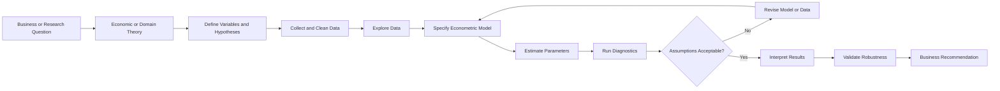
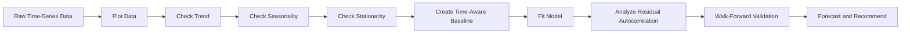
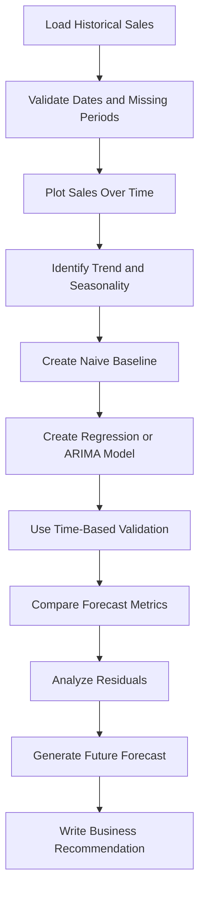

# 001 - Econometrics Fundamentals

**Course:** 01 - Math, Statistics and Econometrics
**Module:** Module 03 - Econometrics and Time Series
**Topic Group:** Econometrics Fundamentals
**Roadmap Source:** Econometrics and Time Series / Econometrics Fundamentals
**Lesson Type:** Econometrics and Time Series
**Order in Module:** 001
**Suggested Duration:** 22 minutes

---

## 1. Overview

Econometrics combines:

* Economic or business theory
* Mathematics
* Statistical methods
* Real-world data

Its main purpose is to measure relationships between variables, test hypotheses, estimate causal effects, and forecast future outcomes.

In AI and Data Science, econometrics is especially useful when the goal is not only to predict an outcome, but also to answer questions such as:

* How much does advertising affect sales?
* Does a discount cause customers to purchase more?
* How does price affect product demand?
* Did a new policy improve business performance?
* What factors explain employee productivity?
* How will sales change over time?

A machine learning model may produce an accurate prediction, while an econometric model focuses more heavily on interpretation, assumptions, uncertainty, and causal reasoning.

---

## 2. Learning Objectives

After completing this lesson, you should be able to:

1. Explain econometrics in your own words.
2. Distinguish prediction, association, and causation.
3. Recognize common econometric data structures.
4. Describe the basic econometric workflow.
5. Understand the role of regression models.
6. Identify important assumptions behind a model.
7. Interpret coefficients in business language.
8. Recognize common problems such as omitted variable bias, endogeneity, and time leakage.
9. Build a small econometric analysis in a notebook.
10. Connect econometrics to forecasting and AI workflows.

---

## 3. What Is Econometrics?

Econometrics applies statistical methods to economic, financial, social, and business data.

A simplified definition is:

> Econometrics uses data and statistical models to measure relationships, test theories, estimate effects, and forecast outcomes.

A typical econometric question has three parts:

1. **Outcome:** What are we trying to explain?
2. **Explanatory variables:** What factors may affect the outcome?
3. **Assumptions:** Under what conditions can the estimated relationship be trusted?

For example:

> How does advertising spending affect weekly sales after controlling for price and seasonality?

In this example:

* Weekly sales are the outcome.
* Advertising, price, and seasonality are explanatory variables.
* The model must make assumptions about omitted factors, measurement quality, and the direction of causality.

---

## 4. Econometrics, Statistics, and Machine Learning

These fields overlap, but their priorities are often different.

| Field                | Main Goal                                  | Typical Question                               |
| -------------------- | ------------------------------------------ | ---------------------------------------------- |
| Statistics           | Estimate uncertainty and test hypotheses   | Is the relationship statistically significant? |
| Econometrics         | Explain relationships and estimate effects | What is the effect of price on demand?         |
| Machine Learning     | Maximize predictive performance            | How accurately can we predict demand?          |
| Time-Series Analysis | Model temporal patterns                    | What will demand be next month?                |

### 4.1 Predictive question

> What will next month's sales be?

The main concern is prediction accuracy on unseen future data.

### 4.2 Explanatory question

> Which factors are associated with sales?

The goal is to describe relationships between variables.

### 4.3 Causal question

> How much would sales change if we increased advertising spending?

The goal is to estimate what would happen under an intervention.

These questions may use similar models, but they require different assumptions and validation strategies.

---

## 5. Association Is Not Causation

Suppose a dataset shows that advertising spending and sales increase together.

This relationship may be written as:

$$
\text{Sales} = f(\text{Advertising})
$$

However, this does not automatically prove that advertising causes higher sales.

Several alternative explanations are possible:

* Companies advertise more during high-demand seasons.
* Large companies have both higher sales and larger advertising budgets.
* A successful product launch increases both advertising and sales.
* Marketing teams increase spending when they already expect sales to rise.

Therefore:

> A statistical relationship is not necessarily a causal relationship.

To make a causal claim, we must consider the data-generation process and rule out competing explanations.

---

## 6. Core Econometric Model

A basic econometric model can be written as:

$$
Y_i = \beta_0 + \beta_1 X_i + \varepsilon_i
$$

Where:

* $Y_i$ is the outcome for observation $i$.
* $X_i$ is an explanatory variable.
* $\beta_0$ is the intercept.
* $\beta_1$ is the coefficient associated with $X_i$.
* $\varepsilon_i$ is the error term.

The error term contains all factors affecting $Y_i$ that are not explicitly included in the model.

For example:

$$
\text{Sales}_i = \beta_0 + \beta_1 \text{Advertising}_i + \varepsilon_i
$$

If the estimated coefficient is:

$$
\hat{\beta}_1 = 2.5
$$

A possible interpretation is:

> An additional $1,000 in advertising spending is associated with an average increase of $2,500 in sales.

The exact interpretation depends on the units used in the dataset.

The word **associated** is safer than **causes** unless the research design supports causal inference.

---

## 7. Multiple Regression

Real outcomes are usually affected by more than one factor.

A multiple regression model is:

$$
Y_i = \beta_0 + \beta_1 X_{1i} + \beta_2 X_{2i} + \cdots + \beta_k X_{ki} + \varepsilon_i
$$

For example:

$$
\text{Sales}_i = \beta_0 + \beta_1 \text{Advertising}_i + \beta_2 \text{Price}_i + \beta_3 \text{Holiday}_i + \varepsilon_i
$$

This model estimates the relationship between advertising and sales while holding price and holiday status constant.

### Coefficient interpretation

Suppose:

$$
\hat{\beta}_1 = 3.2
$$

Then:

> Holding price and holiday status constant, one additional unit of advertising spending is associated with an average increase of 3.2 units in sales.

The phrase **holding other variables constant** is central to multiple regression interpretation.

---

## 8. Main Types of Econometric Data

### 8.1 Cross-sectional data

Cross-sectional data contains many entities observed at one point in time.

Examples:

* Income of 5,000 people in 2026
* Prices of 1,000 houses in July
* Customer spending during one campaign

Example structure:

| Customer | Income | Age | Spending |
| -------- | -----: | --: | -------: |
| A        | 45,000 |  28 |    1,200 |
| B        | 70,000 |  41 |    2,100 |
| C        | 38,000 |  24 |      900 |

Typical use cases:

* Customer behavior
* Credit scoring
* Salary analysis
* House-price modeling

---

### 8.2 Time-series data

Time-series data observes one entity or aggregate over multiple time periods.

Examples:

* Daily stock prices
* Monthly inflation
* Weekly sales
* Hourly website traffic

Example structure:

| Month    |  Sales |
| -------- | -----: |
| January  | 10,000 |
| February | 10,800 |
| March    | 12,200 |

Time-series data may contain:

* Trend
* Seasonality
* Cycles
* Autocorrelation
* Structural breaks

---

### 8.3 Panel data

Panel data observes multiple entities across multiple time periods.

Examples:

* Monthly sales for 100 stores
* Annual income for 5,000 workers
* Quarterly performance of 500 companies

Example structure:

| Store | Month    | Advertising |  Sales |
| ----- | -------- | ----------: | -----: |
| A     | January  |       2,000 | 12,000 |
| A     | February |       2,500 | 13,200 |
| B     | January  |       1,500 |  9,500 |
| B     | February |       1,700 |  9,900 |

Panel data allows analysts to control for persistent differences between entities.

For example, some stores may always perform better because of location, management, or customer demographics.

---

## 9. The Econometric Workflow



### Step 1: Define the question

Bad question:

> What can I discover in this dataset?

Better question:

> How does product price affect weekly demand after controlling for promotions and seasonality?

A precise question determines:

* The target variable
* Relevant explanatory variables
* The data structure
* The appropriate model
* The interpretation of results

---

### Step 2: Build a theoretical model

Before fitting a statistical model, describe the expected relationship.

For example:

$$
\text{Demand} = f(\text{Price}, \text{Income}, \text{Promotion}, \text{Season})
$$

Expected relationships might include:

* Higher price may reduce demand.
* Higher income may increase demand.
* Promotions may increase demand.
* Holidays may create seasonal demand spikes.

Theory helps prevent meaningless variable selection.

---

### Step 3: Define variables

A variable should have:

* A clear definition
* A measurement unit
* A source
* A time range
* A known transformation

Example data dictionary:

| Variable    | Meaning                                    | Unit   |
| ----------- | ------------------------------------------ | ------ |
| `sales`     | Weekly product revenue                     | USD    |
| `price`     | Average weekly price                       | USD    |
| `ad_spend`  | Weekly advertising cost                    | USD    |
| `promotion` | Whether a promotion was active             | 0 or 1 |
| `holiday`   | Whether the week contained a major holiday | 0 or 1 |

---

### Step 4: Explore the data

Important exploratory checks include:

* Missing values
* Outliers
* Distribution shape
* Correlation
* Time trends
* Seasonal patterns
* Sudden structural changes
* Duplicate records
* Measurement errors

Useful visualizations include:

* Histograms
* Scatter plots
* Box plots
* Correlation matrices
* Time-series plots
* Residual plots

---

### Step 5: Specify the model

Model specification means deciding:

* Which outcome to model
* Which explanatory variables to include
* Whether transformations are needed
* Whether interaction terms are needed
* Whether temporal components are needed

Example:

$$
\text{Sales}_t = \beta_0 + \beta_1 \text{AdSpend}_t + \beta_2 \text{Price}_t + \beta_3 \text{Holiday}_t + \varepsilon_t
$$

A richer model may include trend and seasonality:

$$
\text{Sales}_t = \beta_0 + \beta_1 \text{AdSpend}_t + \beta_2 \text{Price}_t + \beta_3 \text{Holiday}_t + \beta_4 t + \sum_{m=2}^{12}\gamma_m D_{m,t} + \varepsilon_t
$$

Where:

* $t$ represents a time trend.
* $D_{m,t}$ represents monthly seasonal indicators.

---

### Step 6: Estimate the model

Ordinary Least Squares, or OLS, chooses coefficients that minimize the sum of squared residuals.

The residual for observation $i$ is:

$$
\hat{\varepsilon}_i = Y_i - \hat{Y}_i
$$

OLS minimizes:

$$
\sum_{i=1}^{n}
\left(
Y_i - \hat{Y}_i
\right)^2
$$

The fitted value is:

$$
\hat{Y}_i = \hat{\beta}_0 + \hat{\beta}_1 X_{1i} + \cdots + \hat{\beta}_k X_{ki}
$$

---

### Step 7: Diagnose the model

A fitted model is not automatically trustworthy.

We must examine:

* Residual behavior
* Nonlinearity
* Heteroskedasticity
* Autocorrelation
* Multicollinearity
* Influential observations
* Model stability
* Time leakage
* Structural breaks

---

### Step 8: Interpret and communicate

The final result should answer the original business question.

Weak interpretation:

> The coefficient is 0.82 and the p-value is 0.01.

Better interpretation:

> After controlling for price, promotions, and seasonality, an additional $1,000 in weekly advertising spending is associated with approximately $820 in additional weekly sales. The estimated relationship is statistically distinguishable from zero, although the observational design does not by itself prove causality.

---

## 10. Key Regression Assumptions

Regression assumptions determine whether estimates and statistical tests can be trusted.

### 10.1 Linearity in parameters

The model must be linear in its coefficients.

This model is linear in parameters:

$$
Y_i = \beta_0 + \beta_1 X_i + \beta_2 X_i^2 + \varepsilon_i
$$

Although $X_i^2$ is nonlinear in $X$, the coefficients still enter linearly.

---

### 10.2 Random or representative sampling

The sample should adequately represent the population of interest.

A model trained only on premium customers may not generalize to all customers.

---

### 10.3 No perfect multicollinearity

No explanatory variable should be an exact linear combination of other explanatory variables.

For example, do not include all twelve monthly dummy variables together with an intercept.

That would create:

$$
D_{\text{Jan}} + D_{\text{Feb}} + \cdots + D_{\text{Dec}} = 1
$$

One month should be treated as the reference category.

---

### 10.4 Zero conditional mean

A central assumption is:

$$
E[\varepsilon_i \mid X_i] = 0
$$

This means that, after conditioning on the included variables, the remaining error should not be systematically related to the explanatory variables.

If this assumption fails, coefficient estimates may be biased.

---

### 10.5 Constant error variance

The classical assumption of homoskedasticity is:

$$
\operatorname{Var}(\varepsilon_i \mid X_i) = \sigma^2
$$

When the error variance changes across observations, the data is heteroskedastic.

For example, sales uncertainty may be much larger for large stores than for small stores.

Heteroskedasticity does not necessarily bias OLS coefficients, but it can make standard errors and hypothesis tests unreliable.

A common solution is to use heteroskedasticity-robust standard errors.

---

### 10.6 No serial correlation

For time-dependent observations, errors should not be strongly correlated over time.

A simplified condition is:

$$
\operatorname{Cov}(\varepsilon_t,\varepsilon_{t-1}) = 0
$$

Serial correlation is common in:

* Sales data
* Financial data
* Demand data
* Website traffic
* Macroeconomic data

Ignoring it may produce incorrect standard errors and misleading confidence intervals.

---

## 11. Omitted Variable Bias

Omitted variable bias occurs when:

1. A relevant variable is excluded from the model.
2. The omitted variable affects the outcome.
3. The omitted variable is correlated with an included explanatory variable.

Suppose the true model is:

$$
\text{Sales} = \beta_0 + \beta_1 \text{Advertising} + \beta_2 \text{DemandSeason} + \varepsilon
$$

But we estimate:

$$
\text{Sales} = \beta_0 + \beta_1 \text{Advertising} + \varepsilon
$$

If companies advertise more during high-demand seasons, the advertising coefficient may incorrectly capture part of the seasonal effect.

The estimated relationship may then exaggerate the true effect of advertising.

### Practical protection

* Use domain knowledge.
* Draw a causal diagram.
* Add relevant control variables.
* Run randomized experiments when possible.
* Use fixed effects, instrumental variables, or difference-in-differences when appropriate.
* Perform robustness checks with alternative model specifications.

---

## 12. Endogeneity

Endogeneity means an explanatory variable is correlated with the model error:

$$
\operatorname{Cov}(X_i,\varepsilon_i) \neq 0
$$

Common sources include:

* Omitted variables
* Reverse causality
* Measurement error
* Simultaneous relationships
* Selection bias

### Reverse causality example

We may estimate:

$$
\text{Sales}_t = \beta_0 + \beta_1 \text{Advertising}_t + \varepsilon_t
$$

But advertising may respond to expected sales:

$$
\text{Advertising}_t = f(\text{Expected Sales}_t)
$$

Therefore, advertising affects sales, but expected sales may also affect advertising.

This makes causal interpretation difficult.

---

## 13. Statistical Significance and Practical Significance

A coefficient may be statistically significant but practically unimportant.

Suppose:

$$
\hat{\beta}_1 = 0.02
$$

with:

$$
p < 0.001
$$

The relationship is statistically distinguishable from zero, but the business impact may still be tiny.

Always ask:

* What is the effect size?
* What are the units?
* What is the confidence interval?
* Is the effect economically meaningful?
* Does the benefit exceed the implementation cost?

### Example

A recommendation system increases average order value by $0.03.

With 100 purchases per month, the impact is negligible.

With 100 million purchases per month, the impact may be substantial.

Context determines practical importance.

---

## 14. Confidence Intervals

A confidence interval represents uncertainty around an estimated coefficient.

A general form is:

$$
\hat{\beta}_j
\pm
z_{\alpha/2}
\cdot
SE(\hat{\beta}_j)
$$

For a 95% confidence interval, the critical value is approximately:

$$
z_{0.025} \approx 1.96
$$

Suppose:

$$
\hat{\beta}_1 = 4.0
$$

and:

$$
SE(\hat{\beta}_1) = 1.0
$$

Then the approximate 95% confidence interval is:

$$
4.0 \pm 1.96 \times 1.0
$$

Therefore:

$$
[2.04,\ 5.96]
$$

Business interpretation:

> The estimated increase in sales is 4 units per unit of advertising, with a plausible range of approximately 2.04 to 5.96 units under the model assumptions.

---

## 15. Common Functional Forms

### 15.1 Level-level model

$$
Y = \beta_0 + \beta_1 X + \varepsilon
$$

Interpretation:

> A one-unit increase in $X$ is associated with a $\beta_1$-unit change in $Y$.

---

### 15.2 Log-level model

$$
\log(Y) = \beta_0 + \beta_1 X + \varepsilon
$$

Approximate interpretation:

> A one-unit increase in $X$ is associated with approximately a $100\beta_1$ percent change in $Y$.

---

### 15.3 Level-log model

$$
Y = \beta_0 + \beta_1 \log(X) + \varepsilon
$$

Approximate interpretation:

> A 1% increase in $X$ is associated with a $\beta_1/100$-unit change in $Y$.

---

### 15.4 Log-log model

$$
\log(Y) = \beta_0 + \beta_1 \log(X) + \varepsilon
$$

Interpretation:

> A 1% increase in $X$ is associated with an estimated $\beta_1$ percent change in $Y$.

In a demand model, $\beta_1$ may represent price elasticity.

---

## 16. Dummy Variables

A dummy variable represents a category using values 0 and 1.

For example:

$$
\text{Promotion}_i = \begin{cases} 1, & \text{if a promotion is active} \ 0, & \text{otherwise} \end{cases}
$$

Model:

$$
\text{Sales}_i = \beta_0 + \beta_1 \text{Promotion}_i + \varepsilon_i
$$

Interpretation:

> $\beta_1$ is the average difference in sales between promotion and non-promotion observations.

This is an association unless the promotion assignment is random or the design supports causal inference.

---

## 17. Interaction Effects

An interaction allows the effect of one variable to depend on another variable.

Example:

$$
\text{Sales} = \beta_0 + \beta_1 \text{Advertising} + \beta_2 \text{Holiday} + \beta_3 \left( \text{Advertising} \times \text{Holiday} \right) + \varepsilon
$$

When `Holiday = 0`, the advertising effect is:

$$
\beta_1
$$

When `Holiday = 1`, the advertising effect is:

$$
\beta_1 + \beta_3
$$

This model can answer:

> Is advertising more effective during holiday periods?

---

## 18. Econometrics for Time-Dependent Data

Time-series data requires special care because observations are ordered.



Important concepts include:

* Trend
* Seasonality
* Lagged variables
* Autocorrelation
* Stationarity
* Structural breaks
* Forecast horizon
* Time-aware validation

### Time leakage

Time leakage occurs when future information is used to predict the past.

Incorrect split:

```text
Randomly shuffle all dates
        ↓
Use future observations in the training set
        ↓
Evaluate on earlier observations
        ↓
Overly optimistic performance
```

Correct split:

```text
Past data          Future data
Training period -> Validation period -> Test period
```

Example:

```text
2023-2024          Jan-Jun 2025        Jul-Dec 2025
Training           Validation          Test
```

---

## 19. Example: Advertising and Sales

Suppose we have weekly data with:

* `sales`
* `ad_spend`
* `price`
* `promotion`
* `holiday`

A possible model is:

$$
\text{Sales}_t = \beta_0 + \beta_1 \text{AdSpend}_t + \beta_2 \text{Price}_t + \beta_3 \text{Promotion}_t + \beta_4 \text{Holiday}_t + \varepsilon_t
$$

Assume the estimated model is:

$$
\widehat{\text{Sales}}_t = 12{,}000 + 1.8 \text{AdSpend}_t - 450 \text{Price}_t + 2{,}100 \text{Promotion}_t + 3{,}500 \text{Holiday}_t
$$

Possible interpretations:

* Each additional unit of advertising is associated with 1.8 additional units of sales, holding the other variables constant.
* A one-unit increase in price is associated with 450 fewer units of sales.
* Promotion weeks have approximately 2,100 more sales units than non-promotion weeks.
* Holiday weeks have approximately 3,500 more sales units than comparable non-holiday weeks.

Before making recommendations, we should inspect:

* Confidence intervals
* Residual plots
* Autocorrelation
* Nonlinear effects
* Outliers
* Possible reverse causality
* Whether advertising was assigned strategically

---

## 20. Python Demo

```python
import pandas as pd
import statsmodels.api as sm

# Example dataset
df = pd.DataFrame(
    {
        "sales": [12000, 13500, 12800, 15100, 16000, 14900, 17200, 18100],
        "ad_spend": [1000, 1500, 1200, 1800, 2100, 1900, 2400, 2600],
        "price": [20, 20, 21, 20, 19, 21, 19, 18],
        "promotion": [0, 1, 0, 1, 1, 0, 1, 1],
        "holiday": [0, 0, 0, 0, 1, 0, 1, 1],
    }
)

# Explanatory variables
X = df[["ad_spend", "price", "promotion", "holiday"]]

# Add the intercept
X = sm.add_constant(X)

# Outcome variable
y = df["sales"]

# Fit OLS with heteroskedasticity-robust standard errors
model = sm.OLS(y, X).fit(cov_type="HC3")

print(model.summary())
```

### Important note

This dataset is too small for reliable statistical inference. It is only a demonstration of the modeling workflow.

A real analysis should include:

* More observations
* Data-quality checks
* Train and test periods
* Residual diagnostics
* Domain-based variable selection
* Robustness analysis
* A clear causal or predictive objective

---

## 21. Residual Diagnostics

A residual is the difference between the observed and predicted values:

$$
\hat{\varepsilon}_i = Y_i - \hat{Y}_i
$$

Good residuals should behave like unexplained noise.

### 21.1 Residuals versus fitted values

This plot can reveal:

* Nonlinearity
* Heteroskedasticity
* Missing interactions
* Outliers

A visible curve may indicate that the linear functional form is inadequate.

A funnel shape may indicate changing error variance.

---

### 21.2 Residuals over time

For time-series data, plot residuals chronologically.

Patterns may reveal:

* Remaining trend
* Remaining seasonality
* Structural breaks
* Autocorrelation
* Missing lagged variables

---

### 21.3 Residual autocorrelation

If residuals remain correlated across time, the model has not captured all temporal structure.

Potential solutions include:

* Add lagged variables.
* Add trend and seasonal components.
* Use autoregressive errors.
* Use ARIMA or dynamic regression.
* Use time-series-aware standard errors.

---

## 22. Model Evaluation

Econometric evaluation should consider more than one metric.

### 22.1 Explanatory metrics

* Coefficient estimates
* Standard errors
* Confidence intervals
* p-values
* $R^2$
* Adjusted $R^2$

### 22.2 Predictive metrics

* Mean Absolute Error
* Root Mean Squared Error
* Mean Absolute Percentage Error
* Forecast bias
* Out-of-sample $R^2$

Mean Absolute Error:

$$
MAE = \frac{1}{n} \sum_{i=1}^{n} |Y_i-\hat{Y}_i|
$$

Root Mean Squared Error:

$$
RMSE = \sqrt{ \frac{1}{n} \sum_{i=1}^{n} (Y_i-\hat{Y}_i)^2 }
$$

### 22.3 Business metrics

* Revenue increase
* Cost reduction
* Conversion lift
* Return on advertising spend
* Inventory reduction
* Forecast-driven service improvement

A statistically strong model is not automatically useful unless it supports a business decision.

---

## 23. Baselines

Always compare a model against a simple baseline.

For cross-sectional data, a baseline may predict:

$$
\hat{Y}_i = \bar{Y}
$$

For time-series data, common baselines include:

### Naive forecast

$$
\hat{Y}_{t+1} = Y_t
$$

### Seasonal naive forecast

$$
\hat{Y}_t = Y_{t-s}
$$

Where $s$ is the seasonal period.

For monthly data with yearly seasonality:

$$
s = 12
$$

A complex model that cannot outperform a simple baseline may not be production-worthy.

---

## 24. Econometric Thinking in AI Projects

Econometrics improves AI projects by forcing the team to ask:

* What is the data-generation process?
* Why should these variables be related?
* Are we predicting or estimating an effect?
* Could the model be using future information?
* Is there selection bias?
* Are important variables missing?
* Does a coefficient have a meaningful interpretation?
* Will the relationship remain stable after deployment?
* What happens when the model changes user behavior?
* Does the model support a decision or merely describe historical data?

### Example

An AI model predicts that customers receiving discounts have higher purchase rates.

An econometric perspective asks:

> Were discounts randomly assigned, or were they offered to customers already likely to buy?

Without answering that question, the model may confuse targeting rules with the true effect of discounts.

---

## 25. Common Mistakes

### 25.1 Treating correlation as causation

A strong relationship does not prove that changing one variable will change another.

### 25.2 Selecting variables only by p-value

Variables should be selected using theory, domain knowledge, and the research question.

### 25.3 Ignoring omitted variables

A missing confounder can bias multiple coefficients.

### 25.4 Ignoring time order

Random splitting may leak future information into training data.

### 25.5 Reporting only $R^2$

A high $R^2$ does not guarantee:

* Causality
* Good out-of-sample prediction
* Correct model specification
* Stable coefficients
* Business usefulness

### 25.6 Ignoring residuals

A model can produce coefficients even when its assumptions are badly violated.

### 25.7 Overinterpreting p-values

A small p-value does not measure:

* Business value
* Causal validity
* Predictive accuracy
* Model stability
* Data quality

### 25.8 Using too many variables with too little data

An overly complex model may overfit noise and produce unstable estimates.

### 25.9 Ignoring measurement definitions

“Revenue,” “active user,” or “customer engagement” may be defined differently across systems.

### 25.10 Creating no practical artifact

Reading definitions without building a notebook, chart, model, or report produces weak retention.

---

## 26. Practical Exercise

Use a small sales dataset containing:

* Date
* Sales
* Advertising spending
* Product price
* Promotion status
* Holiday status

### Task 1: Define the question

Write one precise question, such as:

> How is weekly advertising spending related to weekly sales after controlling for price, promotions, holidays, trend, and seasonality?

### Task 2: Explore the data

Create:

* A time-series plot of sales
* A scatter plot of advertising versus sales
* A correlation table
* A missing-value report
* A summary-statistics table

### Task 3: Build a baseline

Use the previous week's sales:

$$
\hat{Y}_{t+1} = Y_t
$$

### Task 4: Fit a regression

Estimate:

$$
\text{Sales}_t = \beta_0 + \beta_1 \text{Advertising}_t + \beta_2 \text{Price}_t + \beta_3 \text{Promotion}_t + \beta_4 \text{Holiday}_t + \varepsilon_t
$$

### Task 5: Add temporal structure

Extend the model with:

* A time trend
* Month indicators
* Lagged sales
* Lagged advertising, when theoretically appropriate

### Task 6: Diagnose the model

Check:

* Residual distribution
* Residuals versus fitted values
* Residuals over time
* Autocorrelation
* Outliers
* Coefficient stability

### Task 7: Interpret the result

Write three statements:

1. One statistical interpretation
2. One business interpretation
3. One limitation or caveat

---

## 27. Mini-Project: Sales Forecasting

### Objective

Analyze historical sales and produce a baseline or ARIMA-based forecast.

### Recommended workflow



### Minimum deliverables

* `sales_forecasting.ipynb`
* Cleaned dataset
* Data dictionary
* Trend and seasonality chart
* Baseline forecast
* Regression or ARIMA forecast
* MAE or RMSE comparison
* Residual diagnostic chart
* Business recommendation
* Assumptions and limitations section

### Example portfolio statement

> Built a sales forecasting workflow using trend analysis, seasonal features, a naive baseline, and an ARIMA model. Evaluated forecasts using time-based validation and MAE, analyzed residual autocorrelation, and translated the results into inventory-planning recommendations.

---

## 28. Assumptions and Caveats Template

Use this template in your notebook or report:

```markdown
## Assumptions

- The historical observations are measured consistently.
- The selected variables represent the main known drivers of the outcome.
- Relationships are sufficiently stable during the analysis period.
- No future information is used during model training.
- Missing values are handled without introducing systematic bias.

## Limitations

- The data is observational rather than randomized.
- Important confounding variables may be missing.
- The model may not capture nonlinear relationships.
- Structural changes may reduce future accuracy.
- Statistical association should not automatically be interpreted as causation.
```

---

## 29. Completion Checklist

* [ ] I can explain econometrics in one or two minutes.
* [ ] I understand the difference between association, prediction, and causation.
* [ ] I can identify cross-sectional, time-series, and panel data.
* [ ] I can write a simple econometric regression equation.
* [ ] I can interpret a regression coefficient using its units.
* [ ] I understand why omitted variables may bias an estimate.
* [ ] I know what endogeneity means at a basic level.
* [ ] I understand why residual diagnostics are necessary.
* [ ] I know why time-based data should not be randomly split.
* [ ] I can compare a model with a simple baseline.
* [ ] I have created a notebook, model, chart, query, API, or practical note.
* [ ] I have documented at least one assumption and one limitation.
* [ ] I can translate statistical output into a business recommendation.

---

## 30. Key Takeaways

1. Econometrics connects theory, data, statistical models, and decision-making.
2. A regression coefficient describes a conditional relationship, not automatically a causal effect.
3. Model assumptions are part of the result, not optional technical details.
4. Data structure determines the appropriate modeling and validation strategy.
5. Time-series data requires special attention to trend, seasonality, autocorrelation, and leakage.
6. Residual analysis helps reveal problems that summary metrics may hide.
7. Statistical significance and business significance are different concepts.
8. Simple baselines are essential when evaluating forecasting models.
9. Domain knowledge is necessary for selecting variables and interpreting results.
10. A useful analysis ends with a decision, recommendation, or deployable artifact.

---

## 31. Related Outcome

Model relationships and time-dependent data using:

* Regression
* Statistical diagnostics
* Trend and seasonality analysis
* ARIMA
* Forecasting workflows
* Time-aware validation
* Business interpretation

---

## 32. Related Project

**Mini-Project:** Sales Forecasting with Trend and Seasonality Analysis

Suggested components:

* Exploratory time-series analysis
* Naive and seasonal-naive baselines
* Regression with trend and seasonal variables
* ARIMA or SARIMA forecast
* Walk-forward validation
* Residual diagnostics
* Forecast visualization
* Business recommendations
* Limitations and monitoring plan

---

## 33. Summary

Econometrics provides a structured way to study relationships in real-world data.

A complete econometric analysis does not stop after fitting a model. It should include:

```text
Question
   ↓
Theory
   ↓
Data
   ↓
Model specification
   ↓
Estimation
   ↓
Diagnostics
   ↓
Validation
   ↓
Interpretation
   ↓
Business decision
```

To make this lesson practical, turn it into at least one concrete artifact:

* A Jupyter notebook
* A regression report
* A forecasting dashboard
* A diagnostic chart
* A SQL analysis
* A model API
* A Dockerized forecasting service
* A portfolio case study

The goal is not only to calculate coefficients. The goal is to understand what the data can support, what assumptions are required, and how the result should influence a real decision.
